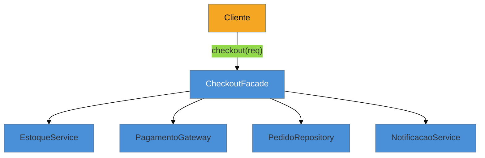

# Facade

> [!abstract] TL;DR
> O **Facade** oferece uma interface **simplificada** para um subsistema complexo, escondendo várias
> classes e dependências atrás de uma API única e limpa. É, sem exagero, **o padrão mais usado do
> mundo** — quase todo `@Service` que orquestra repositórios, clientes e validadores é uma Facade,
> mesmo que ninguém a chame assim. Curiosidade da nossa lente cross-linguagem: diferente de Builder
> ou Singleton, a linguagem **não dissolve** a Facade, porque ela não é um contorno para uma lacuna
> técnica — é sobre **organização em escala humana**. Por isso ela é idêntica em Java, Python, Go e
> TS. A armadilha campeã: a **God Facade** que cresce sem limite e vira um God Object.

## O fluxo que atravessa cinco serviços

Um checkout, na prática, é uma coreografia: reservar estoque, cobrar o pagamento, gravar o pedido, notificar o cliente. São quatro ou cinco colaboradores diferentes, cada um com sua API. Se o *controller* HTTP chama todos eles na ordem certa, tratando erros no meio, ele acumula conhecimento que não é dele — vira um método gigante que sabe demais sobre estoque, pagamento e notificação ao mesmo tempo.

A Facade recolhe essa orquestração para trás de uma porta única: `checkout(request)`. O controller chama **um** método; a Facade sabe a sequência, coordena os subsistemas e devolve um resultado limpo. Quem está de fora não precisa conhecer as cinco dependências nem a ordem entre elas — só a fachada.

O ponto não é esconder que os subsistemas existem (você ainda pode usá-los direto quando precisa); é **oferecer um caminho fácil para o caso comum**, reduzindo o acoplamento entre o cliente e as tripas do subsistema.

## A ideia



O cliente conhece só a fachada. A fachada conhece — e coordena — o subsistema. A seta de dependência para as quatro classes internas fica **contida** num lugar só.

## O padrão nas quatro linguagens

Aqui a lente do catálogo dá um resultado diferente e revelador: **a Facade é praticamente igual em toda linguagem**. Um serviço que recebe dependências no construtor e expõe um método de caso-de-uso — o formato é o mesmo em Java, Python, Go ou TS, porque o padrão não depende de nenhum recurso da linguagem.

```java
@Service
public class CheckoutFacade {
    private final EstoqueService estoque;
    private final PagamentoGateway pagamento;
    private final PedidoRepository pedidos;
    private final NotificacaoService notificacoes;

    public OrderResult checkout(CheckoutRequest req) {
        estoque.reservar(req.itens());
        PaymentResult pr = pagamento.charge(req.valor(), req.clienteId());
        Pedido pedido = pedidos.save(Pedido.de(req, pr));
        notificacoes.enviarConfirmacao(pedido);
        return OrderResult.sucesso(pedido);
    }
}
```

Em Go seria um `struct` com os quatro colaboradores como campos e um método `Checkout`; em Python, uma classe recebendo as dependências no `__init__`; em TS, idem. Nenhum idioma "encolhe" a Facade — e isso, por si, ensina algo: **nem todo padrão é um contorno de lacuna da linguagem**. Alguns, como a Facade, são ferramentas de *organização* que sobrevivem a qualquer sintaxe, porque o problema que resolvem — complexidade demais exposta ao cliente — é humano, não técnico.

## Facade não é Adapter (nem Mediator)

Três estruturais parecidos, distinções que caem em entrevista:

- **Adapter** converte **uma** interface em outra que o cliente espera (tradução). **Facade** simplifica **muitas** classes numa API nova (redução de complexidade). Adapter existe porque as interfaces *não batem*; Facade, porque há *coisas demais* expostas.
- **Mediator** ([[19 - Mediator]]) coordena a interação **entre** colegas que, sem ele, se conheceriam diretamente — é bidirecional e sobre desacoplar *pares*. A Facade é unidirecional (cliente → subsistema) e não muda como os subsistemas conversam entre si.

## Armadilhas comuns

> [!warning] A God Facade
> **O que acontece:** a fachada começa enxuta e vai ganhando método após método, até virar uma classe de milhares de linhas que orquestra o sistema inteiro — um God Object com nome de padrão.
> **Por quê:** a Facade concentra orquestração, e concentração sem limite atrai responsabilidade. Sem uma fronteira clara ("esta fachada cobre *checkout*, não o app todo"), ela cresce por gravidade.
> **Como evitar:** uma Facade por **caso de uso ou subsistema coeso**, não uma por aplicação. Quando ela passa a coordenar coisas não relacionadas, quebre-a em fachadas menores.

> [!warning] A fachada que vaza o subsistema
> **O que acontece:** o método da fachada devolve tipos internos do subsistema (uma entidade do ORM, um objeto do SDK de pagamento), ou exige que o cliente monte esses tipos para chamá-la.
> **Por quê:** se os tipos internos cruzam a fachada, o cliente volta a depender do subsistema — a simplificação foi só aparente, e o acoplamento continua lá.
> **Como evitar:** a fachada fala a língua do cliente na entrada e na saída (DTOs/objetos de domínio), traduzindo internamente. O subsistema fica atrás da porta.

> [!warning] Facade sobre um subsistema que já é simples
> **O que acontece:** envolve-se uma única classe (ou duas triviais) numa fachada "por padronização".
> **Por quê:** a Facade se paga quando há **complexidade real** a esconder (várias dependências, ordem, tratamento de erro). Sobre algo já simples, ela é só uma camada de repasse que afasta o leitor do código real.
> **Como evitar:** só introduza a fachada quando o caso comum atravessa **múltiplos** colaboradores. Uma dependência só → chame direto.

## Como explicar em inglês

> "Facade gives a simplified interface over a complex subsystem — it hides several classes behind one clean API. It's probably the most-used pattern in existence: almost every orchestrating `@Service` is a Facade, even when nobody names it. What I find interesting is that, unlike Builder or Singleton, no language dissolves it — it looks identical in Java, Python, Go, and TypeScript, because it's about human-scale organization, not a language gap. The distinction I keep sharp: an Adapter *translates* one interface into another; a Facade *reduces* the complexity of many. The main trap is the God Facade — it starts small and accretes responsibility until it's a God Object. I keep one facade per use case or cohesive subsystem, not one per application."

| PT | EN |
| --- | --- |
| fachada | facade |
| subsistema | subsystem |
| interface simplificada | simplified interface |
| orquestrar / coordenar | to orchestrate / coordinate |
| caso de uso | use case |
| God Object / God Facade | God Object / God Facade |
| vazar tipos internos | to leak internal types |

## O que vem a seguir

A Facade simplifica o acesso a um subsistema. O próximo estrutural também envolve um objeto mantendo a interface — mas com outra intenção: **controlar o acesso** a ele (lazy, cache, segurança, chamada remota). É o padrão que faz `@Transactional` e `@Cacheable` funcionarem, e onde mora uma das pegadinhas mais clássicas do Spring.

- [[10 - Proxy]] — controlar o acesso a um objeto mantendo a mesma interface; a base da AOP.
- [[19 - Mediator]] — o comportamental parecido, mas para coordenar a conversa *entre* colegas.

## Veja também

- [[03-Dominios/Engenharia/Arquitetura/index|Arquitetura]] — a Facade como fronteira de camada (service layer) e ponto de entrada de um módulo.
- [[03-Dominios/Engenharia/Design de Software/SOLID/02 - SRP - Responsabilidade Única|SRP]] — o princípio que a God Facade viola ao acumular responsabilidades.

## Fontes

- **Gamma, Helm, Johnson, Vlissides (GoF)** — *Design Patterns* (1994) — Facade como interface unificada de subsistema.
- **Refactoring Guru** — [*Facade*](https://refactoring.guru/design-patterns/facade) — a simplificação de subsistema e o contraste com Adapter.
- **Martin Fowler** — [*Service Layer*](https://martinfowler.com/eaaCatalog/serviceLayer.html) — a fachada de casos de uso na arquitetura de aplicação corporativa.
