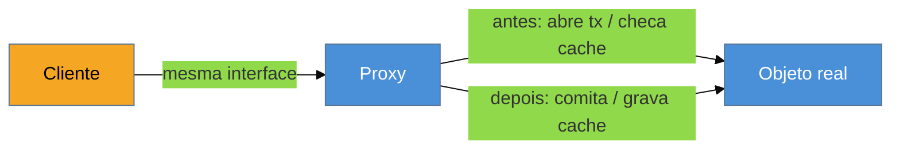

# Proxy

> [!abstract] TL;DR
> O **Proxy** é um objeto que **controla o acesso** a outro, implementando a **mesma interface** e se pondo no meio para adicionar *lazy loading*, cache, log, segurança ou chamadas remotas — de forma transparente para o cliente. É o motor por trás de `@Transactional`, `@Cacheable` e do *lazy loading* do JPA/Hibernate: o Spring cria um proxy dinâmico ao redor do seu bean. Aqui a lente cross-linguagem é dramática: a JVM e as linguagens dinâmicas interceptam **em runtime** (Java via JDK dynamic proxy / CGLIB; JS tem um `Proxy` **nativo** com *traps*), enquanto **Go, por decisão de design, não tem proxy dinâmico** — você escreve o wrapper à mão ou gera código. A pegadinha mais clássica do Spring mora aqui: `@Transactional` **não funciona** numa chamada interna.

## Interceptar sem poluir o método

Você quer que toda chamada a um método de serviço abra uma transação, comite no sucesso e faça rollback no erro. Ou que ela consulte um cache antes de executar de fato. O jeito ingênuo é encher cada método com esse código de transação/cache — repetido, misturado com a regra de negócio, fácil de esquecer.

O Proxy resolve pondo um objeto **no meio do caminho**: o cliente pensa que chama o objeto real, mas chama um substituto de **mesma interface** que faz o controle (abre transação, checa cache) e **delega** ao real. O método de negócio fica limpo; o *concern* transversal vive no proxy. É assim que uma anotação como `@Transactional` parece mágica — mas é só um proxy.

## A ideia



Proxy e objeto real implementam a mesma interface — por isso o cliente não percebe a troca. O proxy envolve a chamada com o controle de acesso (antes/depois) e repassa ao real.

## O padrão nas quatro linguagens — a maior divergência do catálogo

### Java — proxy dinâmico em runtime (a base da AOP)

O Spring gera o proxy **em tempo de execução**: **JDK dynamic proxy** quando o bean tem interface, **CGLIB** (subclasse gerada) quando é classe concreta. É esse proxy que implementa `@Transactional`, `@Cacheable`, `@Async`, segurança de método:

```java
@Service
public class PedidoService {
    @Transactional                       // o proxy abre/comita a transação ao redor deste método
    public void criar(Pedido p) { repo.save(p); }
}
```

### JavaScript / TypeScript — `Proxy` é nativo (com *traps*)

O ES6 trouxe um objeto `Proxy` embutido: você intercepta operações (get, set, chamada) via *handlers*. É o padrão como recurso de linguagem, literal:

```typescript
const logged = new Proxy(servico, {
  get(alvo, prop) {
    console.log(`acessando ${String(prop)}`);
    return (alvo as any)[prop];
  },
});
```

### Python — `__getattr__`, descritores, `wrapt`

Python intercepta acesso a atributos/métodos via *dunder* (`__getattr__`, `__getattribute__`) ou bibliotecas como `wrapt`. De novo, interceptação em runtime, no espírito do Proxy.

### Go — **sem proxy dinâmico**, por design

Go não tem interceptação em runtime nem metaprogramação para isso — é uma escolha da linguagem (explícito > mágico). Não existe `@Transactional`; você escreve o wrapper **à mão** (um struct que implementa a interface e envolve a chamada com a transação) ou **gera código** em build. O que na JVM é uma anotação, em Go é código visível:

```go
type txPedidoService struct { inner PedidoService; db *sql.DB }
func (s txPedidoService) Criar(p Pedido) error {
    return runInTx(s.db, func() error { return s.inner.Criar(p) })   // transação explícita
}
```

> **A tese:** o Proxy é o padrão que mais muda de "sabor" entre linguagens. Java e as dinâmicas tornam a interceptação **invisível** (anotação + proxy gerado em runtime); Go a torna **visível e explícita** (wrapper escrito à mão). Nenhuma abordagem é "certa" — mas entender que `@Transactional` é um proxy, e não mágica, é o que explica a pegadinha a seguir.

## A pegadinha clássica: a chamada interna

> [!warning] `@Transactional` (ou `@Cacheable`) que silenciosamente não funciona
> **O que acontece:** você anota um método com `@Transactional`, mas ele é chamado **de dentro da mesma classe** (`this.outroMetodo()`) ou é **privado** — e a transação simplesmente não abre. Nenhum erro; só não funciona. **Por quê:** o proxy fica **em volta** do bean e só intercepta chamadas que **entram de fora**. Uma chamada interna (`this.metodo()`) não passa pelo proxy — vai direto ao objeto real, pulando o controle. Método privado, idem: o proxy não o vê. **Como evitar:** chame o método anotado a partir de **outro bean** (que passe pelo proxy), ou extraia o método para um serviço separado. Saber que é Proxy — não mágica — transforma esse bug de "assombração" em óbvio.

## Outras armadilhas

> [!warning] O proxy que esconde uma chamada cara
> **O que acontece:** o *lazy loading* do JPA é um proxy: acessar uma coleção lazy dispara uma query. Num laço, isso vira o problema **N+1** — uma query por item, escondida atrás de um `getter` que parece local. **Por quê:** o Proxy torna uma operação cara (I/O, rede, banco) **indistinguível** de um acesso local. A transparência que ajuda também esconde o custo. **Como evitar:** saiba onde há proxies de acesso remoto/lazy; use *fetch joins* / *batch* quando iterar; meça. "Parece local" não é "é barato".

> [!warning] Confundir Proxy com Decorator
> **O que acontece:** trata-se como sinônimos porque ambos envolvem um objeto mantendo a interface. **Por quê:** a **intenção** difere. Decorator **adiciona comportamento** (e você empilha vários por escolha). Proxy **controla o acesso** ao objeto (existência, permissão, custo) e normalmente é um só, transparente. Mesma estrutura, propósitos diferentes. **Como evitar:** pergunte *"estou enriquecendo o objeto (Decorator) ou intermediando/controlando o acesso a ele (Proxy)?"*.

## Como explicar em inglês

> "Proxy controls access to another object through the same interface — lazy loading, caching, security, remote calls, all transparently. It's what powers `@Transactional` and `@Cacheable`: Spring creates a dynamic proxy around the bean, JDK dynamic proxy for interfaces or CGLIB for classes. The cross-language contrast is striking: the JVM and dynamic languages intercept at runtime — JavaScript even has a native `Proxy` object — while Go deliberately has no dynamic proxy, so you write the wrapper by hand. The classic gotcha is that `@Transactional` doesn't work on an internal call or a private method, because the proxy only intercepts calls coming from outside the bean. Once you know it's a proxy and not magic, that bug becomes obvious instead of haunting."

| PT | EN |
| --- | --- |
| controlar o acesso | to control access |
| proxy dinâmico | dynamic proxy |
| interceptar (chamada) | to intercept (a call) |
| lazy loading | lazy loading |
| chamada interna | internal / self-invocation |
| concern transversal | cross-cutting concern |
| problema N+1 | N+1 problem |
| explícito vs mágico | explicit vs magic |

## O que vem a seguir

Fechamos quatro estruturais que envolvem **um** objeto (Adapter, Decorator, Facade, Proxy). O último estrutural muda a forma: compõe objetos em **árvore**, para que o cliente trate um item isolado e um grupo inteiro **da mesma maneira**.

- [[11 - Composite]] — hierarquias parte-todo tratadas uniformemente.
- [[08 - Decorator]] — o primo estrutural, para revisar a diferença de intenção (adicionar × controlar).

## Veja também

- [[03-Dominios/Tecnologia/Java/index|Java]] — Spring AOP, JDK dynamic proxy vs CGLIB, `@Transactional` na prática.
- [[03-Dominios/Engenharia/Design de Software/Orientação a Objetos/07 - Composição sobre herança|Composição sobre herança]] — o Proxy compõe (envolve) em vez de herdar.

## Fontes

- **Gamma, Helm, Johnson, Vlissides (GoF)** — *Design Patterns* (1994) — Proxy (virtual, protection, remote).
- **Refactoring Guru** — [*Proxy*](https://refactoring.guru/design-patterns/proxy) — os tipos de proxy e a diferença para Decorator.
- **Spring Framework Docs** — [*Understanding AOP Proxies*](https://docs.spring.io/spring-framework/reference/core/aop/proxying.html) — por que a self-invocation não passa pelo proxy.
- **MDN** — [*Proxy*](https://developer.mozilla.org/en-US/docs/Web/JavaScript/Reference/Global_Objects/Proxy) — o `Proxy` nativo do JavaScript e seus *traps*.
