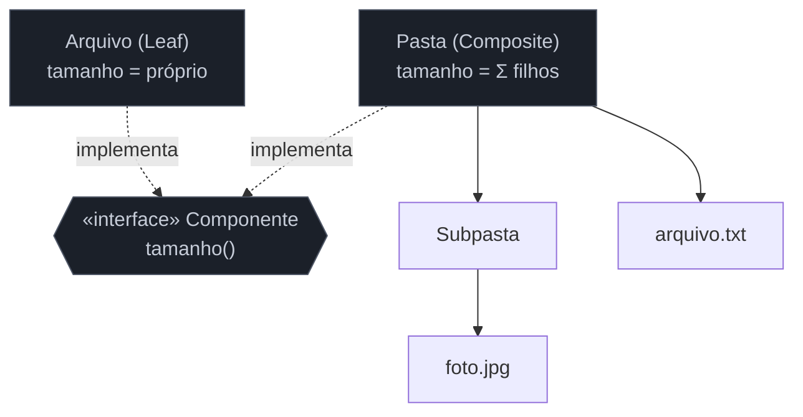

# Composite

> [!abstract] TL;DR
> O **Composite** compõe objetos em **árvore** para representar hierarquias **parte-todo**, de modo que o cliente trate um item isolado (folha) e um grupo inteiro (composto) **da mesma forma** — sem perguntar "é um ou vários?" a cada nível. É o padrão por trás de sistemas de arquivos (arquivo e pasta), árvores de UI, ASTs e expressões. Na nossa lente cross-linguagem, ele encontra um rival elegante: linguagens com **tipos algébricos** (*sealed*/união) modelam a mesma árvore como um **tipo-soma + recursão**, ao estilo funcional. A tensão de design mais citada do padrão: a escolha entre **transparência** (métodos de filho na interface comum, mesmo sem sentido para folhas) e **segurança** (só no composto, ao custo de o cliente checar tipos).

## O tamanho da pasta é a soma dos filhos

Pense num sistema de arquivos. Um **arquivo** tem um tamanho. Uma **pasta** tem um tamanho também — que é a **soma** do tamanho de tudo que ela contém, incluindo subpastas, recursivamente. Se você escrever o cálculo com `if (é arquivo) ... else se (é pasta) percorre os filhos ...`, essa verificação de tipo se espalha por todo código que anda na árvore, e cada nova operação (contar, buscar, exportar) repete a mesma bifurcação.

O Composite elimina a pergunta. Arquivo e pasta implementam a **mesma** interface (`tamanho()`, por exemplo). O arquivo devolve seu tamanho direto; a pasta devolve a soma dos `tamanho()` dos filhos — e como os filhos também respondem `tamanho()`, a recursão se resolve sozinha, sem o cliente jamais checar "arquivo ou pasta?". Um item e uma árvore inteira são intercambiáveis diante da interface.

## A ideia



Folha e composto compartilham a interface `Componente`. O composto guarda filhos (que também são `Componente`) e implementa cada operação **delegando recursivamente** aos filhos. O cliente fala com a raiz sem saber a profundidade.

## O padrão nas quatro linguagens — OO vs funcional

### Java — interface comum + recursão

```java
interface Componente { long tamanho(); }

record Arquivo(String nome, long bytes) implements Componente {
    public long tamanho() { return bytes; }
}

final class Pasta implements Componente {
    private final List<Componente> filhos = new ArrayList<>();
    public void add(Componente c) { filhos.add(c); }
    public long tamanho() {
        return filhos.stream().mapToLong(Componente::tamanho).sum();  // recursão uniforme
    }
}
```

Python, Go e TS seguem a mesma forma: uma interface/protocolo comum, uma implementação folha e uma composta que guarda filhos e delega recursivamente. A estrutura muda pouco — é recursão estrutural sobre uma interface.

### A alternativa funcional: tipo-soma + recursão

Onde a linguagem tem **tipos algébricos** (sealed types em Java 21+, `enum` do Rust, união discriminada em TS, `sealed` em Kotlin/Scala), a mesma árvore costuma ser modelada como um **tipo-soma** — "um Componente é *ou* um Arquivo *ou* uma Pasta" — e as operações viram `switch`/*pattern matching* recursivo, do lado de fora dos dados:

```typescript
type Componente =
  | { tipo: "arquivo"; bytes: number }
  | { tipo: "pasta"; filhos: Componente[] };

const tamanho = (c: Componente): number =>
  c.tipo === "arquivo" ? c.bytes : c.filhos.reduce((s, f) => s + tamanho(f), 0);
```

> **A tese:** o Composite é a resposta **OO** (polimorfismo esconde a distinção folha/composto *dentro* dos objetos) a um problema que o mundo **funcional** resolve com **tipo-soma + pattern matching** (a distinção fica explícita *fora*, numa função recursiva). Nenhum é "melhor": o Composite facilita **adicionar novos tipos de nó** (nova classe, sem tocar nas operações); o tipo-soma facilita **adicionar novas operações** (nova função, sem tocar nos dados). É o mesmo *trade-off* do [[20 - Visitor]] — vale reconhecer os dois na natureza.

## Armadilhas comuns

> [!warning] Composite onde uma lista simples resolve
> **O que acontece:** monta-se toda a maquinaria de árvore para uma coleção **plana** (sem aninhamento real), ou para uma hierarquia que nunca terá mais de um nível. **Por quê:** o Composite se paga quando há **recursão parte-todo genuína** (árvore de profundidade arbitrária). Sem aninhamento, é estrutura demais para um `for` que bastaria. **Como evitar:** só use quando existir hierarquia recursiva real (nós que contêm nós). Coleção plana → lista e um laço.

> [!warning] Transparência vs segurança: o `add()` sem sentido na folha
> **O que acontece:** para tratar folha e composto igual, coloca-se `add(filho)`/`remove(filho)` na interface comum — mas um arquivo (folha) não tem filhos, então seu `add()` ou não faz nada, ou lança exceção em runtime. **Por quê:** é o *trade-off* clássico do GoF. **Transparência** (métodos de filho na interface comum) dá uniformidade total, ao custo de operações inválidas nas folhas. **Segurança** (métodos de filho só no composto) evita o método inválido, mas força o cliente a checar o tipo antes de adicionar. **Como evitar:** escolha conscientemente. Se o cliente raramente monta a árvore (só a percorre), prefira **segurança** (folha sem `add`). Se montar é comum e uniforme, aceite a **transparência** e documente que `add` na folha é no-op/erro.

> [!warning] Recursão sem defesa contra ciclos ou profundidade
> **O que acontece:** a árvore vira um grafo (um nó vira filho de um ancestral) e a recursão entra em laço infinito; ou uma árvore muito profunda estoura a pilha. **Por quê:** as operações do Composite são recursivas e assumem uma árvore **acíclica** e de profundidade razoável. Ciclos ou profundidade extrema quebram essa suposição silenciosamente. **Como evitar:** garanta a invariante de árvore ao montar (sem ciclos); para árvores potencialmente enormes, considere travessia iterativa com pilha explícita em vez de recursão.

## Como explicar em inglês

> "Composite arranges objects into a tree for part-whole hierarchies, so the client treats a single item and a whole group the same way — no 'is it one or many?' checks. A file system is the classic example: a file returns its size, a folder returns the sum of its children's sizes, and the recursion just works because both share a `size()` interface. The cross-language angle I like: it's the object-oriented answer to a problem that functional languages solve with a sum type and pattern matching — Composite makes it easy to add new node types, while the sum type makes it easy to add new operations. That's the same trade-off as Visitor. The design tension to mention is transparency versus safety: putting `add`/`remove` on the shared interface is uniform but gives leaves a meaningless `add`."

| PT | EN |
| --- | --- |
| hierarquia parte-todo | part-whole hierarchy |
| árvore | tree |
| folha / composto | leaf / composite |
| tratar uniformemente | treat uniformly |
| recursão estrutural | structural recursion |
| tipo-soma / pattern matching | sum type / pattern matching |
| transparência vs segurança | transparency vs safety |

## O que vem a seguir

Com o Composite fechamos os **cinco estruturais** (Adapter, Decorator, Facade, Proxy, Composite) — todos sobre *como compor* objetos. A próxima família muda o foco para o **comportamento**: como os objetos decidem, variam e conversam. Começamos pelo mais útil de todos no dia a dia — e o caso-ouro do "vira uma função".

- [[12 - Strategy]] — algoritmos intercambiáveis selecionados em runtime.
- [[20 - Visitor]] — o comportamental que formaliza o outro lado do *trade-off* "novos tipos vs novas operações".

## Veja também

- [[03-Dominios/Ciência/Estruturas de Dados/index|Estruturas de Dados]] — árvores como estrutura, a base do Composite.
- [[03-Dominios/Ciência/Compiladores e Linguagens/index|Compiladores e Linguagens]] — a AST, um Composite clássico, e o Visitor que a percorre.

## Fontes

- **Gamma, Helm, Johnson, Vlissides (GoF)** — *Design Patterns* (1994) — Composite e a discussão transparência vs segurança.
- **Refactoring Guru** — [*Composite*](https://refactoring.guru/design-patterns/composite) — o exemplo de árvore e a operação recursiva uniforme.
- **Wikipedia** — [*Algebraic data type*](https://en.wikipedia.org/wiki/Algebraic_data_type) — a modelagem funcional (tipo-soma) alternativa ao Composite.
