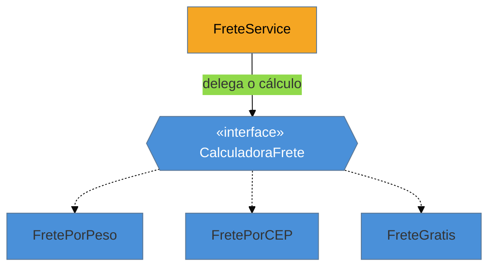

# Strategy

> [!abstract] TL;DR
> O **Strategy** encapsula **algoritmos intercambiáveis** atrás de uma interface comum, deixando o
> cliente escolher a implementação em **runtime**. É o comportamental mais útil do dia a dia e o
> **caso-ouro** da lente deste catálogo: onde há **função de primeira classe**, o Strategy vira
> literalmente uma **função** (uma lambda em Java, uma função em Python/Go/TS) — a interface e a
> classe do GoF eram, em parte, um contorno para a falta desse recurso. No Spring, o idioma é
> injetar um `Map<String, Strategy>`. A armadilha número um, e a mais cometida de todo o catálogo:
> criar a interface de Strategy com **uma única implementação** e nenhuma perspectiva de segunda —
> abstração prematura em estado puro.

## O `if-else-if` que cresce sem parar

O cálculo do frete depende da transportadora: uma cobra por peso, outra por CEP de destino, outra é grátis acima de um valor. A primeira versão é um `if tipo == PESO ... else if tipo == CEP ... else if ...` dentro do serviço de checkout. A cada nova transportadora, você **abre o mesmo método** e acrescenta mais um ramo. A lógica de todas as transportadoras se acumula num lugar só, e mudar uma arrisca quebrar as outras.

O problema é que **um comportamento que varia** está codificado como uma cadeia de condicionais fixa. O Strategy extrai cada variação para trás de uma interface (`CalculadoraFrete`) e deixa o cliente receber **a estratégia certa** já escolhida. Adicionar uma transportadora vira criar uma implementação nova — sem tocar no checkout. É o [[03 - OCP - Aberto-Fechado|Aberto-Fechado]] em ação: aberto para novas estratégias, fechado para modificação.



O contexto (âmbar) não sabe *qual* algoritmo roda — só delega à interface. Trocar ou acrescentar uma estratégia não encosta nele.

## O padrão nas quatro linguagens — o colapso para função

### Java — interface, mas a lambda já é a estratégia

O GoF pede uma interface e uma classe por algoritmo:

```java
interface CalculadoraFrete { Money calcular(Pedido p); }

class FretePorPeso implements CalculadoraFrete {
    public Money calcular(Pedido p) { return Money.reais(p.pesoKg() * 5); }
}
```

Mas, desde o Java 8, se a interface é funcional (um método), a "estratégia" pode ser uma **lambda** — sem classe nenhuma:

```java
CalculadoraFrete gratis = p -> Money.ZERO;              // a estratégia É a função
Money f = calcular(pedido, gratis);
```

### Python, Go e TypeScript — a estratégia É uma função, ponto

Nessas linguagens, funções são valores de primeira classe; o Strategy raramente precisa de interface nominal — você passa a função:

```python
def frete_por_peso(p): return p.peso_kg * 5
def calcular(pedido, estrategia): return estrategia(pedido)   # recebe a função
calcular(pedido, frete_por_peso)
```

```go
type CalculadoraFrete func(Pedido) Money            // um tipo função
porPeso := func(p Pedido) Money { return Reais(p.PesoKg * 5) }
```

```typescript
type CalculadoraFrete = (p: Pedido) => Money;
const gratis: CalculadoraFrete = () => Money.zero;
```

> **A tese, no seu exemplo mais claro:** o Strategy é uma interface **de um método** — e "objeto com um método" é só uma forma verbosa de "função". Onde a linguagem trata função como valor, o padrão colapsa para passar uma função. Isso não o torna inútil: o *conceito* (comportamento intercambiável selecionado em runtime) é essencial. Muda só a **forma** — e reconhecer que em Python/Go você não precisa de uma classe `Strategy` é o que evita cerimônia importada de Java.

## Spring — injetar um `Map<String, Strategy>`

Quando as estratégias são beans, o Spring popula um mapa com todas, indexadas pelo nome — e um "resolvedor" escolhe pela chave, sem nenhum `switch`:

```java
@Service
public class FreteService {
    private final Map<String, CalculadoraFrete> estrategias;   // Spring injeta todas
    public FreteService(Map<String, CalculadoraFrete> e) { this.estrategias = e; }

    public Money calcular(String transportadora, Pedido p) {
        return estrategias.get(transportadora).calcular(p);
    }
}
```

## Na prática (da minha experiência)

> Em Spring Boot, os padrões que mais uso deliberadamente são **Strategy**, **Observer** (Spring Events), **Facade** (services orquestradores) e **Proxy** (via `@Transactional`/`@Cacheable`). Raramente implemento à mão — o framework faz — mas reconhecer o padrão é o que me deixa debugar quando algo quebra.
>
> Um caso concreto de Strategy: no **MedEspecialista**, o cálculo de comissão médica tinha cinco regras dependendo do tipo de convênio. A primeira versão era um `if-else-if` de 80 linhas dentro de um service. Refatorei para `ComissaoStrategy` + cinco implementações, injetadas via `Map<TipoConvenio, ComissaoStrategy>`. Adicionar um novo tipo de convênio virou criar uma classe — zero alteração no service.
>
> O oposto também me pegou: já cometi Strategy prematuro. Uma interface `EmailTemplateStrategy` com **uma única implementação**, que ficou assim por três anos. Em retrospecto, deveria ter sido só uma classe concreta. Não crie abstrações para o futuro hipotético — crie quando a segunda implementação aparecer.

## Armadilhas comuns

> [!warning] Strategy com uma única implementação (abstração prematura)
> **O que acontece:** cria-se a interface `XStrategy` e **uma** classe que a implementa, "porque um dia pode ter outra". A segunda implementação nunca chega, e o código carrega uma indireção sem motivo por anos.
> **Por quê:** o valor do Strategy é ter **variação real**. Com uma implementação só, você pagou o custo (interface, injeção, um arquivo a mais) sem o benefício (trocar algoritmos). É a abstração prematura mais comum de todo o catálogo — "tão ruim quanto não ter abstração nenhuma".
> **Como evitar:** só extraia a estratégia quando existir a **segunda** implementação (ou ela for concretamente iminente). Uma regra só → um método direto. Adicione a abstração quando o segundo caso aparecer, não antes.

> [!warning] Estratégia com estado compartilhado
> **O que acontece:** a implementação de Strategy guarda estado mutável entre chamadas; usada como bean singleton compartilhado, um cálculo contamina o outro (bugs de concorrência).
> **Por quê:** estratégias costumam ser **sem estado** (recebem o input, devolvem o resultado). Estado mutável num objeto compartilhado reintroduz os problemas de estado global.
> **Como evitar:** mantenha a estratégia sem estado; o que varia por chamada entra como **parâmetro**, não como campo.

> [!warning] Strategy onde um enum + função basta
> **O que acontece:** monta-se a hierarquia completa de Strategy para duas variações triviais que um `enum` com um método, ou um parâmetro-função, resolveria em linhas.
> **Por quê:** para pouquíssimas variações simples e estáveis, a maquinaria de interface + implementações + injeção é peso morto.
> **Como evitar:** poucas variações fixas → `enum` com comportamento, ou passar a função direto. Reserve o Strategy nomeado para quando o conjunto cresce ou precisa ser plugável/injetável.

## Como explicar em inglês

> "Strategy encapsulates interchangeable algorithms behind a common interface and lets the client pick one at runtime — shipping cost by carrier, discount by rule. It's my go-to for replacing a growing `if-else` chain, and it respects open-closed: a new algorithm is a new implementation, not an edit. It's also the clearest case of a pattern that collapses into a function: in Java 8+ it's a lambda, and in Python, Go, or TypeScript I just pass a function — no interface needed. In Spring I inject a `Map` of strategies by name. The number-one trap, and the most common over-engineering in the whole catalog, is a Strategy interface with a single implementation added 'just in case' — premature abstraction is as bad as no abstraction. I add the interface when the second implementation actually shows up."

| PT | EN |
| --- | --- |
| algoritmos intercambiáveis | interchangeable algorithms |
| selecionar em runtime | select at runtime |
| função de primeira classe | first-class function |
| abstração prematura | premature abstraction |
| sem estado | stateless |
| aberto para extensão | open for extension |
| plugável / injetável | pluggable / injectable |

## O que vem a seguir

O Strategy deixa **o cliente** escolher o algoritmo. O próximo comportamental inverte quem avisa quem: quando um objeto muda, ele **notifica** automaticamente todos os interessados — sem conhecê-los. É a base de todo sistema orientado a eventos.

- [[13 - Observer]] — dependência um-para-muitos com notificação automática.
- [[16 - State]] — o primo estrutural do Strategy: também troca comportamento, mas dirigido por transições **internas**, não pela escolha do cliente.

## Veja também

- [[03-Dominios/Engenharia/Design de Software/SOLID/03 - OCP - Aberto-Fechado|OCP]] — o princípio que o Strategy materializa.
- [[01 - O que são Design Patterns]] — o exemplo do desconto na abertura do catálogo é um Strategy; aqui está o tratamento completo.

## Fontes

- **Gamma, Helm, Johnson, Vlissides (GoF)** — *Design Patterns* (1994) — Strategy como família de algoritmos intercambiáveis.
- **Refactoring Guru** — [*Strategy*](https://refactoring.guru/design-patterns/strategy) — o padrão e o contraste com State.
- **Baeldung** — [*Strategy Pattern in Java 8*](https://www.baeldung.com/java-strategy-pattern) — como a lambda substitui a classe de estratégia.
