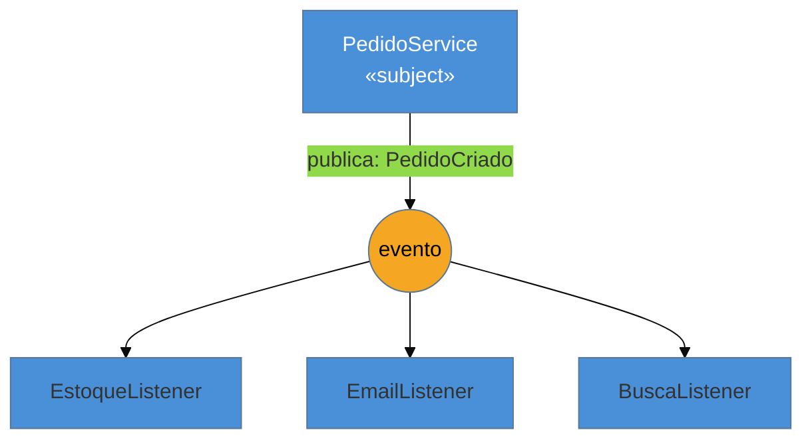

# Observer

> [!abstract] TL;DR
> O **Observer** define uma dependência **um-para-muitos**: quando um objeto (o *subject*) muda, todos
> os seus dependentes (os *observers*) são **notificados automaticamente** — e o subject **não precisa
> conhecê-los**. É a base de todo sistema orientado a eventos: Spring Events, `EventEmitter` do Node,
> eventos do DOM, *reactive streams* (RxJS/Reactor). Na lente cross-linguagem, o Observer "artesanal"
> (attach/detach/notify escritos à mão) quase sumiu: os frameworks o oferecem pronto, e **Go prefere
> `channels`** a classes de observador. As armadilhas que mais mordem: **listener que nunca se
> desregistra** (memory leak) e **evento síncrono** que roda na thread da transação e derruba o fluxo
> principal se falhar.

## Uma ação, várias reações que não deveriam se conhecer

Ao criar um pedido, várias coisas precisam acontecer: baixar o estoque, enviar e-mail de confirmação, indexar o pedido na busca, talvez pontuar um programa de fidelidade. Se o `PedidoService` chama todos esses serviços diretamente, ele passa a **depender** de estoque, e-mail, busca e fidelidade — e cada nova reação (amanhã, um webhook para o parceiro) exige **abrir e editar** o `PedidoService`. Ele vira um centro que sabe demais.

O Observer inverte a direção do conhecimento. O `PedidoService` só **anuncia** um fato — "pedido criado" — sem saber quem se importa. Quem precisa reagir se **inscreve** para ouvir esse fato. Adicionar uma reação nova = criar um novo ouvinte; o `PedidoService` não muda. O emissor fica desacoplado dos receptores.

## A ideia



O subject publica o evento sem referência aos ouvintes. Cada observer registrou interesse; o mecanismo de notificação entrega a todos. Acrescentar um quarto ouvinte não toca no subject.

## O padrão nas quatro linguagens

### Java — Spring Events (o `java.util.Observer` foi aposentado)

O `Observer`/`Observable` da biblioteca padrão foi **deprecado** no Java 9. Na prática, você usa os eventos do Spring:

```java
public record PedidoCriado(Long pedidoId) { }

@Service
class PedidoService {
    private final ApplicationEventPublisher eventos;
    public void criar(Pedido p) {
        repo.save(p);
        eventos.publishEvent(new PedidoCriado(p.getId()));   // não conhece os ouvintes
    }
}

@Component
class EstoqueListener {
    @EventListener
    void ao(PedidoCriado e) { /* baixa estoque */ }
}
```

### Node / TypeScript — `EventEmitter` e o DOM

Node tem o `EventEmitter` embutido; o navegador tem `addEventListener`. O padrão é primitivo da plataforma:

```typescript
emitter.on("pedidoCriado", (id) => baixarEstoque(id));
emitter.emit("pedidoCriado", pedido.id);
```

### Go — **channels**, não classes de observador

Go raramente escreve interface `Observer`; o idioma para "avisar interessados" são **channels** (e goroutines lendo deles). O desacoplamento vem do canal, não de uma hierarquia de observadores:

```go
eventos := make(chan PedidoCriado, 10)
go func() { for e := range eventos { baixarEstoque(e.ID) } }()   // observer = goroutine + canal
eventos <- PedidoCriado{ID: pedido.ID}
```

### Python — *callbacks* ou bibliotecas (`blinker`)

Python não tem Observer embutido; usa-se listas de *callbacks* ou libs de sinais como `blinker`.

> **A tese:** o mecanismo de "registrar-e-notificar" foi **absorvido** — por frameworks (Spring Events), por primitivos de plataforma (EventEmitter, DOM) e por concorrência (channels do Go). E foi **industrializado** pelos *reactive streams* (RxJS, Project Reactor), que são o Observer com back-pressure, operadores e composição. Você quase nunca escreve `attach/detach/notify` à mão — mas reconhecer que tudo isso *é* Observer é o que conecta esses mundos.

## Observer não é message broker

Distinção que cai em entrevista: o Observer clássico é **in-process** e geralmente **síncrono** — emissor e ouvintes vivem na mesma aplicação, na mesma JVM/processo. Um **pub/sub com broker** (Kafka, RabbitMQ) é o mesmo *espírito* levado para **entre processos**, com entrega assíncrona, durabilidade e desacoplamento total. Confundir os dois leva a esperar garantias de broker (retry, persistência) de um `@EventListener` em memória, que não as tem. O aprofundamento de mensageria distribuída vive em [[03-Dominios/Engenharia/Comunicação entre Sistemas/index|Comunicação entre Sistemas]].

## Armadilhas comuns

> [!warning] Listener que nunca se desregistra (memory leak)
> **O que acontece:** um observer é registrado mas nunca removido; o subject segura uma referência a ele para sempre, impedindo a coleta de lixo. Em UIs e código dinâmico, a memória cresce sem parar.
> **Por quê:** o subject mantém a lista de observers viva. Se o ciclo de vida do observer é mais curto que o do subject e ninguém chama `detach`/`off`, ele vaza.
> **Como evitar:** sempre desregistre no fim do ciclo de vida (`removeEventListener`, `off`, `dispose`). Em Spring não é problema (beans vivem com a app), mas em front-end e código dinâmico, é obrigatório. Referências fracas ajudam onde a linguagem as oferece.

> [!warning] Evento síncrono na thread (e na transação) do emissor
> **O que acontece:** um `@EventListener` síncrono roda na **mesma thread e transação** de quem publicou. Se o listener é lento, ele atrasa o fluxo principal; se lança exceção, pode causar rollback da transação do emissor.
> **Por quê:** por padrão, muitos mecanismos (incluindo Spring Events) são síncronos — a notificação é uma chamada de método comum, com o custo e o risco de acoplamento temporal que isso traz.
> **Como evitar:** para efeitos colaterais que não devem afetar o fluxo principal, use notificação **assíncrona** (`@Async`, fila, ou publicar após o commit com `@TransactionalEventListener`). Saiba se seu mecanismo é sync ou async — a resposta muda o design.

> [!warning] Cascata de eventos ("event spaghetti")
> **O que acontece:** um listener publica outro evento, que dispara outro listener, que publica mais um... O fluxo real do sistema fica espalhado por handlers, impossível de seguir lendo o código.
> **Por quê:** o desacoplamento que é a força do Observer também **esconde o fluxo de controle**: não há um lugar que mostre "o que acontece quando um pedido é criado". Em excesso, vira um grafo implícito difícil de depurar.
> **Como evitar:** use eventos para desacoplar *efeitos colaterais* genuínos, não para expressar o fluxo principal de negócio. Limite cascatas; documente as cadeias importantes; desconfie de listeners que republicam.

## Como explicar em inglês

> "Observer sets up a one-to-many dependency: when the subject changes, all its observers are notified automatically, and the subject doesn't know who they are. It's the backbone of event-driven code — Spring Events, Node's EventEmitter, DOM events, and reactive streams, which are really Observer industrialized with back-pressure and operators. I rarely hand-write attach/detach/notify anymore; the framework or the platform provides it, and in Go I'd use channels instead of observer classes. The two traps I always mention: a listener that never unsubscribes leaks memory, and a synchronous listener runs on the publisher's thread and transaction — so a slow or failing listener can hurt the main flow. For side effects, I make those async or fire them after commit."

| PT | EN |
| --- | --- |
| dependência um-para-muitos | one-to-many dependency |
| notificar automaticamente | notify automatically |
| inscrever-se / desinscrever-se | subscribe / unsubscribe |
| emissor / ouvinte | publisher / listener |
| in-process vs broker | in-process vs message broker |
| síncrono vs assíncrono | synchronous vs asynchronous |
| vazamento de memória | memory leak |
| reactive streams | reactive streams |

## O que vem a seguir

O Observer transforma uma mudança de estado num **evento** que vários reagem. O próximo comportamental transforma uma **requisição** em um objeto de primeira classe — o que permite enfileirá-la, registrá-la em log, desfazê-la. É a base de filas de tarefas, undo/redo e do lado "command" do CQRS.

- [[14 - Command]] — encapsular uma requisição como objeto.
- [[03-Dominios/Engenharia/Comunicação entre Sistemas/index|Comunicação entre Sistemas]] — o Observer levado para entre processos: pub/sub com broker.

## Veja também

- [[03-Dominios/Tecnologia/Node/index|Node]] — `EventEmitter`, o Observer como primitivo da plataforma.
- [[03-Dominios/Tecnologia/Go/index|Go]] — channels como alternativa idiomática às classes de observador.

## Fontes

- **Gamma, Helm, Johnson, Vlissides (GoF)** — *Design Patterns* (1994) — Observer (push vs pull, dependência um-para-muitos).
- **Refactoring Guru** — [*Observer*](https://refactoring.guru/design-patterns/observer) — o mecanismo de assinatura e notificação.
- **Spring Framework Docs** — [*Application Events*](https://docs.spring.io/spring-framework/reference/core/beans/context-introduction.html#context-functionality-events) — `@EventListener`, `@TransactionalEventListener`, sync vs async.
