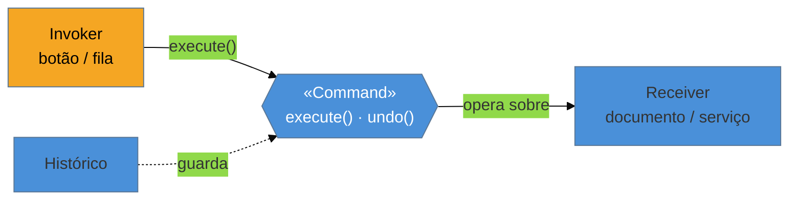

# Command

> [!abstract] TL;DR
> O **Command** encapsula uma **requisição como um objeto** — transformando "faça X" em um dado que se
> pode guardar, passar adiante, **enfileirar**, **registrar em log** e **desfazer**. É a base de
> undo/redo em editores, de filas de tarefas (a tarefa *é* um comando serializado) e do lado
> *command* do CQRS. Na lente cross-linguagem, o caso simples **colapsa para uma closure** (uma
> função que carrega seu contexto) em Python/TS/Go e até em Java com lambda; o objeto Command completo
> se justifica quando você precisa de **undo** ou de **serializar** a ação. A armadilha principal:
> montar a cerimônia de Command para uma ação trivial que um método direto resolveria.

## Quando "uma ação" precisa virar dado

Pense num editor com **desfazer/refazer**. Cada operação — mover uma forma, apagar um texto — precisa saber não só **como se executar**, mas **como se reverter**. Se essas ações são só chamadas de método espalhadas, não há como empilhá-las para desfazer na ordem certa. Você precisa que cada ação seja um **objeto** que carrega o que fazer e o que desfazer.

Outro caso: uma **fila de tarefas**. O produtor cria "envie este e-mail" e enfileira; um consumidor pega depois e executa. Para atravessar a fila (talvez serializada, talvez em outra máquina), a ação **tem que ser dado** — não uma chamada imediata. O Command é o padrão que reifica "uma requisição" num objeto de primeira classe, separando **quem pede** (o *invoker*) de **quem sabe fazer** (o *receiver*).

## A ideia



O invoker dispara `execute()` sem saber os detalhes; o command sabe qual receiver chamar e como. Como o command é um objeto, o histórico pode **guardá-lo** para desfazer, e uma fila pode **transportá-lo**.

## O padrão nas quatro linguagens

### Java — interface com `execute` (e `undo`)

```java
interface Command { void execute(); void undo(); }

class MoverCommand implements Command {
    private final Forma forma; private final Ponto de, para;
    MoverCommand(Forma f, Ponto de, Ponto para) { this.forma = f; this.de = de; this.para = para; }
    public void execute() { forma.mover(para); }
    public void undo()    { forma.mover(de); }         // sabe reverter
}
```

O caso **sem undo** encolhe para um `Runnable` (uma lambda): `queue.add(() -> enviarEmail(id))`.

### Python, TypeScript, Go — a closure carrega o contexto

Onde há closures, "um objeto com um método `execute`" é só uma função que capturou seu contexto:

```python
tarefas.append(lambda: enviar_email(pedido_id))   # a closure É o comando
```

```go
tarefas = append(tarefas, func() { enviarEmail(pedidoID) })   // func + captura
```

O objeto Command completo (com `undo`, metadados, serialização) reaparece quando o caso **exige** mais que executar: desfazer, logar com contexto, transportar pela rede.

> **A tese:** o Command tem dois usos que a linguagem trata muito diferente. **Executar depois** (enfileirar, adiar) colapsa para uma **closure** em qualquer linguagem funcional — não precisa de classe. Mas **desfazer** e **serializar** pedem um objeto que carrega *estado* (o que reverter) ou é *dado* (para a fila persistente) — e aí o Command completo se justifica. Reconhecer qual dos dois você tem evita tanto a closure insuficiente quanto a classe cerimoniosa.

## Onde ele aparece

- **Undo/redo** em editores (a pilha de comandos executados).
- **Filas de tarefas** — a mensagem é um Command serializado (envie e-mail, gere relatório).
- **CQRS** — *Commands* mutam o estado, *Queries* leem; um *command bus* (ver [[19 - Mediator]]) roteia cada comando ao seu handler.
- **Ações de GUI** — o mesmo comando disparado por botão, menu e atalho.

## Armadilhas comuns

> [!warning] Cerimônia de Command onde um método basta
> **O que acontece:** cria-se uma classe Command (invoker, receiver, interface) para uma ação que é executada **imediatamente e uma vez**, sem fila, sem undo, sem log.
> **Por quê:** o Command se paga pela **indireção temporal** (executar depois) ou pela **reversibilidade** (undo). Sem nenhuma das duas, é uma classe a mais entre o chamador e a ação — indireção pura.
> **Como evitar:** precisa só executar agora? Chame o método (ou passe uma lambda). Introduza o Command quando surgir enfileirar, desfazer, logar ou serializar.

> [!warning] `undo` que não reverte de verdade
> **O que acontece:** o `undo()` assume que basta fazer "o inverso", mas não capturou **estado suficiente** — desfazer um "apagar" sem ter guardado o que foi apagado, ou desfazer sobre um estado que já mudou por outra via.
> **Por quê:** reverter exige memória: o comando precisa guardar, no `execute`, o que for necessário para restaurar (o *Memento* costuma andar junto aqui). "O inverso" nem sempre é bem definido.
> **Como evitar:** capture no `execute()` tudo que o `undo()` precisará (valores anteriores). Para estado complexo, combine com [[21 - Padrões raros (Bridge, Flyweight, Memento, Interpreter)|Memento]] (snapshot). Teste a sequência execute→undo→execute.

> [!warning] Confundir Command com Strategy
> **O que acontece:** trata-se como sinônimos porque ambos são interfaces de (quase) um método.
> **Por quê:** a **intenção** difere. Strategy encapsula **como** fazer algo (um algoritmo intercambiável, que você escolhe). Command encapsula **o que** fazer (uma requisição concreta, que você guarda/enfileira/desfaz). Mesma forma, propósitos diferentes.
> **Como evitar:** pergunte *"estou trocando o algoritmo de uma operação (Strategy) ou reificando uma ação para adiar/desfazer/transportar (Command)?"*.

## Como explicar em inglês

> "Command turns a request into an object, so I can queue it, log it, and undo it. It's the backbone of undo/redo, task queues — where the message is a serialized command — and the command side of CQRS. In a functional language, the simple 'run this later' case collapses into a closure: I just push a lambda onto the queue, no class needed. The full Command object earns its keep when I need `undo`, which requires capturing enough state to reverse the action, or when the command must be serialized to cross a queue. The trap is building the whole invoker/receiver ceremony for an action that just runs once, right now — that's indirection with no payoff. And I keep it distinct from Strategy: Strategy is *how* to do something, Command is *what* to do."

| PT | EN |
| --- | --- |
| requisição como objeto | request as an object |
| desfazer / refazer | undo / redo |
| enfileirar | to queue |
| invocador / receptor | invoker / receiver |
| fila de tarefas | task queue |
| command bus (CQRS) | command bus |
| closure (captura de contexto) | closure |

## O que vem a seguir

O Command encapsula *o que* fazer. O próximo comportamental fixa o **esqueleto** de um algoritmo numa classe base e deixa as subclasses preencherem os passos que variam — e é onde a ausência de herança em Go muda tudo.

- [[15 - Template Method]] — esqueleto fixo, passos variáveis por subclasse.
- [[12 - Strategy]] — o vizinho de mesma forma (interface de um método), para revisar a diferença de intenção.

## Veja também

- [[03-Dominios/Engenharia/Comunicação entre Sistemas/index|Comunicação entre Sistemas]] — filas e mensageria, onde a mensagem é um Command serializado.
- [[03-Dominios/Engenharia/Arquitetura/index|Arquitetura]] — CQRS e command bus no nível de aplicação.

## Fontes

- **Gamma, Helm, Johnson, Vlissides (GoF)** — *Design Patterns* (1994) — Command (invoker, receiver, undo).
- **Refactoring Guru** — [*Command*](https://refactoring.guru/design-patterns/command) — o padrão, undo e a relação com filas.
- **Martin Fowler** — [*CommandOrientedInterface*](https://martinfowler.com/bliki/CommandOrientedInterface.html) — comandos como reificação de requisições em CQRS.
