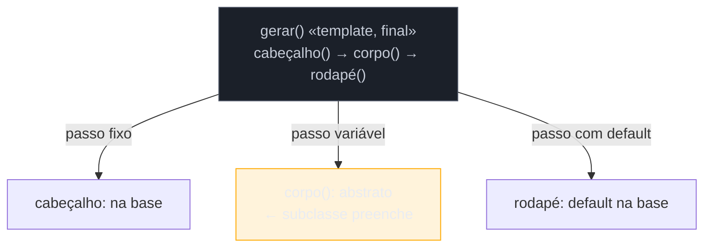

# Template Method

> [!abstract] TL;DR
> O **Template Method** define o **esqueleto** de um algoritmo numa classe base — a ordem fixa dos passos — e deixa as **subclasses preencherem** os passos que variam, sem mudar a estrutura geral. É o padrão comportamental **mais dependente de herança** do GoF, e por isso o que mais muda na nossa lente cross-linguagem: **Go não tem herança**, então lá ele vira **composição** (passar os passos como funções, ou embutir); e mesmo em Java moderno, a tendência é preferir composição + lambdas (essencialmente um [[12 - Strategy|Strategy]]) à hierarquia rígida. Segue o "princípio de Hollywood": *não nos chame, nós chamamos você* — a base controla o fluxo e invoca seus ganchos. A armadilha central é a **classe-base frágil**: mudar a base quebra silenciosamente as subclasses.

## Quatro classes que fazem quase a mesma coisa

Você tem vários geradores de relatório: vendas, estoque, financeiro. Todos seguem o **mesmo fluxo** — montar cabeçalho, montar corpo, montar rodapé, juntar — e só o **corpo** muda de um para outro. Se cada gerador reimplementa o fluxo inteiro, você duplica a ordem dos passos em todo lugar, e mudar o fluxo (digamos, adicionar numeração de página) vira editar N classes.

O Template Method extrai o **fluxo** para um método na classe base — o *template method* — que chama os passos na ordem certa. Os passos que variam são métodos **abstratos** (ou com implementação default) que cada subclasse preenche. O fluxo mora num lugar só; as subclasses só fornecem as peças que mudam. A base **controla**; as subclasses **completam**.

## A ideia



O `gerar()` é `final` — a subclasse **não** muda o fluxo, só os ganchos. Isso é o inverso do controle habitual: em vez de a subclasse chamar a base, a **base chama a subclasse** (Hollywood).

## O padrão nas quatro linguagens — herança vs composição

### Java — o caso clássico, com herança

```java
abstract class GeradorRelatorio {
    public final String gerar() {                 // template: fluxo fixo, não sobrescrevível
        return cabecalho() + corpo() + rodape();
    }
    protected String cabecalho() { return "=== Relatório ===\n"; }  // passo com default
    protected abstract String corpo();                              // passo variável
    protected String rodape()    { return "\n— fim —"; }
}

class RelatorioVendas extends GeradorRelatorio {
    protected String corpo() { return "..."; }     // só preenche o que varia
}
```

Python e TS seguem igual (classe abstrata + métodos sobrescritos). 

### Go — sem herança, vira composição

Go não tem classes nem sobrescrita; o "esqueleto que chama passos variáveis" é feito **compondo funções** (o passo variável é um campo do tipo função) ou embutindo — mas o idioma mais limpo é passar os passos:

```go
func Gerar(corpo func() string) string {          // o esqueleto recebe o passo variável
    return cabecalho() + corpo() + rodape()
}
Gerar(func() string { return "vendas..." })       // "subclasse" = uma função
```

Repare: isso já **é** um Strategy. Em Go, o Template Method e o Strategy convergem — porque, sem herança, a única forma de variar um passo é **injetá-lo**.

> **A tese:** o Template Method é a versão **por herança** (estática, em tempo de compilação) do que o Strategy faz **por composição** (dinâmica, injetada). Onde não há herança (Go), ele *é* composição; e mesmo onde há (Java, Python), o estilo moderno tende a preferir passar funções — porque herança acopla a subclasse à base para sempre, enquanto composição deixa trocar o passo em runtime. Reconhecer isso é escolher conscientemente entre o acoplamento forte (e conveniente) da herança e a flexibilidade da injeção.

## Armadilhas comuns

> [!warning] Classe-base frágil (fragile base class)
> **O que acontece:** você muda a classe base (reordena passos, ajusta um método default) e **quebra** subclasses distantes, que dependiam do comportamento anterior — muitas vezes sem erro de compilação, só bug em runtime. **Por quê:** a herança cria um acoplamento **forte e implícito** entre base e subclasses. O template method assume que os ganchos se comportam de certo jeito; a subclasse assume que o fluxo é de certo jeito. Mudar um lado fere o outro à distância. **Como evitar:** mantenha o template method `final` (ninguém reescreve o fluxo); documente o contrato de cada gancho (o que ele deve/não deve fazer); mudanças na base exigem revisar as subclasses. Onde o acoplamento incomoda, prefira composição.

> [!warning] Ganchos demais / inversão confusa
> **O que acontece:** a base define muitos *hooks* opcionais; entender o que a subclasse precisa (ou pode) sobrescrever exige ler a base inteira, e a ordem de chamada fica obscura. **Por quê:** o "não nos chame, nós chamamos você" inverte o fluxo de controle. Com poucos ganchos é elegante; com muitos, vira um framework implícito difícil de seguir. **Como evitar:** poucos pontos de variação, bem nomeados. Se há muitos passos independentes variando, talvez sejam **estratégias** separadas, não ganchos de uma base só.

> [!warning] Herança onde composição seria mais flexível
> **O que acontece:** usa-se Template Method (herança) para variar um único passo que muda em runtime, e depois se descobre que era preciso trocar esse passo dinamicamente — o que a herança não permite. **Por quê:** herança fixa a variação em **tempo de compilação** (a subclasse *é* o que é). Se a variação precisa mudar por requisição/contexto, você precisava de composição (Strategy) desde o início. **Como evitar:** varia em runtime, ou é um passo só? Prefira **Strategy** (injetar a função/objeto). Reserve o Template Method para quando há um **fluxo com vários passos** genuinamente compartilhado e a variação é por tipo, não por instância.

## Como explicar em inglês

> "Template Method puts the skeleton of an algorithm in a base class — the fixed order of steps — and lets subclasses fill in the steps that vary. It follows the Hollywood principle: the base calls the hooks, not the other way around, and I keep the template method `final` so subclasses can't rewrite the flow. It's the most inheritance-dependent GoF pattern, which makes the cross-language contrast sharp: Go has no inheritance, so there it becomes composition — you pass the varying step as a function, which is basically Strategy. Even in Java I often prefer composition plus lambdas, because inheritance couples the subclass to the base forever, while injecting the step lets me swap it at runtime. The classic risk is the fragile base class: changing the base silently breaks distant subclasses."

| PT | EN |
| --- | --- |
| esqueleto do algoritmo | algorithm skeleton |
| passo variável / gancho | varying step / hook |
| princípio de Hollywood | Hollywood principle |
| classe-base frágil | fragile base class |
| herança vs composição | inheritance vs composition |
| tempo de compilação vs runtime | compile-time vs runtime |
| método final (não sobrescrevível) | final (non-overridable) method |

## O que vem a seguir

O Template Method e o Strategy variam **um passo** de um algoritmo. O próximo comportamental varia o **comportamento inteiro** de um objeto conforme seu **estado interno** muda — e parece que a classe trocou de tipo.

- [[16 - State]] — comportamento que muda com o estado interno do objeto.
- [[12 - Strategy]] — o par por composição do Template Method; reveja a diferença herança × injeção.

## Veja também

- [[03-Dominios/Engenharia/Design de Software/Orientação a Objetos/07 - Composição sobre herança|Composição sobre herança]] — por que o estilo moderno migra do Template Method para o Strategy.
- [[03-Dominios/Tecnologia/Go/index|Go]] — a ausência de herança que funde Template Method e Strategy.

## Fontes

- **Gamma, Helm, Johnson, Vlissides (GoF)** — *Design Patterns* (1994) — Template Method e o princípio de Hollywood.
- **Refactoring Guru** — [*Template Method*](https://refactoring.guru/design-patterns/template-method) — passos fixos vs variáveis e o contraste com Strategy.
- **Joshua Bloch** — *Effective Java*, Item 18 ("Favor composition over inheritance") — a base do argumento contra a herança rígida do Template Method.
