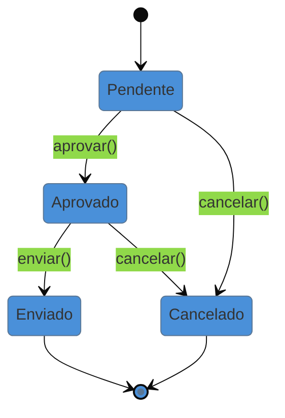

# State

> [!abstract] TL;DR
> O **State** permite que um objeto **altere seu comportamento** quando seu **estado interno** muda —
> a ponto de parecer que ele trocou de classe. Cada estado vira um objeto que implementa a mesma
> interface, e o contexto **delega** ao estado atual, que também decide as **transições**. É a versão
> orientada a objetos de uma **máquina de estados finitos**. Na lente cross-linguagem, ele tem um
> rival forte: **enum com comportamento**, **união discriminada** (TypeScript) e **sealed types**
> (Java 21+) modelam a mesma FSM de forma mais enxuta quando o comportamento por estado é simples. A
> armadilha central é justamente essa: montar uma classe por estado onde um `enum` + `switch`
> resolveria — e vice-versa, espalhar `if(estado == ...)` por todo método quando o State organizaria.

## O `if (status == ...)` que se repete em todo método

Um `Pedido` passa por estados: pendente, aprovado, enviado, cancelado. E cada estado **permite ações diferentes**: um pedido pendente pode ser aprovado ou cancelado; um já enviado não pode mais ser cancelado; um cancelado não aceita mais nada. Se cada método (`aprovar`, `cancelar`, `enviar`) começa com um `if (status == PENDENTE) ... else if (status == ENVIADO) ...`, a mesma bifurcação de estados se repete em **todos** eles. Adicionar um estado novo obriga a revisar cada método, e é fácil esquecer um.

O State recolhe o comportamento de cada estado para **um objeto**. `PedidoPendente` sabe o que fazer em `aprovar` e `cancelar`; `PedidoEnviado` sabe que `cancelar` é inválido. O `Pedido` (contexto) só delega ao objeto-estado atual — e são os próprios estados que fazem a **transição** para o próximo. A lógica de "o que é permitido em cada estado" fica coesa, num lugar por estado.

## A ideia



Cada transição válida é uma seta; o que não está no diagrama é proibido. No State, cada nó vira um objeto que implementa as ações e dispara as transições permitidas a partir dele.

## O padrão nas quatro linguagens — objeto por estado vs tipo-soma

### Java — um objeto por estado

```java
interface EstadoPedido { void aprovar(Pedido p); void cancelar(Pedido p); }

class Pendente implements EstadoPedido {
    public void aprovar(Pedido p)  { p.setEstado(new Aprovado()); }
    public void cancelar(Pedido p) { p.setEstado(new Cancelado()); }
}
class Enviado implements EstadoPedido {
    public void aprovar(Pedido p)  { throw new IllegalStateException("já enviado"); }
    public void cancelar(Pedido p) { throw new IllegalStateException("não dá pra cancelar enviado"); }
}
```

### A alternativa enxuta: enum / união / sealed

Quando o comportamento por estado é simples, um **enum com métodos** (Java), uma **união discriminada** (TS) ou **sealed types** com `switch` exaustivo (Java 21+, Kotlin, Rust) expressam a mesma FSM sem uma classe por estado:

```typescript
type Pedido =
  | { status: "pendente" }
  | { status: "aprovado" }
  | { status: "enviado" };

const cancelar = (p: Pedido): Pedido => {
  switch (p.status) {
    case "pendente":
    case "aprovado": return { status: "cancelado" as const };
    case "enviado":  throw new Error("não dá pra cancelar enviado");
  }
};
```

> **A tese:** o State (uma classe por estado) brilha quando **cada estado tem comportamento rico** — muitos métodos, lógica própria, dados associados. Quando o que varia é só "qual transição é permitida", um **enum/união/sealed** com `switch` exaustivo é mais direto, e o compilador ainda te avisa se você esqueceu um caso (exaustividade). É o mesmo *trade-off* do [[11 - Composite|Composite]] e do [[20 - Visitor|Visitor]]: objeto-por-caso facilita **adicionar estados**; tipo-soma facilita **adicionar operações** e garante exaustividade.

## State não é Strategy (mesma forma, intenção oposta)

Estruturalmente idênticos — um contexto delega a um objeto intercambiável — mas: no **Strategy**, quem escolhe a implementação é o **cliente**, de fora, e as estratégias **não se conhecem**. No **State**, a troca é **interna e automática** (o próprio estado dispara a transição para o próximo), e os estados **conhecem** uns aos outros o suficiente para transicionar. Strategy é sobre *como* fazer; State é sobre *em que situação* o objeto está.

## Armadilhas comuns

> [!warning] State pattern onde um enum + switch basta
> **O que acontece:** cria-se uma classe por estado (com toda a hierarquia) para uma máquina de três estados cujo comportamento é trivial.
> **Por quê:** o State se paga quando cada estado carrega **comportamento substancial**. Para transições simples, a maquinaria de classes é peso morto — um `enum` com um método, ou um `switch` exaustivo, é mais curto e ainda ganha checagem de exaustividade do compilador.
> **Como evitar:** comportamento rico por estado → State (objetos). Só "qual transição é válida" → enum/união/sealed. Deixe a complexidade real decidir.

> [!warning] Quem decide a transição? (context-god ou state-god)
> **O que acontece:** ou o contexto concentra toda a lógica de transição (e os estados viram sacos de dados), ou os estados conhecem demais do contexto e uns dos outros, virando um emaranhado acoplado.
> **Por quê:** a transição precisa morar em algum lugar coerente. Espalhada, reintroduz o `if` que o padrão veio eliminar; concentrada demais num estado onisciente, acopla tudo.
> **Como evitar:** deixe **cada estado** decidir suas próprias transições de saída (é o que dá coesão). O contexto só guarda o estado atual e delega.

> [!warning] Explosão de classes com comportamento duplicado
> **O que acontece:** muitos estados que compartilham quase todo o comportamento geram muitas classes quase iguais, com duplicação.
> **Por quê:** um objeto por estado multiplica classes; se os estados diferem pouco, a maior parte é repetição.
> **Como evitar:** use uma classe-base de estado com defaults (comportamento comum) e sobrescreva só o que difere; ou reavalie se um enum não seria mais adequado para esse caso de baixa variação.

## Como explicar em inglês

> "State lets an object change its behavior when its internal state changes — it's the object-oriented form of a finite state machine. Each state becomes an object with the same interface, the context delegates to the current one, and the states themselves drive the transitions. It's structurally identical to Strategy, but the intent is opposite: Strategy is chosen by the client from outside, while State transitions internally and the states know about each other. The cross-language nuance is that when the per-state behavior is simple, I'd model the machine with an enum, a discriminated union, or sealed types with an exhaustive switch — the compiler then tells me if I forgot a case. I reserve the full State pattern for when each state has genuinely rich behavior. The trap is a class-per-state for a three-state machine a switch would handle."

| PT | EN |
| --- | --- |
| estado interno | internal state |
| máquina de estados finitos | finite state machine (FSM) |
| transição | transition |
| união discriminada | discriminated union |
| sealed types / exaustividade | sealed types / exhaustiveness |
| comportamento por estado | per-state behavior |
| contexto (guarda o estado atual) | context |

## O que vem a seguir

O State roteia uma chamada conforme a situação interna do objeto. O próximo comportamental roteia uma requisição por uma **cadeia** de possíveis tratadores, até que um a resolva — a base de todo pipeline de middleware e filtros.

- [[17 - Chain of Responsibility]] — passar a requisição por uma cadeia de handlers.
- [[12 - Strategy]] — o gêmeo estrutural do State; reveja a diferença de intenção (externo × interno).

## Veja também

- [[03-Dominios/Ciência/Teoria da Computação/index|Teoria da Computação]] — máquinas de estados finitos, o fundamento formal do State.
- [[03-Dominios/Engenharia/Comunicação entre Sistemas/index|Comunicação entre Sistemas]] — máquinas de estado de pedidos/sagas, onde a FSM aparece no fluxo distribuído.

## Fontes

- **Gamma, Helm, Johnson, Vlissides (GoF)** — *Design Patterns* (1994) — State e a relação com Strategy.
- **Refactoring Guru** — [*State*](https://refactoring.guru/design-patterns/state) — o padrão e a máquina de estados.
- **Baeldung** — [*Sealed Classes and Records in Java*](https://www.baeldung.com/java-sealed-classes-interfaces) — modelar estados como tipos selados com `switch` exaustivo.
