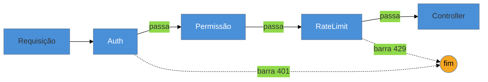

# Chain of Responsibility

> [!abstract] TL;DR
> O **Chain of Responsibility** passa uma requisição por uma **cadeia de tratadores**, cada um
> decidindo se a processa e/ou a repassa ao próximo — desacoplando quem envia de quem trata. É o
> padrão por trás de **todo pipeline de middleware**: servlet filters, a filter chain do Spring
> Security, o middleware do Express/NestJS, pipelines de validação. Na lente cross-linguagem, o
> "handler com `setNext`" do GoF encolhe para uma **composição de funções** — o middleware moderno
> (`(req, next) => ...`) é o Chain of Responsibility funcional. As armadilhas que mais mordem: uma
> requisição que **cai no fim da cadeia sem ninguém tratar** (silenciosamente), e a **ordem
> implícita** dos elos, frágil e difícil de enxergar.

## Uma requisição, vários filtros em sequência

Uma requisição HTTP, antes de chegar ao seu *controller*, precisa atravessar uma sequência de preocupações: autenticar o usuário, verificar permissão, aplicar rate limit, registrar no log, talvez descomprimir o corpo. Cada uma pode **deixar passar** (e delegar ao próximo) ou **barrar** (responder 401, 429 e encerrar). Se você amontoa tudo isso no início do controller, ele acumula responsabilidades que não são dele, e reordenar ou remover uma etapa vira cirurgia.

O Chain of Responsibility organiza isso como uma **cadeia**: cada tratador (elo) recebe a requisição, faz sua parte e decide se **passa adiante**. Quem envia a requisição não sabe quantos elos existem nem quem vai tratá-la — só entrega ao primeiro. Adicionar uma etapa é inserir um elo; a ordem da cadeia define o fluxo.

## A ideia



Cada elo processa e **repassa** (seta cheia) ou **interrompe** a cadeia (seta pontilhada). O emissor conhece só a entrada; a decisão de quem trata emerge da cadeia.

## O padrão nas quatro linguagens — o middleware é a forma moderna

### Java — a filter chain (Spring Security, servlet filters)

O `FilterChain` do servlet é o exemplo canônico: cada filtro faz sua parte e chama `chain.doFilter(...)` para seguir — ou não, encerrando ali:

```java
public class AuthFilter implements Filter {
    public void doFilter(ServletRequest req, ServletResponse res, FilterChain chain) {
        if (!autenticado(req)) { negar(res); return; }   // barra: não chama o próximo
        chain.doFilter(req, res);                          // passa adiante
    }
}
```

### Node / TypeScript e Go — middleware como função + `next`

O middleware do Express é o Chain of Responsibility reduzido a funções: cada uma recebe `next` e decide chamá-la:

```typescript
app.use((req, res, next) => {
  if (!autenticado(req)) return res.status(401).end();  // barra
  next();                                                // passa
});
```

Em Go, o idioma é uma função que **envolve** o próximo handler (`func(http.Handler) http.Handler`) — a mesma cadeia, composta por funções.

### Python — middleware WSGI/ASGI

Frameworks como Django/FastAPI têm cadeias de middleware idênticas em espírito: cada camada processa a requisição e delega à próxima.

> **A tese:** o Chain of Responsibility "OO clássico" (handlers ligados por `setNext`, cada um numa classe) encolheu para **composição de funções** — o middleware. Onde o GoF via uma lista encadeada de objetos handler, o mundo moderno vê uma pilha de funções `(req, next)`. É o mesmo padrão do [[08 - Decorator]] aplicado a requisições — com uma diferença de intenção: no Decorator, **todas** as camadas agem; no Chain, um elo pode **interromper** e resolver sozinho.

## Chain of Responsibility vs Decorator

Estruturalmente parecidos (camadas que envolvem/encadeiam), mas: o **Decorator** sempre repassa — cada camada **acrescenta comportamento** e delega, e a intenção é *compor comportamentos*. O **Chain** busca **um tratador**: um elo pode **parar** a cadeia (tratou, não passa), e a intenção é *encontrar quem resolve*. Middleware fica no meio dos dois — decora (log, sempre passa) e pode barrar (auth, interrompe).

## Armadilhas comuns

> [!warning] A requisição que cai no fim sem ninguém tratar
> **O que acontece:** nenhum elo assume a requisição e ela chega ao fim da cadeia silenciosamente — sem resposta, sem erro, "sumindo".
> **Por quê:** o Chain não garante que **alguém** vai tratar; se nenhum elo assume e não há um tratador-padrão no fim, a requisição simplesmente escoa.
> **Como evitar:** coloque um **elo final garantido** (um *default handler* que trata ou lança "não tratado"). Decida explicitamente o que acontece quando ninguém assume — não deixe isso ao acaso.

> [!warning] Ordem implícita e frágil
> **O que acontece:** a cadeia depende da ordem (autenticar **antes** de autorizar; rate limit **antes** do trabalho caro), mas essa ordem está espalhada na configuração e não é óbvia. Reordenar por engano introduz falhas de segurança ou performance.
> **Por quê:** a corretude da cadeia mora na **sequência** dos elos, que é um estado global implícito. Nada no elo individual revela onde ele deve estar.
> **Como evitar:** torne a ordem **explícita e centralizada** (uma lista ordenada num lugar), documente as dependências de ordem, e teste o fluxo fim a fim. Ordem é parte do contrato.

> [!warning] Elo que faz demais / cadeia longa e opaca
> **O que acontece:** um elo acumula várias responsabilidades, ou a cadeia fica tão longa que rastrear onde uma requisição foi barrada exige percorrer dez camadas.
> **Por quê:** o desacoplamento facilita empilhar elos, e a transparência de cada um esconde o todo — como no middleware, o fluxo real fica difuso.
> **Como evitar:** um elo, uma responsabilidade; mantenha a cadeia curta e nomeada; logue por qual elo a requisição passou/foi barrada quando precisar depurar.

## Como explicar em inglês

> "Chain of Responsibility passes a request along a chain of handlers, each deciding whether to handle it and whether to pass it on — it decouples the sender from whoever ends up handling it. It's the pattern behind every middleware pipeline: servlet filters, Spring Security's filter chain, Express and NestJS middleware. The modern form is functional: instead of GoF's handlers linked by `setNext`, it's a stack of `(req, next)` functions. It's Decorator applied to requests, with one difference of intent — in Decorator every layer acts and passes through, while in Chain a handler can stop and resolve the request itself. The traps I watch for are a request falling off the end with no handler, and the chain's order being implicit and fragile — order is part of the contract, so I keep it explicit and tested."

| PT | EN |
| --- | --- |
| cadeia de tratadores | chain of handlers |
| repassar / interromper | pass on / stop |
| middleware / filtro | middleware / filter |
| tratador-padrão (fim da cadeia) | default handler |
| ordem dos elos | handler ordering |
| desacoplar emissor de receptor | decouple sender from receiver |
| pipeline | pipeline |

## O que vem a seguir

Fechamos os comportamentais mais usados variando *decisão* e *fluxo*. O último do bloco Adepto é o mais onipresente e o menos "padrão": percorrer uma coleção sem expor sua estrutura interna — algo que toda linguagem moderna já embutiu.

- [[18 - Iterator]] — acessar elementos de uma coleção sem revelar a representação.
- [[08 - Decorator]] — o primo estrutural do Chain; reveja a diferença "todos agem" × "um pode parar".

## Veja também

- [[03-Dominios/Engenharia/Auth e Identidade/index|Auth e Identidade]] — a filter chain do Spring Security como Chain of Responsibility de segurança.
- [[03-Dominios/Tecnologia/Node/index|Node]] — middleware do Express, o padrão como função + `next`.

## Fontes

- **Gamma, Helm, Johnson, Vlissides (GoF)** — *Design Patterns* (1994) — Chain of Responsibility.
- **Refactoring Guru** — [*Chain of Responsibility*](https://refactoring.guru/design-patterns/chain-of-responsibility) — a cadeia e o contraste com Decorator.
- **Spring Security Docs** — [*The Security Filter Chain*](https://docs.spring.io/spring-security/reference/servlet/architecture.html) — o exemplo de produção mais rico do padrão.
