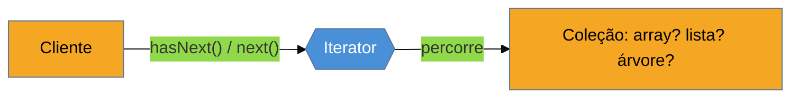

# Iterator

> [!abstract] TL;DR
> O **Iterator** fornece uma forma de **percorrer** os elementos de uma coleção **sem expor** sua
> estrutura interna — o cliente itera igual seja um array, uma lista ligada ou uma árvore. É o padrão
> que as linguagens modernas **mais absorveram**: você o consome o tempo todo (`for...of`,
> `for range`, `for-each`), mas quase nunca escreve a interface do GoF à mão — em vez disso escreve um
> **generator** (`yield`), que é a linguagem te entregando o Iterator de graça. Até Go, o resistente,
> ganhou iteradores nativos no **1.23** (`range`-over-func). A face moderna é a **iteração
> preguiçosa**: produzir valores sob demanda, o que permite sequências enormes ou infinitas sem
> materializar tudo. A armadilha principal é reimplementar à mão o que a linguagem já dá — e modificar
> a coleção enquanto se itera.

## Percorrer sem saber o que há por baixo

Você tem uma coleção e quer percorrê-la. Se o cliente precisa saber que é um `ArrayList` (e usar índices) ou uma `LinkedList` (e seguir ponteiros) ou uma árvore (e recorrer), então **trocar a estrutura interna quebra todo mundo** que itera. Pior: cada coleção exigiria um jeito diferente de percorrer, e o mesmo laço não serviria para duas estruturas.

O Iterator resolve dando a toda coleção uma forma **uniforme** de dizer "me dê o próximo elemento" — `hasNext()`/`next()`, ou o equivalente. O cliente pede elementos em sequência sem saber a representação; a coleção pode mudar por dentro sem afetar quem itera. É o que faz o `for (x : colecao)` funcionar igual para lista, conjunto e árvore.



O cliente só conhece o protocolo `hasNext`/`next`; a estrutura real da coleção (âmbar) fica escondida atrás do iterador.

## O padrão que virou recurso da linguagem

Aqui a lente cross-linguagem tem o resultado mais extremo do catálogo: **o Iterator está embutido em toda linguagem moderna**, e você o implementa não escrevendo a interface do GoF, mas usando o mecanismo da linguagem.

### Java — `Iterable`/`Iterator` + for-each

Implementar `Iterable` habilita o `for` melhorado; mas raramente você escreve `hasNext`/`next` à mão — usa as coleções prontas:

```java
for (Pedido p : pedidos) { processar(p); }   // açúcar sobre iterator.hasNext()/next()
```

### Python — `__iter__`/`__next__`, e o **generator** com `yield`

O jeito idiomático de *criar* um iterador em Python não é a classe com dunders — é um **generator**:

```python
def pares_ate(n):
    for i in range(0, n, 2):
        yield i          # produz sob demanda; a linguagem constrói o Iterator

for x in pares_ate(10): ...   # consome preguiçosamente
```

### JavaScript / TypeScript — `Symbol.iterator` e generators

```typescript
function* paresAte(n: number) {
  for (let i = 0; i < n; i += 2) yield i;   // generator = iterator pronto
}
for (const x of paresAte(10)) { /* ... */ }
```

### Go — resistiu até o 1.23

Por anos Go não teve iterador genérico; percorria-se com `for` explícito ou canais. O **Go 1.23** introduziu *range-over-func* — funções iteradoras que o `for range` consome — trazendo o padrão para a linguagem que mais tempo ficou sem ele.

> **A tese, no extremo:** o Iterator é o padrão **mais completamente absorvido** pelas linguagens. Ninguém escreve a interface do GoF no dia a dia — escreve um `yield` e recebe o Iterator pronto, com iteração preguiçosa de brinde. O fato de até Go ter cedido e adicionado iteradores nativos em 2024 é a prova cabal: quando um padrão é universal o suficiente, a linguagem o incorpora e o "padrão" some da vista, virando sintaxe.

## A face moderna: iteração preguiçosa

O maior ganho dos iteradores/generators modernos é a **preguiça**: os valores são produzidos **sob demanda**, um a um, em vez de materializados todos numa lista. Isso permite percorrer arquivos gigantes sem carregá-los na memória, compor transformações (`map`/`filter`) sem passos intermediários, e até representar sequências **infinitas** (produza "o próximo número primo" para sempre; consuma só os que precisar). Uma `Stream` do Java, um *generator* do Python, um `iterator` de Rust — todos são o Iterator com avaliação preguiçosa.

## Armadilhas comuns

> [!warning] Reimplementar o Iterator à mão
> **O que acontece:** escreve-se uma classe com `hasNext`/`next` (ou controla-se índices manualmente) onde um `for-each` sobre a coleção pronta, ou um generator, resolveria.
> **Por quê:** a linguagem já fornece o Iterator para suas coleções e um mecanismo (generator) para criar novos. Reimplementá-lo é trabalho redundante e propenso a erros de fronteira (off-by-one, `next` sem checar `hasNext`).
> **Como evitar:** consuma com o laço nativo; para criar sequências próprias, use **generators** (`yield`) em vez da classe do GoF. Só desça ao iterador manual em casos muito especiais.

> [!warning] Modificar a coleção durante a iteração
> **O que acontece:** você adiciona/remove elementos enquanto itera e recebe um erro (`ConcurrentModificationException` em Java) ou, pior, um comportamento indefinido silencioso (elementos pulados/repetidos).
> **Por quê:** muitos iteradores assumem que a coleção **não muda** durante o percurso; mutá-la invalida o estado interno do iterador (índices, ponteiros).
> **Como evitar:** colete as mudanças e aplique depois; use o `remove()` do próprio iterador quando disponível; ou itere sobre uma cópia. Em concorrência, use coleções apropriadas (copy-on-write, concorrentes).

> [!warning] Consumir um iterador de uso único duas vezes
> **O que acontece:** um generator/stream é iterado até o fim e, ao tentar percorrê-lo de novo, vem vazio — ou lança erro.
> **Por quê:** iteradores preguiçosos costumam ser **de uso único** (exauríveis): uma vez consumidos, não "rebobinam". Confundi-los com uma coleção reutilizável causa bugs sutis (o segundo laço não roda).
> **Como evitar:** se precisa percorrer duas vezes, materialize numa coleção (`list()`, `toList()`) ou recrie o generator. Saiba se o que você tem é uma **coleção** (reiterável) ou um **fluxo** (uso único).

## Como explicar em inglês

> "Iterator provides a way to traverse a collection without exposing its internal structure, so the same loop works whether it's an array, a linked list, or a tree, and I can change the internals without breaking callers. It's the pattern languages have absorbed most completely: I consume it constantly with `for...of` or `for range`, but I almost never implement the GoF interface by hand — I write a generator with `yield` and the language hands me the iterator, with lazy evaluation for free. Even Go, which held out for years, added native iterators in 1.23. The modern value is laziness: producing values on demand lets me stream huge files or represent infinite sequences. The traps are reimplementing it by hand, mutating the collection mid-iteration, and reusing a single-use iterator."

| PT | EN |
| --- | --- |
| percorrer / iterar | to traverse / iterate |
| sem expor a representação | without exposing the representation |
| iteração preguiçosa | lazy iteration |
| generator (`yield`) | generator |
| sob demanda | on demand |
| uso único / exaurível | single-use / exhaustible |
| modificação concorrente | concurrent modification |

## O que vem a seguir

Com o Iterator fechamos o **bloco Adepto** — os cinco estruturais e os sete comportamentais de trabalho. A partir daqui, o bloco **Magus** reúne os padrões mais **situacionais** e a síntese de discernimento sênior. Começamos por um coordenador de interações — o padrão que evita que muitos objetos se conheçam diretamente.

- [[19 - Mediator]] — centralizar a comunicação entre colegas para reduzir acoplamento (abre o bloco Magus).
- [[11 - Composite]] — a estrutura que o Iterator frequentemente percorre (árvores).

## Veja também

- [[03-Dominios/Ciência/Estruturas de Dados/index|Estruturas de Dados]] — as coleções que o Iterator percorre sem revelar.
- [[03-Dominios/Tecnologia/Python/index|Python]] — generators e iteração preguiçosa no seu habitat mais idiomático.

## Fontes

- **Gamma, Helm, Johnson, Vlissides (GoF)** — *Design Patterns* (1994) — Iterator (externo vs interno).
- **Refactoring Guru** — [*Iterator*](https://refactoring.guru/design-patterns/iterator) — o padrão e a travessia uniforme.
- **Go Blog** — [*Range Over Function Types*](https://go.dev/blog/range-functions) — os iteradores nativos do Go 1.23, o último grande resistente a ceder.
