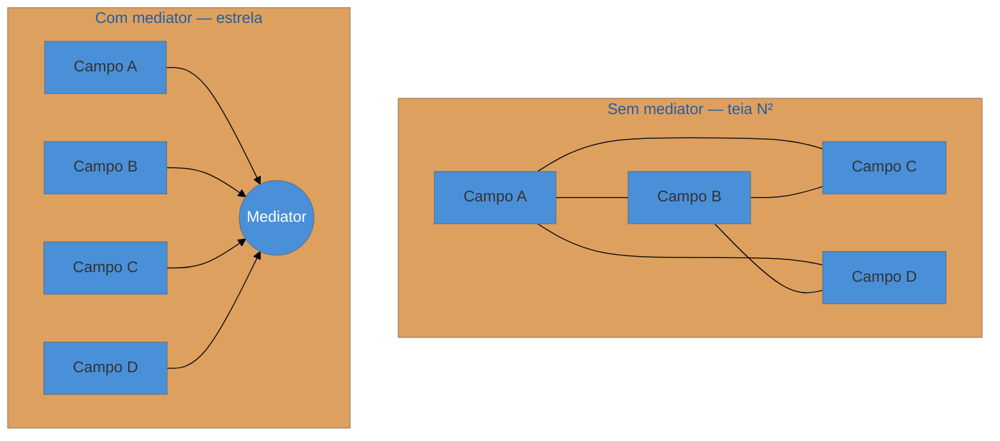

# Mediator

> [!abstract] TL;DR
> O **Mediator** encapsula **como um conjunto de objetos interage** num objeto central, para que os colegas não se refiram diretamente uns aos outros — transformando uma teia de dependências **muitos-para-muitos** numa topologia em **estrela**. É o padrão por trás dos *command buses* do CQRS (MediatR no .NET), do `ApplicationEventMulticaster` interno do Spring e de formulários de UI com campos interdependentes. Como a Facade, é pouco sensível à linguagem — o valor está na **topologia**, não na sintaxe. A armadilha que domina: o mediator absorve tanta lógica que vira um **God Object**, e você troca N² acoplamentos entre colegas por um monolito central que sabe tudo.

## A teia de dependências N²

Pense num formulário de checkout complexo: escolher o país filtra a lista de estados; marcar "retirar na loja" desabilita o endereço de entrega; aplicar cupom recalcula o total e habilita o botão. Se cada campo conhece e chama os outros diretamente, você cria uma **teia**: com N campos que se afetam, o acoplamento tende a N² conexões, e adicionar um campo novo exige tocar em vários existentes. Ninguém entende o formulário inteiro, porque a lógica de coordenação está espalhada entre os widgets.

O Mediator recolhe essa coordenação para um objeto central. Cada colega passa a conhecer **só o mediator**; quando algo muda, avisa o mediator, que decide o que os outros devem fazer. A teia N² vira uma **estrela**: N conexões, todas para o centro. A lógica de "como esses objetos colaboram" fica num lugar, explícita.

## A ideia

À esquerda, cada colega conhece vários outros (acoplamento que cresce quadraticamente). À direita, todos conhecem só o mediator, que orquestra a interação.

## Onde ele aparece hoje

O Mediator "de UI" do GoF é menos comum no backend; a encarnação moderna mais forte é o **command/message bus**:

- **CQRS com command bus** (MediatR no .NET, implementações caseiras em Java/Spring): quem dispara um comando não conhece o *handler*; o bus (mediator) roteia cada comando ao seu handler. Desacopla emissor de tratador. Ver [[14 - Command]].
- **Spring**: o `ApplicationEventMulticaster` é um mediator interno que roteia eventos aos listeners.
- **UI**: formulários e telas complexas onde um *controller* coordena widgets que não se conhecem.

## Mediator não é Observer nem Facade

Três coordenadores que confundem:

- **Observer** ([[13 - Observer]]): o subject **transmite** uma mudança e os observers reagem — unidirecional, e o subject não coordena o que cada um faz. **Mediator** coordena interações **bidirecionais** e *decide* o que cada colega deve fazer em resposta.
- **Facade** ([[09 - Facade]]): simplifica o acesso **para dentro** de um subsistema (cliente → subsistema), unidirecional, e não muda como as partes internas conversam. **Mediator** fica **entre colegas do mesmo nível** e gere a conversa *entre* eles.

## Armadilhas comuns

> [!warning] O God Mediator
> **O que acontece:** o mediator começa coordenando e vai acumulando regra após regra, até virar uma classe gigante que contém **toda** a lógica de interação do sistema — os colegas viram fantoches anêmicos. **Por quê:** o Mediator centraliza a coordenação, e centralização sem limite atrai responsabilidade. Você trocou N² acoplamentos distribuídos por **um** ponto que sabe tudo e do qual tudo depende — às vezes um negócio pior. **Como evitar:** um mediator por **grupo coeso** de colaboração, não um por aplicação. Se ele cresce sem parar, quebre por contexto, ou reavalie se um bus com handlers separados (um handler por comando) não distribui melhor a lógica.

> [!warning] Mediator que só repassa (sem valor)
> **O que acontece:** o mediator apenas encaminha chamadas de A para B sem coordenar nada — uma camada de indireção que não reduz acoplamento real. **Por quê:** o valor do Mediator é **conter a lógica de interação**. Se ele só repassa, os colegas continuam logicamente acoplados (só que via um intermediário burro), e você pagou indireção sem ganhar coesão. **Como evitar:** só introduza o mediator quando há **coordenação genuína** (várias partes que se afetam). Duas partes com uma interação simples → deixe-as conversar direto ou use um evento.

> [!warning] Confundir com Facade ou Observer
> **O que acontece:** chama-se de Mediator o que é uma Facade (simplificar acesso a um subsistema) ou um Observer (broadcast de eventos). **Por quê:** os três "ficam no meio", mas com intenções diferentes — reduzir complexidade de acesso (Facade), notificar mudanças (Observer), coordenar interação entre pares (Mediator). **Como evitar:** pergunte *"estou simplificando o acesso a algo (Facade), avisando interessados de uma mudança (Observer) ou coordenando como vários colegas colaboram entre si (Mediator)?"*.

## Como explicar em inglês

> "Mediator encapsulates how a set of objects interact, so colleagues talk to the mediator instead of to each other — it turns a many-to-many web into a star. The classic UI example is a complex form where fields affect each other; the modern backend form is a command bus in CQRS, like MediatR, where the sender doesn't know the handler and the bus routes the command. I keep it distinct from Observer, which just broadcasts a change one-way, and from Facade, which simplifies access into a subsystem — Mediator coordinates peers bidirectionally. The dominant trap is the God Mediator: it accumulates all the interaction logic until it's a God Object, and you've traded N-squared coupling for one omniscient center. I keep one mediator per cohesive collaboration, not one per app."

| PT | EN |
| --- | --- |
| coordenar interações | to coordinate interactions |
| muitos-para-muitos | many-to-many |
| topologia em estrela | star topology |
| colegas | colleagues |
| command bus / message bus | command bus / message bus |
| desacoplar emissor de tratador | decouple sender from handler |
| God Object | God Object |

## O que vem a seguir

O Mediator centraliza a interação entre objetos. O próximo comportamental é o **caso-ouro** da lente deste catálogo: um padrão inteiro que o *pattern matching* e os *sealed types* das linguagens modernas praticamente aposentaram.

- [[20 - Visitor]] — adicionar operações a uma hierarquia sem tocá-la — e por que a linguagem moderna o mata.
- [[14 - Command]] — o command bus é um Mediator roteando comandos; reveja a conexão.

## Veja também

- [[03-Dominios/Engenharia/Arquitetura/index|Arquitetura]] — command bus e CQRS no nível de aplicação.
- [[13 - Observer]] · [[09 - Facade]] — os coordenadores vizinhos, para fixar as distinções.

## Fontes

- **Gamma, Helm, Johnson, Vlissides (GoF)** — *Design Patterns* (1994) — Mediator (colegas e objeto mediador).
- **Refactoring Guru** — [*Mediator*](https://refactoring.guru/design-patterns/mediator) — a estrela vs a teia, e o contraste com Observer.
- **Jimmy Bogard** — [*MediatR*](https://github.com/jbogard/MediatR) — o mediator como command bus de CQRS, a encarnação moderna do padrão.
