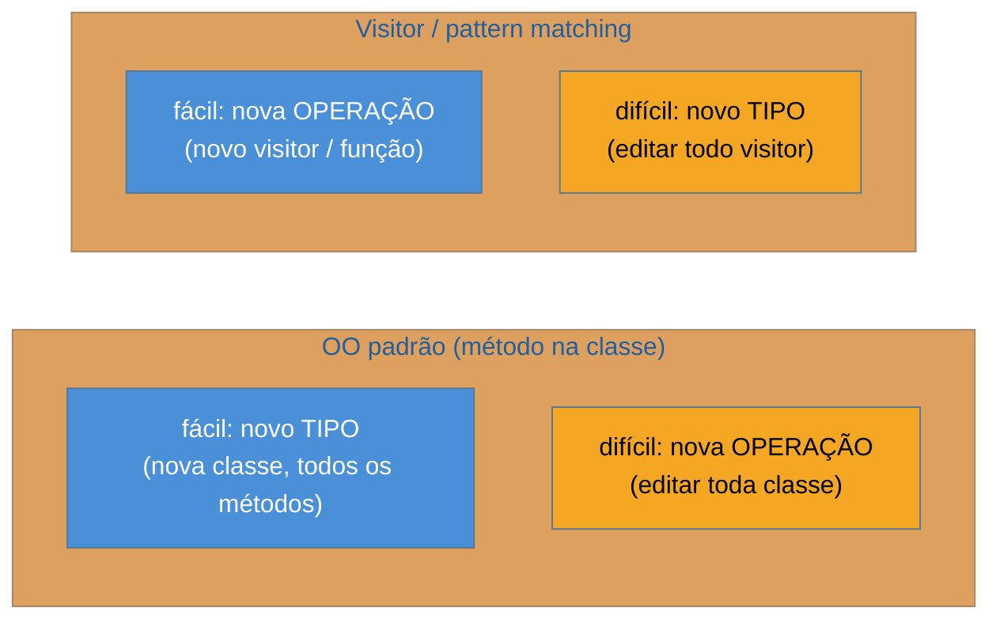

# Visitor

> [!abstract] TL;DR
> O **Visitor** permite **adicionar operações** a uma hierarquia de objetos **sem modificá-los** —
> movendo cada operação para uma classe externa (o visitante) que "visita" cada tipo de nó. É a
> resposta orientada a objetos ao **problema da expressão**: facilita adicionar *operações*, ao custo
> de dificultar adicionar *tipos*. E é o **caso-ouro da lente deste catálogo**: o Visitor é, em boa
> parte, um contorno para linguagens **sem *pattern matching***. Onde a linguagem tem **tipos
> selados** e `switch` exaustivo (Java 21+, Kotlin, Scala, Rust) — ou `type switch` (Go) e
> `singledispatch`/`match` (Python) — você escreve a operação como uma função que casa sobre o tipo,
> **sem** a cerimônia de `accept`/`visit` e com **checagem de exaustividade** do compilador de brinde.
> A armadilha central: montar todo o Visitor onde um `switch` sobre tipo selado seria mais claro.

## Adicionar uma operação sem editar dez classes

Você modela expressões matemáticas como uma árvore: `Numero`, `Soma`, `Multiplicacao`. Agora precisa de operações sobre ela: **avaliar** o valor, **imprimir** como texto, **otimizar** (ex.: `x * 1 → x`). Se cada operação é um método em cada classe de nó (`avaliar()`, `imprimir()`, `otimizar()` em `Numero`, `Soma`, `Multiplicacao`...), então **adicionar uma operação nova exige editar todas as classes de nó**. Pior: operações não-relacionadas (avaliar e renderizar em HTML) acabam misturadas dentro dos dados.

O Visitor inverte o eixo. As classes de nó ganham **um** método genérico — `accept(visitor)` — e cada operação vira **uma classe visitante** (`Avaliador`, `Impressor`, `Otimizador`) com um método por tipo de nó. Adicionar uma operação nova = escrever um novo visitante, **sem tocar** nas classes de nó. As operações ficam agrupadas (todo o "avaliar" num lugar), separadas dos dados.

## O problema da expressão

Toda a tensão do Visitor cabe numa matriz **tipos × operações**:



O default OO (métodos na classe) facilita **novos tipos** e penaliza **novas operações**. O Visitor faz o **oposto**: facilita operações, penaliza tipos. Você escolhe o padrão conforme qual eixo muda mais no seu problema — se os tipos são estáveis (nós de uma AST bem definida) e as operações crescem (avaliar, otimizar, compilar, formatar), o Visitor ganha.

## O mecanismo: double dispatch

Por que precisa de `accept`/`visit`, e não um `switch` simples? Porque linguagens OO fazem *dispatch* dinâmico sobre **um** tipo (o do receptor), e o Visitor precisa resolver **dois**: qual operação **e** qual tipo de nó. O truque do `accept(v)` → `v.visit(this)` é um **double dispatch** manual: a primeira chamada resolve o tipo do nó (via polimorfismo do `accept`), a segunda resolve a operação (via sobrecarga do `visit`). É engenhoso — e é exatamente essa engenhosidade que o *pattern matching* torna desnecessária.

## O padrão nas quatro linguagens — e como a linguagem o mata

### Java clássico — accept/visit (double dispatch)

```java
interface Visitor { int visit(Numero n); int visit(Soma s); }
interface No { int accept(Visitor v); }
record Numero(int valor) implements No { public int accept(Visitor v) { return v.visit(this); } }
record Soma(No a, No b) implements No { public int accept(Visitor v) { return v.visit(this); } }

class Avaliador implements Visitor {
    public int visit(Numero n) { return n.valor(); }
    public int visit(Soma s)   { return s.a().accept(this) + s.b().accept(this); }
}
```

### Java 21+ / Kotlin / Scala — sealed + switch exaustivo mata o Visitor

Com **tipos selados** e *pattern matching*, a operação é só uma função que casa sobre o tipo — sem `accept`, sem `visit`, e o compilador **exige** que você trate todos os casos:

```java
sealed interface No permits Numero, Soma { }
record Numero(int valor) implements No { }
record Soma(No a, No b) implements No { }

int avaliar(No no) {
    return switch (no) {                       // exaustivo: o compilador cobra os casos
        case Numero n -> n.valor();
        case Soma s   -> avaliar(s.a()) + avaliar(s.b());
    };
}
```

### Go e Python — type switch e singledispatch

Go usa **type switch** (`switch v := n.(type)`); Python usa `functools.singledispatch` ou o `match` estrutural (3.10+). Em ambos, a operação vive fora dos dados, sem a cerimônia do double dispatch.

> **A tese, no seu ápice:** o Visitor é um **simulador de *pattern matching*** para linguagens que não o tinham. Ele reconstrói, com `accept`/`visit` e double dispatch, o que um `switch` exaustivo sobre um tipo selado faz nativamente — e com uma desvantagem: o Visitor **não** te dá checagem de exaustividade automática (esquecer um `visit` compila). Quando a linguagem ganhou *sealed types* + *pattern matching*, o Visitor virou, na maioria dos casos, cerimônia obsoleta. Reconhecer isso é o exemplo mais forte de todo o catálogo de "a linguagem tornou o padrão desnecessário" — e é ouro em entrevista.

## Onde o Visitor ainda faz sentido

Não é peça de museu total. Ele ainda ganha quando: a linguagem **não** tem *pattern matching* exaustivo (Java pré-21, sem sealed); a hierarquia é **estável** e as operações crescem muito (AST de compiladores, análise estática, travessia de documentos); ou você precisa de **múltiplas operações independentes** que ficariam melhor agrupadas fora dos nós. Compiladores e ferramentas de análise (que percorrem ASTs o tempo todo) são seu habitat clássico — ver [[03-Dominios/Ciência/Compiladores e Linguagens/index|Compiladores]].

## Armadilhas comuns

> [!warning] Visitor onde sealed + switch é mais claro
> **O que acontece:** escreve-se a hierarquia `Visitor`/`accept`/`visit` completa numa linguagem que tem *pattern matching* exaustivo (Java 21+, Kotlin, Scala, Rust).
> **Por quê:** o *switch* sobre tipo selado faz o mesmo com menos código, sem o double dispatch, e **com** checagem de exaustividade — o compilador te avisa se esquecer um caso, coisa que o Visitor não faz.
> **Como evitar:** na linguagem com sealed types, prefira `switch`/`match` exaustivo. Reserve o Visitor para quando a linguagem não oferece o recurso, ou a hierarquia é aberta a extensão externa.

> [!warning] O custo escondido: adicionar um tipo novo dói
> **O que acontece:** a AST ganha um nó novo (`Divisao`), e agora **todos** os visitantes (`Avaliador`, `Impressor`, `Otimizador`) precisam ganhar um `visit(Divisao)` — uma mudança que se espalha por todas as operações.
> **Por quê:** é o lado ruim do problema da expressão: o Visitor otimiza para operações estáveis + tipos que crescem, mas paga caro quando os **tipos** mudam. Fácil esquecer um visitante e ter comportamento faltando.
> **Como evitar:** só adote o Visitor quando os **tipos são estáveis**. Se a hierarquia de tipos cresce com frequência, o Visitor vai te atrapalhar — talvez métodos na classe (ou sealed+switch, que ao menos cobra exaustividade) sirvam melhor.

> [!warning] Double dispatch cerimonioso e frágil
> **O que acontece:** cada classe de nó precisa do seu `accept`, e a sobrecarga de `visit` por tipo é fácil de errar (chamar o `visit` errado, esquecer um `accept`).
> **Por quê:** o double dispatch manual é *boilerplate* repetitivo e sem rede de segurança do compilador — um `visit` faltando ou uma sobrecarga ambígua passam despercebidos.
> **Como evitar:** se precisar mesmo do Visitor, gere o *boilerplate* ou use uma classe-base que centralize o `accept`; e, de novo, prefira o *pattern matching* onde existir.

## Como explicar em inglês

> "Visitor lets me add operations to an object hierarchy without modifying it — each operation becomes a visitor class that visits each node type. It's the OO answer to the expression problem: it makes adding operations easy and adding types hard, the opposite of putting methods on the classes. The mechanism is double dispatch: `accept(visitor)` then `visitor.visit(this)` resolves both the node type and the operation. But here's the key insight for me — Visitor is essentially a workaround for languages without pattern matching. In Java 21 with sealed types, or in Kotlin, Scala, or Rust, I just write a function with an exhaustive switch over the type, no accept/visit boilerplate, and the compiler even checks I've covered every case, which Visitor never did. So it's the clearest example in the whole catalog of a pattern that a language feature made obsolete. It still earns its place in compilers and AST tooling where the type hierarchy is stable and operations keep growing."

| PT | EN |
| --- | --- |
| adicionar operações | to add operations |
| problema da expressão | the expression problem |
| double dispatch | double dispatch |
| tipos selados | sealed types |
| switch exaustivo | exhaustive switch |
| checagem de exaustividade | exhaustiveness checking |
| árvore sintática (AST) | abstract syntax tree (AST) |
| boilerplate / cerimônia | boilerplate / ceremony |

## O que vem a seguir

Com o Visitor fechamos os padrões comportamentais de peso. Restam quatro do GoF que o catálogo tratou de passagem — raros, mas parte do repertório de um sênior que topa com sistemas legados. Eles vão juntos numa nota honesta sobre *por que* são raros.

- [[21 - Padrões raros (Bridge, Flyweight, Memento, Interpreter)]] — os quatro que a prática moderna quase aposentou, e onde ainda vivem.
- [[11 - Composite]] — a estrutura que o Visitor mais visita (árvores), e o mesmo *trade-off* tipos × operações.

## Veja também

- [[03-Dominios/Ciência/Compiladores e Linguagens/index|Compiladores e Linguagens]] — ASTs e travessia, o habitat natural do Visitor.
- [[16 - State]] · [[11 - Composite]] — os outros pontos do catálogo onde *sealed types* + *pattern matching* competem com o padrão OO.

## Fontes

- **Gamma, Helm, Johnson, Vlissides (GoF)** — *Design Patterns* (1994) — Visitor e o double dispatch.
- **Refactoring Guru** — [*Visitor*](https://refactoring.guru/design-patterns/visitor) — o mecanismo e o problema da expressão.
- **Philip Wadler** — [*The Expression Problem*](https://homepages.inf.ed.ac.uk/wadler/papers/expression/expression.txt) — a formulação canônica do dilema tipos × operações.
- **JEP 441** — [*Pattern Matching for switch*](https://openjdk.org/jeps/441) — o recurso do Java 21 que torna o Visitor obsoleto na maioria dos casos.
