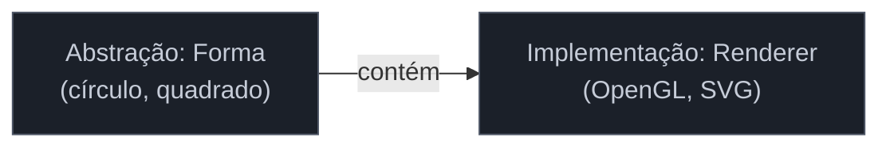

# Padrões raros (Bridge, Flyweight, Memento, Interpreter)

> [!abstract] TL;DR
> Quatro dos 23 padrões do GoF são **genuinamente raros** na prática moderna — **Bridge**, **Flyweight**, **Memento** e **Interpreter**. Em vez de um capítulo forçado para cada, esta nota os cobre juntos e honestamente: o que são, **por que ficaram raros** (a linguagem, o framework ou a economia do hardware os absorveram) e **onde ainda vivem**. É repertório de reconhecimento — num sistema legado, você vai *encontrar* um Flyweight ou um Interpreter caseiro, e saber nomeá-lo vale mais do que saber implementá-lo do zero. A armadilha comum aos quatro: reinventar à mão o que uma biblioteca, um recurso da linguagem ou um *parser generator* já fazem melhor.

## Bridge — separar abstração da implementação

**O que é:** desacopla uma **abstração** da sua **implementação**, para que as duas variem de forma independente. O exemplo clássico: `Forma` (abstração: círculo, quadrado) × `API de desenho` (implementação: OpenGL, SVG). Em vez de uma classe por combinação (`CirculoOpenGL`, `QuadradoSVG`...), a forma **contém** uma referência à API de desenho — dois eixos que crescem separados.

**Por que é raro:** o princípio "componha em vez de herdar, injete a implementação" — que é a essência do Bridge — hoje é simplesmente **como se programa** com injeção de dependência. Você aplica a ideia do Bridge sem chamá-la assim. Além disso, ele é constantemente **confundido com Adapter** (Adapter conserta interfaces incompatíveis *depois*; Bridge planeja a separação *antes*) e com Strategy.

**Onde ainda vive:** *drivers* de dispositivo, camadas de renderização multiplataforma, abstrações sobre back-ends intercambiáveis (mesma API, várias implementações — JDBC é um parente).

## Flyweight — compartilhar estado para economizar memória

**O que é:** compartilha a parte **comum e imutável** (o estado *intrínseco*) entre muitos objetos, mantendo fora só o que varia (o estado *extrínseco*), para caber **milhões** de objetos na memória. O caractere de um editor de texto: a fonte/tamanho/glifo é compartilhada; só a posição varia.

**Por que é raro:** memória ficou barata, e o Flyweight **complica** o design (separar intrínseco de extrínseco não é trivial). Na maioria dos sistemas, o ganho não justifica. Muitas vezes a linguagem já o aplica por baixo: o **cache de `Integer` do Java** (−128 a 127) é um Flyweight; a **internação de strings** (*string interning*) é um Flyweight.

**Onde ainda vive:** cenários de **altíssima cardinalidade** — engines de jogos (sprites, partículas), renderização de texto (cache de glifos), sistemas com milhões de objetos pequenos e repetitivos onde a memória é o gargalo real.

## Memento — capturar e restaurar estado sem violar encapsulamento

**O que é:** captura o estado interno de um objeto num "lembrança" (*memento*) opaca e o guarda **fora** do objeto, para restaurá-lo depois — sem expor os campos internos a quem guarda. É o motor do **undo/redo** (anda de mãos dadas com o [[14 - Command]]) e dos *snapshots*.

**Por que é raro (como padrão formal):** a ideia é onipresente, mas raramente implementada com a estrutura cerimoniosa do GoF (originador/memento/caretaker). Na prática, você serializa o estado, tira um *snapshot* imutável, ou usa **Event Sourcing** (que reconstrói estado a partir de eventos — um primo distribuído do Memento). A imutabilidade também simplifica: um objeto imutável *é* seu próprio memento.

**Onde ainda vive:** undo/redo em editores, *save states* em jogos, *checkpoints* de transação, e conceitualmente no Event Sourcing (ver [[03-Dominios/Engenharia/Comunicação entre Sistemas/index|Comunicação entre Sistemas]]).

## Interpreter — uma gramática interpretada

**O que é:** define uma **gramática** para uma linguagem pequena e um interpretador que avalia sentenças dela — cada regra da gramática vira uma classe. Útil para DSLs simples, regras de negócio configuráveis, expressões.

**Por que é raro:** é o padrão mais **especializado e trabalhoso** do GoF, e quase sempre há algo melhor: **geradores de parser** (ANTLR, yacc) para linguagens sérias; **engines prontas** para o caso comum (regex para padrões de texto, SpEL/expression languages no Spring, engines de regra). Escrever um interpretador à mão com uma classe por regra raramente se paga.

**Onde ainda vive:** engines de regra, linguagens de consulta/filtro embutidas, avaliadores de expressão — e, por baixo, as engines de **regex** e os interpretadores de *expression language* que você usa sem ver. Conexão profunda com [[03-Dominios/Ciência/Compiladores e Linguagens/index|Compiladores e Linguagens]].

## Armadilhas comuns

> [!warning] Reinventar o Interpreter em vez de usar parser generator ou engine
> **O que acontece:** para interpretar uma linguagenzinha, escreve-se um interpretador à mão com uma classe por regra gramatical, que logo vira difícil de estender e cheio de bugs de parsing. **Por quê:** parsing e avaliação são problemas resolvidos. Um *parser generator* (ANTLR) ou uma engine existente (regex, SpEL, uma rule engine) faz melhor, com menos código e menos bugs. **Como evitar:** precisa de uma linguagem real → *parser generator*. Precisa de padrões de texto → regex. Precisa de regras configuráveis → engine de regras. Reserve o Interpreter caseiro para gramáticas minúsculas e estáveis.

> [!warning] Flyweight prematuro (complexidade sem ganho real)
> **O que acontece:** separa-se estado intrínseco de extrínseco "para economizar memória" num sistema que tem milhares — não milhões — de objetos, onde a memória nunca foi problema. **Por quê:** o Flyweight troca clareza por economia de memória; sem um gargalo de memória **real e medido**, você só ganhou complexidade. **Como evitar:** meça primeiro. Só aplique Flyweight com um problema de memória comprovado e alta cardinalidade. Antes disso, é otimização prematura.

> [!warning] Confundir Bridge com Adapter (ou Strategy)
> **O que acontece:** rotula-se como Bridge o que é um Adapter (conserto de interface) ou um Strategy (algoritmo intercambiável), e vice-versa. **Por quê:** os três compõem/injetam, mas com intenções distintas: **Adapter** conserta interfaces incompatíveis *depois do fato*; **Bridge** separa dois eixos de variação *por projeto, desde o início*; **Strategy** troca *o algoritmo* de uma operação. **Como evitar:** pergunte *"estou adaptando algo que já existe e não bate (Adapter), planejando duas dimensões que variam independentes (Bridge), ou trocando como uma operação é feita (Strategy)?"*.

## Como explicar em inglês

> "Four of the GoF patterns are genuinely rare today, and I treat them as recognition knowledge rather than daily tools. Bridge — decoupling an abstraction from its implementation — is basically just dependency injection now, so I apply the idea without naming it. Flyweight — sharing intrinsic state to save memory — is rare because memory got cheap, though the language often does it for me, like Java's Integer cache or string interning; it still matters in games and text rendering. Memento — capturing state to restore later — powers undo/redo, but I'd usually reach for an immutable snapshot or event sourcing instead of the formal originator/caretaker structure. Interpreter — a hand-rolled grammar — I almost always replace with a parser generator like ANTLR, regex, or an existing rule engine. Knowing them matters most in legacy code, where I'll actually find a hand-built interpreter or flyweight and need to name it."

| PT | EN |
| --- | --- |
| abstração vs implementação | abstraction vs implementation |
| estado intrínseco / extrínseco | intrinsic / extrinsic state |
| internação de strings | string interning |
| lembrança (snapshot de estado) | memento (state snapshot) |
| desfazer/refazer | undo/redo |
| gramática | grammar |
| gerador de parser | parser generator |
| engine de regras | rule engine |

## O que vem a seguir

Cobrimos os 23 padrões do GoF — os essenciais e os raros. As duas últimas notas do galho não são *novos* padrões: são a síntese sênior. Primeiro, o outro lado da lente — não "quando a linguagem dissolve o padrão", mas "**onde o framework já o implementou por você**", e como reconhecê-lo.

- [[22 - Reconhecer GoF nos frameworks]] — os padrões que você usa sem perceber, dentro de Spring, JPA e afins.
- [[23 - Quando NÃO usar - anti-patterns e discernimento sênior]] — a síntese do discernimento que cada nota antecipou.

## Veja também

- [[03-Dominios/Ciência/Compiladores e Linguagens/index|Compiladores e Linguagens]] — o habitat do Interpreter (e do Visitor).
- [[14 - Command]] — o par do Memento em undo/redo.
- [[07 - Adapter]] · [[12 - Strategy]] — os padrões com que o Bridge é confundido.

## Fontes

- **Gamma, Helm, Johnson, Vlissides (GoF)** — *Design Patterns* (1994) — Bridge, Flyweight, Memento e Interpreter no catálogo original.
- **Refactoring Guru** — [*Design Patterns Catalog*](https://refactoring.guru/design-patterns/catalog) — descrições e a raridade prática de cada um.
- **Baeldung** — [*The Flyweight Pattern in Java*](https://www.baeldung.com/java-flyweight) — o exemplo do cache de `Integer` e a economia de memória.
