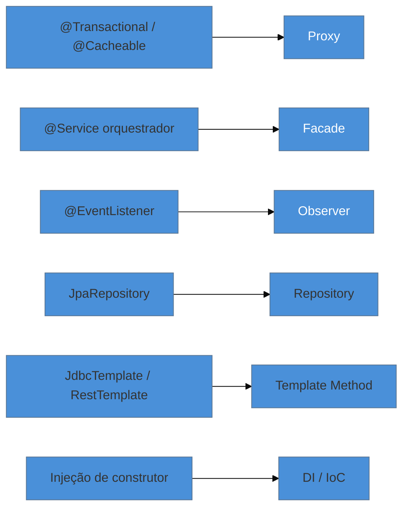

# Reconhecer GoF nos frameworks

> [!abstract] TL;DR
> As notas anteriores mostraram um lado da lente: *quando a linguagem dissolve o padrão*. Esta mostra o outro: **onde o framework já o implementou por você**. Você usa Spring, JPA e Express o dia inteiro sem escrever um único padrão GoF à mão — mas eles estão lá, aplicados pelo framework. `@Transactional` é **Proxy**; um `@Service` orquestrador é **Facade**; `@EventListener` é **Observer**; `JpaRepository` é **Repository**; injeção de dependência é **IoC**. A tese prática: num stack moderno, **reconhecer** o padrão vale mais que **reimplementá-lo** — porque é o reconhecimento que te dá o modelo mental para **depurar** quando o comportamento foge do esperado. A armadilha: tratar o framework como mágica e, quando quebra, não ter por onde raciocinar.

## Você já usa os padrões — sem escrevê-los

Pare para pensar no que acontece quando você anota um método com `@Transactional`. Você não escreveu um Proxy, mas o Spring **criou** um ao redor do seu bean. Você não escreveu um Singleton, mas o container gerencia seu `@Service` como um. Você não escreveu um Observer, mas `@EventListener` liga publicadores a ouvintes. Os padrões do GoF não sumiram no mundo dos frameworks — eles **desceram uma camada**, dos seus arquivos para os do framework.

Isso muda a habilidade que importa. Em 1994, o valor era saber **implementar** os padrões. Hoje, na maior parte do trabalho de aplicação, o valor é saber **reconhecê-los** — porque é o reconhecimento que transforma um bug de "mágica que parou de funcionar" em um problema com causa compreensível.

## O mapa: anotação → padrão

A tabela completa, para consulta:

| Você escreve | O padrão por baixo | Framework |
| --- | --- | --- |
| `@Service`, `@Component` (escopo default) | **Singleton** (gerido pelo container) | Spring IoC |
| `@Bean`, `BeanFactory` | **Factory** | Spring |
| `@Builder` (Lombok), `HttpRequest.newBuilder()` | **Builder** | Lombok, Java HTTP |
| `@EventListener`, `EventEmitter` | **Observer** | Spring Events, Node |
| Injeção de `Map<String, Impl>` | **Strategy** / **Factory** | Spring |
| AOP, middleware, I/O streams | **Decorator** | Spring AOP, Express, `java.io` |
| `@Transactional`, `@Cacheable`, lazy loading | **Proxy** | Spring, JPA/Hibernate |
| Qualquer `@Service` que orquestra outros | **Facade** | Spring |
| Wrappers de SDK de terceiros | **Adapter** | qualquer integração |
| Filter chain, pipeline de middleware | **Chain of Responsibility** | Spring Security, Express |
| `JdbcTemplate`, `RestTemplate` | **Template Method** | Spring |
| `for...of`, `Iterator`, streams | **Iterator** | linguagem padrão |
| Filas, CQRS, undo/redo | **Command** | RabbitMQ, MediatR |
| `JpaRepository` | **Repository** | Spring Data |
| Command/message bus | **Mediator** | MediatR, Spring events |
| Injeção de construtor | **DI / IoC** | Spring, Nest, Angular |

## Por que isso é uma ferramenta de debug

Reconhecer o padrão é o que te dá o **modelo mental** para entender falhas que, de outro modo, parecem sobrenaturais. Três exemplos que caem em produção e em entrevista:

- **`@Transactional` não abre numa chamada interna.** Se você sabe que é um **Proxy** (ver [[10 - Proxy]]), a explicação é imediata: o proxy só intercepta chamadas que entram de fora; `this.metodo()` pula o proxy. Sem esse modelo, é assombração.
- **`LazyInitializationException` / N+1 no JPA.** Sabendo que a entidade lazy é um **Proxy** que busca dados ao primeiro acesso, você entende por que acessá-la fora da sessão falha, e por que iterar dispara uma query por item.
- **Um `@EventListener` derrubou a transação.** Sabendo que é um **Observer** síncrono rodando na thread do publicador, você entende o acoplamento e sabe a saída (async / after-commit).

> **A tese, pelo avesso:** as outras notas perguntaram "a linguagem me poupa deste padrão?". Esta pergunta "o framework já implementou este padrão — eu o reconheço?". Nas duas, o objetivo é o mesmo: **não escrever cerimônia desnecessária** e **entender o que já está lá**. E há um contraste cross-linguagem: a JVM e os frameworks dinâmicos escondem os padrões atrás de anotações (mágica conveniente); o ethos de **Go** os deixa explícitos no código (sem `@Transactional` — você vê a transação). Nem melhor nem pior; mas em Go você lê o padrão, e em Spring você precisa reconhecê-lo.

## Armadilhas comuns

> [!warning] Tratar o framework como mágica
> **O que acontece:** o dev usa `@Transactional`, `@Cacheable`, lazy loading por anos sem saber que são Proxy — até um comportamento inesperado virar um mistério de horas, sem por onde começar. **Por quê:** o framework esconde a implementação, não a existência do padrão. Sem reconhecer o padrão por baixo, você não tem modelo mental para raciocinar quando algo desvia do esperado. **Como evitar:** ao adotar um recurso "mágico" do framework, pergunte *qual padrão é este?*. Saber que `@Transactional` é Proxy, `JpaRepository` é Repository, `@EventListener` é Observer transforma depuração em dedução.

> [!warning] Reimplementar o que o framework já faz
> **O que acontece:** escreve-se o próprio container de DI, o próprio *event bus*, o próprio Singleton artesanal, o próprio mecanismo de proxy. **Por quê:** o framework já implementa esses padrões de forma testada, thread-safe e integrada. Reimplementá-los à mão é reintroduzir bugs que outros já resolveram, e ainda perder a integração (ciclo de vida, configuração). **Como evitar:** antes de escrever um padrão à mão, cheque se o framework não o oferece. Singleton → deixe o container. Event bus → use os eventos do framework. Proxy → use AOP.

> [!warning] Achar que "é um padrão" garante bom uso
> **O que acontece:** conclui-se que, porque o framework aplica o padrão, o seu uso está automaticamente correto — e ignora-se um `@Service` que virou God Facade, ou um `@EventListener` que criou uma cascata de eventos. **Por quê:** o framework implementa o **mecanismo** bem; o **uso** que você faz dele pode ser ruim (uma Facade gigante ainda é um God Object). O padrão é uma ferramenta, não um selo de qualidade. **Como evitar:** as armadilhas de cada padrão (ver as notas individuais) continuam valendo mesmo quando o framework fornece o mecanismo. Reconhecer o padrão inclui reconhecer quando ele está sendo mal usado.

## Como explicar em inglês

> "In a modern stack, I use the GoF patterns constantly without writing them — the framework implements them. `@Transactional` is a Proxy, an orchestrating `@Service` is a Facade, `@EventListener` is Observer, `JpaRepository` is Repository, dependency injection is IoC. So the skill that matters shifted from *implementing* patterns to *recognizing* them, because recognition is what lets me debug. When `@Transactional` doesn't fire on an internal call, knowing it's a proxy makes it obvious instead of magical; same with lazy-loading exceptions or a synchronous event listener affecting a transaction. There's a nice cross-language contrast too: the JVM and dynamic frameworks hide the pattern behind an annotation, while Go's philosophy keeps it explicit in the code. The trap is treating the framework as magic — and, on the flip side, reimplementing a Singleton or event bus the framework already gives me."

| PT | EN |
| --- | --- |
| reconhecer vs reimplementar | recognize vs reimplement |
| escopo singleton (do container) | (container-managed) singleton scope |
| proxy dinâmico | dynamic proxy |
| modelo mental | mental model |
| mágica do framework | framework magic |
| filter chain | filter chain |
| ciclo de vida (do bean) | (bean) lifecycle |

## O que vem a seguir

Reconhecer o padrão é metade do discernimento sênior. A outra metade — e a última nota do galho — é saber **quando não usar** nenhum deles: os anti-patterns, a abstração prematura, o *pattern mania*. É a síntese de todos os avisos que cada nota antecipou.

- [[23 - Quando NÃO usar - anti-patterns e discernimento sênior]] — o fechamento do catálogo, com o inglês/entrevista consolidado.
- [[10 - Proxy]] — o exemplo mais rico de reconhecer-para-depurar (`@Transactional`).

## Veja também

- [[03-Dominios/Tecnologia/Java/index|Java]] — Spring, JPA e a AOP onde a maioria destes padrões vive.
- [[03-Dominios/Engenharia/Design de Software/SOLID/07 - DIP na prática - DI e IoC|DI e IoC]] — o padrão-base do container que gere todos os outros.

## Fontes

- **Gamma, Helm, Johnson, Vlissides (GoF)** — *Design Patterns* (1994) — os padrões que os frameworks industrializaram.
- **Spring Framework Docs** — [*Core Technologies*](https://docs.spring.io/spring-framework/reference/core.html) — IoC, AOP e os proxies por trás das anotações.
- **Martin Fowler** — [*Inversion of Control Containers and the Dependency Injection pattern*](https://martinfowler.com/articles/injection.html) — o padrão-base de todo container moderno.
