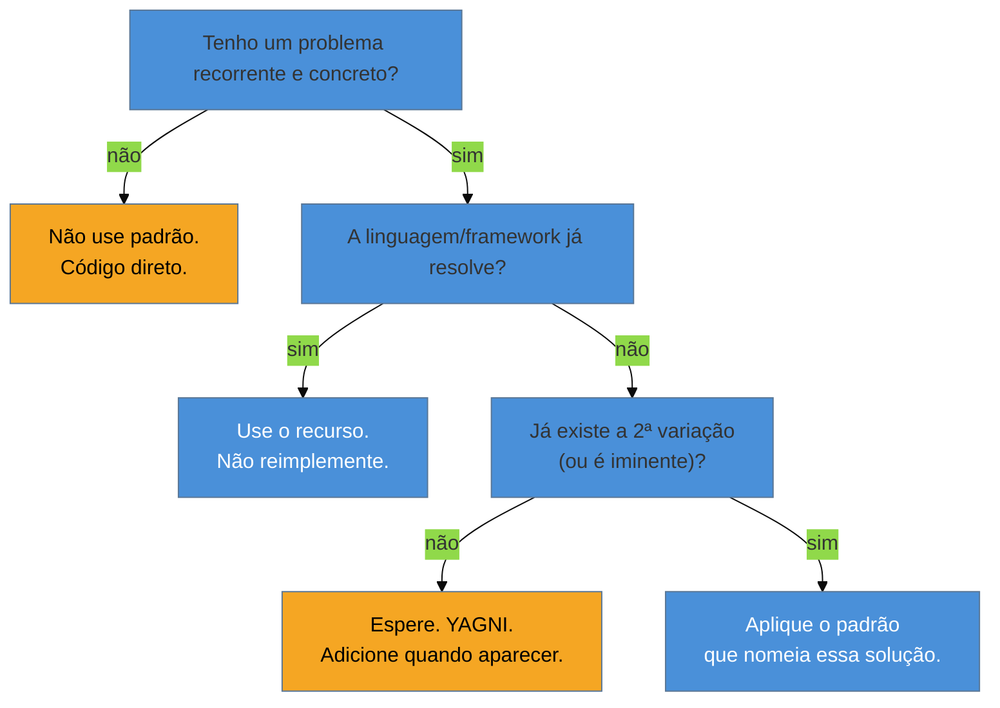

# Quando NÃO usar: anti-patterns e discernimento sênior

> [!abstract] TL;DR
> Esta é a nota que fecha o catálogo — e a mais importante para o sênior. Todas as anteriores ensinaram *quando usar* cada padrão; aqui consolidamos o que quase ninguém debate: **quando não usar nenhum**. O maior erro com padrões não é escolher o errado — é aplicar um onde **código direto** resolveria. A regra de ouro atravessa todo o catálogo: **parta do problema, nunca do padrão**; e a frase que resume o discernimento é *"abstração prematura é tão ruim quanto abstração nenhuma"*. Reunimos aqui os anti-patterns (pattern mania, Golden Hammer, abstração prematura, Singleton para tudo, reimplementar o framework, confundir padrão com arquitetura) e o vocabulário de entrevista para falar de padrões como quem tem julgamento, não como quem decorou 23 nomes.

## O erro que o catálogo inteiro tenta evitar

Existe um momento perigoso na carreira de quase todo dev: o mês em que ele **descobre** os design patterns. De repente, todo `if` parece pedir um Strategy, toda classe parece querer ser Singleton, todo fluxo parece merecer uma Factory. O código dobra de tamanho, enche-se de interfaces com uma implementação só, e fica **mais difícil de ler** — em nome de "boas práticas".

O catálogo inteiro que você acabou de percorrer foi construído para evitar esse momento. Por isso cada nota teve uma seção **Armadilhas** reforçada; por isso a lente foi *"quando a linguagem torna o padrão desnecessário"*. A mensagem de fundo é uma só: um padrão é uma **resposta**. Sem a **pergunta certa** — um problema recorrente e concreto — ele é só indireção com um nome bonito. O sinal de senioridade não é conhecer os 23; é saber que, na maioria dos casos, a resposta certa é **nenhum deles**.

## A regra de ouro: problema primeiro

Repare quantos caminhos levam a **não usar padrão nenhum**. Esse é o ponto: o fluxo default é código simples; o padrão é a exceção que você justifica, não o ponto de partida.

## Os anti-patterns (consolidados)

> [!warning] Pattern mania / overuse
> **O que acontece:** aplicar padrões onde código direto resolveria — um `if/else` claro vira um Strategy, uma função vira um Command, uma classe vira um Singleton. **Por quê:** confunde-se *conhecer* o padrão com *precisar* dele. Cada padrão adiciona indireção; sem um problema que a justifique, você só afastou o leitor do código que faz o trabalho. **Como evitar:** parta do problema. Se não consegue nomear a dor concreta que o padrão alivia, não use o padrão. Um `if/else` legível vence uma abstração cerimoniosa.

> [!warning] Abstração prematura
> **O que acontece:** cria-se a interface e a hierarquia "para o caso de um dia precisar" — o Strategy com uma implementação, a Factory para um tipo, o Abstract Factory para uma família. **Por quê:** você paga o custo da abstração (mais arquivos, mais indireção, mais cognição) **antes** de ter o benefício (variação real). E adivinhar o futuro raramente acerta a forma certa da abstração. **Como evitar:** espere a **segunda** implementação. *"Premature abstraction is as bad as no abstraction."* Adicione o padrão quando o segundo caso concreto aparecer, não antes — refatorar para o padrão é barato; desfazer a abstração errada, caro.

> [!warning] Golden Hammer (o martelo de ouro)
> **O que acontece:** "quando você só tem um martelo, tudo parece prego" — aplicar o mesmo padrão preferido em todo problema, porque é o que você domina. **Por quê:** familiaridade não é adequação. O padrão que resolveu bem o último problema pode ser desajeitado no próximo, e a insistência esconde soluções mais simples. **Como evitar:** deixe o problema escolher a ferramenta, não o contrário. Se você usa o mesmo padrão em tudo, desconfie.

> [!warning] Singleton mutável / Singleton para tudo
> **O que acontece:** classes utilitárias viram Singletons "para não instanciar"; estado compartilhado mutável vira global disfarçado. **Por quê:** Singleton mutável é estado global — difícil de testar, fonte de bugs de concorrência, dependências escondidas (ver [[02 - Singleton]]). **Como evitar:** sem estado → funções estáticas/de módulo. Com estado compartilhado → bean de escopo singleton gerido pelo container (DI). "Singleton artesanal" quase nunca é a resposta.

> [!warning] Reimplementar o que o framework já faz / confundir padrão com arquitetura
> **O que acontece:** escrever o próprio container de DI, event bus ou proxy; ou dizer "nossa arquitetura é baseada em Strategy". **Por quê:** o framework já implementa esses padrões, testados e integrados (ver [[22 - Reconhecer GoF nos frameworks]]). E padrões operam no nível de **classe** — não descrevem a forma **macro** do sistema, que é [[03-Dominios/Engenharia/Arquitetura/index|Arquitetura]]. **Como evitar:** use o que o framework dá; reserve "padrão" para o nível de objeto e "arquitetura" para módulos/serviços.

## O discernimento em uma frase

Depois de 23 notas, o resumo cabe numa linha: **os design patterns são vocabulário e ferramentas; a maturidade é saber que a melhor ferramenta, na maioria das vezes, é a mais simples que resolve.** Você aprende os padrões não para aplicá-los, mas para **reconhecê-los** — no código dos outros, nos frameworks, e nos raros momentos em que o seu problema realmente pede um. O resto é YAGNI e um `if/else` bem escrito.

## Como explicar em inglês

> "The most important thing I've learned about design patterns is when *not* to use them. The biggest mistake isn't picking the wrong pattern — it's reaching for one where plain code would do. My rule is problem-first: if I can't name the concrete, recurring pain a pattern solves, I don't use it. Premature abstraction is as bad as no abstraction — I've built Strategy interfaces with a single implementation 'just in case', and three years later the second one never came and the code was harder to read for nothing. So I wait for the second case before I abstract; refactoring toward a pattern is cheap, undoing the wrong abstraction is expensive. I also watch for the Golden Hammer — applying my favorite pattern everywhere — and for reimplementing what the framework already gives me, like a hand-rolled Singleton. Patterns are vocabulary and tools; the maturity is knowing the best tool is usually the simplest one that works."

### Frases prontas de entrevista

- "I'd reach for a Strategy here because the algorithm selection depends on runtime context."
- "I'd avoid a Factory here — there's only one implementation, so a direct constructor is simpler."
- "That's essentially a Proxy — the framework wraps the bean to add cross-cutting behavior."
- "Premature abstraction is as bad as no abstraction; I'd wait for a second use case before introducing the pattern."
- "In Python or Go I wouldn't write that pattern at all — a first-class function covers it."
- "That's not architecture — it's a class-level pattern; the architecture is the service boundaries."

| PT | EN |
| --- | --- |
| quando NÃO usar | when *not* to use |
| abstração prematura | premature abstraction |
| partir do problema | problem-first |
| martelo de ouro | Golden Hammer |
| indireção sem retorno | indirection with no payoff |
| YAGNI (você não vai precisar) | YAGNI (you aren't gonna need it) |
| a ferramenta mais simples que resolve | the simplest tool that works |
| cargo cult | cargo cult |

## O que vem a seguir

Esta nota **fecha a família Clássicos (GoF)** — os 23 padrões, mais a síntese de reconhecimento e discernimento. O galho-pai [[03-Dominios/Engenharia/Design de Software/Padrões de Projeto/index|Padrões de Projeto]] segue com as próximas famílias do catálogo, começando pelos padrões que a orientação a objetos por si só não cobre: como o código conversa com o banco.

- **Próxima família — Acesso a Dados:** DAO, Active Record, Data Mapper, Repository, Unit of Work e o impacto de NoSQL/cloud.
- [[01 - O que são Design Patterns]] — reveja o mapa das seis famílias e a lente do catálogo.
- [[22 - Reconhecer GoF nos frameworks]] — o par desta nota no discernimento sênior.

## Veja também

- [[03-Dominios/Engenharia/Design de Software/SOLID/08 - SOLID em xeque|SOLID em xeque]] — a mesma leitura crítica aplicada aos princípios: heurísticas, não dogma.
- [[03-Dominios/Engenharia/Complexidade de Software/index|Complexidade de Software]] — por que a simplicidade (e não o padrão) costuma ser o objetivo.
- [[03-Dominios/Engenharia/Design de Software/Padrões de Projeto/Clássicos (GoF)/index|Índice da família Clássicos (GoF)]].

## Fontes

- **Gamma, Helm, Johnson, Vlissides (GoF)** — *Design Patterns* (1994) — a seção "quando aplicar" de cada padrão, frequentemente ignorada.
- **John Ousterhout** — *A Philosophy of Software Design* — a defesa da simplicidade e o custo da complexidade acidental.
- **Martin Fowler** — [*Is Design Dead?*](https://martinfowler.com/articles/designDead.html) — YAGNI, evolução do design e o risco da abstração antecipada.
- **AntiPatterns** — Brown et al. — o catálogo de anti-patterns (Golden Hammer, Cargo Cult, entre outros).
