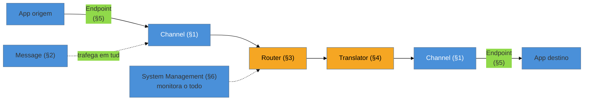

# Panorama da integração

> [!abstract] TL;DR
> Nenhum sistema vive sozinho — e integrá-los é onde mais se sofre. Hohpe & Woolf catalogaram esse sofrimento nos **Enterprise Integration Patterns (EIP)**: um vocabulário nomeado para conectar sistemas heterogêneos. Tudo começa numa escolha de **estilo de integração** — File Transfer, Shared Database, **RPC** ou **Messaging** — e o livro defende que **mensageria** é a que melhor entrega o que integração precisa: **desacoplamento** no tempo, no espaço e na tecnologia. A partir daí, os padrões se organizam em **6 grupos** (canais, construção da mensagem, roteamento, transformação, endpoints, gestão), que se compõem como um **pipeline** por onde a mensagem viaja. A lente desta família é a **ferramenta**: **Apache Camel** e **Spring Integration** *são* implementações diretas dos EIPs. E o fio condutor moderno, herdado da queda do ESB: **"smart endpoints, dumb pipes"**.

## O problema: ninguém construiu tudo junto

Uma empresa real não tem *um* sistema — tem o ERP comprado em 2009, o CRM SaaS, o gateway de pagamento, o sistema de estoque legado em .NET, o app novo em Node, e uma planilha que alguém jura que é crítica. Eles foram feitos por times diferentes, em épocas diferentes, com tecnologias que não se falam. E ainda assim o negócio exige que **conversem**: o pedido do app precisa baixar o estoque, disparar o pagamento e avisar o CRM.

Integrar é difícil por razões que não somem com esforço: as aplicações são **autônomas** (você não manda na agenda de deploy do ERP), as redes são **não-confiáveis e lentas**, os formatos **divergem**, e tudo **muda** — um sistema é atualizado sem avisar os outros. A pergunta que os EIP respondem é: *existe um vocabulário de soluções testadas para esses problemas recorrentes, em vez de cada integração reinventar a roda?* Existe — e ele começa antes dos padrões, na escolha do **estilo**.

## Os quatro estilos de integração

Hohpe & Woolf abrem catalogando **como** dois sistemas podem se integrar, dos piores aos melhores em desacoplamento:

| Estilo | Como | Problema |
| --- | --- | --- |
| **File Transfer** | um sistema exporta um arquivo, o outro lê | acoplamento por formato + latência de lote; sem semântica |
| **Shared Database** | os dois leem/escrevem na mesma base | acoplamento máximo ao esquema; contenção; ninguém pode evoluir |
| **RPC** (chamada remota) | um sistema chama o outro como se fosse local | acoplamento **temporal** (o outro tem que estar no ar); falha em cascata |
| **Messaging** | trocam mensagens por um canal assíncrono | **desacoplado** no tempo, espaço e tecnologia — mas exige pensar assíncrono |

A tese do livro é que **Messaging** é o estilo que melhor equilibra as tensões da integração: o emissor **não espera** o receptor (desacoplamento temporal — o outro pode estar fora do ar e a mensagem aguarda), não precisa saber **onde** ele está (o canal medeia), nem em que **linguagem** foi escrito. O preço é mudar a cabeça para o assíncrono — sem retorno imediato, com entrega eventual e possíveis duplicatas. É esse preço que os padrões dos grupos seguintes ajudam a pagar.

## Os seis grupos — e como a mensagem viaja por eles

Os ~65 padrões do livro se organizam em **6 grupos**, que não são categorias soltas: eles descrevem as **estações** por onde uma mensagem passa da origem ao destino.

1. **Messaging Channels** — por onde a mensagem trafega ([[03 - Message Channel]]: fila × tópico).
2. **Message Construction** — o que é uma mensagem ([[02 - Message]]: header + payload; comando/documento/evento).
3. **Message Routing** — direcionar sem acoplar origem e destino ([[05 - Content-Based Router + Message Filter|routers]], [[06 - Splitter + Aggregator|splitter/aggregator]]).
4. **Message Transformation** — adaptar formatos ([[08 - Message Translator + Normalizer|translator]], [[09 - Canonical Data Model|canonical model]]).
5. **Messaging Endpoints** — como a aplicação se pluga no canal ([[10 - Consumers - Polling × Event-Driven|consumers]], [[11 - Competing Consumers]]).
6. **System Management** — operar, monitorar e tratar o que falha ([[13 - Guaranteed Delivery + Dead Letter Channel|dead letter]], control bus).

O [[04 - Pipes and Filters|Pipes and Filters]] é a metáfora que costura tudo: cada estação é um **filtro** (faz uma coisa) conectado por **pipes** (os canais). É por isso que os EIPs **compõem** — um router seguido de um translator seguido de um aggregator é um pipeline legível.

## A lente desta família: a ferramenta É o padrão

Diferente de outras famílias, aqui os padrões têm uma encarnação **literal**: frameworks de integração foram construídos *como* catálogos de EIP executáveis.

- **Apache Camel** — a DSL de rotas fala EIP diretamente: `from("queue:pedidos").choice().when(...).to(...)` é Message Channel + Content-Based Router + Endpoint numa linha. Camel tem um componente por padrão.
- **Spring Integration** — os mesmos padrões como beans Spring: `MessageChannel`, `Router`, `Transformer`, `Aggregator`. Ler a doc dele é ler os EIP.
- **MuleSoft / ESBs** — o EIP no habitat enterprise clássico (aprofundado em [[03-Dominios/Engenharia/Comunicação entre Sistemas/index|Comunicação entre Sistemas]]).
- **Brokers e streams modernos** (RabbitMQ, Kafka, SQS) — realizam alguns padrões nativamente (pub-sub, competing consumers) e deixam outros pra aplicação.

> [!question]- Se Camel e Spring Integration já implementam tudo, por que estudar os padrões?
> Porque a ferramenta te dá o `aggregator()`, mas não te diz **quando** um Aggregator é a resposta, qual a condição de completude, nem por que ele vai vazar memória sem timeout. O padrão é o **modelo mental** que te faz escolher e configurar a peça certa — e reconhecer, num sistema legado com 400 rotas Camel, o que cada trecho está tentando fazer. A ferramenta executa; o padrão explica.

## "Smart endpoints, dumb pipes" — o fio condutor moderno

Há uma tensão que atravessa toda a família e vem da história real: nos anos 2000, o **ESB (Enterprise Service Bus)** tentou colocar *toda* a inteligência de integração — roteamento, transformação, orquestração, regra de negócio — num **barramento central**. Virou gargalo, ponto único de falha e o oposto do desacoplamento prometido. A crítica de Fowler & Lewis (2014) cristalizou a lição: **"smart endpoints and dumb pipes"** — a inteligência mora nos **serviços** (endpoints), e o meio de transporte deve ser **burro** (só roteia). Guarde isso: vários padrões desta família são ótimos em pequena dose e **veneno** quando você os usa para centralizar inteligência que deveria estar nas pontas. É o critério que reaparece no [[14 - Message Bus × Message Broker|Message Bus × Broker]] que fecha a família.

## Armadilhas comuns

> [!warning] Escolher RPC/Shared Database onde messaging era a resposta
> **O que acontece:** integra-se dois sistemas por chamada síncrona direta (ou pior, base compartilhada), e o acoplamento temporal derruba tudo junto: o sistema A cai quando o B fica lento. **Por quê:** RPC e Shared Database acoplam no tempo e no esquema — a promessa de "simples" cobra o preço na primeira falha parcial. É o oposto do que integração deveria dar. **Como evitar:** onde os sistemas precisam ser **autônomos** e resilientes a indisponibilidade um do outro, escolha **messaging**. Reserve RPC para quando você genuinamente precisa da resposta agora e aceita o acoplamento (ver o trade-off síncrono × assíncrono em Comunicação entre Sistemas).

> [!warning] Reinventar os padrões sem nomeá-los
> **O que acontece:** o time constrói, na mão, um "processador que quebra o pedido, manda cada item pra um serviço e junta as respostas" — sem perceber que acabou de reimplementar Splitter + Recipient List + Aggregator, com todos os bugs que esses padrões já resolveram (timeout, completude, ordenação). **Por quê:** sem o vocabulário, cada integração redescobre os mesmos problemas e erra os mesmos detalhes que o catálogo já mapeou décadas atrás. **Como evitar:** aprenda a **reconhecer** os padrões no problema; use a peça pronta da ferramenta (Camel/Spring Integration) em vez de reescrever a maquinaria stateful do zero.

> [!warning] Inteligência no barramento (o ESB de novo)
> **O que acontece:** a camada de integração acumula regra de negócio, orquestração e transformação complexa — e vira um monólito central que todo time precisa mudar e ninguém entende. **Por quê:** centralizar inteligência no "pipe" é exatamente o anti-padrão que derrubou o ESB. O meio de integração vira gargalo organizacional e técnico. **Como evitar:** **smart endpoints, dumb pipes** — regra de negócio nos serviços; o canal só transporta e roteia. Se uma rota de integração está cheia de `if` de negócio, ela está no lugar errado.

## Como explicar em inglês

> "No system lives alone, and integrating them is where most of the pain is. Hohpe and Woolf cataloged that pain as the Enterprise Integration Patterns. It starts with an integration style — File Transfer, Shared Database, RPC, or Messaging — and the book argues messaging wins because it decouples systems in time, space, and technology: the sender doesn't wait for the receiver, doesn't need to know where it is, or what language it's written in. From there the patterns fall into six groups — channels, message construction, routing, transformation, endpoints, and system management — that compose like a pipeline the message travels through. The lens for this family is the tooling: Apache Camel and Spring Integration are literally implementations of the EIPs, one component per pattern. And the modern thread, learned from the fall of the ESB, is 'smart endpoints, dumb pipes' — keep the intelligence in the services and the transport dumb, because centralizing integration logic in a shared bus is what turned the ESB into a bottleneck."

| PT | EN |
| --- | --- |
| estilos de integração | integration styles |
| desacoplamento (tempo/espaço) | decoupling (temporal/spatial) |
| acoplamento temporal | temporal coupling |
| roteamento de mensagens | message routing |
| endpoints de mensageria | messaging endpoints |
| barramento (burro) | (dumb) bus/pipe |
| pontas inteligentes, canos burros | smart endpoints, dumb pipes |

## O que vem a seguir

Escolhido o estilo (messaging) e visto o mapa (6 grupos), a família desce ao concreto na ordem do pipeline. Antes de rotear ou transformar qualquer coisa, é preciso saber **o que** viaja e **por onde** — a unidade de tudo é a mensagem.

- [[02 - Message]] — o envelope: header + payload, e os três tipos (comando, documento, evento).
- [[03 - Message Channel]] — por onde ela trafega: fila (point-to-point) × tópico (publish-subscribe).
- [[04 - Pipes and Filters]] — a metáfora que faz todos os padrões seguintes comporem.

## Veja também

- [[03-Dominios/Engenharia/Comunicação entre Sistemas/index|Comunicação entre Sistemas]] — a infra por baixo dos padrões (brokers, JMS/MQ, ESB, garantias de entrega, Kafka/RabbitMQ).
- [[03-Dominios/Engenharia/Design de Software/Padrões de Projeto/index|Padrões de Projeto]] — o galho-pai e as outras famílias do catálogo.

## Fontes

- **Gregor Hohpe & Bobby Woolf** — *Enterprise Integration Patterns* (2004) — a fonte canônica; o cap. de abertura estabelece os 4 estilos e os 6 grupos.
- **Gregor Hohpe** — [*Enterprise Integration Patterns* (site/catálogo)](https://www.enterpriseintegrationpatterns.com/) — o catálogo online com os ícones de cada padrão.
- **Martin Fowler & James Lewis** — [*Microservices*](https://martinfowler.com/articles/microservices.html) (2014) — o princípio "smart endpoints and dumb pipes" e a crítica ao ESB.
- **Apache Camel** — [*EIP DSL*](https://camel.apache.org/components/latest/eips/enterprise-integration-patterns.html) — os EIPs como componentes executáveis.
