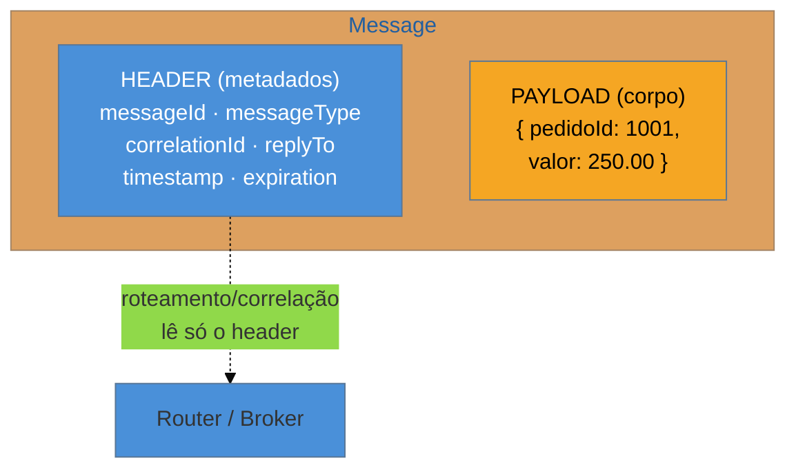

# Message

> [!abstract] TL;DR
> A **Message** é a unidade que viaja pelo canal — e ela é mais que o dado: é um **envelope** com **header** (metadados: id, tipo, correlação, endereço de resposta, expiração) e **payload** (o corpo, o dado de negócio). Separar os dois é o que permite rotear, correlacionar e rastrear sem abrir o conteúdo. Hohpe distingue três **intenções**: **Command Message** ("faça isto" — invoca uma ação), **Document Message** ("aqui está o dado" — transfere informação) e **Event Message** ("isto aconteceu" — notifica uma mudança). Reconhecer qual dos três você está enviando muda o acoplamento do sistema inteiro. As armadilhas: **payload gordo** que arrasta o banco todo, **acoplar o consumidor** à estrutura interna do produtor, e **esquecer o correlation id** que costura pedido e resposta.

## O dado não basta: é preciso um envelope

Você quer mandar "o pedido 1001 foi pago" de um sistema para outro pelo canal. Se você joga só o dado cru no canal, faltam respostas que o transporte precisa: **quem** deve responder e para onde? Essa mensagem é uma **ordem** ("cobre o cliente") ou um **aviso** ("o cliente já pagou")? Ela ainda é válida ou já expirou? Se for a resposta de uma pergunta anterior, **de qual** pergunta?

Como uma carta, a Message resolve isso com um **envelope**. O **payload** é a carta (o dado de negócio); o **header** é o envelope (metadados que o sistema de mensageria e os padrões de roteamento usam **sem precisar ler a carta**). Essa separação é o que torna possível rotear pela mensagem, correlacionar resposta com pergunta e descartar mensagens vencidas — tudo olhando só o header.

## Anatomia: header + payload

O **header** carrega o que a infraestrutura precisa:

- **Message ID** — identidade única (base da idempotência — ver [[12 - Idempotent Receiver]]).
- **Message Type** — que tipo de conteúdo, para o consumidor saber desserializar.
- **Correlation Identifier** — casa uma resposta com a requisição que a originou.
- **Return Address** (reply-to) — para onde mandar a resposta, sem o produtor fixar o destino.
- **Timestamp / Message Expiration** — quando foi criada e até quando vale (TTL; depois disso, descartar).

O **payload** é o dado de negócio — e a regra de ouro é que ele deve ser **autossuficiente e estável**: o consumidor entende a mensagem sem consultar o estado interno do produtor.

## As três intenções: Command, Document, Event

O mesmo formato de envelope carrega três **intenções** diferentes, e a distinção é de projeto, não de sintaxe:

| Tipo | Intenção | Exemplo | Acoplamento |
| --- | --- | --- | --- |
| **Command Message** | *faça isto* — invoca uma ação no receptor | `CobrarCliente{pedido:1001}` | mais alto: o emissor sabe o que o receptor deve fazer |
| **Document Message** | *aqui está o dado* — transfere informação, sem dizer o que fazer | `DadosDoPedido{...}` | médio: transfere estado, decisão é do receptor |
| **Event Message** | *isto aconteceu* — notifica uma mudança de fato | `PedidoPago{pedido:1001}` | mais baixo: o emissor nem sabe quem escuta |

A escolha tem consequência arquitetural direta. Um **Command** acopla emissor e receptor (o emissor conhece a operação do outro); um **Event** desacopla ao máximo (o emissor anuncia um fato e ignora quem reage — a base da arquitetura orientada a eventos, [[03-Dominios/Engenharia/Comunicação entre Sistemas/index|família 5 e Comunicação]]). Trocar um Command por um Event é frequentemente o passo que transforma um sistema acoplado num desacoplado.

> [!question]- "PedidoPago" é um Event ou um Document? Parece os dois.
> A diferença é a **intenção**, não o payload. Se você publica `PedidoPago` para **anunciar que um fato ocorreu** e não se importa com quem consome, é um **Event Message**. Se você manda os `DadosDoPedido` porque o outro sistema **pediu** essa informação para processar, é um **Document Message**. O mesmo dado pode ser embrulhado nas duas intenções — e o header (`messageType`) é onde você declara qual é, para o consumidor tratar corretamente.

## A lente cross-ferramenta

O envelope header+payload é universal — cada tecnologia o encarna com nomes próprios:

| Tecnologia | Header | Payload |
| --- | --- | --- |
| **JMS / Jakarta Messaging** | `JMSMessageID`, `JMSCorrelationID`, `JMSReplyTo`, propriedades | corpo (`TextMessage`, `BytesMessage`) |
| **AMQP / RabbitMQ** | propriedades (`message_id`, `correlation_id`, `reply_to`, `expiration`) | body (bytes) |
| **Kafka** | `key`, headers, timestamp, offset | value (bytes) |
| **Apache Camel** | `Exchange` headers | `Message` body |

Repare que **correlation id** e **reply-to** são de primeira classe em todos — porque os padrões de [Request-Reply](https://www.enterpriseintegrationpatterns.com/patterns/messaging/RequestReply.html) e de correlação dependem deles.

## Armadilhas comuns

> [!warning] Payload gordo demais
> **O que acontece:** a mensagem carrega a linha inteira do banco, mais joins, mais campos "por via das dúvidas" — mensagens de megabytes atravessando o broker. **Por quê:** payload grande satura o broker, aumenta latência e frequentemente vaza **estrutura interna** do produtor que o consumidor não deveria conhecer. Muitas vezes o sinal é que você está mandando um Document onde um Event com um id bastaria (o consumidor busca o resto se precisar — ver Claim Check em [[08 - Message Translator + Normalizer]]). **Como evitar:** mande o **mínimo** que o consumidor precisa; para dados grandes, use um id + Claim Check (o payload fica num armazenamento, a mensagem carrega a referência).

> [!warning] Acoplar o consumidor à estrutura interna
> **O que acontece:** o payload espelha o modelo de domínio interno do produtor; quando o produtor refatora uma classe, todas as mensagens (e todos os consumidores) quebram. **Por quê:** sem um contrato explícito e versionado, a mensagem vira um vazamento do modelo interno — o desacoplamento prometido pela mensageria some por baixo. **Como evitar:** trate o payload como um **contrato público** (schema versionado, tolerante a evolução — campos novos opcionais); traduza do modelo interno para o contrato na saída ([[08 - Message Translator + Normalizer|Message Translator]]).

> [!warning] Esquecer o Correlation Identifier
> **O que acontece:** num fluxo request-reply assíncrono, a resposta chega mas o emissor não sabe **de qual** requisição ela é — respostas e pedidos se embaralham sob concorrência. **Por quê:** sem um `correlationId` no header ligando a resposta à requisição, não há como casá-las; o assíncrono perde o fio que o síncrono tinha de graça (a mesma thread esperava o retorno). **Como evitar:** sempre propague um **Correlation Identifier** em fluxos de resposta; o receptor copia o id da requisição para a resposta, e o emissor casa pela chave.

## Como explicar em inglês

> "A Message is the unit that travels through the channel, and it's more than the data — it's an envelope with a header and a payload. The header holds metadata the infrastructure uses without opening the body: message id, type, correlation id, return address, expiration. The payload is the business data. Hohpe distinguishes three intents: a Command Message says 'do this' and invokes an action; a Document Message says 'here's the data' and just transfers information; an Event Message says 'this happened' and notifies a change. The choice drives coupling — a command couples sender and receiver because the sender knows the receiver's operation, while an event decouples the most because the sender doesn't even know who's listening. Every technology has this envelope: JMS headers and body, Kafka key/value/headers, AMQP properties. The traps are fat payloads that drag the whole database across the broker, coupling consumers to the producer's internal structure instead of a versioned contract, and forgetting the correlation id that ties a reply back to its request in async flows."

| PT | EN |
| --- | --- |
| envelope (header + corpo) | envelope (header + body) |
| identificador de correlação | correlation identifier |
| endereço de resposta | return address / reply-to |
| expiração da mensagem | message expiration |
| mensagem de comando/documento/evento | command/document/event message |
| contrato público (versionado) | public (versioned) contract |
| verificação de reivindicação | claim check |

## O que vem a seguir

Sabemos **o que** viaja (a mensagem, seu envelope e sua intenção). Falta **por onde** — a mensagem não flutua no vácuo; ela trafega por um canal, e o tipo de canal define quantos consumidores a recebem.

- [[03 - Message Channel]] — fila (point-to-point) × tópico (publish-subscribe); a escolha que decide se um Event chega a um ou a muitos.
- [[04 - Pipes and Filters]] — o pipeline por onde a mensagem passa de filtro em filtro.
- [[12 - Idempotent Receiver]] — onde o Message ID vira a chave da deduplicação.

## Veja também

- [[03-Dominios/Engenharia/Comunicação entre Sistemas/index|Comunicação entre Sistemas]] — o contrato de mensagem e os formatos (Avro/Protobuf/JSON) pela ótica de infra.
- [[03-Dominios/Engenharia/Design de Software/Padrões de Projeto/Acesso a Dados/01 - Panorama do acesso a dados|Acesso a Dados]] — o payload frequentemente nasce de um agregado; o mesmo cuidado de contrato se aplica.

## Fontes

- **Gregor Hohpe & Bobby Woolf** — *Enterprise Integration Patterns* (2004) — Message, Command/Document/Event Message, Correlation Identifier, Return Address.
- **Gregor Hohpe** — [*Message* (catálogo EIP)](https://www.enterpriseintegrationpatterns.com/patterns/messaging/Message.html) — a definição canônica e os padrões de header.
- **Oracle** — [*Jakarta Messaging (JMS) — Message*](https://jakarta.ee/specifications/messaging/) — headers e corpo no padrão Java.
