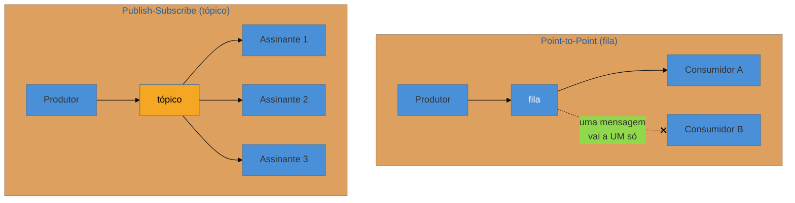

# Message Channel

> [!abstract] TL;DR
> O **Message Channel** é o **caminho lógico** por onde a mensagem trafega — o emissor escreve no canal, o receptor lê do canal, e **nenhum dos dois conhece o outro** (é o canal que desacopla). A decisão central é o **tipo de canal**, e ela define quantos recebem cada mensagem: **Point-to-Point** (uma fila — cada mensagem é consumida por **exatamente um** receptor, mesmo havendo vários competindo) × **Publish-Subscribe** (um tópico — cada mensagem é entregue a **todos** os assinantes). Escolher errado é o bug de integração mais comum: mandar um comando por pub-sub (N sistemas executam a mesma ação) ou um evento por fila (só um dos interessados fica sabendo). Variantes: **Datatype Channel** (um canal por tipo), **Invalid Message Channel** e **Dead Letter Channel** (para onde vai o que não pôde ser processado).

## O canal é quem desacopla

No estilo messaging, o produtor **não chama** o consumidor — ele deposita a mensagem num canal e segue a vida. O consumidor, em outro ritmo, lê do canal. Essa indireção é a fonte de todo o desacoplamento: o produtor não sabe **quem** consome, **quantos** consomem, nem **quando**. Trocar, adicionar ou remover consumidores não toca no produtor.

Mas "um canal" é uma decisão com duas geometrias radicalmente diferentes, e escolher entre elas é a primeira pergunta de qualquer integração assíncrona: **essa mensagem deve ser processada por um só, ou anunciada a todos?**

## Point-to-Point × Publish-Subscribe

- **Point-to-Point Channel (fila):** garante que **exatamente um** consumidor processa cada mensagem. Se houver vários consumidores na fila, eles **competem** ([[11 - Competing Consumers]]) e o canal entrega cada mensagem a apenas um — ótimo para **distribuir trabalho** (uma tarefa, um worker). Casa com **Command Message**: uma ordem deve ser executada uma vez.
- **Publish-Subscribe Channel (tópico):** entrega **uma cópia a cada** assinante. Ótimo para **anunciar fatos** a múltiplos interessados que reagem de formas diferentes. Casa com **Event Message**: um fato interessa a quem quiser ouvir.

A regra prática: **trabalho a distribuir → fila; fato a anunciar → tópico.** Ela decorre direto da intenção da [[02 - Message|mensagem]] (comando × evento).

## Variantes que organizam e protegem o canal

- **Datatype Channel** — um canal **por tipo** de mensagem. Como o consumidor lê sem negociar o formato, ele precisa saber de antemão o que vem; misturar tipos num canal força o consumidor a inspecionar e ramificar (e é a primeira armadilha abaixo).
- **Invalid Message Channel** — para onde vai a mensagem que chegou **malformada** (não desserializa, viola o contrato). Em vez de travar o consumidor, ela é desviada para análise.
- **Dead Letter Channel** — para onde o **sistema de mensageria** coloca a mensagem que não conseguiu **entregar** (destino inexistente, expirada, rejeitada N vezes). É a rede de segurança da confiabilidade, aprofundada em [[13 - Guaranteed Delivery + Dead Letter Channel]].

## A lente cross-ferramenta

| Tecnologia | Point-to-Point | Publish-Subscribe |
| --- | --- | --- |
| **JMS** | `Queue` | `Topic` |
| **RabbitMQ (AMQP)** | exchange default → `queue` | `fanout`/`topic` exchange → N queues |
| **Kafka** | tópico + **um** consumer group | tópico + **vários** consumer groups |
| **AWS** | SQS | SNS (→ SQS/e-mail/HTTP) |

O **Kafka** é o caso instrutivo: um mesmo **tópico** é point-to-point **dentro** de um consumer group (a partição vai a um consumidor do grupo) e publish-subscribe **entre** grupos (cada grupo recebe tudo). Ele unifica as duas geometrias na mesma primitiva — por isso "tópico Kafka" ≠ "tópico JMS".

> [!question]- Se eu preciso que 3 sistemas reajam a um pedido, uso um tópico ou três filas?
> Depende de **quem decide** os interessados. Se o produtor deve ignorar quem escuta (desacoplamento máximo, novos consumidores entram sem tocar no produtor), **pub-sub**: um tópico `PedidoCriado`, três assinantes. Se cada sistema tem uma responsabilidade **específica e distinta** que o produtor conhece e quer garantir (cobrar, separar, faturar), às vezes um **Recipient List** ([[07 - Recipient List + Scatter-Gather + Resequencer]]) para filas dedicadas é mais explícito. A regra de ouro: use pub-sub quando o produtor **não deve saber** quem reage; use roteamento explícito quando ele **precisa garantir** destinos nomeados.

## Armadilhas comuns

> [!warning] Misturar tipos de mensagem num canal
> **O que acontece:** um canal `eventos` recebe `PedidoCriado`, `PagamentoAprovado` e `ClienteAtualizado` juntos; todo consumidor precisa inspecionar o tipo e ramificar, ignorando o que não lhe interessa. **Por quê:** viola o **Datatype Channel**. O consumidor não pode mais assumir o formato do que lê; acopla-se a **todos** os tipos que trafegam ali, e uma mudança em qualquer um pode afetá-lo. **Como evitar:** um canal por tipo (ou por contexto coeso). Se precisa multiplexar, use um [[05 - Content-Based Router + Message Filter|Content-Based Router]] na entrada para separar por tipo em canais dedicados — não empurre a ramificação para cada consumidor.

> [!warning] Comando por publish-subscribe
> **O que acontece:** publica-se `CobrarCliente` num tópico; **todos** os assinantes executam a cobrança — o cliente é cobrado três vezes. **Por quê:** pub-sub entrega a **todos**. Um **comando** deve ser executado **uma vez** — o canal errado transforma "faça isto" em "todos façam isto". **Como evitar:** comandos vão por **fila** (point-to-point, exatamente um executor); reserve pub-sub para **eventos** (fatos que múltiplos podem observar sem duplicar efeito).

> [!warning] Evento por fila única (interessado perdido)
> **O que acontece:** o fato `PedidoPago` é publicado numa fila; o primeiro consumidor a pegar processa, e os outros sistemas interessados **nunca ficam sabendo**. **Por quê:** fila entrega a **um só**. Um fato que interessa a vários exige que **cada um** receba sua cópia — a fila única rouba a mensagem dos demais. **Como evitar:** eventos com múltiplos interessados vão por **tópico** (pub-sub). Se cada sistema tem sua própria fila alimentada pelo tópico (o padrão SNS→SQS), cada um processa de forma independente e resiliente.

## Como explicar em inglês

> "A Message Channel is the logical path a message travels — the producer writes to the channel, the consumer reads from it, and neither knows the other; the channel is what decouples them. The key decision is the channel type, which decides how many receive each message. A Point-to-Point channel — a queue — delivers each message to exactly one consumer, even when several compete, so it's for distributing work and pairs with command messages. A Publish-Subscribe channel — a topic — delivers a copy to every subscriber, so it's for announcing facts and pairs with event messages. The rule is: work to distribute goes on a queue, a fact to announce goes on a topic. Kafka is the instructive case — a topic is point-to-point within a consumer group and publish-subscribe across groups. The classic bugs are sending a command over pub-sub, so everyone executes it, and sending an event over a single queue, so only one interested system ever hears about it."

| PT | EN |
| --- | --- |
| canal de mensagens | message channel |
| ponto-a-ponto (fila) | point-to-point (queue) |
| publicação-assinatura (tópico) | publish-subscribe (topic) |
| canal por tipo de dado | datatype channel |
| canal de mensagem inválida | invalid message channel |
| distribuir trabalho | distribute work |
| grupo de consumidores | consumer group |

## O que vem a seguir

Temos a mensagem (02) e o canal (03). Falta a **metáfora que conecta os canais em processamento**: se cada etapa de tratamento é um filtro e cada canal é um pipe, então integrações complexas viram pipelines componíveis — e é isso que faz todos os roteadores e transformadores das próximas notas se encaixarem.

- [[04 - Pipes and Filters]] — o pipeline: filtros independentes conectados por canais; a base da composição.
- [[11 - Competing Consumers]] — vários consumidores na mesma fila, o mecanismo por trás do point-to-point que escala.
- [[13 - Guaranteed Delivery + Dead Letter Channel]] — o que acontece com a mensagem que o canal não consegue entregar.

## Veja também

- [[03-Dominios/Engenharia/Comunicação entre Sistemas/4 - Comunicação assíncrona/02 - Message queue vs event streaming|Comunicação — queue vs streaming]] — fila × stream pela ótica de infra (Kafka × RabbitMQ).
- [[03-Dominios/Engenharia/Comunicação entre Sistemas/index|Comunicação entre Sistemas]] — brokers concretos e suas garantias.

## Fontes

- **Gregor Hohpe & Bobby Woolf** — *Enterprise Integration Patterns* (2004) — Message Channel, Point-to-Point, Publish-Subscribe, Datatype/Invalid Message Channel.
- **Gregor Hohpe** — [*Point-to-Point Channel*](https://www.enterpriseintegrationpatterns.com/patterns/messaging/PointToPointChannel.html) e [*Publish-Subscribe Channel*](https://www.enterpriseintegrationpatterns.com/patterns/messaging/PublishSubscribeChannel.html) — as definições canônicas.
- **Confluent** — [*Kafka topics & consumer groups*](https://developer.confluent.io/courses/apache-kafka/consumer-group-protocol/) — como o tópico Kafka unifica as duas geometrias.
