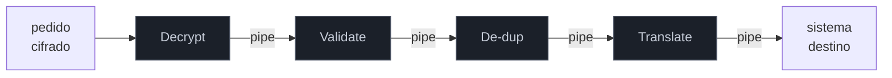

# Pipes and Filters

> [!abstract] TL;DR
> **Pipes and Filters** decompõe um processamento complexo numa **sequência de filtros independentes** conectados por **pipes** (os canais de mensagem). Cada **filtro** faz **uma** transformação, não conhece os vizinhos, e se comunica só pela mensagem que entra e sai — como o `ls | grep | sort` do Unix. É a **metáfora-mãe** do EIP: todos os roteadores, tradutores e agregadores das próximas notas **são filtros** num pipeline, e uma rota do Apache Camel é literalmente pipes-and-filters escrito como código. O ganho é **composição** — você monta integrações encaixando peças testáveis e reusáveis; o preço é **latência** (cada salto custa) e a dificuldade de raciocinar sobre o fluxo inteiro. A armadilha central: filtro com **estado ou efeito colateral escondido**, que quebra a composição e a paralelização que o padrão promete.

## O problema: um processamento monolítico não se reaproveita

Imagine o tratamento de um pedido que chega por mensagem: você precisa **descriptografar**, **validar** o formato, **remover duplicatas**, **traduzir** para o formato interno e **rotear** para o sistema certo. A tentação é escrever um método gigante que faz tudo em sequência. Ele funciona — mas é um bloco: você não consegue testar a validação isolada, não reusa a descriptografia noutro fluxo, e trocar a ordem ou inserir um passo novo mexe no monólito inteiro.

A observação de Pipes and Filters é que cada um desses passos é **independente**: recebe uma mensagem, faz **uma** coisa, produz uma mensagem. Se cada passo vira um **filtro** autônomo e os passos se conectam por **pipes** (canais), o processamento inteiro vira uma **linha de montagem** — e cada estação pode ser desenvolvida, testada, reusada, reordenada e escalada **sozinha**.

## A ideia: filtros burros conectados por canais

Cada **filtro** conhece só sua entrada e sua saída — nunca o vizinho. O **pipe** entre eles é um [[03 - Message Channel|Message Channel]]. Como a interface entre filtros é sempre "mensagem entra, mensagem sai", eles são **intercambiáveis**: você reordena, insere um filtro novo, ou substitui um por outro sem tocar nos demais. É o mesmo princípio dos pipes do Unix (`cat log | grep ERRO | sort | uniq -c`) — cada comando ignora quem vem antes e depois, e você compõe pipelines poderosos a partir de peças simples.

Dessa independência vêm ganhos concretos: cada filtro é **testável isolado** (dá uma mensagem, verifica a saída), **reusável** (o mesmo `Decrypt` serve a vários fluxos) e **escalável por partes** (se o `Translate` é o gargalo, você paraleliza só ele com [[11 - Competing Consumers]]).

## A metáfora-mãe: tudo no EIP é um filtro

Aqui está a razão de esta nota vir cedo na família: **quase todo padrão dos próximos capítulos é um tipo especial de filtro**. Um [[05 - Content-Based Router + Message Filter|Router]] é um filtro que escolhe a saída; um [[08 - Message Translator + Normalizer|Translator]] é um filtro que muda o formato; um [[06 - Splitter + Aggregator|Splitter]] é um filtro que produz várias saídas. Compor esses filtros num pipeline é como se **constrói** uma integração. Por isso frameworks de integração são, no fundo, motores de pipes-and-filters:

- **Apache Camel** — uma rota `from(...).unmarshal().filter(...).transform().to(...)` é um pipeline de filtros explícito; cada EIP é um filtro plugável.
- **Spring Integration** — `MessageChannel` (pipe) + `MessageHandler` (filtro); você desenha o fluxo ligando handlers por channels.
- **Unix / shells** — o ancestral conceitual: processos como filtros, `|` como pipe.
- **Stream processing** (Kafka Streams, Flink) — operadores (`map`, `filter`, `join`) encadeados são o mesmo padrão sobre streams.

> [!question]- Isso não é a mesma coisa que "cadeia de responsabilidade" ou "middleware"?
> São parentes próximos. O [[17 - Chain of Responsibility|Chain of Responsibility]] do GoF e o *middleware* de frameworks web (Express, ASP.NET) compartilham o DNA: passos compostos, cada um fazendo uma parte. A diferença de ênfase: Pipes and Filters é sobre **fluxo de dados assíncrono** entre componentes **distribuídos e independentes** (conectados por canais reais, possivelmente em processos diferentes), enquanto Chain of Responsibility é um padrão **in-process** de passar uma requisição por handlers até um tratá-la. A metáfora do pipe (dado fluindo) × a da corrente (responsabilidade passando) marca a diferença.

## Armadilhas comuns

> [!warning] Filtro com estado ou efeito colateral escondido
> **O que acontece:** um filtro "puro" na aparência guarda estado entre mensagens (um contador, um cache) ou escreve num banco no meio do caminho — e o pipeline deixa de ser reordenável e paralelizável. **Por quê:** a composição de Pipes and Filters depende de filtros serem **funções da mensagem**: mesma entrada, mesma saída, sem memória. Estado escondido cria acoplamento temporal (a ordem passa a importar de um jeito não-óbvio) e quebra a paralelização (dois workers no mesmo filtro corrompem o estado). **Como evitar:** mantenha filtros **stateless** por padrão. Onde o estado é essencial (o [[06 - Splitter + Aggregator|Aggregator]] precisa esperar partes), trate-o como um padrão **especial e explícito**, com estado gerenciado e visível — não um efeito colateral acidental.

> [!warning] Pipeline longo e opaco
> **O que acontece:** a rota cresce para 25 filtros encadeados; ninguém entende o fluxo de ponta a ponta, e depurar uma mensagem que "sumiu" no meio de saltos assíncronos vira arqueologia. **Por quê:** cada salto é um canal assíncrono; a legibilidade que você ganha em cada filtro isolado se perde no **todo** quando o pipeline é longo demais e sem marcos. O rastro de uma mensagem atravessa processos e filas. **Como evitar:** agrupe filtros em sub-fluxos nomeados com intenção clara; instrumente com um **Correlation Identifier** ([[02 - Message]]) para rastrear a mensagem ponta a ponta (tracing distribuído); resista a empilhar "só mais um filtro" sem revisar o desenho.

> [!warning] Filtros acoplados por suposição, não por contrato
> **O que acontece:** o filtro C assume que o filtro A (dois passos atrás) já preencheu certo campo — uma dependência **implícita** que não aparece na interface. **Por quê:** o valor do padrão é que cada filtro dependa **só da mensagem que recebe**. Suposições sobre o que outros filtros fizeram recriam o acoplamento que o pipeline deveria eliminar, e reordenar quebra tudo. **Como evitar:** o **contrato é a mensagem**. Se C precisa de um campo, ele deve estar no contrato da mensagem que C recebe (garantido por um Content Enricher explícito, se preciso), não numa suposição sobre a história do pipeline.

## Como explicar em inglês

> "Pipes and Filters breaks a complex processing into a sequence of independent filters connected by pipes — the message channels. Each filter does one transformation, doesn't know its neighbors, and communicates only through the message in and out, exactly like Unix `ls | grep | sort`. It's the mother metaphor of the EIP: almost every other pattern — routers, translators, splitters — is a special kind of filter, and an Apache Camel route is literally pipes-and-filters as code. The payoff is composition: you build integrations by snapping together testable, reusable pieces, and you can reorder, insert, or scale any stage on its own. The cost is latency per hop and harder end-to-end reasoning. The core trap is a filter with hidden state or side effects, which breaks the composability and parallelism the pattern promises — filters should be stateless functions of the message, and where state is essential, like an aggregator, it should be an explicit special case, not an accident."

| PT | EN |
| --- | --- |
| filtro (sem estado) | (stateless) filter |
| cano / canal | pipe |
| linha de montagem | assembly line / pipeline |
| componível | composable |
| efeito colateral escondido | hidden side effect |
| o contrato é a mensagem | the contract is the message |
| rastreio ponta a ponta | end-to-end tracing |

## O que vem a seguir

Fecha o **bloco Iniciado** — a mensagem (02), o canal (03) e o pipeline (04) que os compõe. Com a linha de montagem no lugar, o bloco **Adepto** enche as estações: os filtros que **decidem para onde** a mensagem vai. O primeiro e mais fundamental é o que escolhe o destino pelo conteúdo.

- [[05 - Content-Based Router + Message Filter]] — o primeiro filtro-com-decisão: rotear pela mensagem, descartar o irrelevante.
- [[06 - Splitter + Aggregator]] — os filtros que quebram e juntam mensagens (fan-out/fan-in).
- [[08 - Message Translator + Normalizer]] — o filtro que muda o formato entre sistemas.

## Veja também

- [[03-Dominios/Engenharia/Design de Software/Padrões de Projeto/Clássicos (GoF)/17 - Chain of Responsibility|Chain of Responsibility]] — o parente in-process: passos compostos, ênfase em responsabilidade.
- [[03-Dominios/Ciência/Sistemas Operacionais/index|Sistemas Operacionais]] — os pipes do Unix, o ancestral conceitual do padrão.

## Fontes

- **Gregor Hohpe & Bobby Woolf** — *Enterprise Integration Patterns* (2004) — Pipes and Filters como base da composição de mensageria.
- **Gregor Hohpe** — [*Pipes and Filters* (catálogo EIP)](https://www.enterpriseintegrationpatterns.com/patterns/messaging/PipesAndFilters.html) — a definição canônica.
- **Buschmann et al.** — *Pattern-Oriented Software Architecture, vol. 1* (1996) — a formulação arquitetural original de Pipes and Filters.
