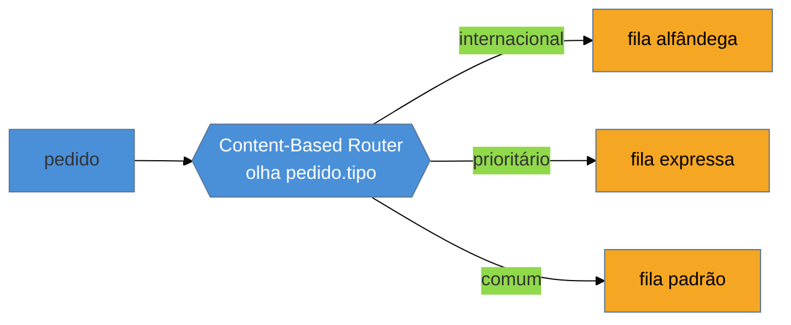

# Content-Based Router + Message Filter

> [!abstract] TL;DR
> O **Content-Based Router** olha o **conteúdo** da mensagem (tipo, campo, valor) e a encaminha para **um**
> de vários destinos — sem que o produtor saiba quem processa o quê. O **Message Filter** é o caso
> degenerado: um router de **uma saída** que decide **passar ou descartar** ("essa mensagem me interessa?").
> Juntos, são o primeiro **filtro-com-decisão** do pipeline — a estação que direciona o fluxo. Na lente da
> família, é o `choice().when(...).to(...)` do Apache Camel. A armadilha que domina: o router incha de
> **lógica de negócio** e vira um **God component** que centraliza decisões (o ESB-gargalo em miniatura); a
> saída é manter a regra de roteamento **simples e declarativa**, e empurrar orquestração complexa para um
> Routing Slip ou Process Manager.

## O problema: o produtor não deveria saber quem processa

Um canal recebe pedidos de tipos variados — nacionais e internacionais, comuns e prioritários. Cada tipo
vai para um sistema diferente. Se o **produtor** decide o destino, ele precisa conhecer todos os sistemas
downstream e sua lógica de despacho — acoplamento que a mensageria deveria justamente eliminar. E se cada
consumidor lê **tudo** e ignora o que não é seu, você desperdiça processamento e espalha a regra de "isto
é meu" por todo lugar.

O Content-Based Router resolve pondo um **filtro-decisor** no meio: ele inspeciona a mensagem e a manda
para o destino certo. O produtor publica num canal só, ignorante dos destinos; o roteador — e **só** ele —
conhece o mapa de "que conteúdo vai para onde".

## A ideia: uma entrada, uma de N saídas

O router examina o conteúdo e escolhe **exatamente um** destino. Repare que ele **não transforma** a
mensagem (isso é [[08 - Message Translator + Normalizer|Translator]]) nem a duplica para vários (isso é
[[07 - Recipient List + Scatter-Gather + Resequencer|Recipient List]]) — ele só **decide o caminho**. Em
Camel: `from("pedidos").choice().when(header("tipo").isEqualTo("intl")).to("alfandega")...`.

## O Message Filter: um router de uma saída

O **Message Filter** é o router levado ao mínimo: **uma** saída, e a decisão é binária — a mensagem
**passa** ou é **descartada**. É o "essa mensagem me interessa?" Um consumidor que só liga para pedidos
acima de R$ 1000 põe um filtro na entrada e ignora o resto sem custo downstream.

> [!question]- Message Filter (EIP) é a mesma coisa que Selective Consumer? E que `filter()` de stream?
> São primos com uma diferença de **onde** mora a decisão. O **Message Filter** é um passo **no fluxo** (um
> filtro no pipeline) que descarta antes de seguir. O **Selective Consumer** ([[10 - Consumers - Polling × Event-Driven]])
> é o **consumidor** que só retira do canal as mensagens que casam com um critério (o broker filtra na
> entrega — ex. *message selector* do JMS). E o `filter()` de Kafka Streams/RxJS é a mesma ideia sobre
> streams in-process. Mesma intenção (deixar passar só o relevante); o que muda é se o descarte acontece no
> pipeline, no broker, ou no operador de stream.

## A lente cross-ferramenta

| Ferramenta | Content-Based Router | Message Filter |
| --- | --- | --- |
| **Apache Camel** | `choice().when(predicate).to(...)` | `filter(predicate)` |
| **Spring Integration** | `@Router` / `PayloadTypeRouter` | `@Filter` / `MessageFilter` |
| **RabbitMQ** | `topic` exchange + routing keys (roteamento por chave, não por payload) | binding com routing key |
| **Kafka Streams** | `branch()` / `split()` | `filter()` |

Nuance importante: o **RabbitMQ** roteia por **routing key** (um campo do envelope), não pelo **payload** —
é roteamento baseado em **header**, não em conteúdo profundo. Content-Based Router "de verdade" (inspecionar
o corpo) costuma exigir uma camada de aplicação (Camel/Spring Integration) por cima do broker.

## Armadilhas comuns

> [!warning] O God Router com lógica de negócio
> **O que acontece:** o `choice()` cresce para 40 `when(...)` com condições que consultam serviços, fazem
> cálculo e embutem regra de negócio — o roteador vira o cérebro do sistema.
> **Por quê:** é o ESB-gargalo em miniatura ([[01 - Panorama da integração|smart endpoints, dumb pipes]]):
> centralizar decisão de negócio no pipe acopla todos os fluxos a um ponto que todo time precisa mudar e
> ninguém entende. O router deveria só **direcionar**, não **decidir o negócio**.
> **Como evitar:** mantenha a condição de roteamento **simples e declarativa** (um campo, um tipo). Quando a
> escolha do caminho depende de lógica de negócio real ou de uma sequência de passos, é um **Process Manager**
> ou **Routing Slip** (o roteiro viaja na mensagem), não mais um `when` no router.

> [!warning] Regras de roteamento espalhadas e duplicadas
> **O que acontece:** a mesma decisão ("internacional → alfândega") aparece em três routers diferentes; muda
> a regra, e você conserta em dois lugares e esquece o terceiro.
> **Por quê:** roteamento é uma regra que tende a se repetir; copiada, ela diverge silenciosamente e cria
> comportamento inconsistente entre fluxos.
> **Como evitar:** centralize a regra de roteamento num só lugar (um router canônico, ou configuração
> externa); os demais fluxos referenciam, não recopiam. Roteamento **por configuração** (tabela) em vez de
> `if` hard-coded facilita manter a regra única.

> [!warning] Router acoplado a destinos hard-coded
> **O que acontece:** os destinos (`"alfandega"`, `"expressa"`) estão escritos no código do router; adicionar
> um tipo novo de pedido exige recompilar e redeployar o roteador.
> **Por quê:** hard-codear destinos transforma uma mudança de configuração numa mudança de código, e acopla o
> router à topologia concreta — frágil quando os destinos mudam com frequência.
> **Como evitar:** externalize o mapa conteúdo→destino (configuração, tabela de roteamento). Um **Dynamic
> Router** aprende os destinos em runtime; no mínimo, os endereços vêm de config, não de literais no código.

## Como explicar em inglês

> "A Content-Based Router looks at the message content — a type, a field, a value — and routes it to one of
> several destinations, so the producer never needs to know who processes what. A Message Filter is the
> degenerate case: a router with a single output that decides pass or discard — 'do I care about this
> message?' Together they're the first decision-making filter in the pipeline, the station that steers the
> flow, and in this family's lens they're Camel's `choice().when(...).to(...)` and `filter(...)`. The
> dominant trap is the router bloating with business logic into a God component that centralizes decisions —
> the ESB bottleneck in miniature — so you keep the routing condition simple and declarative and push complex
> orchestration to a Routing Slip or Process Manager, where the itinerary travels with the message. And watch
> the nuance that RabbitMQ routes by routing key, a header field, not by deep payload content — true
> content-based routing usually needs an application layer like Camel on top."

| PT | EN |
| --- | --- |
| roteador por conteúdo | content-based router |
| filtro de mensagem | message filter |
| passar ou descartar | pass or discard |
| roteamento por configuração | configuration-driven routing |
| roteiro na mensagem (routing slip) | routing slip |
| chave de roteamento | routing key |
| roteador dinâmico | dynamic router |

## O que vem a seguir

O router escolhe **um** caminho para a mensagem inteira. Mas e quando a mensagem é **composta** — um pedido
com vários itens que precisam ser processados separadamente e depois recombinados? Aí entra o par mais
famoso do EIP: quebrar em partes e juntar de volta.

- [[06 - Splitter + Aggregator]] — quebrar uma mensagem em várias (fan-out) e recombinar as respostas (fan-in).
- [[07 - Recipient List + Scatter-Gather + Resequencer]] — enviar a vários destinos e compor as respostas.
- [[08 - Message Translator + Normalizer]] — o filtro que muda o formato, não o caminho.

## Veja também

- [[03-Dominios/Engenharia/Design de Software/Padrões de Projeto/Clássicos (GoF)/17 - Chain of Responsibility|Chain of Responsibility]] — o parente in-process do filtro-com-decisão.
- [[03-Dominios/Engenharia/Comunicação entre Sistemas/index|Comunicação entre Sistemas]] — routing keys e exchanges do RabbitMQ na ótica de infra.

## Fontes

- **Gregor Hohpe & Bobby Woolf** — *Enterprise Integration Patterns* (2004) — Content-Based Router, Message Filter, Dynamic Router, Routing Slip.
- **Gregor Hohpe** — [*Content-Based Router*](https://www.enterpriseintegrationpatterns.com/patterns/messaging/ContentBasedRouter.html) e [*Message Filter*](https://www.enterpriseintegrationpatterns.com/patterns/messaging/Filter.html) — as definições canônicas.
- **Apache Camel** — [*Content Based Router EIP*](https://camel.apache.org/components/latest/eips/choice-eip.html) — o `choice()` como roteador por conteúdo.
