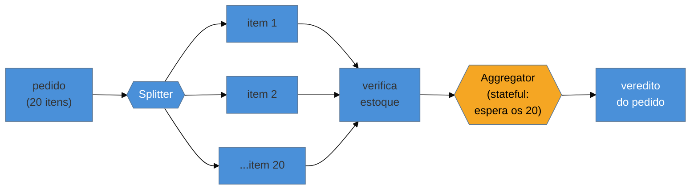

# Splitter + Aggregator

> [!abstract] TL;DR
> **Splitter** e **Aggregator** são o par **fan-out/fan-in** do EIP. O **Splitter** quebra uma mensagem
> composta em várias — um pedido com N itens vira N mensagens, cada uma processável em paralelo. O
> **Aggregator** faz o oposto: coleta mensagens **correlacionadas** e as recombina numa só. A assimetria é o
> que você precisa entender: o Splitter é quase sempre **stateless** (recebe uma, emite N), mas o Aggregator
> é o **padrão stateful por excelência** do EIP — ele precisa **esperar** as partes, e por isso exige quatro
> decisões: **correlação** (quais mensagens vão juntas?), **condição de completude** (quando tenho todas?),
> **estratégia de agregação** (como combino?) e **timeout** (e se uma parte nunca chegar?). A armadilha
> central mora aí: um Aggregator **sem completude + timeout** ou **vaza memória** guardando partes para
> sempre, ou **trava** esperando uma parte que não vem.

## O problema: processar as partes, mas responder pelo todo

Chega um pedido com 20 itens, cada um de um fornecedor diferente. Você quer verificar o estoque de cada
item **em paralelo** (não em série, item a item), mas precisa devolver **uma** resposta: "pedido aprovado"
só quando **todos** os 20 responderem. Processar tudo numa mensagem gigante serializa o trabalho e não
paraleliza; processar cada item isolado paraleliza, mas perde a noção do **todo** — quem junta as 20
respostas de volta num veredito único?

Esse é o ciclo **quebra-processa-junta**, e o EIP o resolve com dois padrões complementares: o Splitter na
entrada (um → N) e o Aggregator na saída (N → um). Entre eles, cada parte segue seu caminho independente.

## A ideia: fan-out e fan-in

O **Splitter** olha a mensagem composta e emite uma mensagem por elemento — geralmente carregando um
**Correlation Identifier** (o id do pedido) e um número de sequência, para o Aggregator saber depois quais
partes pertencem ao mesmo todo. O **Aggregator** acumula as partes correlacionadas até a **condição de
completude** ser satisfeita, então aplica a **estratégia de agregação** e emite o resultado. A combinação
Splitter → (rota) → Aggregator tem nome próprio: **Composed Message Processor**.

## O Aggregator é stateful — e é aí que tudo dá errado

A diferença crítica: o Splitter não guarda nada (uma mensagem entra, N saem, esqueceu). O **Aggregator
precisa de memória** — ele segura partes até ter o conjunto. Isso o obriga a resolver quatro perguntas, e
cada uma é uma decisão de projeto (não um detalhe):

1. **Correlação** — quais mensagens formam um grupo? (pela chave de correlação, ex. `pedidoId`)
2. **Condição de completude** — quando o grupo está completo? (contei os 20? passou o tempo? chegou um sinal de "fim"?)
3. **Estratégia de agregação** — como combino as partes? (concateno? somo? escolho a melhor?)
4. **Timeout** — e se uma parte **nunca** chegar? (aborta? emite parcial? alarme?)

> [!question]- Como o Aggregator sabe que já chegaram "todas" as partes, se elas vêm assíncronas?
> Ele não sabe de graça — você **declara** a condição de completude, e há três estratégias comuns. **Por
> contagem:** o Splitter anota "parte 3 de 20" e o Aggregator conta até 20. **Por sinal de fim:** uma
> mensagem final marca o encerramento do grupo. **Por timeout:** espera um intervalo e agrega o que chegou.
> Quase sempre você combina contagem **com** timeout — porque confiar só na contagem significa **travar para
> sempre** se uma das 20 partes se perder no caminho. O timeout é a rede de segurança que impede o Aggregator
> de esperar eternamente.

## A lente cross-ferramenta

| Ferramenta | Splitter | Aggregator |
| --- | --- | --- |
| **Apache Camel** | `split(body())` (com `.parallelProcessing()`) | `aggregate(correlationExpr, strategy).completionSize(n).completionTimeout(ms)` |
| **Spring Integration** | `@Splitter` | `@Aggregator` + `ReleaseStrategy` + `MessageStore` |
| **Kafka Streams** | `flatMap` | `groupByKey().windowedBy(...).aggregate(...)` (janela = completude por tempo) |

Repare que o Camel expõe as quatro decisões **explicitamente** na API (`completionSize`, `completionTimeout`,
a estratégia) — porque não há default seguro. E note onde o estado vive: o `MessageStore` do Spring
Integration e a janela do Kafka Streams são **onde as partes ficam guardadas** — persistir esse estado é o
que torna o Aggregator resiliente a reinícios (senão um restart perde os grupos em andamento).

## Armadilhas comuns

> [!warning] Aggregator sem completude + timeout
> **O que acontece:** o Aggregator espera "todas as partes", mas uma se perde (consumidor caiu, mensagem foi
> pra [[13 - Guaranteed Delivery + Dead Letter Channel|dead letter]]) — e o grupo fica **preso para sempre**,
> ocupando memória; sob volume, isso vaza até o `OutOfMemory`.
> **Por quê:** o Aggregator é stateful e **retém** o que ainda não completou. Sem uma condição de completude
> robusta e um timeout, ele não tem como desistir — cada grupo incompleto é memória que nunca é liberada.
> **Como evitar:** **sempre** combine a condição de completude (contagem/sinal) com um **timeout** que fecha
> ou aborta grupos travados; monitore grupos que expiram (indicam partes perdidas upstream). Nunca confie só
> na contagem.

> [!warning] Splitter que perde a correlação
> **O que acontece:** o Splitter emite as N partes sem um id de correlação nem número de sequência; o
> Aggregator recebe um mar de mensagens e **não consegue** saber quais pertencem a qual pedido.
> **Por quê:** o fan-in depende de **saber o que junta com o quê**. Sem a chave de correlação carimbada em
> cada parte na hora de dividir, a recomposição é impossível.
> **Como evitar:** o Splitter carimba **correlation id + índice/total** em cada parte
> ([[02 - Message|header da mensagem]]); o Aggregator agrupa pela chave. Sem isso, não há fan-in.

> [!warning] Assumir que as partes voltam em ordem
> **O que acontece:** o código do Aggregator (ou de quem consome o resultado) assume que a parte 1 chega
> antes da 2 — mas com processamento paralelo e canais assíncronos, elas chegam **fora de ordem**.
> **Por quê:** paralelizar as partes (o ganho do Splitter) **destrói a ordem** de chegada. Contar com ordem
> introduz um bug que só aparece sob concorrência real.
> **Como evitar:** a estratégia de agregação deve ser **indiferente à ordem** (usar o índice de sequência
> para posicionar cada parte). Se a ordem do **resultado** importa, ordene na agregação ou insira um
> [[07 - Recipient List + Scatter-Gather + Resequencer|Resequencer]] antes.

## Como explicar em inglês

> "Splitter and Aggregator are the EIP's fan-out/fan-in pair. The Splitter breaks a composite message into
> many — an order with N items becomes N messages you can process in parallel — and it's usually stateless.
> The Aggregator does the opposite, collecting correlated messages and recombining them into one, and it's
> the stateful pattern par excellence: it has to wait for the parts, so it needs four decisions —
> correlation (which messages belong together), a completeness condition (when do I have them all?), an
> aggregation strategy (how do I combine them?), and a timeout (what if a part never arrives?). The central
> trap lives right there: an aggregator without completeness and timeout either leaks memory holding parts
> forever or hangs waiting for a part that never comes. So you always pair the completeness condition — by
> count or an end signal — with a timeout as the safety net. In Camel that's `completionSize` and
> `completionTimeout` spelled out explicitly, because there's no safe default."

| PT | EN |
| --- | --- |
| divisor / agregador | splitter / aggregator |
| espalhar e juntar (fan-out/fan-in) | fan-out / fan-in |
| condição de completude | completeness condition |
| estratégia de agregação | aggregation strategy |
| chave de correlação | correlation key |
| processador de mensagem composta | composed message processor |
| indiferente à ordem | order-independent |

## O que vem a seguir

O Splitter/Aggregator quebra e junta **uma** mensagem composta. Uma variação pergunta a **vários destinos
diferentes** e junta as respostas — e outra reordena mensagens que chegaram fora de sequência. São os
parentes de roteamento múltiplo que completam o repertório de fan-out/fan-in.

- [[07 - Recipient List + Scatter-Gather + Resequencer]] — enviar a N destinos, juntar as respostas, reordenar.
- [[08 - Message Translator + Normalizer]] — adaptar o formato de cada parte entre sistemas.
- [[09 - Canonical Data Model]] — o modelo comum que as partes traduzidas compartilham.

## Veja também

- [[03-Dominios/Engenharia/Comunicação entre Sistemas/4 - Comunicação assíncrona/03 - Garantias de entrega e ordenação|Comunicação — garantias e ordenação]] — por que a ordem se perde e como o broker lida com isso.
- [[03-Dominios/Engenharia/Design de Software/Padrões de Projeto/Acesso a Dados/14 - Modelagem por agregado e single-table design|Agregado]] — o "agregado" de dados que o Splitter frequentemente quebra.

## Fontes

- **Gregor Hohpe & Bobby Woolf** — *Enterprise Integration Patterns* (2004) — Splitter, Aggregator, Composed Message Processor.
- **Gregor Hohpe** — [*Aggregator*](https://www.enterpriseintegrationpatterns.com/patterns/messaging/Aggregator.html) — a definição canônica e as estratégias de completude.
- **Apache Camel** — [*Aggregate EIP*](https://camel.apache.org/components/latest/eips/aggregate-eip.html) — as quatro decisões (correlação, completude, timeout, estratégia) na API.
