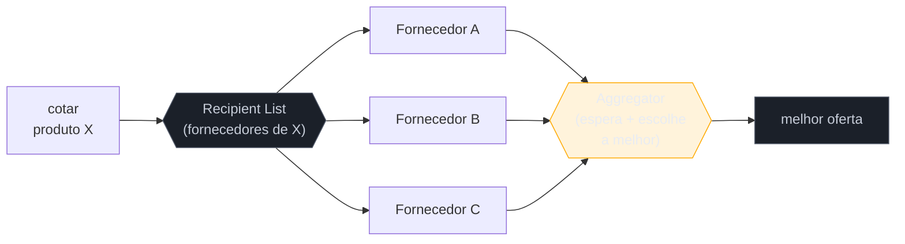

# Recipient List + Scatter-Gather + Resequencer

> [!abstract] TL;DR
> Três padrões de roteamento múltiplo que completam o repertório fan-out/fan-in. O **Recipient List** manda a mensagem para uma **lista dinâmica de destinos** — diferente do [[05 - Content-Based Router + Message Filter|Content-Based Router]], que escolhe **um**, este envia a **N destinos computados** (ex.: pedir cotação aos fornecedores que vendem aquele produto). O **Scatter-Gather** é Recipient List **+** [[06 - Splitter + Aggregator|Aggregator]]: pergunta a vários, junta as respostas, decide (ex.: cotar com 3 fornecedores e escolher o mais barato). O **Resequencer** conserta a ordem: recebe mensagens fora de sequência e as reemite **em ordem** por número de sequência — um padrão **stateful** que precisa de buffer. As armadilhas seguem o tema do bloco: **Scatter-Gather sem timeout** trava no destino mais lento (ou morto); **Resequencer com buffer ilimitado** vaza memória (ou congela) quando uma mensagem da sequência se perde.

## O problema: um destino não basta

O Content-Based Router resolve "para **qual** dos destinos essa mensagem vai?" — escolhe **um**. Mas muitos cenários reais precisam de **vários** ao mesmo tempo, e de formas diferentes:

- *"Peça cotação a **todos** os fornecedores que vendem este item"* — uma lista que **depende do conteúdo** e muda a cada pedido. Isso é **Recipient List**.
- *"Peça a três fornecedores e me traga a **melhor** oferta"* — mandar para vários **e recombinar** as respostas num veredito. Isso é **Scatter-Gather**.
- *"As respostas chegaram fora de ordem; preciso processá-las na **sequência** original"* — isso é **Resequencer**.

Os três estendem o roteamento de "um destino" para "muitos", cada um com uma torção.

## Recipient List: uma lista computada de destinos

O Recipient List calcula, **por mensagem**, o conjunto de destinos e envia uma cópia para cada. A lista é **dinâmica** — vem do conteúdo, de uma consulta, de uma regra. É o irmão "N saídas" do router (que tem "1 saída escolhida"). Cuidado com a semântica: diferente do pub-sub ([[03 - Message Channel|tópico]]), onde o produtor **ignora** quem escuta, aqui o roteador **conhece e decide** a lista — útil quando você precisa **garantir** destinos nomeados e específicos.

## Scatter-Gather: pergunte a vários, componha a resposta

Scatter-Gather = **espalhar** (Recipient List ou pub-sub) + **juntar** (Aggregator). O clássico é a "licitação": pergunta a vários fornecedores, agrega as respostas, escolhe. Como reusa o Aggregator, herda **todas** as quatro decisões dele — em especial a mais crítica aqui: o **timeout**, porque você está esperando **sistemas externos** que podem estar lentos ou fora do ar.

> [!question]- Scatter-Gather e Splitter/Aggregator não são a mesma coisa?
> A maquinaria de fan-in é a mesma (Aggregator), mas o **fan-out** difere. No [[06 - Splitter + Aggregator|Splitter]], você quebra **uma** mensagem nas suas **partes** (os itens de um pedido) — as saídas são pedaços do mesmo dado. No Scatter-Gather, você manda a **mesma** pergunta a **destinos diferentes** (fornecedores distintos) — as saídas são a mesma pergunta replicada. Splitter = "divida este todo em partes"; Scatter-Gather = "pergunte isto a vários". O fan-in junta pedaços num caso, respostas concorrentes no outro.

## Resequencer: devolver a ordem perdida

Quando você paraleliza (Splitter, competing consumers), as mensagens chegam **fora de ordem**. O **Resequencer** é um buffer stateful que segura as mensagens e as reemite ordenadas por **número de sequência** — a parte 1, depois a 2, depois a 3, mesmo que tenham chegado 3-1-2. Ele não muda o conteúdo, só a **ordem de saída**. É o antídoto para a terceira armadilha do bloco anterior (assumir ordem), quando a ordem do resultado realmente importa (ex.: aplicar eventos de conta na sequência correta).

## A lente cross-ferramenta

| Padrão | Apache Camel | Spring Integration |
| --- | --- | --- |
| **Recipient List** | `recipientList(expr)` | `@Router` retornando vários canais |
| **Scatter-Gather** | `recipientList().aggregationStrategy(...)` | `ScatterGatherHandler` |
| **Resequencer** | `resequence().stream()` / `.batch()` | `@Resequencer` + `ReleaseStrategy` |

## Armadilhas comuns

> [!warning] Scatter-Gather sem timeout (o refém do mais lento)
> **O que acontece:** você pergunta a 3 fornecedores; dois respondem em 200ms, o terceiro está fora do ar — e o Aggregator **espera indefinidamente**, prendendo a resposta ao cliente. **Por quê:** o Scatter-Gather depende de **sistemas externos** que você não controla. Sem timeout, o tempo total é o do **destino mais lento** (ou infinito, se um morrer). A latência do todo é a do pior, não a do melhor. **Como evitar:** **sempre** um timeout na agregação, com estratégia de resposta parcial ("agregue quem respondeu até T"). Trate destinos ausentes como resposta faltante, não como motivo para travar. Combine com [[12 - Idempotent Receiver|retry]]/[circuit breaker] onde fizer sentido.

> [!warning] Resequencer com buffer ilimitado (a mensagem que falta trava tudo)
> **O que acontece:** o Resequencer espera a sequência 1,2,3,4...; a mensagem **3 se perde**, e ele segura 4, 5, 6... **indefinidamente** esperando a 3 — o buffer cresce sem limite e a saída congela. **Por quê:** reordenar por sequência assume que **todos** os números chegam. Um buraco na sequência bloqueia tudo que vem depois (não dá para emitir 4 antes de 3 sem violar a ordem), e o buffer acumula. **Como evitar:** buffer **limitado** + timeout por lacuna: após esperar um tempo pela mensagem faltante, pule-a (emitindo um gap explícito) ou desça para a dead letter. Nunca um Resequencer que espera para sempre.

> [!warning] Recipient List com destinos hard-coded
> **O que acontece:** a lista de destinatários está fixa no código; adicionar um fornecedor novo exige recompilar. **Por quê:** o valor do Recipient List é a lista ser **dinâmica** (computada por mensagem). Fixá-la anula o padrão e o transforma num broadcast estático frágil. **Como evitar:** compute a lista a partir de dados (consulta, config, conteúdo da mensagem). Um destino novo deve entrar por **dado**, não por deploy.

## Como explicar em inglês

> "These three extend routing from one destination to many. A Recipient List sends the message to a dynamic list of destinations — unlike a content-based router that picks one, this sends to N computed recipients, like asking every supplier that sells a product for a quote. Scatter-Gather is a Recipient List plus an Aggregator: ask several, gather the responses, decide — quote three suppliers and pick the cheapest. Since it reuses the Aggregator, it inherits the timeout concern, which is critical here because you're waiting on external systems. A Resequencer fixes order: it buffers out-of-sequence messages and re-emits them in order by sequence number, which is stateful. The traps follow the block's theme: Scatter-Gather without a timeout is held hostage by the slowest or dead recipient, so the total latency is the worst one's; and a Resequencer with an unbounded buffer hangs or leaks when a message in the sequence goes missing, because it can't emit past the gap — so you cap the buffer and time out the gap."

| PT | EN |
| --- | --- |
| lista de destinatários | recipient list |
| espalhar e juntar | scatter-gather |
| reordenador | resequencer |
| lista dinâmica | dynamic list |
| resposta parcial | partial response |
| lacuna na sequência | sequence gap |
| refém do mais lento | hostage to the slowest |

## O que vem a seguir

Fechamos o roteamento — direcionar mensagens sem transformá-las. Mas sistemas diferentes falam **formatos diferentes**; antes de uma mensagem chegar a um destino, muitas vezes ela precisa ser **traduzida**. É a estação de transformação do pipeline.

- [[08 - Message Translator + Normalizer]] — adaptar o formato entre sistemas que não se entendem.
- [[09 - Canonical Data Model]] — o modelo comum que evita o N×N de tradutores.
- [[13 - Guaranteed Delivery + Dead Letter Channel]] — para onde vai a resposta que nunca chegou no timeout.

## Veja também

- [[03-Dominios/Engenharia/Comunicação entre Sistemas/4 - Comunicação assíncrona/03 - Garantias de entrega e ordenação|Comunicação — garantias e ordenação]] — ordenação e reentrega pela ótica de infra.
- [[03-Dominios/Engenharia/Design de Software/Padrões de Projeto/Clássicos (GoF)/17 - Chain of Responsibility|Chain of Responsibility]] — roteamento in-process, o parente estrutural.

## Fontes

- **Gregor Hohpe & Bobby Woolf** — *Enterprise Integration Patterns* (2004) — Recipient List, Scatter-Gather, Resequencer.
- **Gregor Hohpe** — [*Scatter-Gather*](https://www.enterpriseintegrationpatterns.com/patterns/messaging/BroadcastAggregate.html) e [*Resequencer*](https://www.enterpriseintegrationpatterns.com/patterns/messaging/Resequencer.html) — as definições canônicas.
- **Apache Camel** — [*Recipient List EIP*](https://camel.apache.org/components/latest/eips/recipientList-eip.html) — a lista dinâmica de destinos na prática.
