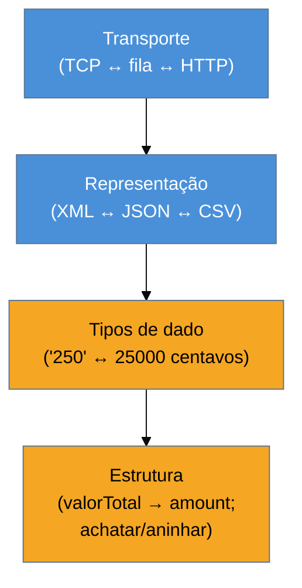

# Message Translator + Normalizer

> [!abstract] TL;DR
> O **Message Translator** é o **[[07 - Adapter|Adapter]] da mensageria** — traduz o formato de uma mensagem
> entre sistemas que não falam a mesma língua. É o padrão de transformação mais usado do EIP, e opera em
> quatro **níveis**: transporte, representação (XML↔JSON), tipos de dado e estrutura (mapeamento de campos).
> O **Normalizer** é o Translator para **muitos formatos de entrada**: detecta o tipo e despacha para o
> tradutor certo, produzindo **um** formato canônico de saída. A família tem variantes úteis: **Content
> Enricher** (adiciona dado que falta, de outra fonte), **Content Filter** (remove/simplifica), **Envelope
> Wrapper** (embrulha/desembrulha para um canal), **Claim Check** (guarda o payload grande e carrega só uma
> referência). As armadilhas: **tradução espalhada** (cada consumidor traduz — o problema que o
> [[09 - Canonical Data Model|Canonical Data Model]] resolve) e o **Content Enricher síncrono** que acopla o
> pipeline assíncrono a uma chamada bloqueante.

## O problema: ninguém fala a mesma língua

O sistema de pedidos emite XML com `<valorTotal>`; o de faturamento espera JSON com `amount` em centavos; o
legado quer um registro de tamanho fixo com o valor em outra moeda. Nenhum vai mudar para agradar o outro —
eles são autônomos. Alguém precisa **traduzir** no meio, e a pergunta é **onde** essa tradução mora.

Se cada consumidor traduz o que recebe, a lógica de conversão se espalha e se duplica por todo o sistema. O
Message Translator concentra a tradução num **filtro dedicado** no pipeline: a mensagem entra num formato,
sai noutro, e os sistemas das pontas permanecem ignorantes do formato alheio. É o mesmo papel do
[[07 - Adapter|Adapter]] do GoF — reconciliar interfaces incompatíveis — aplicado a mensagens.

## Os quatro níveis de tradução

Hohpe organiza a transformação em camadas, das mais superficiais às mais profundas — e uma tradução real
frequentemente cruza várias:

1. **Transporte** — o canal/protocolo (de uma fila JMS para um POST HTTP).
2. **Representação de dados** — o formato serializado (XML → JSON, EDI → CSV).
3. **Tipos de dado** — a semântica dos valores (string `"250"` → inteiro em centavos; datas; moedas).
4. **Estrutura** — o mapeamento de campos (renomear, achatar, aninhar, dividir um campo em dois).

Separar os níveis ajuda a diagnosticar: um bug de "a integração não funciona" quase sempre mora num nível
específico (o JSON está certo, mas o tipo da data veio como string).

## Normalizer: muitos formatos de entrada, um de saída

O **Normalizer** resolve o caso "recebo o mesmo dado de **cinco** parceiros, cada um no seu formato". Ele é
um [[05 - Content-Based Router + Message Filter|router]] que detecta o tipo da entrada + um **Translator por
formato**, convergindo tudo para **um** formato canônico. É a porta de entrada natural para o
[[09 - Canonical Data Model|Canonical Data Model]] da próxima nota.

## Variantes de transformação que valem nomear

- **Content Enricher** — a mensagem chega **incompleta** (só o `clienteId`), e o enricher **acrescenta** o
  dado que falta (nome, endereço), buscando de outra fonte. Poderoso — e a fonte da segunda armadilha.
- **Content Filter** — o oposto: **remove** campos desnecessários ou simplifica uma estrutura complexa.
- **Claim Check** — para payloads grandes: **guarda** o conteúdo num armazenamento e deixa a mensagem
  carregar só uma **referência** (o "ticket"); o consumidor resgata quando precisar. Resolve a armadilha do
  [[02 - Message|payload gordo]].
- **Envelope Wrapper** — embrulha a mensagem num envelope que um canal específico exige (e desembrulha na
  saída).

## A lente cross-ferramenta

| Ferramenta | Como faz tradução |
| --- | --- |
| **Apache Camel** | `marshal()`/`unmarshal()` (representação), `transform()`, type converters, componente `dataformat` |
| **Spring Integration** | `@Transformer`, `ObjectToJsonTransformer`, `MessageConverter` |
| **ESB / MuleSoft** | DataWeave — uma DSL inteira dedicada a mapeamento de mensagens |
| **Kafka** | Single Message Transforms (SMT) no Kafka Connect; (des)serializers Avro/Protobuf |

Que exista uma **DSL inteira** (DataWeave) só para isso mostra o peso da transformação em integração real —
é onde mais se gasta tempo em projetos de EIP.

## Armadilhas comuns

> [!warning] Tradução espalhada por todo lado
> **O que acontece:** cada um dos N sistemas traduz o formato dos outros N−1 na entrada; a mesma conversão
> "XML do pedidos → meu formato" aparece em vários lugares, divergindo com o tempo.
> **Por quê:** sem um ponto único de tradução, a lógica se espalha e vira N×N conversões — o crescimento
> quadrático que o [[09 - Canonical Data Model|Canonical Data Model]] existe para cortar. Manutenção vira
> pesadelo: uma mudança de formato reverbera em muitos tradutores.
> **Como evitar:** concentre a tradução na **fronteira** (cada sistema traduz só de/para um modelo canônico —
> N tradutores, não N²). É exatamente o pulo da próxima nota.

> [!warning] Content Enricher síncrono no meio do fluxo assíncrono
> **O que acontece:** o enricher, para completar a mensagem, faz uma **chamada síncrona** a um serviço REST —
> e agora o pipeline assíncrono trava esperando essa resposta, e falha quando o serviço cai.
> **Por quê:** enriquecer buscando dado externo **reintroduz acoplamento temporal** ([[01 - Panorama da integração|RPC disfarçado]])
> no meio de um fluxo que deveria ser desacoplado. A resiliência da mensageria se perde na dependência
> síncrona escondida.
> **Como evitar:** prefira **carregar o dado na mensagem** desde a origem (evento gordo o suficiente) ou
> enriquecer de uma fonte local/cache. Se a chamada externa é inevitável, trate-a com timeout, retry e
> circuit breaker — e assuma que o enricher pode falhar.

> [!warning] O God Transformer
> **O que acontece:** um único transformador gigante faz tradução de formato, enriquecimento, filtragem,
> validação e regra de negócio — centenas de linhas ilegíveis.
> **Por quê:** empilhar responsabilidades num transformer o torna o oposto de um [[04 - Pipes and Filters|filtro]]
> (que faz **uma** coisa); testar e evoluir vira difícil, e regra de negócio vaza para a camada de integração.
> **Como evitar:** um filtro por responsabilidade — Translator traduz, Enricher enriquece, Filter remove,
> Validator valida — compostos no pipeline. Regra de negócio fica nos endpoints, não no transformer.

## Como explicar em inglês

> "A Message Translator is the Adapter of messaging — it translates a message's format between systems that
> don't speak the same language, and it's the most-used transformation pattern in EIP. It works at four
> levels: transport, data representation like XML to JSON, data types, and structure, the field mapping. A
> Normalizer is a Translator for many input formats: it detects the type and dispatches to the right
> translator, converging everything to one canonical format. There are useful variants: a Content Enricher
> adds missing data from another source, a Content Filter removes fields, and a Claim Check stores a big
> payload and carries just a reference. The traps are translation scattered everywhere — each consumer
> translating, which is the N-by-N problem the Canonical Data Model solves — and a synchronous Content
> Enricher that couples your async pipeline to a blocking call and fails when that service is down."

| PT | EN |
| --- | --- |
| tradutor de mensagem | message translator |
| normalizador | normalizer |
| enriquecedor de conteúdo | content enricher |
| verificação de reivindicação | claim check |
| níveis de tradução | levels of translation |
| mapeamento de campos | field mapping |
| crescimento quadrático (N×N) | quadratic (N×N) growth |

## O que vem a seguir

O Translator resolve a tradução ponto a ponto; o Normalizer converge muitos formatos para um. Mas se
**cada** sistema traduz de/para o formato de **cada** outro, você cai no N×N. A saída — um **modelo comum**
que todo mundo traduz de/para — é o padrão que fecha o bloco Adepto, com sua própria armadilha de
centralização.

- [[09 - Canonical Data Model]] — o modelo canônico que corta o N×N (e quando centralizar demais vira gargalo).
- [[02 - Message]] — o contrato de mensagem que a tradução preserva na fronteira.
- [[10 - Consumers - Polling × Event-Driven]] — como o endpoint traduzido recebe do canal.

## Veja também

- [[03-Dominios/Engenharia/Design de Software/Padrões de Projeto/Clássicos (GoF)/07 - Adapter|Adapter]] — o mesmo papel (reconciliar interfaces) no nível de objetos.
- [[03-Dominios/Engenharia/Comunicação entre Sistemas/3 - Confiabilidade do contrato/index|Comunicação — contrato]] — formatos e evolução de schema (Avro/Protobuf) pela ótica de infra.

## Fontes

- **Gregor Hohpe & Bobby Woolf** — *Enterprise Integration Patterns* (2004) — Message Translator, Normalizer, Content Enricher, Content Filter, Claim Check, Envelope Wrapper.
- **Gregor Hohpe** — [*Message Translator*](https://www.enterpriseintegrationpatterns.com/patterns/messaging/MessageTranslator.html) — a definição canônica e os níveis de tradução.
- **MuleSoft** — [*DataWeave*](https://docs.mulesoft.com/dataweave/latest/) — uma DSL dedicada a transformação de mensagens.
