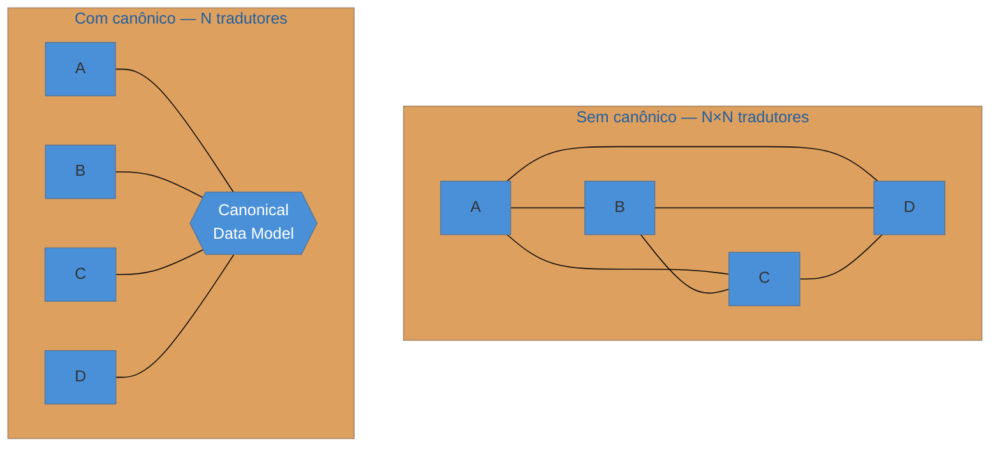

# Canonical Data Model

> [!abstract] TL;DR
> Quando N sistemas se integram e cada um traduz de/para o formato de **cada** outro, você tem N×(N−1)
> tradutores — um crescimento **quadrático** que vira pesadelo de manutenção. O **Canonical Data Model**
> corta isso: define um **formato comum e neutro**, e cada sistema traduz só de/para **ele** — **N**
> tradutores, não N². Adicionar um sistema novo passa a custar **um** tradutor, não N. É o padrão que
> resolve a "tradução espalhada" da nota anterior. Mas ele tem um **lado sombrio** que é a lição mais
> importante desta nota: centralizar demais o modelo canônico o transforma num **god-schema versionado por
> comitê** — todo mundo acoplado a ele, mudanças lentas e políticas, o **acoplamento por baixo do
> desacoplamento aparente**. É o fantasma do ESB de novo. A saída é um canônico **mínimo e por contexto**,
> não um dicionário único da empresa inteira.

## O problema: o crescimento quadrático de tradutores

Traduzir entre dois sistemas ([[08 - Message Translator + Normalizer|Message Translator]]) é simples. O
problema aparece na **escala**: com 6 sistemas que precisam se falar todos, se cada um traduz diretamente
para o formato dos outros, são 6×5 = **30 tradutores**. Adicionar o 7º exige escrever **6 novos**
tradutores (um para cada sistema existente) — e mexer no formato de qualquer um reverbera em todos que o
traduzem. É o crescimento **N×N** que sufoca projetos de integração de verdade.

A observação do Canonical Data Model é a mesma dos hubs em redes: em vez de cada nó falar com cada nó,
todos falam com um **ponto comum**. Aqui, o ponto comum é um **formato de dados neutro** — não o formato de
nenhum sistema específico, mas um modelo acordado que representa os conceitos de negócio (Pedido, Cliente)
de forma independente.

## A ideia: de malha (N×N) para estrela (N)

Cada sistema traduz seu formato próprio **para** o canônico na saída e **do** canônico na entrada. Ninguém
conhece o formato de ninguém — só o canônico. O número de tradutores cai de N×(N−1) para **N** (dois por
sistema: entrada e saída, mas linear no número de sistemas). Um sistema novo se integra escrevendo **um**
par de tradutores de/para o canônico, sem tocar nos demais. É desacoplamento de formato de verdade.

## O lado sombrio: o canônico que vira gargalo

Aqui está a parte que separa quem leu o padrão de quem o **sofreu** em produção. O Canonical Data Model
tem uma força centrípeta perigosa: como todos dependem dele, ele tende a **crescer** para acomodar cada
caso de cada sistema, e a virar um **god-schema** que um comitê central versiona. Quando isso acontece, o
desacoplamento é uma ilusão: por baixo, **todos os sistemas estão acoplados ao modelo canônico** — mudá-lo
exige coordenar toda a empresa, e ele vira o gargalo organizacional que o ESB foi.

> [!question]- Então o Canonical Data Model é bom ou ruim? Parece que a nota se contradiz.
> Ele é uma **faca de dois gumes**, e o julgamento é a lição. Em **pequena escala e por contexto delimitado**
> (um canônico para o domínio de "pedidos", compartilhado por 4 serviços que realmente falam de pedidos), ele
> corta o N×N e vale muito. Em **escala empresarial única** (um dicionário canônico para *toda* a companhia,
> versionado por comitê), ele recria o acoplamento centralizado que deveria eliminar. A regra que reconcilia:
> **canônico mínimo, por contexto, evoluível** — não um god-schema global. É [[01 - Panorama da integração|smart endpoints, dumb pipes]] aplicado ao **modelo de dados**: a inteligência (o modelo rico) fica nos serviços;
> o canônico compartilhado é o **mínimo** necessário para se entenderem.

## A lente cross-ferramenta

| Contexto | Encarnação do Canonical Data Model |
| --- | --- |
| **ESB / MuleSoft** | o "canonical model" central era prática padrão — e fonte do acoplamento que derrubou o ESB |
| **Kafka + Schema Registry** | schemas Avro/Protobuf compartilhados como contrato canônico dos tópicos |
| **DDD** | o **Published Language** de um contexto; o [Anti-Corruption Layer](https://martinfowler.com/bliki/AnticorruptionLayer.html) traduz na fronteira |
| **APIs** | um modelo canônico de recursos que várias integrações consomem |

A leitura moderna (microsserviços/DDD) evita o canônico **global** e prefere canônicos **por bounded
context**, com **Anti-Corruption Layers** traduzindo entre contextos — exatamente para não recriar o
god-schema.

## Armadilhas comuns

> [!warning] O god-schema versionado por comitê
> **O que acontece:** o modelo canônico cresce para cobrir todos os casos de todos os sistemas; qualquer
> mudança precisa passar por um comitê de arquitetura, e leva semanas.
> **Por quê:** centralizar o modelo em escala empresarial acopla todos a ele. O que era para desacoplar vira o
> ponto por onde **toda** mudança tem que passar — o gargalo do ESB reencarnado no schema.
> **Como evitar:** mantenha o canônico **mínimo** (só os campos que múltiplos sistemas realmente
> compartilham) e **por contexto** (um canônico de "pedidos", não da empresa). Prefira evolução tolerante
> (campos novos opcionais) a versionamento por comitê.

> [!warning] Acoplamento por baixo do desacoplamento aparente
> **O que acontece:** a arquitetura *parece* desacoplada (todos falam via canônico), mas na prática ninguém
> pode evoluir seu formato sem renegociar o canônico com todos.
> **Por quê:** o canônico é um **contrato compartilhado**; dependência dele é acoplamento real, só que
> escondido. Quanto mais rico o canônico, mais forte o acoplamento — e menos autônomos os sistemas.
> **Como evitar:** trate o canônico como um contrato público versionado e **magro**; onde um contexto precisa
> de um modelo rico próprio, ele o mantém internamente e traduz para o canônico magro na fronteira (ACL).

> [!warning] Canônico prematuro (N×N ainda é pequeno)
> **O que acontece:** com 2 ou 3 sistemas, o time constrói um Canonical Data Model completo "para escalar" —
> e paga a cerimônia de manter um modelo intermediário que ninguém precisava ainda.
> **Por quê:** com poucos sistemas, N×N é **pequeno** (2 sistemas = 2 tradutores diretos); o canônico só se
> paga quando o número de integrações cresce. Construí-lo cedo é complexidade sem retorno.
> **Como evitar:** comece com **tradução direta** ([[08 - Message Translator + Normalizer]]) entre poucos
> sistemas; introduza o canônico quando o N×N **doer** de verdade (a regra é ~4+ sistemas se integrando
> mutuamente). Deixe a dor justificar a estrutura.

## Como explicar em inglês

> "When N systems integrate and each translates to and from every other's format, you get N-by-(N−1)
> translators — quadratic growth that becomes a maintenance nightmare. A Canonical Data Model cuts that: you
> define a common, neutral format, and each system translates only to and from it, so it's N translators, not
> N-squared, and adding a system costs one translator instead of N. But it has a dark side that's the real
> lesson: over-centralizing the canonical model turns it into a god-schema versioned by committee, with
> everyone coupled to it — coupling underneath the apparent decoupling, the ESB ghost again. So you keep the
> canonical model minimal and per bounded context, not one enterprise-wide dictionary, and you use
> anti-corruption layers to translate between contexts. And you don't build it prematurely — with two or
> three systems, N-by-N is small and direct translation is fine; let the pain justify the structure."

| PT | EN |
| --- | --- |
| modelo canônico de dados | canonical data model |
| crescimento quadrático | quadratic growth |
| formato neutro / comum | neutral / common format |
| linguagem publicada (DDD) | published language |
| camada anticorrupção | anti-corruption layer |
| acoplamento escondido | hidden coupling |
| por contexto delimitado | per bounded context |

## O que vem a seguir

Fecha o **bloco Adepto** — roteamento (routers, splitter/aggregator, recipient list) e transformação
(translator, normalizer, canonical model). Sabemos direcionar e adaptar mensagens. Falta o bloco de
**produção enterprise**: como a aplicação **se conecta** ao canal, como **escala** o consumo e como
sobrevive a **falhas e duplicatas**. O bloco Magus começa pelos modos de receber.

- [[10 - Consumers - Polling × Event-Driven]] — os dois modos de um endpoint puxar/receber mensagens.
- [[11 - Competing Consumers]] — escalar o consumo com vários workers na mesma fila.
- [[14 - Message Bus × Message Broker]] — a topologia que fecha a família e revisita a lição do ESB.

## Veja também

- [[03-Dominios/Engenharia/Comunicação entre Sistemas/4 - Comunicação assíncrona/05 - Legado e padrões enterprise|Comunicação — ESB e legado]] — a queda do ESB e o "smart endpoints, dumb pipes" pela ótica de infra.
- [[03-Dominios/Engenharia/Design de Software/Padrões de Projeto/Acesso a Dados/15 - Polyglot persistence e materialized views|Polyglot persistence]] — a mesma tensão entre modelo compartilhado e autonomia, no acesso a dados.

## Fontes

- **Gregor Hohpe & Bobby Woolf** — *Enterprise Integration Patterns* (2004) — Canonical Data Model.
- **Gregor Hohpe** — [*Canonical Data Model*](https://www.enterpriseintegrationpatterns.com/patterns/messaging/CanonicalDataModel.html) — a definição canônica.
- **Martin Fowler** — [*Anti-Corruption Layer* / *Published Language*](https://martinfowler.com/bliki/AnticorruptionLayer.html) — a alternativa DDD ao canônico global.
