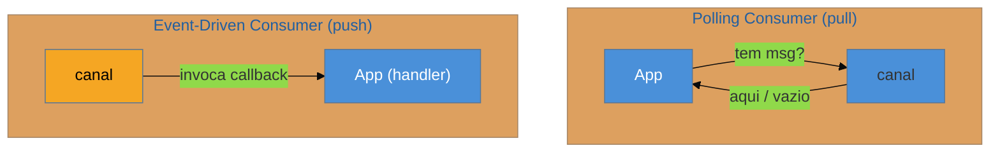

# Consumers — Polling × Event-Driven

> [!abstract] TL;DR
> Um **Messaging Endpoint** é como a aplicação se **pluga** no canal — e há dois modos opostos de receber. O **Polling Consumer** **puxa**: a aplicação pergunta ao canal "tem mensagem?" no **seu** ritmo, o que dá **controle de vazão** natural (throttling), ao custo de latência e de ciclos gastos perguntando em vão. O **Event-Driven Consumer** é **empurrado**: a aplicação registra um callback e o sistema de mensageria o **invoca** quando a mensagem chega — menor latência, mas **sem backpressure embutido** (pode ser afogado). É o mesmo dilema de *pull × push* que aparece em toda a computação. Variantes de endpoint importam: **Selective Consumer** (filtra na entrega), **Durable Subscriber** (sobrevive à desconexão) e **Idempotent Receiver** (a ponte para a próxima nota). As armadilhas: **polling agressivo** que martela o broker e **push sem backpressure** que afoga o consumidor.

## O problema: quem dá o primeiro passo?

A mensagem chegou ao canal. Agora, como a aplicação **fica sabendo**? Há duas respostas fundamentalmente diferentes, e a escolha molda latência, throughput e resiliência do consumo inteiro:

- A aplicação **vai buscar** — de tempos em tempos, ela pergunta "tem algo para mim?". Ela controla o quando.
- A aplicação **é avisada** — ela diz ao sistema "me chame quando chegar", e fica esperando ser invocada.

É o clássico **pull × push**, e os dois têm o mesmo objetivo (consumir a mensagem) com trade-offs opostos.

## Polling × Event-Driven

- **Polling Consumer** — a aplicação **puxa** ativamente (`receive()`), no seu ritmo. A grande vantagem é o **controle de vazão**: se está sobrecarregada, ela simplesmente puxa mais devagar — throttling natural. As desvantagens: **latência** (a mensagem espera até o próximo poll) e **desperdício** (polls que voltam vazios queimam CPU e chamadas ao broker).
- **Event-Driven Consumer** — a aplicação registra um **handler** e o broker o **invoca** na chegada. A vantagem é **latência mínima** e nenhum poll vazio. A desvantagem: **sem backpressure** — se as mensagens chegam mais rápido do que a aplicação processa, ela é **afogada** (a menos que haja um limite de concorrência/prefetch).

A regra prática: **precisa controlar o ritmo / proteger um recurso limitado → polling** (você decide quando puxar); **precisa de baixa latência e o consumo acompanha a chegada → event-driven** (com um limite de prefetch para não afogar).

> [!question]- O Kafka é "streaming", então é event-driven? E o `poll()` no meio?
> Aqui mora uma confusão comum. O consumidor Kafka usa, por baixo, um modelo de **polling**: seu loop chama `consumer.poll(timeout)` repetidamente para buscar lotes. Frameworks como Spring `@KafkaListener` **embrulham** esse poll num callback e te dão a *sensação* de event-driven — mas o controle de vazão (via `max.poll.records`, pausar/retomar partições) existe justamente porque o modelo base é pull. Ou seja: a API que você vê pode ser push (callback), enquanto o mecanismo por baixo é pull. Saber disso é o que te deixa **ajustar** o backpressure quando o consumidor afoga.

## A lente cross-ferramenta

| Ferramenta | Polling (pull) | Event-Driven (push) |
| --- | --- | --- |
| **JMS** | `consumer.receive()` | `MessageListener.onMessage()` |
| **RabbitMQ** | `basicGet` | `basicConsume` (+ `prefetch` = backpressure) |
| **Kafka** | `poll()` (o modelo nativo) | `@KafkaListener` (poll embrulhado em callback) |
| **AWS SQS** | *long polling* (`ReceiveMessage`) | via Lambda trigger (push gerenciado) |

Variantes de endpoint que valem citar: **Selective Consumer** (o consumidor declara um critério e o broker só entrega o que casa — *message selector* JMS), **Durable Subscriber** (a assinatura persiste enquanto o consumidor está offline, e ele recebe o que perdeu ao voltar) e **Competing Consumers** ([[11 - Competing Consumers]], a próxima nota).

## Armadilhas comuns

> [!warning] Polling agressivo martelando o broker
> **O que acontece:** um laço `while(true){ receive(); }` sem pausa nem *long polling* dispara milhares de chamadas por segundo ao broker, quase todas voltando vazias. **Por quê:** polling em loop apertado gasta CPU e satura o broker com perguntas inúteis — o custo de "perguntar" domina quando há pouca mensagem. É desperdício que escala mal. **Como evitar:** use **long polling** (a chamada espera até T por uma mensagem antes de voltar vazia) ou *backoff* exponencial entre polls vazios. Nunca um loop de poll sem espera.

> [!warning] Push sem backpressure afogando o consumidor
> **O que acontece:** um Event-Driven Consumer recebe rajadas de mensagens mais rápido do que processa; a fila interna de trabalho cresce até o `OutOfMemory`, ou o consumidor trava. **Por quê:** push entrega **no ritmo do produtor**, não do consumidor. Sem um limite (prefetch/concorrência), o consumidor aceita mais do que aguenta — o inverso do throttling natural do polling. **Como evitar:** configure **prefetch/limite de concorrência** (quantas mensagens em voo por consumidor); o broker para de empurrar até você dar `ack`. Isso reintroduz o backpressure que o push não tem de graça.

> [!warning] Subscriber não-durável perdendo mensagens na desconexão
> **O que acontece:** um consumidor pub-sub cai por 2 minutos; as mensagens publicadas nesse intervalo **somem** para ele, porque a assinatura não era durável. **Por quê:** por padrão, um assinante não-durável só recebe o que é publicado **enquanto está conectado**. Se perder mensagens durante quedas é inaceitável, a assinatura precisa **persistir** o estado. **Como evitar:** use **Durable Subscriber** onde a perda é inaceitável (a assinatura guarda o que chegou offline). Combine com [[13 - Guaranteed Delivery + Dead Letter Channel|Guaranteed Delivery]] para durabilidade ponta a ponta.

## Como explicar em inglês

> "A messaging endpoint is how an application plugs into the channel, and there are two opposite ways to receive. A Polling Consumer pulls: the app asks the channel 'any message?' on its own schedule, which gives natural flow control — if it's overwhelmed it just polls slower — at the cost of latency and empty polls burning CPU. An Event-Driven Consumer is pushed: the app registers a callback and the broker invokes it on arrival, so latency is minimal but there's no built-in backpressure, and it can be flooded. It's the classic pull-versus-push. A subtlety: Kafka's consumer is polling underneath — your loop calls `poll()` — even when a framework like Spring's `@KafkaListener` wraps it in a callback that feels event-driven, which is exactly why you tune backpressure with things like `max.poll.records`. The traps are aggressive polling hammering the broker, fixed with long polling or backoff, and push without backpressure flooding the consumer, fixed with a prefetch or concurrency limit."

| PT | EN |
| --- | --- |
| consumidor por polling / puxar | polling consumer / pull |
| consumidor orientado a evento / empurrar | event-driven consumer / push |
| controle de vazão | flow control / throttling |
| contrapressão | backpressure |
| sondagem longa | long polling |
| assinante durável | durable subscriber |
| limite de pré-busca | prefetch limit |

## O que vem a seguir

Vimos **como** um endpoint recebe. E quando **um** consumidor não dá conta do volume? A resposta é colocar **vários** consumidores na mesma fila — o padrão que escala o consumo, com seu próprio trade-off contra a ordenação.

- [[11 - Competing Consumers]] — N consumidores concorrendo na mesma fila; escala × ordem.
- [[12 - Idempotent Receiver]] — por que o consumidor precisa tolerar duplicatas.
- [[13 - Guaranteed Delivery + Dead Letter Channel]] — durabilidade e o destino do que falha.

## Veja também

- [[03-Dominios/Engenharia/Comunicação entre Sistemas/4 - Comunicação assíncrona/01 - Síncrono vs assíncrono — quando desacoplar|Comunicação — síncrono × assíncrono]] — pull × push e backpressure pela ótica de infra.
- [[03-Dominios/Ciência/Concorrência e Paralelismo/index|Concorrência e Paralelismo]] — o dilema pull/push e backpressure na base teórica.

## Fontes

- **Gregor Hohpe & Bobby Woolf** — *Enterprise Integration Patterns* (2004) — Polling Consumer, Event-Driven Consumer, Selective Consumer, Durable Subscriber.
- **Gregor Hohpe** — [*Polling Consumer*](https://www.enterpriseintegrationpatterns.com/patterns/messaging/PollingConsumer.html) e [*Event-Driven Consumer*](https://www.enterpriseintegrationpatterns.com/patterns/messaging/EventDrivenConsumer.html) — as definições canônicas.
- **Confluent** — [*Kafka Consumer*](https://docs.confluent.io/platform/current/clients/consumer.html) — o modelo de poll por baixo do "streaming".
