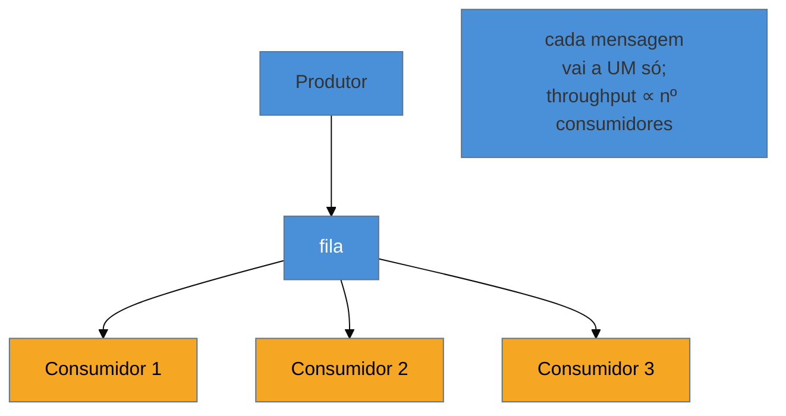

# Competing Consumers

> [!abstract] TL;DR
> **Competing Consumers** escala o consumo colocando **N consumidores na mesma fila**: o broker distribui as
> mensagens entre eles, e cada mensagem vai para **exatamente um** — concorrência horizontal, throughput que
> cresce com o número de workers. É o oposto do [[03 - Message Channel|publish-subscribe]] (que entrega a
> **todos**); aqui os consumidores **competem** pela próxima mensagem. O trade-off central, e a pergunta de
> entrevista: **paralelizar quebra a ordenação** — se dois consumidores processam mensagens relacionadas ao
> mesmo tempo, a ordem se perde. A saída é **particionar por chave** (mensagens da mesma entidade vão ao
> mesmo consumidor — a partição do Kafka), preservando ordem **dentro** da chave e paralelismo **entre**
> chaves. E como a entrega é **at-least-once**, paralelismo + reentrega significam **duplicatas** — o que
> exige o [[12 - Idempotent Receiver|Idempotent Receiver]] da próxima nota.

## O problema: um consumidor não dá conta

Uma fila recebe 10 mil pedidos por minuto; um único consumidor processa 1 mil. A fila cresce sem parar, a
latência explode. Você precisa **escalar o consumo** — e a beleza do canal [[03 - Message Channel|point-to-point]]
é que isso é quase trivial: basta pôr **mais consumidores** na mesma fila. O broker entrega cada mensagem a
**um** deles, e o trabalho se distribui. Dez consumidores processam ~10 mil/min. É escala horizontal por
adição, sem coordenação entre os workers.

Essa é a força do padrão. A dificuldade — e onde os sistemas quebram — é o que o paralelismo faz com a
**ordem**.

## A ideia: competir pela próxima mensagem

Os consumidores são intercambiáveis; o broker faz o balanceamento (cada um puxa quando está livre). Isso
paraleliza o consumo e ainda dá **resiliência**: se um consumidor cai, os outros continuam, e as mensagens
não-confirmadas dele voltam para a fila.

## O trade-off que define o padrão: ordem × paralelismo

Aqui está a lição que separa quem usou de quem só leu. Uma fila única com **um** consumidor processa **em
ordem**. Assim que você adiciona consumidores concorrentes, essa garantia **evapora**: o consumidor 1 pode
terminar a mensagem 5 antes de o consumidor 2 terminar a mensagem 3. Para mensagens **independentes**, isso
é irrelevante. Mas se a ordem importa **por entidade** — os eventos da conta 42 devem ser aplicados na
sequência —, processar dois deles em paralelo corrompe o resultado.

A solução canônica é **particionar por chave**: garantir que todas as mensagens de uma mesma entidade
(`contaId`) vão para o **mesmo** consumidor, preservando ordem **dentro** da chave, enquanto chaves
diferentes rodam em paralelo. É exatamente o modelo de **partição do Kafka** (a `key` decide a partição; a
partição vai a um consumidor do grupo) e do **Message Grouping** (JMS/ActiveMQ, SQS FIFO message group).

> [!question]- Então competing consumers e o consumer group do Kafka são a mesma coisa?
> São o **mesmo padrão** com uma diferença de granularidade. No modelo de fila clássico (JMS/RabbitMQ), os
> consumidores competem mensagem a mensagem, e a ordem global se perde. O **consumer group do Kafka** é
> Competing Consumers **no nível de partição**: os consumidores dividem as **partições** (não mensagens
> soltas), e cada partição é consumida em ordem por um só consumidor do grupo. Ou seja, o Kafka te dá
> competing consumers **com** ordenação por chave de graça — desde que você escolha bem a chave de partição.
> Escolher a chave errada (ou nenhuma) traz de volta o problema de ordem.

## A lente cross-ferramenta

| Ferramenta | Competing Consumers | Ordem preservada por |
| --- | --- | --- |
| **JMS / ActiveMQ** | vários consumidores numa `Queue` | Message Groups (`JMSXGroupID`) |
| **RabbitMQ** | vários consumidores + `prefetch` | *consistent hash* / fila por chave |
| **Kafka** | consumer group (partições divididas) | chave de partição (ordem por partição) |
| **AWS SQS** | vários workers | SQS FIFO + `MessageGroupId` |

## Armadilhas comuns

> [!warning] Perder a ordenação ao paralelizar
> **O que acontece:** eventos que precisam de ordem (`SaldoDebitado` depois de `ContaCriada`) são processados
> por consumidores concorrentes e chegam **fora de ordem** ao destino — saldo negativo, estado corrompido.
> **Por quê:** competing consumers **não garante** ordem entre mensagens; o paralelismo que dá throughput é o
> mesmo que embaralha a sequência. Assumir ordem numa fila com múltiplos consumidores é um bug latente que só
> aparece sob carga.
> **Como evitar:** **particione por chave** (mesma entidade → mesmo consumidor/partição), preservando ordem
> onde ela importa. Onde a ordem global é essencial e não particionável, você não pode paralelizar — aceite
> um consumidor único naquele fluxo (ou um [[07 - Recipient List + Scatter-Gather + Resequencer|Resequencer]]).

> [!warning] Assumir exactly-once quando é at-least-once
> **O que acontece:** um consumidor processa a mensagem, mas cai **antes** de confirmar (`ack`); o broker,
> não vendo o ack, **reentrega** a outro consumidor — e a operação roda **duas vezes** (cobra o cliente 2×).
> **Por quê:** a garantia realista da maioria dos brokers é **at-least-once**: em caso de falha, reentrega.
> Com competing consumers, a reentrega vai para **outro** worker, que não sabe que o primeiro já processou.
> **Como evitar:** torne o consumo **idempotente** ([[12 - Idempotent Receiver]]) — dedup por message id, ou
> operações naturalmente idempotentes. Nunca assuma que a mensagem chega uma vez só.

> [!warning] Poison message e partição quente
> **O que acontece:** uma mensagem que sempre falha (poison) é reentregue em loop, ocupando um consumidor; ou
> uma chave de partição muito frequente (todo tráfego da mesma conta) sobrecarrega **um** consumidor enquanto
> os outros ociam.
> **Por quê:** a reentrega infinita de poison message desperdiça capacidade; e o particionamento por chave,
> se a chave for mal distribuída, cria **partição quente** — o paralelismo vira sequencial no gargalo.
> **Como evitar:** limite de retentativas → [[13 - Guaranteed Delivery + Dead Letter Channel|Dead Letter]]
> para poison messages; escolha chaves de partição com **boa cardinalidade/distribuição** (não um valor que
> concentra o tráfego).

## Como explicar em inglês

> "Competing Consumers scales consumption by putting N consumers on the same queue: the broker distributes
> messages among them and each goes to exactly one, so throughput grows with the number of workers. It's the
> opposite of publish-subscribe, which delivers to all — here consumers compete for the next message. The
> central trade-off, and the interview question, is that parallelizing breaks ordering: with multiple
> consumers, message 5 can finish before message 3, so if order matters per entity you corrupt state. The fix
> is to partition by key — all messages for the same entity go to the same consumer, preserving order within
> the key and parallelism across keys, which is exactly Kafka's partition model. A consumer group is
> competing consumers at the partition level, giving you ordering per key for free if you pick the key well.
> And since delivery is at-least-once, parallelism plus redelivery means duplicates, so the consumer has to be
> idempotent."

| PT | EN |
| --- | --- |
| consumidores concorrentes | competing consumers |
| escala horizontal | horizontal scaling |
| particionar por chave | partition by key |
| grupo de consumidores | consumer group |
| entrega ao menos uma vez | at-least-once delivery |
| mensagem venenosa | poison message |
| partição quente | hot partition |

## O que vem a seguir

Competing Consumers e a entrega at-least-once tornam as **duplicatas** inevitáveis. A pergunta que fica é:
como o consumidor processa a mesma mensagem duas vezes **sem** cobrar o cliente duas vezes? A resposta é o
padrão que torna o consumo seguro sob reentrega.

- [[12 - Idempotent Receiver]] — processar 2× = processar 1×; a base da confiabilidade sob at-least-once.
- [[13 - Guaranteed Delivery + Dead Letter Channel]] — durabilidade e o destino da poison message.
- [[10 - Consumers - Polling × Event-Driven]] — os modos de receber que os competing consumers usam.

## Veja também

- [[03-Dominios/Engenharia/Comunicação entre Sistemas/4 - Comunicação assíncrona/03 - Garantias de entrega e ordenação|Comunicação — garantias e ordenação]] — particionamento e ordem pela ótica de infra (Kafka).
- [[03-Dominios/Ciência/Concorrência e Paralelismo/index|Concorrência e Paralelismo]] — paralelismo × ordem, o trade-off na base teórica.

## Fontes

- **Gregor Hohpe & Bobby Woolf** — *Enterprise Integration Patterns* (2004) — Competing Consumers, Message Dispatcher.
- **Gregor Hohpe** — [*Competing Consumers*](https://www.enterpriseintegrationpatterns.com/patterns/messaging/CompetingConsumers.html) — a definição canônica.
- **Confluent** — [*Consumer group protocol*](https://developer.confluent.io/courses/apache-kafka/consumer-group-protocol/) — competing consumers no nível de partição.
