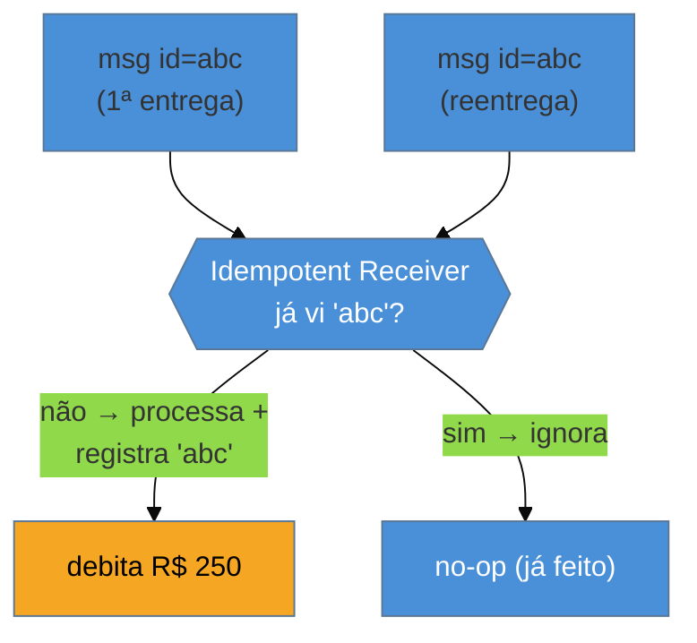

# Idempotent Receiver

> [!abstract] TL;DR
> A entrega confiável de mensagens é, na prática, **at-least-once**: o broker garante que a mensagem chega,
> mas pode entregá-la **mais de uma vez** (reentrega após falha, [[11 - Competing Consumers|competing consumers]]). Logo, o consumidor precisa ser **idempotente** — processar a **mesma** mensagem duas vezes
> deve ter o **mesmo** efeito que processá-la uma vez. Três estratégias: **deduplicar por message id** (o
> *inbox pattern*: guardo os ids já processados e ignoro repetidos), usar **operações naturalmente
> idempotentes** (`saldo = 100` em vez de `saldo += 100`), e **upsert** (inserir-ou-atualizar). O ponto que
> cai em entrevista: **exactly-once é, em grande parte, um mito** na fronteira da mensageria — o combo
> realista é **at-least-once + idempotência = efetivamente-uma-vez**. As armadilhas: **acreditar no
> exactly-once do broker** e **idempotência só em memória** (um set que o restart apaga, deixando duplicatas
> passarem).

## O problema: a mensagem que chega duas vezes

O consumidor processa `CobrarCliente{pedido:1001}`, debita R$ 250 — e cai **antes** de confirmar (`ack`) ao
broker. O broker, sem ver o ack, faz o que foi projetado para fazer: **reentrega** a mensagem (a outro
consumidor, talvez). Esse consumidor debita R$ 250 **de novo**. O cliente foi cobrado duas vezes, e nenhum
sistema fez nada "errado" — a mensageria só cumpriu sua garantia de **não perder** a mensagem.

Esse é o preço da confiabilidade assíncrona: garantir que a mensagem **chega** é mais fácil do que garantir
que ela chega **exatamente uma vez**. A maioria dos sistemas escolhe **at-least-once** (melhor entregar de
novo do que perder), e empurra a responsabilidade da duplicata para o **receptor**. A pergunta que o
padrão responde: como processar a mesma mensagem N vezes sem efeito colateral N vezes?

## A ideia: o mesmo efeito, não importa quantas vezes

O receptor mantém um registro do que **já processou** (por message id) e, ao ver um id repetido, **não faz
nada** — a segunda entrega vira um no-op. É o **inbox pattern**: uma tabela de ids consumidos, checada
dentro da **mesma transação** que aplica o efeito, para que "registrar que processei" e "aplicar o efeito"
sejam atômicos (senão você processa, cai antes de registrar, e a duplicata passa).

## As três estratégias de idempotência

1. **Deduplicação por message id (inbox)** — guarde os ids processados; ignore repetidos. Geral, funciona
   para qualquer operação, mas exige o armazenamento de dedup. É o espelho do
   [[03-Dominios/Engenharia/Comunicação entre Sistemas/4 - Comunicação assíncrona/04 - Outbox e Saga|Outbox]]
   do lado da escrita.
2. **Operação naturalmente idempotente** — projete o efeito para ser repetível: `SET saldo = 100` (idempotente)
   em vez de `saldo = saldo + 100` (não). Aplicar duas vezes não muda o resultado. A mais elegante quando o
   domínio permite.
3. **Upsert** — "inserir se não existe, senão atualizar": processar `CriarPedido{id:1001}` duas vezes resulta
   em um pedido só. A chave de negócio evita a duplicata no nível do dado.

> [!question]- Mas o Kafka não tem "exactly-once semantics" (EOS)? Isso não resolve?
> Só **dentro** do Kafka. O EOS do Kafka (produtor idempotente + transações) garante que uma mensagem lida de
> um tópico, processada e escrita em **outro tópico Kafka** conta uma vez — é exactly-once **Kafka-para-Kafka**.
> No instante em que o seu consumidor toca um sistema **externo** (debita um banco, chama uma API, escreve num
> Postgres), o EOS **não alcança** aquele efeito — e você volta a precisar de idempotência na aplicação. Por
> isso a formulação honesta é: exactly-once **de ponta a ponta é um mito**; o que se consegue é at-least-once
> na entrega + idempotência no receptor = **efetivamente-uma-vez** no efeito observável.

## A lente cross-ferramenta

| Ferramenta | Suporte à idempotência |
| --- | --- |
| **Kafka** | produtor idempotente + transações (EOS **interno**); consumidor externo ainda dedup na app |
| **AWS SQS** | SQS FIFO com `MessageDeduplicationId` (janela de 5 min); SQS padrão exige dedup na app |
| **RabbitMQ** | sem dedup nativo — idempotência é responsabilidade do consumidor (tabela de inbox) |
| **Spring** | `@KafkaListener` + tabela de mensagens processadas; frameworks de inbox |

O padrão consistente: **os brokers ajudam pouco** na dedup ponta a ponta; a idempotência é quase sempre
uma responsabilidade sua, no receptor.

## Armadilhas comuns

> [!warning] Acreditar no exactly-once do broker
> **O que acontece:** o time confia no "exactly-once" do Kafka e não implementa dedup; ao tocar o Postgres, as
> duplicatas aparecem — cobranças e registros dobrados.
> **Por quê:** o exactly-once do broker é **interno** (Kafka→Kafka). Ele não cobre efeitos em sistemas
> externos. Confiar nele como se fosse ponta a ponta é a causa nº 1 de duplicatas em produção.
> **Como evitar:** assuma **at-least-once** na fronteira com qualquer sistema externo e implemente
> idempotência no receptor. Trate o EOS do broker como otimização interna, não como garantia do seu efeito.

> [!warning] Idempotência só em memória
> **O que acontece:** o consumidor guarda os ids processados num `HashSet` em memória; um restart apaga o set,
> e mensagens já processadas antes da queda são reprocessadas.
> **Por quê:** dedup precisa **sobreviver a reinícios** — o estado de "o que já processei" tem que ser tão
> durável quanto o efeito que ele protege. Memória volátil não é dedup, é uma ilusão de dedup.
> **Como evitar:** persista o registro de ids processados (tabela de inbox), e cheque-o **na mesma transação**
> que aplica o efeito. Atomicidade entre "marquei como processado" e "apliquei" é o que fecha a janela.

> [!warning] Chave de dedup fraca ou janela curta
> **O que acontece:** deduplica-se por uma chave de negócio que **colide** (dois pedidos legítimos com a
> mesma chave viram um), ou a janela de dedup expira antes de a reentrega chegar (SQS FIFO: 5 min) e a
> duplicata passa.
> **Por quê:** dedup depende de um identificador **verdadeiramente único** e de uma janela **maior** que o
> atraso máximo de reentrega. Chave fraca descarta mensagens válidas; janela curta deixa duplicatas passar.
> **Como evitar:** use um **message id único e estável** (gerado na origem, não derivado de conteúdo
> ambíguo); dimensione a janela de dedup acima do pior atraso de reentrega esperado.

## Como explicar em inglês

> "Reliable delivery is really at-least-once: the broker guarantees the message arrives but may deliver it
> more than once — redelivery after a failure, or competing consumers. So the receiver must be idempotent:
> processing the same message twice has the same effect as once. Three strategies: deduplicate by message id —
> the inbox pattern, where you store processed ids and skip repeats — use naturally idempotent operations like
> `set balance = 100` instead of `balance += 100`, and upsert. The interview point is that exactly-once is
> largely a myth at the messaging boundary: Kafka's exactly-once is internal, Kafka-to-Kafka, and the moment
> you touch an external system it doesn't cover that effect, so you need idempotency anyway. The honest
> formula is at-least-once delivery plus an idempotent receiver equals effectively-once. The traps are
> trusting the broker's exactly-once end to end, and doing dedup only in memory, where a restart wipes the set
> and duplicates slip through — the processed-id record must be persisted and checked in the same transaction
> as the effect."

| PT | EN |
| --- | --- |
| receptor idempotente | idempotent receiver |
| entrega ao menos uma vez | at-least-once delivery |
| efetivamente uma vez | effectively-once |
| deduplicação (inbox) | deduplication (inbox) |
| operação naturalmente idempotente | naturally idempotent operation |
| inserir-ou-atualizar | upsert |
| janela de deduplicação | deduplication window |

## O que vem a seguir

Idempotência protege o **efeito** contra duplicatas. Falta a outra metade da confiabilidade: garantir que a
mensagem **não se perca** quando o broker ou o consumidor falham — e definir para onde vai a mensagem que
**nunca** consegue ser processada (a poison message).

- [[13 - Guaranteed Delivery + Dead Letter Channel]] — durabilidade da mensagem e o destino do que falha.
- [[11 - Competing Consumers]] — a fonte das duplicatas que a idempotência resolve.
- [[14 - Message Bus × Message Broker]] — a topologia que fecha a família.

## Veja também

- [[03-Dominios/Engenharia/Comunicação entre Sistemas/4 - Comunicação assíncrona/04 - Outbox e Saga|Comunicação — Outbox e Saga]] — o lado da escrita (Outbox) e a idempotência em sagas.
- [[03-Dominios/Engenharia/Auth e Identidade/index|Auth e Identidade]] — chaves de idempotência em APIs (Idempotency-Key), o mesmo princípio no HTTP.

## Fontes

- **Gregor Hohpe & Bobby Woolf** — *Enterprise Integration Patterns* (2004) — Idempotent Receiver, Guaranteed Delivery.
- **Gregor Hohpe** — [*Idempotent Receiver*](https://www.enterpriseintegrationpatterns.com/patterns/messaging/IdempotentReceiver.html) — a definição canônica.
- **Confluent** — [*Exactly-Once Semantics*](https://www.confluent.io/blog/exactly-once-semantics-are-possible-heres-how-apache-kafka-does-it/) — o alcance (e os limites) do EOS do Kafka.
