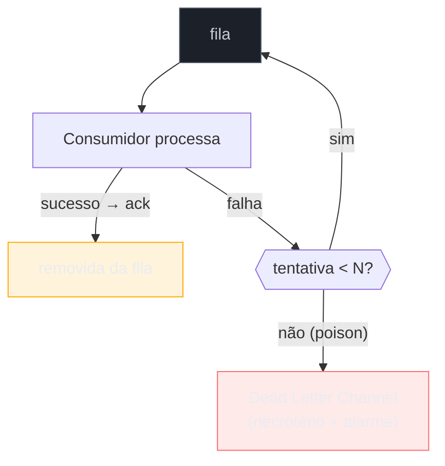

# Guaranteed Delivery + Dead Letter Channel

> [!abstract] TL;DR
> **Guaranteed Delivery** garante que a mensagem **sobrevive a falhas** — o broker a **persiste em disco** e só a descarta após confirmação (`ack`), de modo que um crash não a perde. É o que transforma mensageria de "melhor esforço" em **confiável**, ao custo de throughput (escrever em disco custa). O **Dead Letter Channel** é o complemento: para onde vai a mensagem que **não pôde** ser entregue ou processada após N tentativas — o "necrotério" que impede que uma mensagem **envenenada** (poison message) ou seja **perdida em silêncio**, ou **trave** a fila para sempre. A dupla resolve as duas pontas da confiabilidade: não perder (Guaranteed Delivery) e não travar (Dead Letter). As armadilhas: **DLQ sem monitoramento** (mensagens morrem caladas, descobertas quando um relatório não fecha) e **retry infinito** de poison message.

## O problema: a mensagem não pode sumir — nem travar tudo

Duas falhas ameaçam a confiabilidade da mensageria, e elas puxam para lados opostos.

A primeira: **perder** a mensagem. O broker recebe `PagamentoConfirmado`, guarda em memória para ir rápido — e **cai**. A mensagem evapora; o pagamento confirmado nunca chega ao faturamento. Confiabilidade exige que a mensagem **sobreviva** a quedas.

A segunda: **travar** por causa de uma mensagem ruim. Chega uma `CobrarCliente` malformada que o consumidor **nunca** consegue processar (dá exceção sempre). O broker reentrega, o consumidor falha, reentrega de novo… um **loop infinito** que ocupa o consumidor e — em canais ordenados — **bloqueia** todas as mensagens atrás dela. Confiabilidade também exige uma **saída** para o que não dá para processar.

Guaranteed Delivery resolve a primeira; Dead Letter Channel resolve a segunda.

## Guaranteed Delivery: persistir para não perder

O mecanismo é direto: o broker **grava a mensagem em disco** (armazenamento durável) **antes** de confirmar o recebimento ao produtor, e só a **remove** depois que o consumidor confirma (`ack`) o processamento. Entre esses dois pontos, a mensagem está segura — um crash do broker a recupera do disco no restart. É o mesmo princípio de durabilidade de um [[03-Dominios/Ciência/Banco de Dados/index|banco de dados]] (write-ahead log): persistir antes de confirmar. O custo é **throughput**: escrever em disco é mais lento que manter em memória, e a durabilidade se paga em latência.

## Dead Letter Channel: o destino do que falha

A mecânica: em caso de falha, o broker **reentrega** (bom para falhas **transitórias** — o banco piscou, a rede caiu). Mas com um **limite**: após N tentativas, a mensagem é considerada **poison** (o problema é nela, não transitório) e desviada para o **Dead Letter Channel** — uma fila separada onde ela **aguarda análise** em vez de ser perdida ou reentregue eternamente. Retry cuida do transitório; DLQ cuida do permanente.

> [!question]- Qual a diferença entre Dead Letter Channel e Invalid Message Channel?
> São primos com causas diferentes. O **Invalid Message Channel** ([[03 - Message Channel]]) é para mensagens que chegam **malformadas/inválidas** do ponto de vista da **aplicação** (não desserializa, viola o contrato) — o consumidor as rejeita na entrada. O **Dead Letter Channel** é mais amplo e frequentemente do **sistema de mensageria**: mensagens que não puderam ser **entregues** (destino inexistente, expiração, fila cheia) **ou** que falharam no processamento após N retries. Na prática moderna (RabbitMQ DLX, SQS redrive), o Dead Letter Channel absorve os dois papéis — o importante é que exista **um lugar** para a mensagem-problema, com **alarme**.

## A lente cross-ferramenta

| Ferramenta | Guaranteed Delivery | Dead Letter Channel |
| --- | --- | --- |
| **JMS** | `DeliveryMode.PERSISTENT` | fila DLQ configurada no provider |
| **RabbitMQ** | filas + mensagens `durable` | Dead Letter Exchange (DLX) + TTL/max-retries |
| **Kafka** | retenção em log (persistente por padrão) + réplicas | tópico DLQ (via Kafka Connect / Streams) |
| **AWS SQS** | durabilidade gerenciada (multi-AZ) | redrive policy → DLQ após `maxReceiveCount` |

Note que o **Kafka** é durável por natureza (o log em disco replicado *é* o armazenamento), enquanto no **JMS/RabbitMQ** a durabilidade é uma **opção** que você liga (e paga) por mensagem/fila.

## Armadilhas comuns

> [!warning] DLQ sem monitoramento (o necrotério esquecido)
> **O que acontece:** as mensagens-problema vão para a DLQ silenciosamente; ninguém olha; semanas depois, um relatório financeiro não fecha e descobre-se 4.000 pagamentos parados na dead letter. **Por quê:** a DLQ **impede a perda**, mas não **avisa**. Uma mensagem na DLQ é um erro de negócio parado — se ninguém monitora, o erro fica invisível até causar dano, e a "rede de segurança" vira um buraco negro. **Como evitar:** **alarme** sobre profundidade > 0 da DLQ (métrica + alerta); um processo (manual ou automático) para inspecionar, corrigir e **reprocessar** (redrive) as mensagens. DLQ sem monitoramento é quase tão ruim quanto perder a mensagem.

> [!warning] Retry infinito da poison message
> **O que acontece:** sem limite de tentativas, uma mensagem que **sempre** falha é reentregue para sempre — ocupando o consumidor e, num canal ordenado, **bloqueando** tudo atrás dela. **Por quê:** reentrega é ótima para falha **transitória**, péssima para falha **permanente** (poison). Sem um `maxReceiveCount`/limite de retry, o broker não sabe distinguir os dois e insiste eternamente. **Como evitar:** **sempre** um limite de tentativas + DLQ como destino após o limite. Idealmente com **backoff** entre tentativas (dá tempo para o transitório se resolver) e a poison indo para a DLQ depois.

> [!warning] Durabilidade errada para a carga
> **O que acontece:** liga-se persistência em disco para um fluxo de telemetria de altíssimo volume onde perder uma amostra é irrelevante — e o throughput despenca; ou o oposto: mensagem crítica de pagamento enviada como não-persistente e perdida num crash. **Por quê:** Guaranteed Delivery é um **trade-off** durabilidade × throughput. Aplicá-lo uniformemente ignora que fluxos diferentes têm exigências diferentes de perda aceitável. **Como evitar:** decida a durabilidade **por fluxo**: persistente para o que não pode perder (pagamentos, pedidos); não-persistente/best-effort para o que tolera perda em troca de velocidade (métricas, logs).

## Como explicar em inglês

> "Guaranteed Delivery makes the message survive failures — the broker persists it to disk and only discards it after an ack, so a crash doesn't lose it. That's what turns messaging from best-effort into reliable, at a throughput cost, since writing to disk is slower. The Dead Letter Channel is the complement: where a message goes when it can't be delivered or processed after N attempts — the morgue that stops a poison message from being silently lost or blocking the queue forever. Retry handles transient failures; after a limit, the poison message moves to the DLQ. The two together solve both ends of reliability: don't lose, and don't hang. The traps are a DLQ nobody monitors — messages die silently until a report doesn't reconcile — so you alarm on DLQ depth and have a redrive process; and infinite retry of a poison message, which you fix with a max-retry limit and backoff. And durability is a per-flow decision: persistent for payments, best-effort for telemetry."

| PT | EN |
| --- | --- |
| entrega garantida | guaranteed delivery |
| fila de mensagens mortas | dead letter queue |
| mensagem venenosa | poison message |
| falha transitória × permanente | transient vs permanent failure |
| limite de tentativas | max retries |
| recuo exponencial | exponential backoff |
| reprocessar (redrive) | redrive / reprocess |

## O que vem a seguir

Fecha a confiabilidade — não perder (Guaranteed Delivery) e não travar (Dead Letter). Falta a peça que amarra a família: a **topologia** que conecta tudo. Broker central ou barramento distribuído? E o que a ascensão e queda do ESB nos ensinou sobre onde colocar a inteligência? A última nota fecha o catálogo com o mapa-de-escolha.

- [[14 - Message Bus × Message Broker]] — a topologia da integração e a lição final do ESB; fecha a família.
- [[12 - Idempotent Receiver]] — o que torna a reentrega segura.
- [[11 - Competing Consumers]] — a poison message que trava um consumidor.

## Veja também

- [[03-Dominios/Engenharia/Comunicação entre Sistemas/4 - Comunicação assíncrona/03 - Garantias de entrega e ordenação|Comunicação — garantias de entrega]] — durabilidade, ack e reentrega pela ótica de infra (o aprofundamento).
- [[03-Dominios/Ciência/Sistemas Operacionais/12 - Journaling, consistência e durabilidade|Journaling e durabilidade]] — persistir-antes-de-confirmar (write-ahead), o mesmo princípio no nível do SO/FS.

## Fontes

- **Gregor Hohpe & Bobby Woolf** — *Enterprise Integration Patterns* (2004) — Guaranteed Delivery, Dead Letter Channel, Invalid Message Channel.
- **Gregor Hohpe** — [*Dead Letter Channel*](https://www.enterpriseintegrationpatterns.com/patterns/messaging/DeadLetterChannel.html) e [*Guaranteed Delivery*](https://www.enterpriseintegrationpatterns.com/patterns/messaging/GuaranteedMessaging.html) — as definições canônicas.
- **AWS** — [*Amazon SQS dead-letter queues*](https://docs.aws.amazon.com/AWSSimpleQueueService/latest/SQSDeveloperGuide/sqs-dead-letter-queues.html) — redrive policy e `maxReceiveCount` na prática.
