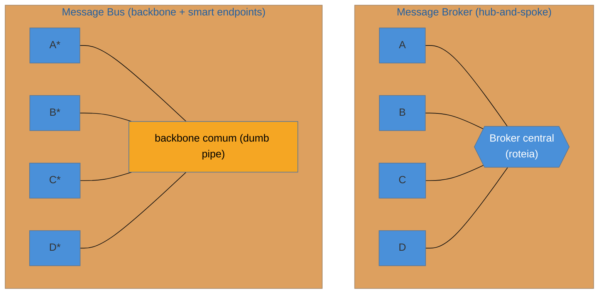

# Message Bus × Message Broker

> [!abstract] TL;DR
> A última decisão do EIP é a **topologia**: como todos os sistemas se conectam. O **Message Broker** é o
> modelo **hub-and-spoke** — um mediador **central** recebe de todos e roteia para todos; cada sistema
> conhece só o broker (desacoplamento máximo), mas o hub é um **ponto central** que, se acumular
> inteligência, vira gargalo. O **Message Bus** é um **backbone comum** onde **endpoints inteligentes** se
> plugam por uma interface compartilhada e mínima — mais distribuído, o "cano" é fino. A história que
> costura esta nota é a **ascensão e queda do ESB**: ele pôs roteamento, transformação e regra de negócio no
> barramento central e **afundou** sob o próprio peso, deixando a lição que atravessa toda a família —
> **"smart endpoints, dumb pipes"**. Hoje: **brokers leves** (RabbitMQ, que medeia) × **logs distribuídos**
> (Kafka, um backbone burro com consumidores espertos). Esta nota **fecha a família** com um mapa-de-escolha
> de todos os padrões.

## O problema: como conectar N sistemas sem virar um monólito

Você tem os padrões — canais, roteadores, tradutores, endpoints confiáveis. Falta a pergunta de mais alto
nível: qual a **forma** da malha de integração? Duas topologias respondem, e a diferença é **onde mora a
inteligência**.

## Broker (hub-and-spoke) × Bus (backbone)

- **Message Broker** — um **mediador central** recebe todas as mensagens e as roteia aos destinos. Cada
  sistema fala **só** com o broker, ignorante dos demais — desacoplamento máximo e um lugar único para
  aplicar roteamento e monitoramento. O risco: o hub é **central** (ponto único de falha) e **tenta** atrair
  inteligência (roteamento complexo, transformação, regra) — e aí vira gargalo.
- **Message Bus** — um **backbone** compartilhado (transporte + um modelo canônico **mínimo**) onde cada
  endpoint é **inteligente** e autônomo. Não há um cérebro central; a lógica está distribuída nas pontas. O
  "cano" só transporta.

A distinção não é binária na prática (um broker pode ser mantido burro; um bus tem algum mediador), mas o
**eixo** é claro: **quanta inteligência você coloca no meio**.

## A ascensão e queda do ESB — a lição da família

Nos anos 2000, o **Enterprise Service Bus (ESB)** foi a resposta dominante: um barramento central que
faria **tudo** — roteamento, transformação, orquestração, até regra de negócio. Parecia elegante:
centralize a integração num produto, e os sistemas só se plugam. Na prática, o ESB **afundou** sob o
próprio peso — virou um **monólito de integração** que todo time precisava mudar, um ponto único de falha,
e o gargalo organizacional que **impedia** a autonomia que deveria entregar.

A crítica de **Fowler & Lewis (2014)** cristalizou o aprendizado num princípio que já apareceu em cada nota
desta família: **"smart endpoints and dumb pipes"** — a inteligência mora nos **serviços** (endpoints); o
meio de transporte é **burro** (só roteia). Toda armadilha "God X" que vimos (God Router, God Transformer,
god-schema canônico) é uma instância local da mesma doença: **centralizar inteligência no cano**. O ESB foi
a versão macro.

> [!question]- Então o Kafka é um broker ou um bus? E por que isso importa?
> O Kafka é instrutivo porque puxa para o lado **bus**. Um broker clássico (RabbitMQ) é um **mediador ativo**:
> roteia, empurra, aplica lógica de entrega — inteligência no meio. O Kafka é mais um **backbone burro**: um
> **log distribuído** que só **guarda e serve** mensagens em ordem; toda a inteligência (roteamento por
> consumo, transformação, agregação) fica nos **consumidores** (Kafka Streams, aplicações). Isso é "dumb pipe,
> smart endpoints" no design do produto — e é parte de por que o Kafka escalou onde ESBs travaram: o backbone
> não vira gargalo de lógica porque **não tem** lógica. Importa porque a escolha broker × bus é, no fundo, a
> escolha de **onde** você vai deixar a complexidade crescer.

## A lente cross-ferramenta

| Modelo | Exemplos | Inteligência |
| --- | --- | --- |
| **Broker (hub ativo)** | RabbitMQ, ActiveMQ, IBM MQ | no broker (roteamento, entrega) — mantê-lo magro é disciplina |
| **ESB (broker gordo)** | Mule ESB, Oracle SB, WSO2 | **no barramento** (roteamento+transformação+regra) — o anti-modelo |
| **Bus/backbone (dumb pipe)** | Kafka, Redpanda | nos endpoints (consumidores espertos) |
| **Gerenciado** | AWS SNS+SQS, EventBridge | híbrido; EventBridge roteia (broker), SQS transporta (pipe) |

## Armadilhas comuns

> [!warning] O broker central que reencarna o ESB
> **O que acontece:** começa como um broker simples de roteamento e, com o tempo, acumula regras, transformações
> e orquestração — até virar um monólito central que todo time teme mudar.
> **Por quê:** o hub-and-spoke tem gravidade: por estar no centro, ele **atrai** responsabilidade. Sem
> disciplina, ele reencena a trajetória do ESB — ponto único de falha e gargalo de mudança.
> **Como evitar:** mantenha o broker **magro** (transporte + roteamento simples). Roteamento complexo e
> orquestração vão para **serviços dedicados** (um Process Manager explícito), não para dentro do broker.

> [!warning] Lógica de negócio no cano
> **O que acontece:** regra de negócio ("clientes VIP têm frete grátis") acaba escrita numa rota de integração
> no barramento, em vez de no serviço de pedidos.
> **Por quê:** é a violação direta de "smart endpoints, dumb pipes". Regra no cano acopla o domínio à camada
> de transporte, espalha a lógica de negócio para um lugar que ninguém associa a ela, e torna o barramento um
> ponto de mudança compartilhado.
> **Como evitar:** o cano **transporta e roteia**; a regra de negócio mora no **endpoint** (serviço) dono
> daquele domínio. Se uma rota tem `if` de negócio, ele está no lugar errado.

> [!warning] Escolher a topologia errada para a necessidade
> **O que acontece:** sobe-se um Kafka (com toda a complexidade operacional de um log distribuído) para
> conectar três serviços com baixo volume — ou o oposto, um único RabbitMQ frágil no caminho de um fluxo de
> altíssimo throughput com replay.
> **Por quê:** broker leve e backbone distribuído resolvem problemas de **escala e semântica** diferentes.
> Kafka brilha em alto volume, replay e múltiplos consumidores; um broker de fila brilha em roteamento
> flexível e trabalho transacional de volume moderado. Errar cobra em complexidade ou em limite.
> **Como evitar:** escolha pela **carga real** — volume, necessidade de replay, número de consumidores,
> flexibilidade de roteamento. Não por moda; o Kafka não é default universal, nem o RabbitMQ é sempre "simples
> demais".

## Como escolher — mapa da família Acesso... digo, EIP

Fechando o catálogo, o roteiro de decisão que amarra os 14 padrões:

- **O que viaja?** → [[02 - Message|Message]]: comando (faça), documento (dado) ou evento (fato)? Isso decide o acoplamento.
- **Para quantos?** → [[03 - Message Channel|Channel]]: um só executa → **fila** (point-to-point); todos observam → **tópico** (pub-sub).
- **Preciso decidir o caminho?** → [[05 - Content-Based Router + Message Filter|Router/Filter]]: um destino pelo conteúdo, ou descartar o irrelevante.
- **É composto / vai a vários?** → [[06 - Splitter + Aggregator|Splitter/Aggregator]] (quebra/junta) e [[07 - Recipient List + Scatter-Gather + Resequencer|Scatter-Gather]] (pergunta a vários).
- **Os formatos divergem?** → [[08 - Message Translator + Normalizer|Translator]]; muitos sistemas → [[09 - Canonical Data Model|Canonical Model]] (mínimo, por contexto!).
- **Como recebo e escalo?** → [[10 - Consumers - Polling × Event-Driven|Polling × Event-Driven]] + [[11 - Competing Consumers|Competing Consumers]] (particione por chave para manter ordem).
- **E as falhas?** → [[12 - Idempotent Receiver|Idempotent Receiver]] (duplicatas) + [[13 - Guaranteed Delivery + Dead Letter Channel|Guaranteed Delivery + DLQ]] (não perder, não travar).
- **Que topologia?** → **esta nota**: broker (hub) × bus (backbone) — e **inteligência nas pontas, sempre**.

## Como explicar em inglês

> "The last EIP decision is topology: how everything connects. A Message Broker is hub-and-spoke — a central
> mediator receives from all and routes to all, so each system only knows the broker, maximum decoupling, but
> the hub is a central point that turns into a bottleneck if it accumulates intelligence. A Message Bus is a
> shared backbone where smart endpoints plug in through a minimal common interface — more distributed, a thin
> pipe. The story tying this together is the rise and fall of the ESB: it put routing, transformation, and
> business logic in the central bus and collapsed under its own weight, leaving the lesson that runs through
> the whole family — smart endpoints, dumb pipes. Every 'God' trap we saw is a local version of putting
> intelligence in the pipe. Today it's lightweight brokers like RabbitMQ that mediate versus distributed logs
> like Kafka, a dumb backbone with smart consumers — which is part of why Kafka scaled where ESBs stalled. So
> choose the topology by your real load, and always keep the business logic in the endpoints, never in the
> pipe."

| PT | EN |
| --- | --- |
| barramento de mensagens | message bus |
| corretor / mediador | broker / mediator |
| hub central (hub-and-spoke) | hub-and-spoke |
| backbone / espinha dorsal | backbone |
| pontas inteligentes, canos burros | smart endpoints, dumb pipes |
| log distribuído | distributed log |
| ponto único de falha | single point of failure |

## O que vem a seguir

Isto **fecha a família Integração Empresarial (EIP)** — dos blocos base (Message, Channel, Pipes and
Filters) ao roteamento e transformação, aos endpoints e à confiabilidade, até a topologia. Você tem o
vocabulário de Hohpe & Woolf como catálogo de consulta, com a lente Camel/Spring Integration e o fio
condutor "smart endpoints, dumb pipes". A próxima família do galho-pai leva a integração para o presente:
os **Padrões de Eventos** (Event Sourcing, CQRS, Saga, Outbox) — onde a mensagem deixa de ser transporte e
vira a **fonte de verdade**.

- [[03-Dominios/Engenharia/Design de Software/Padrões de Projeto/index|Padrões de Projeto]] — o galho-pai; a próxima família é Arquitetura de Eventos.
- [[01 - Panorama da integração]] — reler o mapa da família agora que todas as peças existem.
- [[03-Dominios/Engenharia/Comunicação entre Sistemas/4 - Comunicação assíncrona/05 - Legado e padrões enterprise|Comunicação — ESB e legado]] — a queda do ESB pela ótica de infra (o aprofundamento).

## Veja também

- [[03-Dominios/Engenharia/Comunicação entre Sistemas/index|Comunicação entre Sistemas]] — brokers concretos (Kafka, RabbitMQ) e a decisão de infra.
- [[03-Dominios/Engenharia/Design de Software/Padrões de Projeto/Acesso a Dados/15 - Polyglot persistence e materialized views|Polyglot persistence]] — a mesma tensão entre centralizar e distribuir, no acesso a dados.

## Fontes

- **Gregor Hohpe & Bobby Woolf** — *Enterprise Integration Patterns* (2004) — Message Broker, Message Bus.
- **Gregor Hohpe** — [*Message Broker*](https://www.enterpriseintegrationpatterns.com/patterns/messaging/MessageBroker.html) e [*Message Bus*](https://www.enterpriseintegrationpatterns.com/patterns/messaging/MessageBus.html) — as definições canônicas.
- **Martin Fowler & James Lewis** — [*Microservices*](https://martinfowler.com/articles/microservices.html) (2014) — "smart endpoints and dumb pipes" e a crítica ao ESB.
