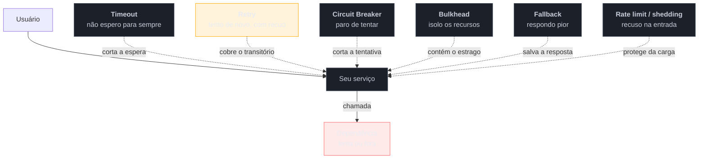

# Panorama da resiliência

> [!abstract] TL;DR
> Num monólito, ou o sistema está no ar ou não está. Distribuído, ele fica **meio no ar** — e esse estado intermediário é o que os padrões desta família administram. O inimigo não é a dependência que **cai**: é a que fica **lenta**, porque a lentidão consome recursos do chamador até que ele também pare, e a falha sobe a cadeia até o usuário. Cada padrão aqui corta essa corrente num ponto — e **nenhum é de graça**. A lente da família é essa: todo padrão de resiliência é uma escolha sobre **o que sacrificar para não cair inteiro**, e sobre **quem paga a conta**.

> [!info] O recorte desta família
> Esta é a família mais coberta do vault, e a redundância é deliberada — um catálogo de padrões precisa ter uma entrada para "Circuit Breaker", não um ponteiro. Mas o recorte é estreito: aqui está **o trade-off explícito de cada padrão**. *Quanto aguenta* está em [[03-Dominios/Engenharia/Arquitetura/System Design/3 - Padrões recorrentes/05 - Circuit Breaker e resiliência|System Design 3-05]]; *como tunar, operar e testar* em [[03-Dominios/Engenharia/Operação/3 - Rodar em produção/06 - Resiliência operacional|Operação 3-06]]; *qual serviço gerenciado faz isso* em [[03-Dominios/Tecnologia/Cloud/20 - Resiliência e continuidade/index|Cloud 20]]; *como migrar com Strangler Fig e ACL* na [[03-Dominios/Engenharia/Arqueologia e Restauração de Software/index|Arqueologia]].

## O serviço que não caiu — e derrubou todo o resto

O serviço de recomendação ficou lento. Não caiu: passou a responder em oito segundos em vez de oitenta milissegundos.

A página de produto chama recomendação. Cada requisição de página passou a ocupar uma thread por oito segundos em vez de por um décimo de segundo — **oitenta vezes mais tempo**. Com o mesmo tráfego de sempre, o pool de threads da página de produto encheu em menos de um minuto.

Cheio o pool, a página de produto parou de responder — inclusive para requisições que **não precisavam** de recomendação. O balanceador marcou as instâncias como não saudáveis e tirou-as de rotação, o que concentrou o tráfego nas restantes, que encheram mais rápido. Em quatro minutos, a loja inteira estava fora do ar por causa de um serviço **secundário**, que continuava respondendo — só que devagar.

Duas lições estão nessa cena, e elas organizam a família toda.

**A primeira: a lentidão é pior que a queda.** Uma dependência que recusa conexão devolve erro em milissegundos, e o chamador segue em frente. Uma dependência lenta **retém** os recursos do chamador — threads, conexões, memória de requisições em voo — e é essa retenção que propaga a falha. Nygard nomeia isso: os pontos de integração são a origem da maioria dos incidentes, e o mecanismo é quase sempre **thread bloqueada**, não erro.

**A segunda: sistemas distribuídos falham em cascata.** A falha não fica onde nasceu; ela sobe pela cadeia de chamadas, e cada camada que não se defende repassa e amplifica.

## Falha parcial: o modo que o monólito não tinha

Num processo único, uma chamada de função ou retorna ou lança exceção — e você sabe imediatamente qual. Atravessando a rede, surgem estados que não existiam:

- a requisição **não chegou**;
- chegou, foi executada, e a **resposta** se perdeu (você não sabe se o efeito ocorreu);
- está demorando — e você **não consegue distinguir** "lento" de "nunca vai responder";
- responde, mas com dados velhos de uma réplica atrasada.

O terceiro é o que dá origem a esta família inteira: **não há como saber se vale a pena continuar esperando.** Todo padrão aqui é, no fundo, uma heurística para decidir isso sem informação completa — e é por isso que todos erram em algum caso, e por isso que todos custam algo.

## O mapa: onde cada padrão corta a corrente

O âmbar no Retry é intencional: é o único padrão do mapa que **piora** o problema quando mal configurado — todos os outros, no pior caso, são inúteis; o retry ingênuo transforma um serviço fraco num serviço morto.

Os padrões se dividem por **para onde olham**: Timeout, Retry, Circuit Breaker e Fallback olham para **fora** (protegem você da sua dependência); Bulkhead, Rate Limiting e Load Shedding olham para **dentro** (protegem você de quem te chama, e de você mesmo).

## A lente: o que se sacrifica, e quem paga

Nenhum padrão desta família é gratuito. Cada um compra sobrevivência com uma moeda, e vale saber qual antes de adotar:

| Padrão | O que sacrifica | Quem paga |
| --- | --- | --- |
| **Timeout** | requisições que teriam sucesso se esperassem mais | o usuário daquela requisição |
| **Retry** | latência do caso ruim; **amplifica carga** | o alvo já fraco, e o usuário que espera |
| **Circuit Breaker** | requisições que talvez funcionassem | usuários durante a janela aberta |
| **Bulkhead** | utilização de recursos (capacidade ociosa reservada) | o orçamento de infraestrutura |
| **Fallback** | **correção** — você responde pior de propósito | o usuário, muitas vezes sem saber |
| **Rate limiting** | clientes legítimos que passaram da cota | os clientes na cauda da distribuição |
| **Load shedding** | requisições escolhidas para morrer | quem tiver menor prioridade |
| **Cache-aside** | frescor do dado | quem lê algo desatualizado |

> [!question]- Se todos custam algo, qual o critério para adotar?
> A pergunta certa não é "este padrão é bom?", é **"o que acontece hoje, sem ele, quando esta dependência falha?"**. Se a resposta for "degrada uma funcionalidade", talvez não valha a complexidade. Se for "derruba o sistema inteiro", como na cena de abertura, o sacrifício é obviamente melhor que a alternativa. O erro de julgamento mais comum é adotar por prestígio — porque circuit breaker é o que times maduros usam — em vez de por análise da falha concreta. E há um custo que não aparece na tabela: **cada padrão é mais um mecanismo que pode ter bug e que precisa ser testado**, inclusive no caminho de falha, que é o único caminho em que ele roda.

## A soma dos sacrifícios

Aqui está o erro mais caro da família, e ele não é sobre nenhum padrão individual: **os sacrifícios se somam, e quase ninguém soma.**

Três exemplos que aparecem em incidentes reais:

- **Retry em camadas.** O cliente tenta 3 vezes, o gateway tenta 3, o serviço tenta 3. Uma requisição do usuário vira **27** no alvo — exatamente quando ele está mal. Cada camada foi configurada isoladamente, com uma decisão razoável.
- **Timeout mal ordenado.** O chamador tem timeout de 2s e o chamado, de 10s. O chamado continua trabalhando para uma resposta que ninguém vai receber — e retém recursos por 8 segundos inúteis, em cada requisição.
- **Retry mais circuit breaker mal casados.** As retentativas contam como falhas para o breaker e o abrem mais rápido do que o previsto — ou não contam, e o breaker nunca abre porque a camada de retry esconde as falhas dele.

A regra prática: **a ordem de composição importa**, e a convencional é `bulkhead( breaker( retry( timeout( chamada ) ) ) )` — o timeout é o mais interno porque delimita cada tentativa; o retry envolve tentativas; o breaker observa o resultado do conjunto; o bulkhead limita quantos disso existem em paralelo. Trocar essa ordem muda o comportamento de formas não óbvias, e essa é a discussão que a [[14 - Escolher o padrão de resiliência (capstone)|nota de fechamento]] retoma.

## Armadilhas comuns

> [!warning] Proteger-se da queda e não da lentidão
> **O que acontece:** o sistema trata bem `connection refused` e não tem defesa alguma contra respostas de oito segundos — que é o modo de falha que efetivamente derruba tudo. **Por quê:** a queda é o que se imagina ao pensar em falha, e é fácil de simular em teste. A lentidão é mais comum, mais destrutiva e quase nunca testada. **Como evitar:** teste com **latência injetada**, não só com o alvo desligado. E trate `timeout` como configuração obrigatória de toda chamada remota, não como afinação posterior.

> [!warning] Empilhar padrões sem somar os efeitos
> **O que acontece:** retry no cliente, no mesh e na aplicação; breakers em duas camadas; timeouts que se contradizem. Sob incidente, o sistema se comporta de um jeito que ninguém consegue prever, e o mecanismo de defesa vira parte da causa. **Por quê:** cada padrão foi adicionado por um bom motivo local, por pessoas diferentes, em momentos diferentes. **Como evitar:** trate a configuração de resiliência como um **conjunto** — documentada num lugar, com a ordem de composição explícita e os timeouts coerentes de fora para dentro.

> [!warning] Resiliência que nunca roda
> **O que acontece:** o fallback tem um bug, o breaker está configurado com um limiar que nunca é atingido, e ninguém sabe — porque esse código só executa quando algo dá errado, e nada dá errado em teste. **Por quê:** o caminho de falha é, por definição, o caminho não exercitado. Cobertura de teste alta convive perfeitamente com resiliência quebrada. **Como evitar:** exercite a falha de propósito — injeção de falha e latência no ambiente de teste, e experimentos controlados em produção onde houver maturidade. Um mecanismo de resiliência nunca acionado é uma hipótese, não uma proteção.

## Como explicar em inglês

> "In a monolith a call either returns or throws. Across a network you get states that didn't exist before — and the one that causes most outages isn't the dependency going down, it's the dependency going slow. A refused connection fails in milliseconds and you move on; a slow dependency holds your threads, your pool fills up, and you stop serving requests that didn't even need it. That's a cascading failure. Every pattern in this family cuts that chain somewhere, and the thing I'd emphasise is that none of them is free: a timeout sacrifices requests that would have succeeded, a circuit breaker sacrifices requests that might have worked, a bulkhead sacrifices utilisation, a fallback sacrifices correctness. The expensive mistake isn't picking the wrong one — it's stacking several without adding up the sacrifices, like retries at three layers turning one user request into twenty-seven at a service that's already struggling."

| PT | EN |
| --- | --- |
| falha parcial | partial failure |
| falha em cascata | cascading failure |
| ponto de integração | integration point |
| esgotamento de pool | pool exhaustion |
| degradação graciosa | graceful degradation |
| injeção de falha | fault injection |
| amplificação de carga | load amplification |

## O que vem a seguir

O primeiro padrão é também o mais simples e o mais esquecido — e é o que ataca diretamente o mecanismo da cena de abertura: a espera indefinida que retém recursos. Sem ele, nenhum dos outros funciona, porque todos pressupõem que uma tentativa **termina**.

- [[02 - Timeout]] — a defesa mais básica, e o default que derruba sistemas.
- [[03 - Retry]] — o único padrão da família que pode piorar o incidente.
- [[04 - Circuit Breaker]] — parar de bater numa porta que não abre.

## Veja também

- [[03-Dominios/Engenharia/Operação/3 - Rodar em produção/06 - Resiliência operacional|Resiliência operacional]] — como tunar, onde a resiliência mora e como testá-la.
- [[03-Dominios/Engenharia/Arquitetura/System Design/3 - Padrões recorrentes/05 - Circuit Breaker e resiliência|Circuit Breaker e resiliência (System Design)]] — os mesmos padrões pela ótica de escala.
- [[03-Dominios/Engenharia/Design de Software/Padrões de Projeto/index|Padrões de Projeto]] — o galho-pai e as outras cinco famílias.

## Fontes

- **Michael Nygard** — *Release It!* (2ª ed., 2018) — a fonte canônica de *stability patterns* e antipadrões; a análise de pontos de integração e threads bloqueadas.
- **Microsoft** — [*Cloud Design Patterns*](https://learn.microsoft.com/en-us/azure/architecture/patterns/) — o catálogo que dá nome à maioria dos padrões desta família.
- **Netflix Technology Blog** — os escritos sobre Hystrix e tolerância a falhas — a linhagem prática de circuit breaker e bulkhead em produção.
- **Google SRE Book** — [*Addressing Cascading Failures*](https://sre.google/sre-book/addressing-cascading-failures/) — o mecanismo da cascata e as contramedidas.
