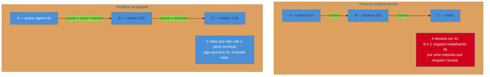

# Timeout

> [!abstract] TL;DR
> A defesa mais simples da família e a mais esquecida — porque o **default de muitas bibliotecas é esperar para sempre**, e "para sempre" é a configuração que derruba sistemas. Sem timeout, uma dependência lenta retém suas threads e conexões até o pool acabar, e a lentidão dela vira indisponibilidade sua. É pré-requisito de todos os outros padrões: retry, circuit breaker e bulkhead pressupõem que uma tentativa **termina**. E há uma versão adulta do padrão que quase ninguém implementa: **propagar o prazo** pela cadeia, em vez de cada serviço ter o seu isoladamente.

> [!info] O recorte desta nota
> Aqui o timeout como **decisão de projeto** e o que ele sacrifica. Como escolher o valor a partir de percentis observados, e como operá-lo, está em [[03-Dominios/Engenharia/Operação/3 - Rodar em produção/06 - Resiliência operacional|Operação 3-06]] ("Timeout: o valor, não o padrão").

## A configuração que ninguém tomou

Você investiga um incidente e procura o timeout da chamada ao serviço de recomendação. Não encontra — não há nenhuma linha configurando isso.

Não é negligência de uma pessoa: é o **default**. Muitos clientes HTTP, drivers e SDKs vêm com timeout de leitura infinito ou muito alto, porque a biblioteca não tem como saber quanto é razoável no seu caso. O resultado é que a decisão mais importante da chamada — *quanto tempo vale a pena esperar* — nunca foi tomada por ninguém, e o sistema herdou "para sempre".

E "para sempre" tem uma consequência mecânica. Cada requisição em espera **ocupa recursos**: uma thread num modelo bloqueante, uma conexão do pool, memória do contexto da requisição. Se a dependência responde em 8 segundos em vez de 80 milissegundos, cada requisição ocupa esses recursos por 100× mais tempo — e o pool, dimensionado para o comportamento normal, enche com o **mesmo tráfego de sempre**.

**O timeout é o que transforma "minha dependência está lenta" em "algumas requisições falham" em vez de "meu serviço parou".**

## A ideia: decidir quando desistir

Um timeout é uma aposta: depois de *t*, a probabilidade de a resposta ainda vir e ser útil é baixa o bastante para valer mais liberar o recurso.

Há mais de um relógio envolvido, e confundi-los é fonte de bug:

| Tipo | O que limita | Sintoma quando falta |
| --- | --- | --- |
| **Conexão** | estabelecer a conexão | trava com host inalcançável ou rede particionada |
| **Leitura / resposta** | esperar os dados depois de conectado | **o caso desta nota** — trava com dependência lenta |
| **Total da requisição** | o tempo da operação inteira, incluindo retries | uma operação "com timeout de 2s" leva 6s após 3 tentativas |
| **Ocioso (pool)** | conexão parada no pool | recursos retidos sem uso |

O terceiro é o que mais surpreende: configurar timeout por tentativa **não** limita o tempo total se houver retry. O usuário espera a soma, e o orçamento real precisa ser pensado para a operação inteira.

## A versão adulta: propagar o prazo

Numa cadeia A → B → C, cada serviço normalmente tem seu próprio timeout, escolhido isoladamente. Isso produz o desperdício mais comum e menos notado dos sistemas distribuídos:

Em vez de cada serviço perguntar "quanto **eu** espero?", a requisição carrega **quanto tempo ainda resta** — e cada salto passa adiante o saldo. Quem recebe um prazo já vencido nem começa o trabalho.

É o modelo de *deadline* do gRPC (que propaga por padrão) e dos `Context` do Go; em HTTP, exige convenção própria (um header com o prazo restante) e disciplina para respeitá-la. O ganho é grande em sistemas com cadeias profundas: **trabalho que ninguém vai usar deixa de ser feito**, exatamente no momento em que o sistema está sob pressão.

> [!question]- Qual valor devo escolher?
> A regra que evita os dois erros grosseiros: **baseie no percentil observado, não no que parece razoável**. Um timeout abaixo do p99 normal transforma lentidão comum em erro; muito acima dele, deixa de proteger. Um ponto de partida usual é algo entre o p99 e um pequeno múltiplo dele, ajustado pela **importância** da chamada — uma dependência opcional merece timeout agressivo com fallback; uma essencial merece mais paciência. Duas coerências obrigatórias: o timeout de quem chama tem de ser **maior** que o de quem é chamado (senão o interno é inútil), e o orçamento total precisa caber no que o usuário aceita esperar. A afinação fina, com dados reais, é assunto de [[03-Dominios/Engenharia/Operação/3 - Rodar em produção/06 - Resiliência operacional|Operação 3-06]].

## O que se sacrifica

**Requisições que teriam sucesso se esperassem mais.** Toda vez que o timeout dispara numa chamada que responderia em seguida, você transformou lentidão em erro — e quem paga é o usuário daquela requisição específica.

Essa é a assimetria que torna a decisão interessante: o benefício do timeout é **coletivo e invisível** (o sistema continua no ar para todos), e o custo é **individual e visível** (aquele usuário viu um erro). Times sem cultura de resiliência tendem a subir timeouts depois de reclamações pontuais, até que o valor volta a ser efetivamente infinito — desfazendo a proteção uma reclamação por vez.

**Sacrifica também previsibilidade do trabalho já iniciado.** Desistir do lado do cliente **não cancela** o trabalho do lado do servidor, a menos que haja cancelamento explícito. Sem propagação de prazo, o efeito colateral pode ocorrer depois de você ter desistido — e é por isso que timeout e idempotência andam juntos: você não sabe se a operação aconteceu.

## Armadilhas comuns

> [!warning] Confiar no default
> **O que acontece:** nenhuma linha de configuração, e a suposição de que a biblioteca traz algo sensato. Sob lentidão, o pool enche e o serviço para. **Por quê:** o default de muitos clientes é infinito ou muito alto — a biblioteca não conhece seu caso e escolhe não limitar. **Como evitar:** trate timeout explícito como **obrigatório** em toda chamada remota, verificável em revisão. E confira o default de cada cliente que você usa, um por um: eles diferem entre si, e "achei que tinha" é a causa raiz frequente.

> [!warning] Timeout do chamador menor que o do chamado
> **O que acontece:** A desiste em 2s, B continua trabalhando por mais 8s numa resposta que será descartada — retendo recursos de B exatamente quando o sistema está sob estresse. **Por quê:** cada serviço configura o seu isoladamente, sem visão da cadeia. **Como evitar:** os timeouts devem **decrescer** de fora para dentro, e o ideal é propagar o prazo. No mínimo, documente a cadeia e verifique a coerência quando um valor mudar.

> [!warning] Esquecer que retry multiplica o tempo total
> **O que acontece:** a chamada tem timeout de 2s e 3 tentativas. O usuário espera até 6 segundos, e a operação "com timeout de 2s" estoura o orçamento da requisição inteira. **Por quê:** o timeout foi pensado por tentativa; a experiência do usuário depende do total. **Como evitar:** defina um **orçamento total** para a operação e faça o retry respeitá-lo — parar de tentar quando o prazo global acabar, mesmo que restem tentativas. É o assunto direto da próxima nota.

## Como explicar em inglês

> "Timeout is the simplest pattern here and the one most often missing, because a lot of clients default to waiting forever — and forever is the setting that takes systems down. Without it, a slow dependency holds your threads and connections until the pool is exhausted, so their latency becomes your outage. It's also a prerequisite for everything else: retry, circuit breaking and bulkheads all assume an attempt terminates. Two things I'd check in any review. First, timeouts should decrease as you go deeper into the call chain — if the caller gives up at two seconds and the callee waits ten, the callee is doing eight seconds of work nobody will receive. Second, per-attempt timeouts don't bound total time once you add retries, so you want an overall budget for the operation. The grown-up version of the pattern is deadline propagation: the request carries how much time is left, and a service that receives an expired deadline doesn't even start."

| PT | EN |
| --- | --- |
| tempo limite | timeout |
| prazo propagado | deadline propagation |
| orçamento da requisição | request budget |
| esgotamento de pool | pool exhaustion |
| cancelamento | cancellation |
| percentil (p99) | percentile |

## O que vem a seguir

Definido que a espera termina, aparece a pergunta seguinte: quando a tentativa falha, vale tentar de novo? Às vezes sim — e é o único padrão desta família que, mal configurado, **piora** o incidente que deveria conter.

- [[03 - Retry]] — recuo exponencial, jitter e orçamento; por que o retry ingênuo mata o alvo.
- [[04 - Circuit Breaker]] — quando parar de tentar por um tempo.
- [[01 - Panorama da resiliência]] — o mapa e a soma dos sacrifícios.

## Veja também

- [[03-Dominios/Engenharia/Operação/3 - Rodar em produção/06 - Resiliência operacional|Resiliência operacional]] — como escolher o valor a partir de percentis reais.
- [[03-Dominios/Engenharia/Comunicação entre Sistemas/2 - Comunicação síncrona/05 - gRPC — Protobuf, HTTP2 e streaming|gRPC]] — o modelo de deadline propagado por padrão.
- [[03-Dominios/Engenharia/Design de Software/Padrões de Projeto/Arquitetura de Eventos/06 - Idempotent Consumer (Inbox)|Idempotência]] — por que desistir sem saber o resultado exige operação idempotente.

## Fontes

- **Michael Nygard** — *Release It!* (2ª ed., 2018) — timeouts como *stability pattern*, e o antipadrão das threads bloqueadas.
- **Microsoft** — [*Cloud Design Patterns*](https://learn.microsoft.com/en-us/azure/architecture/patterns/) — o catálogo de referência da família.
- **Google SRE Book** — [*Addressing Cascading Failures*](https://sre.google/sre-book/addressing-cascading-failures/) — o papel do timeout na contenção da cascata.
- **gRPC** — [*Deadlines*](https://grpc.io/docs/guides/deadlines/) — a formulação de prazo propagado em vez de timeout local.
