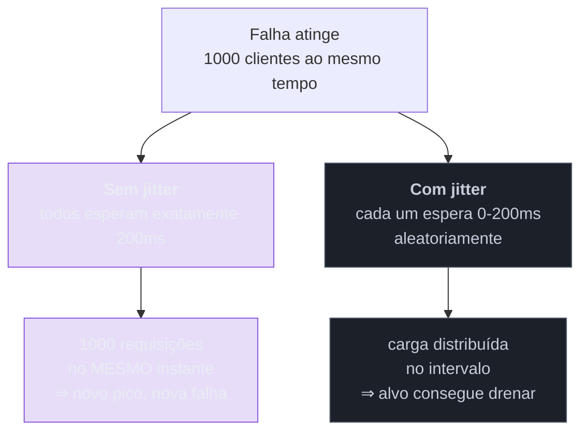

# Retry

> [!abstract] TL;DR
> Falhas transitórias existem — um pacote perdido, uma instância reiniciando, um pico momentâneo — e repetir resolve boa parte delas de graça. É por isso que o retry é o padrão mais adotado da família. Também é o **único que piora o incidente quando mal configurado**: repetir imediatamente contra um serviço sobrecarregado é acrescentar carga exatamente onde ela já é o problema. As três correções que transformam retry em defesa são **recuo exponencial**, **jitter** e **orçamento** — e todas as três costumam faltar. Antes de qualquer uma: retry exige **idempotência**, senão você não está repetindo, está duplicando.

> [!info] O recorte desta nota
> Aqui o retry como decisão de projeto e o que ele sacrifica. **Orçamento de retry na prática, e como observá-lo**, em [[03-Dominios/Engenharia/Operação/3 - Rodar em produção/06 - Resiliência operacional|Operação 3-06]] ("Retry: o orçamento, não só o backoff"). Idempotência do efeito de negócio em [[03-Dominios/Engenharia/Design de Software/Padrões de Projeto/Arquitetura de Eventos/06 - Idempotent Consumer (Inbox)|família 5, nota 06]].

## O retry que derrubou o serviço que tentava salvar

O serviço de pagamento ficou degradado — respondendo com erro em cerca de 20% das requisições, por sobrecarga. Um problema sério, mas parcial: 80% dos clientes ainda eram atendidos.

Todos os chamadores tinham retry: três tentativas, imediatas. Em segundos, cada requisição que falhava virava quatro requisições. O tráfego contra o pagamento **quadruplicou** — não porque chegaram mais usuários, mas porque as falhas viraram tentativas.

Com quatro vezes a carga, a taxa de erro subiu, o que gerou mais retries, o que subiu mais a carga. O serviço saiu de 20% de erro para 100% em menos de dois minutos, e não conseguiu se recuperar sozinho: **cada tentativa de recuperação era imediatamente afogada pelas retentativas acumuladas**. Foi preciso cortar tráfego na borda para que ele voltasse.

Esse é o modo de falha característico do padrão, e ele tem nome: **tempestade de retries**. O mecanismo é perverso — o retry aumenta a carga exatamente na condição em que o alvo está mais fraco, e a defesa se torna a causa.

## O que corrige: recuo, jitter e orçamento

**Recuo exponencial** (*exponential backoff*). Espere mais a cada tentativa: 100 ms, 200 ms, 400 ms, 800 ms. O raciocínio é que se a primeira falhou, a chance de a segunda funcionar logo em seguida é baixa — e dar tempo ao alvo é o que permite que ele se recupere. Sem recuo, você não está tentando de novo: está martelando.

**Jitter** — aleatorizar o intervalo. Esta é a correção que mais falta e a menos intuitiva:

Sem jitter, os clientes que falharam juntos **voltam juntos** — o recuo exponencial apenas move o pico para frente, sincronizado. É um efeito de rebanho: todos os relógios apontam para o mesmo instante. Com aleatorização, a mesma quantidade de tentativas chega distribuída, e o alvo consegue processá-las.

**Orçamento de retry** (*retry budget*). Um teto para a proporção do tráfego que pode ser retentativa — por exemplo, no máximo 10% além das requisições originais. Quando o orçamento estoura, o cliente **para de retentar** e falha direto. É o que impede a espiral da cena de abertura, porque limita a amplificação por construção, independentemente de quantas falhas houver. É a correção mais eficaz e a menos implementada, porque exige estado no cliente em vez de configuração por chamada.

## Transitório × permanente: o que não se deve repetir

Repetir só faz sentido para falhas **transitórias** — aquelas que podem ter sumido quando você tentar de novo. Para falhas permanentes, repetir é dano puro: gasta recursos, aumenta latência e não tem chance de sucesso.

| Repetir | Não repetir |
| --- | --- |
| timeout, conexão recusada, reset | 400 — requisição malformada |
| 429 (respeitando `Retry-After`) | 401 / 403 — credencial ou permissão |
| 503 / 502 — indisponível, gateway | 404 — não existe |
| deadlock ou lock timeout no banco | 422 — regra de negócio recusou |
| erro de rede transitório | qualquer erro determinístico do seu lado |

A regra prática: **repetir erro de infraestrutura, nunca erro de contrato.** Um `400` vai falhar identicamente nas dez tentativas — e, pior, alguns desses erros indicam que **o seu** pedido está errado, então repetir esconde um bug em vez de tratá-lo.

> [!question]- E se eu não souber se a operação aconteceu?
> Esse é o caso mais perigoso, e é comum: você enviou, deu timeout, e **não sabe** se o outro lado executou. Repetir pode duplicar; não repetir pode perder. Não há resposta correta sem informação adicional — e é por isso que **retry pressupõe idempotência**. Com uma operação idempotente (ou com chave de idempotência na chamada externa), repetir é seguro e a dúvida deixa de importar. Sem isso, você está escolhendo entre dois danos, e a escolha deve ser consciente: para leitura, repita; para escrita não idempotente, prefira **falhar e reconciliar** a duplicar um débito.

## O que se sacrifica

**Latência do caso ruim.** Com recuo exponencial e três tentativas, o pior caso soma as esperas mais os timeouts — e o usuário espera tudo isso antes de ver o erro. Um retry generoso pode transformar uma falha rápida de 2s numa falha lenta de 15s, que é uma experiência pior.

**Carga sobre quem já está fraco** — o sacrifício central, e o único da família em que o custo recai sobre **a dependência**, não sobre você. Todos os outros padrões protegem alguém às custas de requisições suas; o retry gasta o recurso do outro. É a razão de ele exigir mais disciplina que os demais.

**Amplificação em cadeia.** Se três camadas retentam três vezes, uma requisição do usuário vira até 27 no alvo. O sacrifício não é linear no número de camadas: é **multiplicativo** — e cada camada foi configurada isoladamente, com uma decisão razoável.

## Armadilhas comuns

> [!warning] Retry em cascata (multiplicação por camada)
> **O que acontece:** cliente, gateway e serviço retentam 3× cada. Uma requisição vira 27 no alvo, exatamente durante o incidente. **Por quê:** cada camada foi configurada por pessoas diferentes, e nenhuma tem visão do total. Localmente, todas parecem prudentes. **Como evitar:** decida em **qual camada** o retry vive — normalmente a mais próxima da falha, ou a borda — e desligue nas outras. Se o mesh já retenta, a aplicação não deve. E propague um marcador de "esta requisição já é uma retentativa" para que camadas superiores não a multipliquem.

> [!warning] Retry de operação não idempotente
> **O que acontece:** o timeout dispara depois que o pagamento foi processado, o cliente retenta e o cliente final é cobrado duas vezes. **Por quê:** o timeout diz que **você** não recebeu resposta, não que o outro lado não executou. Os dois casos são indistinguíveis do lado de fora. **Como evitar:** torne a operação idempotente antes de habilitar retry — chave de idempotência na chamada, ou `upsert` por chave de negócio. Retry sem idempotência não é resiliência, é duplicação com passos extras.

> [!warning] Retry sem teto e sem orçamento
> **O que acontece:** "tenta até conseguir". Sob indisponibilidade prolongada, as tentativas acumulam, filas incham, e o cliente é derrubado pela própria pilha de retries pendentes. **Por quê:** parece a atitude correta — desistir soa como render-se —, e o custo só aparece sob falha longa, que é rara e não testada. **Como evitar:** número máximo de tentativas **e** orçamento sobre o tráfego, sempre. E encaminhe a falha final para algo que a trate — [[06 - Fallback e degradação graciosa|fallback]], fila de reprocessamento ou erro honesto ao usuário. Falhar rápido depois de N tentativas é o comportamento certo; é também o que permite ao [[04 - Circuit Breaker|circuit breaker]] fazer o trabalho dele.

## Como explicar em inglês

> "Retry is the most adopted pattern in this family and the only one that makes an incident worse when it's wrong. If a service is degraded and every caller retries three times immediately, failures become traffic — you've just multiplied load on something that's already struggling, and it can't recover because every recovery attempt gets drowned. Three things fix it. Exponential backoff, so you give the target room. Jitter, which is the one people skip: without it, everyone who failed together retries together, so backoff just moves a synchronised spike. And a retry budget — a cap on what fraction of traffic can be retries — which is the only mechanism that bounds amplification regardless of how bad things get. Before any of that, though, the operation has to be idempotent: a timeout tells you that you didn't get a response, not that the other side didn't execute."

| PT | EN |
| --- | --- |
| retentativa | retry |
| recuo exponencial | exponential backoff |
| aleatorização | jitter |
| orçamento de retentativas | retry budget |
| tempestade de retries | retry storm |
| efeito de rebanho | thundering herd |
| falha transitória | transient failure |

## O que vem a seguir

Retry cobre a falha que passa em segundos. Quando a dependência está fora há minutos, insistir é desperdício — cada tentativa custa um timeout inteiro e falha do mesmo jeito. O próximo padrão observa o histórico e decide parar de tentar por um tempo.

- [[04 - Circuit Breaker]] — falhar rápido enquanto não adianta tentar.
- [[05 - Bulkhead]] — conter o estrago quando a defesa não impediu a falha.
- [[02 - Timeout]] — o pré-requisito: cada tentativa precisa terminar.

## Veja também

- [[03-Dominios/Engenharia/Operação/3 - Rodar em produção/06 - Resiliência operacional|Resiliência operacional]] — o orçamento de retry na prática e como observá-lo.
- [[03-Dominios/Engenharia/Design de Software/Padrões de Projeto/Arquitetura de Eventos/06 - Idempotent Consumer (Inbox)|Idempotent Consumer]] — o pré-requisito de qualquer retry de escrita.
- [[03-Dominios/Engenharia/Comunicação entre Sistemas/3 - Confiabilidade do contrato/01 - Idempotência|Idempotência (Comunicação)]] — a idempotência como propriedade de contrato de API.

## Fontes

- **Michael Nygard** — *Release It!* (2ª ed., 2018) — retry entre os *stability patterns*, e a análise de como ele amplifica falhas.
- **AWS Architecture Blog** — [*Exponential Backoff and Jitter*](https://aws.amazon.com/blogs/architecture/exponential-backoff-and-jitter/) — a demonstração de por que jitter importa mais do que parece.
- **Google SRE Book** — [*Addressing Cascading Failures*](https://sre.google/sre-book/addressing-cascading-failures/) — orçamento de retry e o mecanismo da espiral.
- **Microsoft** — [*Retry pattern*](https://learn.microsoft.com/en-us/azure/architecture/patterns/retry) — a ficha do catálogo Azure, com a distinção transitório × permanente.
