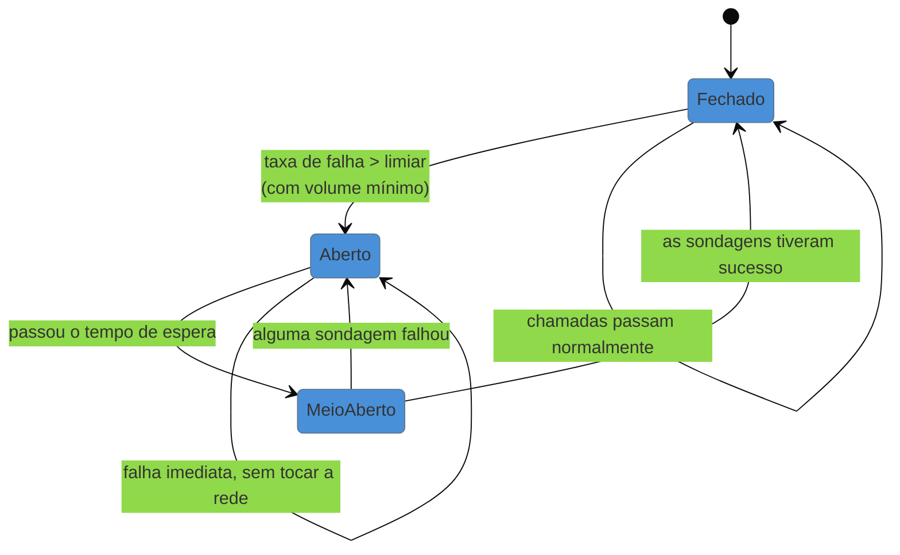

# Circuit Breaker

> [!abstract] TL;DR
> Quando a dependência está fora há minutos, cada tentativa custa um **timeout inteiro** e falha do mesmo jeito — você está gastando recursos para descobrir algo que já sabe. O circuit breaker observa o histórico recente e, ao passar de um limiar, **abre**: as chamadas seguintes falham na hora, sem tocar a rede. Isso protege dois lados — preserva os recursos do chamador e **dá espaço** ao alvo para se recuperar sem ser martelado. O sacrifício é uma aposta estatística: enquanto aberto, ele rejeita requisições que **talvez funcionassem**. E ele só entrega valor real se houver um plano para o que responder quando estiver aberto.

> [!info] O recorte desta nota
> Aqui o padrão como decisão e sua aposta. **Onde tunar os limiares e o custo dos dois erros** em [[03-Dominios/Engenharia/Operação/3 - Rodar em produção/06 - Resiliência operacional|Operação 3-06]]; os **três estados sob a ótica de escala e entrevista** em [[03-Dominios/Engenharia/Arquitetura/System Design/3 - Padrões recorrentes/05 - Circuit Breaker e resiliência|System Design 3-05]].

## Bater numa porta que não abre

O serviço de recomendação está fora há três minutos. Seu timeout está corretamente configurado em dois segundos, então cada requisição de página espera dois segundos, falha, e segue.

Isso parece aceitável até você fazer a conta. Com 500 requisições por segundo, são **mil segundos de espera acumulada por segundo** — mil requisições simultâneas paradas, ocupando threads e conexões, todas destinadas a falhar. O timeout impediu o travamento indefinido, mas não impediu o desperdício: você está pagando o preço máximo da espera, repetidamente, para descobrir a cada vez uma informação que já tem.

E há o efeito do outro lado. Se a dependência está degradada e tentando se recuperar, receber 500 requisições por segundo durante a recuperação é o que a impede de voltar. **Insistir atrasa o retorno de quem você quer que volte.**

A ideia do padrão vem do disjuntor elétrico, e a analogia é boa: ele não conserta o curto — ele **isola o circuito** para que o problema não queime a casa, e permite religar quando a condição mudar.

## Os três estados

**Fechado** — operação normal; as chamadas passam e o breaker apenas **conta** sucessos e falhas numa janela recente.

**Aberto** — o limiar foi ultrapassado. As chamadas falham **imediatamente**, sem tentar a rede. Aqui está o ganho: o custo de uma falha cai de "um timeout" para "praticamente zero", e o alvo deixa de receber tráfego.

**Meio-aberto** — depois de um tempo de espera, o breaker deixa passar **algumas** chamadas de sondagem. Se tiverem sucesso, ele fecha; se falharem, volta a abrir e espera de novo. Esse estado é o que evita o pior comportamento possível: mandar todo o tráfego acumulado de uma vez contra um serviço que acabou de voltar — o que o derrubaria imediatamente.

Dois detalhes que separam uma implementação útil de uma perigosa: o limiar precisa de **volume mínimo** (duas falhas em duas chamadas são 100% de erro e não significam nada), e a janela precisa ser **recente** (deslizante), senão o breaker demora demais para reagir ou para esquecer.

> [!question]- Retry e circuit breaker não fazem a mesma coisa?
> São complementares e atuam em **escalas de tempo diferentes**, o que é a melhor forma de lembrar a distinção. O retry cobre a falha que passa em **milissegundos ou segundos** — um pacote perdido, uma instância reiniciando. O breaker cobre a falha que dura **minutos** — a dependência está fora, e nenhuma quantidade de tentativas ajuda. Usados juntos, a composição usual é retry **dentro** do breaker: cada operação tenta algumas vezes, e o breaker observa o resultado final de cada operação. Se for ao contrário, o retry esconde falhas do breaker e ele nunca abre. Vale também decidir se as tentativas individuais contam como falhas para o breaker — se contarem, ele abre mais cedo do que o configurado sugere.

## O que se sacrifica

**Requisições que talvez funcionassem.** Enquanto está aberto, o breaker rejeita **tudo**, inclusive o que teria sucesso — a dependência pode ter voltado no segundo seguinte à abertura, e ninguém vai descobrir até o tempo de espera terminar. Essa é a aposta: você troca a chance de sucesso pela garantia de não desperdiçar recursos.

E, ao contrário do timeout, o erro aqui **tem dois lados com custos opostos**:

| Erro | O que acontece | Quem paga |
| --- | --- | --- |
| **Abrir cedo demais** (limiar baixo) | rejeita em falhas passageiras normais; funcionalidade cai sem necessidade | usuários que teriam sido atendidos |
| **Abrir tarde demais** (limiar alto) | o desperdício da cena inicial continua; a proteção não age | o sistema inteiro, sob cascata |

Não existe valor universalmente correto — depende de quão custosa é a falha e de quão comum é a instabilidade passageira daquela dependência. É por isso que o padrão exige **observabilidade do próprio breaker**: sem métrica de quantas vezes abriu e por quanto tempo, você não tem como saber em qual dos dois erros está.

**Sacrifica também simplicidade.** É um mecanismo com estado, janela e transições — mais uma coisa que pode ter bug, e que só roda quando algo já está errado.

## Armadilhas comuns

> [!warning] Breaker sem fallback: só troca timeout por erro
> **O que acontece:** o breaker abre corretamente e o usuário passa a receber erro **imediato** em vez de erro após dois segundos. Mais rápido, igualmente inútil. **Por quê:** implementou-se a detecção, que é a parte técnica, e não a resposta, que é decisão de produto — e por isso costuma ficar para depois. **Como evitar:** ao abrir um breaker, o sistema precisa saber **o que responder**: valor em cache, resultado padrão, funcionalidade reduzida. Se não houver resposta melhor que o erro, questione se aquela dependência deveria estar no caminho crítico. É o assunto de [[06 - Fallback e degradação graciosa|Fallback]].

> [!warning] Abrir por erro de negócio
> **O que acontece:** o breaker conta `404` e `422` como falhas. Um pico legítimo de requisições inválidas — um cliente com bug — abre o circuito e derruba a funcionalidade **para todo mundo**, embora o serviço esteja perfeitamente saudável. **Por quê:** a implementação conta "resposta não-2xx" como falha, que é o default fácil. **Como evitar:** só falhas de **infraestrutura** contam — timeout, conexão recusada, 5xx. Erro de contrato (4xx) é resposta correta a um pedido errado: o serviço funcionou.

> [!warning] Breaker por processo numa frota grande
> **O que acontece:** cada uma das 200 instâncias mantém seu próprio breaker e precisa **aprender sozinha** que a dependência caiu, gastando o próprio cota de falhas. A proteção chega tarde e de forma desigual, e o comportamento agregado fica difícil de prever. **Por quê:** o estado local é simples e não exige coordenação — e funciona bem com poucas instâncias. **Como evitar:** reconheça o efeito ao dimensionar limiares (o volume mínimo é **por instância**, não global). Onde a frota é grande, considere mover a decisão para uma camada compartilhada — gateway ou service mesh, assunto de [[11 - Ambassador + Sidecar|Ambassador + Sidecar]].

## Como explicar em inglês

> "Once a dependency has been down for minutes, every call costs you a full timeout and fails anyway — you're spending resources to learn something you already know, and you're hammering a service that's trying to come back. A circuit breaker watches recent failures and, past a threshold, opens: calls fail instantly without touching the network. Then after a cooldown it goes half-open and lets a few probes through, which is what stops you from slamming a recovering service with all the queued traffic at once. The trade-off is a statistical bet — while open, you reject requests that might have succeeded — and the two failure modes have opposite costs: open too eagerly and you drop functionality during normal blips, open too late and you never actually protect anything. Two things I always check: it should only count infrastructure failures, not 4xx, and there has to be a fallback — otherwise you've just converted a slow error into a fast one."

| PT | EN |
| --- | --- |
| disjuntor | circuit breaker |
| falhar rápido | fail fast |
| meio-aberto | half-open |
| limiar | threshold |
| janela deslizante | sliding window |
| sondagem | probe |
| volume mínimo | minimum throughput |

## O que vem a seguir

Timeout, retry e breaker protegem **uma** chamada. Falta a defesa que impede que o problema de uma dependência contamine funcionalidades que nada têm a ver com ela — porque compartilham o mesmo pool de recursos.

- [[05 - Bulkhead]] — compartimentar recursos; fecha o bloco Iniciado.
- [[06 - Fallback e degradação graciosa]] — o que responder quando a defesa disparou.
- [[03 - Retry]] — o padrão vizinho, em outra escala de tempo.

## Veja também

- [[03-Dominios/Engenharia/Arquitetura/System Design/3 - Padrões recorrentes/05 - Circuit Breaker e resiliência|Circuit Breaker (System Design)]] — os estados pela ótica de escala e entrevista.
- [[03-Dominios/Engenharia/Operação/3 - Rodar em produção/06 - Resiliência operacional|Resiliência operacional]] — onde tunar o limiar e o custo dos dois erros.
- [[01 - Panorama da resiliência]] — o mapa dos padrões e a ordem de composição.

## Fontes

- **Michael Nygard** — *Release It!* (2ª ed., 2018) — a formulação original do Circuit Breaker como *stability pattern*.
- **Martin Fowler** — [*CircuitBreaker*](https://martinfowler.com/bliki/CircuitBreaker.html) — a descrição dos estados e do papel do meio-aberto.
- **Microsoft** — [*Circuit Breaker pattern*](https://learn.microsoft.com/en-us/azure/architecture/patterns/circuit-breaker) — a ficha do catálogo Azure.
- **Netflix Technology Blog** — os escritos sobre Hystrix — a experiência de operar breakers em frota grande.
