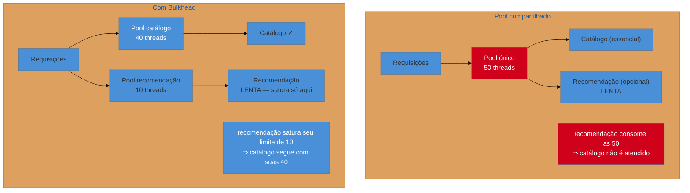

# Bulkhead

> [!abstract] TL;DR
> Timeout, retry e breaker protegem **uma chamada**. O bulkhead protege o **resto do sistema** de uma chamada: em vez de um pool compartilhado por todas as dependências, cada uma recebe seu compartimento de recursos. Assim, a dependência que afunda leva junto apenas o próprio compartimento, e as funcionalidades que nada têm a ver com ela continuam funcionando. O nome vem dos anteparos do casco de um navio — o furo alaga uma seção, não o barco. O sacrifício é **utilização**: capacidade reservada num compartimento fica ociosa mesmo quando outro está sufocando.

> [!info] O recorte desta nota
> Aqui o padrão como decisão e o que ele custa. **Dimensionar os compartimentos com dados reais** em [[03-Dominios/Engenharia/Operação/3 - Rodar em produção/06 - Resiliência operacional|Operação 3-06]] ("Bulkhead: dimensionando o isolamento").

## A funcionalidade que caiu sem ter culpa

A página de produto ficou fora do ar. Investigando, você descobre que a causa foi o serviço de **recomendação** — aquele bloco lateral de "quem viu isto também viu", que a página exibe se der certo e omite se não der.

A pergunta óbvia: como uma funcionalidade **opcional** derrubou a página inteira?

Porque as duas coisas — buscar o produto e buscar as recomendações — usam o **mesmo pool de threads** e o **mesmo pool de conexões HTTP**. Quando recomendação ficou lenta, as chamadas a ela ocuparam progressivamente todo o pool compartilhado. Quando a busca do produto precisou de uma thread, não havia nenhuma: todas estavam esperando por um bloco lateral decorativo.

**O acoplamento não estava no código — estava no recurso compartilhado.** Nada no design dizia que a página dependia de recomendação para funcionar; na prática, dependia, porque ambas competiam pelo mesmo balde. E note que timeout, retry e circuit breaker no cliente de recomendação **não teriam evitado isso sozinhos**: com timeout de dois segundos e tráfego suficiente, o pool ainda enche — só que mais devagar.

## A ideia: dar a cada um o seu balde

A compartimentação pode ser feita em vários níveis, do mais barato ao mais forte:

| Nível | Como | Isola |
| --- | --- | --- |
| **Semáforo / limite de concorrência** | teto de chamadas simultâneas por dependência | uso de recursos, sem thread extra |
| **Pool de threads ou conexões dedicado** | um pool por dependência | espera e bloqueio |
| **Instâncias separadas** | serviços ou pods distintos por função | falha de processo, memória, CPU |
| **Infraestrutura separada** | banco, cluster ou conta por cliente/domínio | falha de infraestrutura inteira |

E há duas dimensões de corte, que resolvem problemas diferentes: **por dependência** (o caso acima) e **por cliente ou tenant** — para que um cliente que dispara um pico não consuma a capacidade de todos os outros, problema clássico de multi-tenant conhecido como *noisy neighbour*.

> [!question]- Se eu já tenho circuit breaker, preciso de bulkhead?
> Sim, e a razão é que eles agem em momentos diferentes. O breaker só protege **depois de detectar** — ele precisa de falhas acumuladas para abrir, e durante essa janela de aprendizado o pool compartilhado já está enchendo. O bulkhead protege **desde sempre e sem detectar nada**: o limite é estrutural, não reativo. Há também o caso em que o breaker nunca abre: uma dependência que responde em 3 segundos com **sucesso** não gera falha nenhuma, então o breaker fica fechado enquanto ela drena o pool. O bulkhead cobre exatamente esse buraco — e é por isso que a ordem de composição usual coloca o bulkhead **por fora** de tudo.

## O que se sacrifica

**Utilização.** É o sacrifício central e o mais direto: capacidade reservada para um compartimento fica **ociosa** mesmo quando outro está saturado. Com o pool único de 50 threads do diagrama, um pico só de catálogo poderia usar as 50; com bulkhead, ele usa 40 e as outras 10 ficam paradas esperando um tráfego de recomendação que não veio.

Quem paga é o **orçamento de infraestrutura** — você provisiona mais para ter a mesma capacidade efetiva de pico. É uma troca boa, porque compra previsibilidade, mas precisa ser reconhecida: a compartimentação **reduz a capacidade máxima teórica** em nome de garantir a capacidade mínima de cada parte.

**Sacrifica também simplicidade operacional.** Cada compartimento vira mais um limite para dimensionar, monitorar e ajustar — e um compartimento mal dimensionado falha sob carga **normal**, o que é uma forma nova de incidente que não existia antes.

## Armadilhas comuns

> [!warning] Isolar a thread e compartilhar o recurso real
> **O que acontece:** cada dependência ganha seu pool de threads, mas todas apontam para o **mesmo banco de dados** com o mesmo pool de conexões. A dependência lenta esgota as conexões, e o isolamento de threads não protege nada. **Por quê:** compartimentou-se a camada visível — as threads da aplicação — e não o recurso escasso de verdade. **Como evitar:** identifique **qual** recurso satura primeiro (conexões de banco, sockets, memória, CPU) e compartimente **esse**. Isolar a camada errada dá uma falsa sensação de proteção, que é pior que não ter.

> [!warning] Compartimentos pequenos demais
> **O que acontece:** o pool dedicado é dimensionado com folga mínima e passa a rejeitar requisições sob picos **normais** — o mecanismo de proteção virou fonte de erro no dia a dia. **Por quê:** dimensionou-se pela média, não pelo pico observado, e sem margem para variação. **Como evitar:** use percentil alto de concorrência real, com folga, e trate rejeição por bulkhead como **métrica de primeira classe**. Se ela dispara fora de incidente, o compartimento está apertado — não o tráfego, errado.

> [!warning] Compartimentar sem observabilidade por compartimento
> **O que acontece:** o sistema degrada de forma parcial e ninguém entende por quê, porque as métricas são agregadas — a saturação de um compartimento fica invisível na média geral, que continua saudável. **Por quê:** a instrumentação foi criada antes da compartimentação e nunca foi segmentada. **Como evitar:** métricas **por compartimento** — utilização, rejeições, tempo de espera na fila. O valor do bulkhead é a falha parcial e localizada; sem visibilidade por parte, você perde justamente a informação que ele produz.

## Como explicar em inglês

> "Timeouts and circuit breakers protect a call; a bulkhead protects everything else from that call. The classic failure is an optional feature taking down an essential one — a recommendations widget goes slow, its calls fill the shared thread pool, and now the product lookup can't get a thread either. The coupling wasn't in the code, it was in the shared resource. So you give each dependency its own compartment: a semaphore, a dedicated pool, separate instances, whatever fits. The name comes from ship bulkheads — a breach floods one section, not the hull. What you pay is utilisation: capacity reserved for one compartment sits idle while another is saturated, so you provision more for the same peak. And the mistake I'd look for is isolating the wrong layer — separate thread pools all pointing at one shared connection pool isolates nothing."

| PT | EN |
| --- | --- |
| anteparo / compartimento | bulkhead / compartment |
| isolamento de recursos | resource isolation |
| pool dedicado | dedicated pool |
| limite de concorrência | concurrency limit |
| vizinho barulhento | noisy neighbour |
| saturação | saturation |
| falha parcial contida | contained partial failure |

## O que vem a seguir

Isso fecha o bloco **Iniciado** — as quatro defesas que todo serviço distribuído precisa ter. Todas elas terminam na mesma pergunta, que nenhuma responde: **o que responder ao usuário** quando a defesa disparou e não há resultado real para entregar.

- [[06 - Fallback e degradação graciosa]] — a resposta pior servida de propósito; abre o bloco Adepto.
- [[07 - Rate Limiting e Load Shedding]] — recusar na entrada, antes de a carga virar problema.
- [[04 - Circuit Breaker]] — a defesa que o bulkhead complementa.

## Veja também

- [[03-Dominios/Engenharia/Operação/3 - Rodar em produção/06 - Resiliência operacional|Resiliência operacional]] — dimensionar compartimentos com dados reais.
- [[03-Dominios/Engenharia/Arquitetura/System Design/3 - Padrões recorrentes/05 - Circuit Breaker e resiliência|Circuit Breaker e resiliência (System Design)]] — bulkhead pela ótica de escala.
- [[03-Dominios/Engenharia/Auth e Identidade/3 - Autorização e multi-tenancy/03 - Multi-tenancy e organizações|Multi-tenancy]] — o isolamento por cliente e o vizinho barulhento.

## Fontes

- **Michael Nygard** — *Release It!* (2ª ed., 2018) — o bulkhead entre os *stability patterns*, com a analogia naval.
- **Microsoft** — [*Bulkhead pattern*](https://learn.microsoft.com/en-us/azure/architecture/patterns/bulkhead) — a ficha do catálogo Azure e os níveis de isolamento.
- **Netflix Technology Blog** — os escritos sobre Hystrix — isolamento por *thread pool* e por semáforo em produção.
