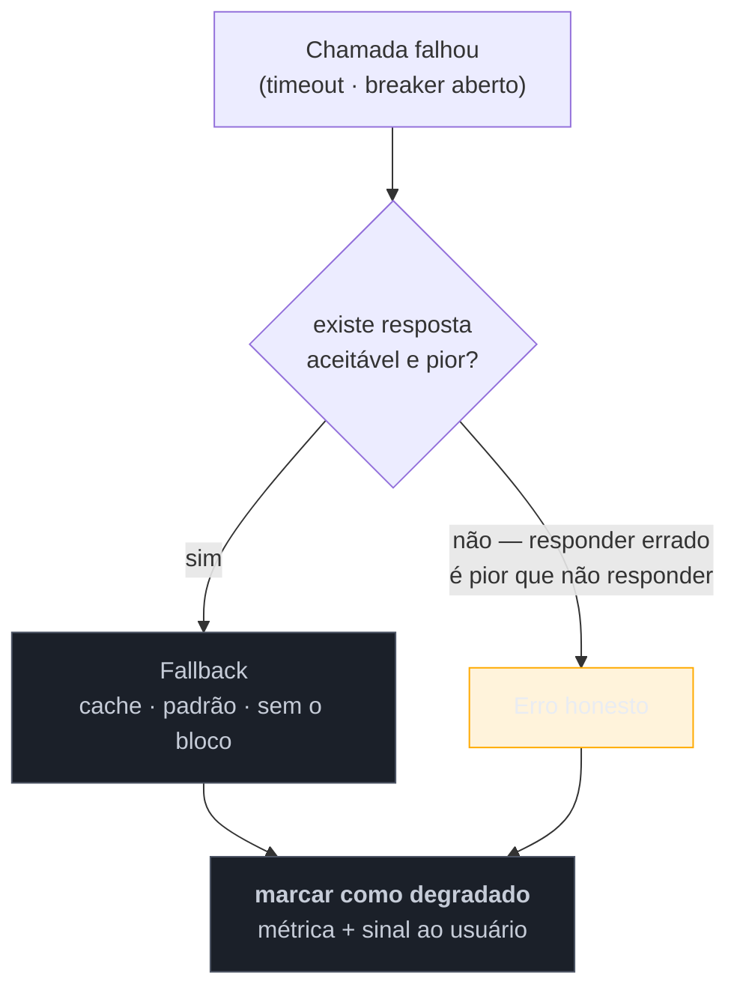

# Fallback e degradação graciosa

> [!abstract] TL;DR
> Timeout, retry e breaker decidem **quando desistir**. Nenhum decide **o que responder** — e essa pergunta não é técnica: é de produto. O fallback é a resposta pior servida **de propósito**: valor em cache, valor padrão, funcionalidade reduzida ou uma mensagem honesta. Ele é o que transforma "erro 500" em "a página carregou sem o bloco de recomendações", que é a diferença entre um incidente e uma imperfeição. E carrega a armadilha mais cruel da família: **o plano B nunca exercitado**, que falha justamente no dia em que é acionado — transformando um incidente em dois.

> [!info] O recorte desta nota
> Aqui o fallback como decisão e o que ele sacrifica. **Como testá-lo e observá-lo em produção** em [[03-Dominios/Engenharia/Operação/3 - Rodar em produção/06 - Resiliência operacional|Operação 3-06]] ("Fallback: a armadilha de ter um plano B nunca testado").

## O breaker abriu. E agora?

Você implementou o circuit breaker corretamente. Ele detecta a falha do serviço de recomendação, abre, e as chamadas passam a falhar em microssegundos em vez de dois segundos.

Aí você olha a tela do usuário: **erro 500**.

O breaker fez exatamente o que devia — economizou recursos, parou de martelar a dependência. Mas do ponto de vista de quem está comprando, nada melhorou: a página não carrega, só falha mais rápido. Você trocou um erro lento por um erro rápido, o que é melhor para o servidor e indiferente para o cliente.

**A defesa estava completa pela metade.** Detectar a falha é a parte técnica, fica pronta primeiro, e é onde a maioria dos times para. Decidir o que responder exige alguém dizer "é aceitável mostrar a página sem recomendações" — uma decisão de produto, que não cabe ao desenvolvedor tomar sozinho e por isso tende a ficar para depois. Depois costuma ser nunca.

## Os níveis de degradação

Não existe "o fallback": existe uma escada de respostas, da melhor à pior. Vale conhecê-la porque a escolha muda por funcionalidade.

| Nível | O que responde | Quando cabe |
| --- | --- | --- |
| **Cache** | o último valor conhecido | dado que tolera estar desatualizado |
| **Valor padrão** | um resultado genérico e seguro | recomendações → "mais vendidos"; frete → tabela fixa |
| **Funcionalidade reduzida** | a página sem aquele bloco | componentes opcionais da tela |
| **Fila para depois** | aceita agora, processa quando voltar | escrita que não precisa de confirmação imediata |
| **Mensagem honesta** | "indisponível, tente em instantes" | quando não há resposta parcial possível |
| **Erro** | falha explícita | quando responder errado é **pior** que não responder |

A última linha é a mais importante e a mais esquecida: **nem toda funcionalidade deve ter fallback.** Se o serviço antifraude está fora, o fallback "aprova a transação" é catastrófico e o fallback "recusa tudo" pode ser aceitável — mas alguém precisa decidir isso explicitamente, e a decisão pertence ao negócio. Para saldo bancário, mostrar um valor em cache pode ser pior que mostrar erro.

O quadrado final é o que mais falta na prática: **degradar em silêncio é uma armadilha**. Se o fallback não emite métrica, o sistema pode operar degradado por semanas com todos os painéis verdes — porque, do ponto de vista das métricas de erro, ele está respondendo 200.

## O que se sacrifica

**Correção.** É o único padrão da família que sacrifica isso, e por isso é o mais delicado: você está entregando de propósito uma resposta **pior** — desatualizada, genérica ou incompleta. Todos os outros padrões sacrificam disponibilidade de algumas requisições para preservar o todo; este preserva a disponibilidade **degradando a verdade**.

Quem paga é o usuário, muitas vezes **sem saber** — e daí decorre uma obrigação: sinalizar. Um preço vindo de cache exibido como se fosse atual é um problema de confiança, não de engenharia. "Dados de alguns minutos atrás" é uma frase barata que resolve.

**Sacrifica também clareza operacional**, se malfeito. Um sistema que degrada silenciosamente esconde a falha das suas próprias métricas — e você perde a informação de que a dependência está mal justamente quando precisaria dela.

> [!question]- Se o fallback é bom o bastante, por que a chamada original existe?
> Essa pergunta é um teste de projeto excelente, e às vezes a resposta revela um problema. Se o valor padrão serve igualmente bem em qualquer circunstância, talvez a dependência não precise estar no caminho crítico — ou não precise existir. Mas normalmente o fallback é **aceitável por um tempo curto** e não indefinidamente: recomendações genéricas por dez minutos não custam nada; por três semanas, custam receita. Isso tem uma implicação prática: fallback ativo precisa de **prazo e alarme**, não só de métrica. Ele é uma ponte, não um destino.

## Armadilhas comuns

> [!warning] O plano B nunca exercitado
> **O que acontece:** o fallback é acionado pela primeira vez durante um incidente real — e falha, porque tem um bug, ou porque o cache está vazio, ou porque a dependência que ele usa também caiu. O incidente vira dois, e o segundo é mais difícil de diagnosticar. **Por quê:** esse código só roda quando algo já deu errado, então nunca executa em teste nem em produção normal. Cobertura alta convive perfeitamente com fallback quebrado. **Como evitar:** exercite deliberadamente — injeção de falha na esteira, e um interruptor que force o caminho degradado em ambiente de teste. Alguns times mantêm uma pequena fração do tráfego real de produção passando pelo fallback, justamente para que ele nunca esteja frio.

> [!warning] Fallback silencioso
> **O que acontece:** a chamada falha, o valor padrão é servido, e nada é registrado. O sistema opera degradado por semanas com painéis verdes, e a descoberta vem por reclamação de que "os dados estão estranhos". **Por quê:** do ponto de vista de HTTP, a requisição teve sucesso — o `try/catch` transformou o erro em resposta 200 e a métrica de erro não vê nada. **Como evitar:** toda ativação de fallback emite **métrica própria** e entra no rastreamento. Alerta quando a taxa passar de um patamar. E, para o usuário, um sinal honesto quando o dado for degradado.

> [!warning] Fallback que chama outra dependência
> **O que acontece:** o plano B para o serviço de preços é consultar outro serviço — que está sobrecarregado justamente porque todo mundo migrou o tráfego para ele. A cascata continua, agora por um caminho que ninguém desenhou. **Por quê:** o plano B foi pensado como funcionalidade equivalente, não como caminho de contingência sob estresse. **Como evitar:** o fallback ideal é **local e barato** — cache em memória, constante, resposta parcial. Se ele precisa de rede, herda todos os problemas da chamada original e precisa das mesmas defesas: timeout, breaker e limite próprios.

## Como explicar em inglês

> "Timeouts, retries and breakers decide when to give up; none of them decides what to answer, and that question is a product decision, not a technical one. A fallback is a deliberately worse answer — a cached value, a sensible default, the page without that section, or an honest message. Without one, a circuit breaker just converts a slow error into a fast error, which is better for your servers and identical for the user. The part people underestimate is that not everything should have a fallback: if the fraud service is down, 'approve anyway' is catastrophic, so failing is correct. And the classic trap is that the fallback path only ever runs during an incident, so it's the least tested code you own — which is why it's worth forcing it deliberately in testing, and why every fallback activation should emit a metric. Degrading silently means running degraded for weeks with green dashboards."

| PT | EN |
| --- | --- |
| degradação graciosa | graceful degradation |
| valor padrão | sensible default |
| caminho degradado | degraded path |
| injeção de falha | fault injection |
| dado obsoleto | stale data |
| funcionalidade reduzida | reduced functionality |

## O que vem a seguir

Os padrões vistos até aqui reagem a uma dependência que falha **fora**. Os próximos olham para dentro: como impedir que a carga que chega — legítima ou não — sature o próprio serviço antes que qualquer dependência tenha chance de falhar.

- [[07 - Rate Limiting e Load Shedding]] — os dois modos de dizer não na entrada.
- [[08 - Cache-Aside]] — absorver a indisponibilidade da origem, ao custo de frescor.
- [[04 - Circuit Breaker]] — a defesa que torna o fallback necessário.

## Veja também

- [[03-Dominios/Engenharia/Operação/3 - Rodar em produção/06 - Resiliência operacional|Resiliência operacional]] — como testar o plano B antes de precisar dele.
- [[03-Dominios/Engenharia/Operação/4 - Observar e responder/02 - SLI, SLO e error budgets|SLI, SLO e error budgets]] — como contabilizar uma resposta degradada.
- [[01 - Panorama da resiliência]] — o mapa e a soma dos sacrifícios.

## Fontes

- **Michael Nygard** — *Release It!* (2ª ed., 2018) — degradação graciosa entre os *stability patterns*.
- **Google SRE Book** — [*Addressing Cascading Failures*](https://sre.google/sre-book/addressing-cascading-failures/) — degradação e a importância de exercitar o caminho de falha.
- **Microsoft** — [*Cloud Design Patterns*](https://learn.microsoft.com/en-us/azure/architecture/patterns/) — o catálogo de referência da família.
