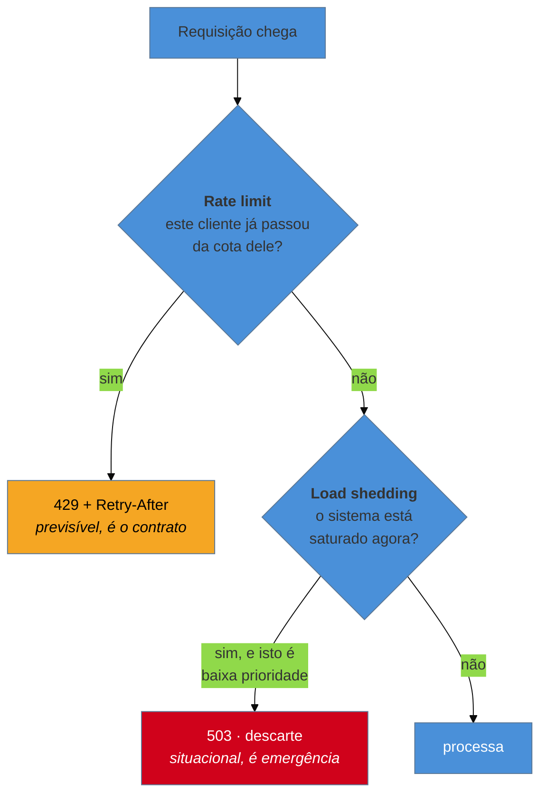

# Rate Limiting e Load Shedding

> [!abstract] TL;DR
> Os dois modos de **dizer não na entrada**, e a diferença entre eles é o critério. **Rate limiting** recusa por **cota**: você tem N por minuto, é um contrato conhecido de antemão, e a recusa é justa e previsível. **Load shedding** recusa por **pressão**: o sistema está no limite **agora**, e descarta o que puder para continuar servindo o resto. O primeiro protege contra abuso e vizinho barulhento; o segundo é o que impede o colapso total quando a carga legítima excede a capacidade. Servir 80% bem é melhor que servir 100% mal — e essa frase é o padrão inteiro.

> [!info] O recorte desta nota
> Aqui os dois padrões como decisão e o que sacrificam. **Algoritmos e escala** em [[03-Dominios/Engenharia/Arquitetura/System Design/3 - Padrões recorrentes/04 - Rate Limiting|System Design 3-04]]; **limite como contrato de API** (headers, 429, negociação com o cliente) em [[03-Dominios/Engenharia/Comunicação entre Sistemas/3 - Confiabilidade do contrato/04 - Rate limiting como contrato|Comunicação 3-04]]; **quotas no gateway gerenciado** em [[03-Dominios/Tecnologia/Cloud/14 - API Gateway e edge de aplicação/03 - Throttling, quotas e caching|Cloud 14-03]].

## Servir 80% bem é melhor que servir 100% mal

O tráfego dobra numa promoção. Sua capacidade não dobrou.

Sem defesa na entrada, todas as requisições são aceitas. As filas internas crescem, o tempo de resposta sobe de 200 ms para 12 segundos, e algo perverso acontece: **os clientes começam a desistir e a tentar de novo**, o que acrescenta ainda mais carga. Pior, o servidor continua processando requisições cujos clientes já foram embora — trabalho puro e desperdiçado, executado com recursos que faltam para quem ainda espera.

O resultado é o pior de todos os mundos: **ninguém é atendido**, e o sistema gasta 100% da sua capacidade produzindo respostas que ninguém recebe. Ele não caiu — ficou inútil, que é operacionalmente pior, porque nem sequer aciona os alarmes de indisponibilidade.

A alternativa é aceitar menos e servir bem. Rejeitar 20% em 5 milissegundos, com uma resposta clara, e atender os 80% restantes em 200 ms. É uma escolha desconfortável — alguém é sacrificado explicitamente, por decisão sua — e é quase sempre melhor que a degradação uniforme.

## Cota × pressão: os dois critérios

**Rate limiting é contratual.** O limite existe antes do problema, é publicado, e o cliente pode se planejar. Serve para proteger contra abuso, para isolar o vizinho barulhento e para monetizar (planos por volume). A recusa é **justa por construção**: quem passou da cota sabia qual era.

**Load shedding é situacional.** Não há cota — há um sistema saturado **neste instante**. O critério não é "quem é você", é "o que é mais dispensável agora". E isso exige uma noção de **prioridade**: rejeitar a listagem de produtos antes do checkout; rejeitar um relatório antes de um pagamento; nunca rejeitar o health check.

A distinção prática mais útil: um cliente bem comportado **nunca** deveria ser rejeitado por rate limiting, mas **pode** ser rejeitado por load shedding — e é por isso que os dois códigos de resposta e as duas mensagens devem ser diferentes.

> [!question]- Não basta autoescalar em vez de rejeitar?
> Autoescala e recusa resolvem coisas diferentes, e confiar só na primeira é uma armadilha comum. Escalar leva **tempo** — dezenas de segundos a minutos para uma instância subir e aquecer —, e o pico já derrubou o sistema nesse intervalo. Há casos em que escalar **não resolve**: se o gargalo é o banco de dados, mais instâncias de aplicação só aumentam a pressão sobre ele. E há o limite econômico: escalar sem teto diante de tráfego abusivo é transformar um ataque numa fatura. A recusa na entrada é o que **segura o sistema de pé** enquanto a escala acontece — as duas são complementares, e quem tem só a segunda descobre isso durante um incidente.

## O que se sacrifica

**Clientes legítimos na cauda.** Alguém que faria uma requisição perfeitamente válida recebe uma recusa. No rate limiting, é quem estourou a cota — previsível, mas ainda assim pode ser um caso de uso real e legítimo que a cota não previu. No load shedding, é quem teve o azar de chegar durante a saturação, ou de estar na classe de menor prioridade.

**A assimetria de quem é sacrificado é uma decisão de valor, não técnica.** Se você prioriza por plano, clientes pequenos caem primeiro. Se prioriza por tipo de operação, funcionalidades secundárias caem. Se não prioriza, cai quem chegar — o que é "justo" no sentido de aleatório e ruim no sentido de sacrificar um checkout para servir uma busca. Essa escolha deveria ser explícita e conhecida pelo negócio, e raramente é.

**Sacrifica também o benefício da dúvida.** Um limite mal calibrado bloqueia uso legítimo — e o cliente afetado quase nunca entende por quê, especialmente se a resposta não disser quando ele pode voltar.

## Armadilhas comuns

> [!warning] Rejeitar sem dizer quando voltar
> **O que acontece:** a resposta é um `429` seco. O cliente, sem informação, retenta imediatamente — e agora você tem **mais** carga vinda exatamente de quem você acabou de recusar. **Por quê:** implementou-se a recusa, que é a parte que protege o servidor, sem a parte que orienta o cliente. **Como evitar:** `429` com `Retry-After`, e headers informando limite, restante e janela. Uma recusa que orienta o cliente reduz a carga; uma que não orienta a aumenta. O contrato completo está em [[03-Dominios/Engenharia/Comunicação entre Sistemas/3 - Confiabilidade do contrato/04 - Rate limiting como contrato|Comunicação 3-04]].

> [!warning] Limitar pela chave errada
> **O que acontece:** o limite é por IP, e um cliente corporativo inteiro atrás de um NAT compartilha uma cota — usuários legítimos se bloqueiam mutuamente. Ou o serviço está atrás de proxy e **todas** as requisições parecem vir do mesmo IP, o que ou bloqueia todo mundo ou não limita ninguém. **Por quê:** o IP é a chave mais fácil de obter e a que menos corresponde a "quem é o cliente". **Como evitar:** limite por **identidade** (chave de API, conta, tenant) sempre que houver. Onde só houver IP, use o cabeçalho de encaminhamento correto e valide que ele é confiável na sua topologia.

> [!warning] Shedding que derruba o que não podia cair
> **O que acontece:** o descarte é uniforme e atinge o *health check* — a plataforma conclui que a instância está morta e a reinicia, reduzindo a capacidade **durante** a sobrecarga. Ou atinge o webhook de confirmação de pagamento, e o dinheiro fica em limbo. **Por quê:** o shedding foi implementado como percentual sobre o total, sem noção de prioridade. **Como evitar:** classes de prioridade explícitas, com uma lista curta do que **nunca** é descartado — health check, autenticação, e as operações críticas de negócio. Shedding sem prioridade é sorteio, e o sorteio vai eventualmente tirar o número errado.

## Como explicar em inglês

> "These are the two ways of saying no at the door, and the difference is the criterion. Rate limiting refuses by quota — you get N per minute, it's a published contract, and the rejection is predictable and fair. Load shedding refuses by pressure — the system is saturated right now, so it drops whatever it can to keep serving the rest. The reasoning behind shedding is that serving eighty percent well beats serving a hundred percent badly: without it, queues grow, latency goes to twelve seconds, clients give up and retry, and you end up spending your entire capacity producing responses nobody receives. The part that needs a real decision is priority — dropping uniformly will eventually drop your health checks, which gets your instances restarted in the middle of an overload. And a 429 without Retry-After actively increases load, because the client just tries again immediately."

| PT | EN |
| --- | --- |
| limitação de taxa | rate limiting |
| estrangulamento | throttling |
| descarte de carga | load shedding |
| cota | quota |
| balde de fichas | token bucket |
| pressão de retorno | backpressure |
| classe de prioridade | priority class |

## O que vem a seguir

Recusar protege o sistema, mas não melhora o atendimento de quem passou. O próximo padrão ataca o outro lado: **não fazer o trabalho de novo** — o que reduz carga na origem e, de quebra, permite continuar servindo mesmo quando ela está fora.

- [[08 - Cache-Aside]] — absorver a indisponibilidade da origem, ao custo de frescor.
- [[09 - Health Endpoint Monitoring]] — como o sistema declara que está saudável (e o que não pode ser descartado).
- [[06 - Fallback e degradação graciosa]] — o que responder a quem foi recusado.

## Veja também

- [[03-Dominios/Engenharia/Arquitetura/System Design/3 - Padrões recorrentes/04 - Rate Limiting|Rate Limiting (System Design)]] — algoritmos e escala.
- [[03-Dominios/Engenharia/Comunicação entre Sistemas/3 - Confiabilidade do contrato/04 - Rate limiting como contrato|Rate limiting como contrato]] — headers, 429 e a negociação com o cliente.
- [[05 - Bulkhead]] — a outra defesa contra o vizinho barulhento, por isolamento em vez de recusa.

## Fontes

- **Michael Nygard** — *Release It!* (2ª ed., 2018) — *shed load* e o handshake de capacidade entre serviços.
- **Google SRE Book** — [*Handling Overload*](https://sre.google/sre-book/handling-overload/) — load shedding, criticidade de requisições e o custo de trabalho desperdiçado.
- **Microsoft** — [*Throttling pattern*](https://learn.microsoft.com/en-us/azure/architecture/patterns/throttling) — a ficha do catálogo Azure.
- **IETF** — [RFC 6585](https://datatracker.ietf.org/doc/html/rfc6585) — o status 429 *Too Many Requests*.
