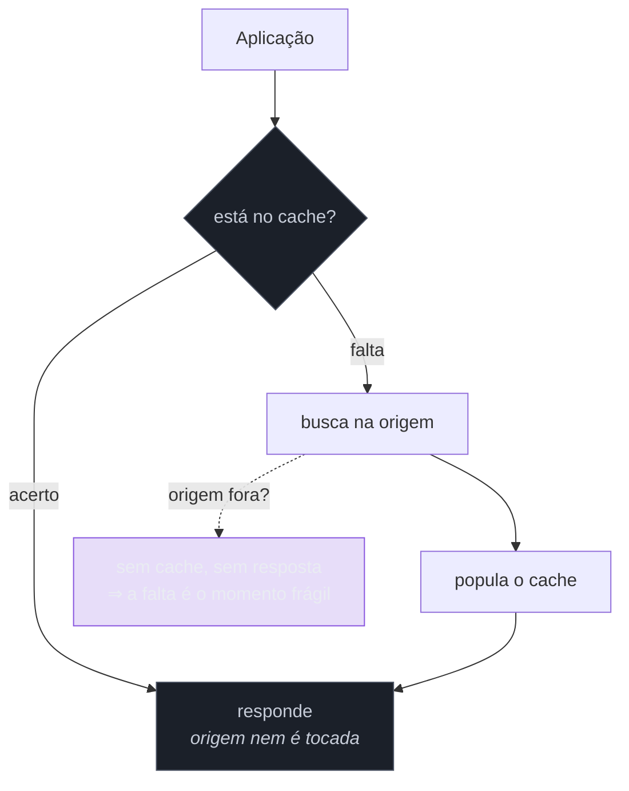

# Cache-Aside

> [!abstract] TL;DR
> A aplicação consulta o cache; se não achar, busca na origem e **popula** o cache antes de responder. É o padrão de cache mais comum, e nesta família ele entra por um ângulo específico: como padrão de **resiliência**, não de desempenho. Um cache quente absorve a indisponibilidade da origem — você continua servindo o que já conhece. Em troca, sacrifica **frescor** e acrescenta um segundo sistema que também pode falhar. E traz um modo de falha próprio, que transforma cache em causa de incidente: a **debandada** (*stampede*), quando muitas chaves expiram juntas e todo o tráfego cai na origem de uma vez.

> [!info] O recorte desta nota
> Aqui o cache como decisão de **resiliência** e seus sacrifícios. Estratégias de cache, invalidação, camadas e dimensionamento estão desenvolvidos em [[03-Dominios/Engenharia/Arquitetura/System Design/2 - Building blocks/02 - Caching|System Design 2-02]].

## O cache que salvou — e o cache que derrubou

Duas cenas do mesmo sistema, com um mês de diferença.

**Primeira.** O banco de catálogo ficou indisponível por seis minutos. A loja continuou vendendo: as páginas de produto mais acessadas estavam em cache, e 90% do tráfego foi servido normalmente. Ninguém de fora percebeu. O cache funcionou como amortecedor de uma falha da origem — que é o motivo de ele aparecer nesta família.

**Segunda.** Uma implantação limpou o cache. Em um segundo, **todo** o tráfego — que antes era 90% servido em memória — caiu direto no banco. O banco, dimensionado para 10% da carga, saturou em segundos. As requisições começaram a acumular, o timeout disparou, e o sistema levou vinte minutos para se recuperar, porque cada tentativa de aquecer o cache era abafada pela avalanche.

**O mesmo mecanismo é as duas coisas.** Um cache quente é uma defesa; um cache frio é uma dívida que vence de uma vez. E isso muda o desenho: se o sistema **depende** do cache para sobreviver, o cache deixou de ser otimização e virou parte da capacidade — precisa ser tratado com o mesmo cuidado da origem.

## A ideia e seu ponto cego

O nome *aside* vem de o cache ficar **ao lado**: a aplicação fala com os dois e coordena. Ela decide quando ler, quando popular, quando invalidar — o que dá controle e coloca a responsabilidade no seu código, diferente de estratégias em que o cache fica no caminho e cuida disso sozinho.

Do ponto de vista de resiliência, o ponto cego é a seta vermelha: **a proteção só existe para o que já está no cache**. Chave nova, chave expirada ou cache recém-limpo = você está exposto exatamente como estaria sem cache nenhum. Todo o risco se concentra no instante da falta.

## A debandada (*cache stampede*)

O modo de falha característico do padrão, e a razão de ele merecer atenção nesta família e não só na de desempenho.

Se um item popular expira, **todas** as requisições que o queriam dão falta ao mesmo tempo — e todas vão à origem, simultaneamente, buscar exatamente o mesmo dado. Mil requisições por segundo viram mil consultas idênticas. Pior: enquanto a primeira ainda não terminou, as outras 999 nem sabem que ela existe.

Duas defesas, ambas simples e ambas frequentemente ausentes:

**Jitter no TTL.** Se todos os itens foram populados juntos (uma implantação, um aquecimento), eles expiram juntos. Aleatorizar o prazo — 300 segundos ± 10% — espalha as expirações no tempo. É o mesmo raciocínio do jitter no retry, e a mesma economia: uma linha de código evita um pico sincronizado.

**Voo único** (*single-flight*). Quando N requisições dão falta na mesma chave, apenas **uma** vai à origem; as outras esperam o resultado dela. Transforma N consultas idênticas em uma, e é o mecanismo mais eficaz contra a debandada.

E, para o caso da segunda cena, **aquecimento**: se o cache é parte da capacidade, subir com ele vazio é subir sem capacidade. Popular os itens quentes antes de receber tráfego é o que evita o incidente de implantação.

> [!question]- Se o cache pode falhar, ele não é mais uma dependência?
> É — e essa é a pergunta certa a fazer antes de adotá-lo como defesa. Você acrescentou um sistema à sua topologia, com sua própria latência, seu próprio modo de falha e seu próprio custo. Daí a regra prática: o cache deve **falhar aberto** (*fail-open*). Se o Redis não responde, a aplicação deve seguir direto para a origem, com timeout curto na consulta ao cache — nunca falhar a requisição porque o cache falhou. Um cache que derruba o sistema quando cai inverteu completamente o seu propósito, e é um erro mais comum do que parece, porque a chamada ao cache costuma ser escrita sem nenhuma das defesas que se aplicam às outras dependências.

## O que se sacrifica

**Frescor.** Você responde com um dado que pode não ser mais verdade. Para catálogo, tolerável; para saldo ou estoque no limite, pode não ser — e essa é decisão de negócio, não técnica. O TTL é literalmente a medida de quanta desatualização você aceita.

**Correção sob invalidação errada.** Um bug de invalidação faz o dado velho persistir indefinidamente — e esse é o tipo de erro que não gera exceção, não aparece em métrica e é descoberto por reclamação, com o agravante de ser difícil de reproduzir.

**Complexidade e mais um sistema.** Cache é infraestrutura para provisionar, monitorar, dimensionar e pagar — e um lugar a mais onde dados sensíveis podem acabar armazenados sem que a decisão tenha sido tomada.

## Armadilhas comuns

> [!warning] Cache no caminho crítico sem *fail-open*
> **O que acontece:** o Redis fica lento, e as requisições passam a esperar por ele antes mesmo de tentar a origem. Um componente que existia para melhorar disponibilidade passa a reduzi-la. **Por quê:** a chamada ao cache é escrita como se fosse local e infalível — sem timeout, sem tratamento —, porque "é só um cache". **Como evitar:** timeout **curto** e agressivo na consulta ao cache, e erro de cache tratado como falta. A regra é: o cache pode tornar a resposta mais lenta em milissegundos, nunca impedi-la.

> [!warning] Debandada por expiração sincronizada
> **O que acontece:** implantação ou aquecimento populam tudo junto; o TTL uniforme faz tudo expirar junto; a origem recebe o pico inteiro e satura. **Por quê:** TTL fixo é o default de toda biblioteca, e o efeito só aparece com volume e com muitas chaves populadas no mesmo instante. **Como evitar:** **jitter no TTL** e **voo único** por chave. Se o cache é parte da capacidade, some a isso o aquecimento antes de receber tráfego.

> [!warning] Invalidação que nunca acontece
> **O que acontece:** o dado é atualizado na origem e o cache não é invalidado — por um caminho de escrita que ninguém lembrou de instrumentar. O sistema serve informação errada até o TTL expirar, ou para sempre, se não houver TTL. **Por quê:** a invalidação vive espalhada por todos os pontos de escrita, e basta um esquecido. **Como evitar:** prefira **TTL curto** a confiar apenas em invalidação explícita — o TTL é a rede de segurança para a invalidação que você esqueceu. Concentre a escrita num ponto que invalida, em vez de espalhar a responsabilidade.

## Como explicar em inglês

> "Cache-aside is the common one: the app checks the cache, and on a miss it reads the origin and populates the cache itself. In a resilience context what interests me is that a warm cache absorbs an origin outage — you keep serving what you already know. But the same mechanism cuts both ways: a cold cache is a debt that comes due all at once. Clear the cache on a deploy and a hundred percent of traffic hits a database sized for ten percent. The failure mode to know is the stampede — when a popular key expires, every request misses simultaneously and they all fetch the same thing, so you want TTL jitter and single-flight. And the rule I'd enforce in review is fail-open: a short timeout on the cache call, and a cache error treated as a miss. A cache that takes the system down when it fails has inverted its own purpose."

| PT | EN |
| --- | --- |
| acerto / falta | cache hit / miss |
| debandada | cache stampede |
| voo único | single-flight |
| falhar aberto | fail-open |
| aquecimento | cache warming |
| tempo de vida (TTL) | time to live |
| invalidação | invalidation |

## O que vem a seguir

Todos os padrões vistos assumem que **alguém sabe** que o serviço está mal — a plataforma tirando uma instância de rotação, o balanceador redistribuindo tráfego. Essa informação não é mágica: o serviço precisa declará-la, e a forma como ele declara pode ser a causa do próximo incidente.

- [[09 - Health Endpoint Monitoring]] — liveness × readiness, e a checagem que derruba a frota.
- [[10 - Leader Election]] — quando exatamente uma instância deve agir.
- [[07 - Rate Limiting e Load Shedding]] — proteger a origem pela entrada, em vez de pela memória.

## Veja também

- [[03-Dominios/Engenharia/Arquitetura/System Design/2 - Building blocks/02 - Caching|Caching (System Design)]] — estratégias, camadas, invalidação e dimensionamento.
- [[03-Dominios/Engenharia/Comunicação entre Sistemas/3 - Confiabilidade do contrato/03 - Caching HTTP e requisições condicionais|Caching HTTP]] — o cache como parte do contrato HTTP.
- [[03-Dominios/Engenharia/Design de Software/Padrões de Projeto/Acesso a Dados/15 - Polyglot persistence e materialized views|Polyglot persistence e materialized views]] — a leitura derivada e persistida, alternativa ao cache volátil.

## Fontes

- **Microsoft** — [*Cache-Aside pattern*](https://learn.microsoft.com/en-us/azure/architecture/patterns/cache-aside) — a ficha canônica do padrão.
- **Michael Nygard** — *Release It!* (2ª ed., 2018) — cache como fonte de instabilidade quando mal dimensionado.
- **Google SRE Book** — [*Addressing Cascading Failures*](https://sre.google/sre-book/addressing-cascading-failures/) — o papel do cache frio em cascatas e o problema do aquecimento.
