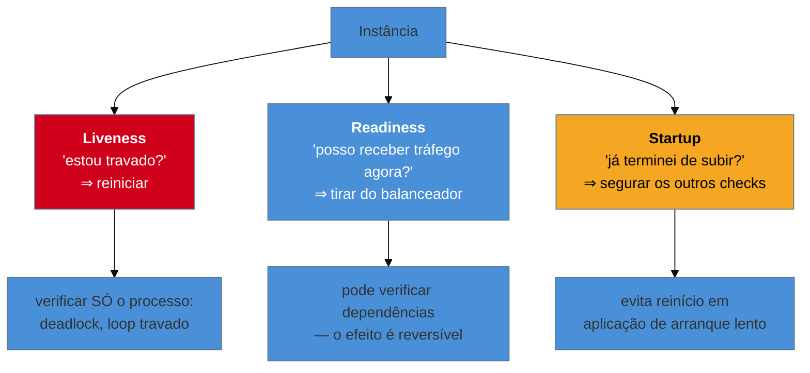

# Health Endpoint Monitoring

> [!abstract] TL;DR
> O serviço expõe um endpoint que declara sua saúde, e a **plataforma age** sobre a resposta: tira do balanceador, reinicia, alerta. É o padrão que faz todos os outros funcionarem — sem ele, ninguém sabe quem está mal. E é o mais fácil de implementar errado de um jeito **catastrófico**, porque a decisão central não é técnica e sim semântica: *o que exatamente essa checagem está declarando?* A distinção que evita a maior parte dos desastres é **liveness** (estou vivo? falha ⇒ **reiniciar**) × **readiness** (posso receber tráfego agora? falha ⇒ **tirar de rotação**). Confundi-las é como um health check profundo derruba a frota inteira quando o banco pisca.

> [!info] O recorte desta nota
> Aqui o padrão como decisão de design e seu sacrifício. **Probes do Kubernetes na prática** em [[03-Dominios/Engenharia/Operação/3 - Rodar em produção/02 - O contrato de produção do Kubernetes|Operação 3-02]]; **HA e continuidade na nuvem** em [[03-Dominios/Tecnologia/Cloud/20 - Resiliência e continuidade/index|Cloud 20]].

## O banco piscou e a frota inteira reiniciou

O banco de dados ficou indisponível por quarenta segundos — uma falha curta, do tipo que um retry bem configurado teria absorvido quase por completo.

Só que o *liveness probe* da aplicação verificava o banco. "Saúde", na implementação, significava "consigo executar `SELECT 1`". Com o banco fora, as 40 instâncias passaram a responder falha no liveness. O orquestrador fez o que lhe cabia: **reiniciou todas**.

Quando o banco voltou, quarenta minutos de incidente estavam à frente. As instâncias subiram todas ao mesmo tempo, com cache frio, abrindo pools de conexão simultaneamente contra um banco que acabara de voltar — e o derrubaram de novo. O que era uma falha de quarenta segundos virou um incidente longo, e a causa não foi o banco: **foi o health check**.

O erro é semântico, não de código. A pergunta que o liveness responde é **"este processo precisa ser reiniciado?"** — e a resposta, quando o banco cai, é *não*. Reiniciar não conserta um banco fora do ar; só destrói o estado local, esfria caches e cria uma avalanche na recuperação.

## As três perguntas

**Liveness — "o processo está irrecuperável?"** A única ação possível é reiniciar, e reiniciar só resolve problemas **internos e permanentes**: deadlock, corrupção de estado, loop travado. Por isso deve ser **raso**: responder que o event loop gira e o processo atende. Verificar dependência externa aqui é o erro da cena de abertura.

**Readiness — "posso atender agora?"** Aqui **pode** verificar dependências, porque a ação é reversível e proporcional: você sai de rotação e volta quando melhorar, sem perder estado. É o lugar certo para "meu pool de conexões está esgotado" ou "ainda estou aquecendo".

**Startup — "já terminei de subir?"** Existe para aplicações de arranque lento — uma JVM grande, um cache a popular. Sem ele, o liveness dispara durante a inicialização e o orquestrador reinicia em laço, num ciclo que nunca converge.

O erro de readiness também tem uma consequência séria, porém: se **todas** as instâncias declararem não-prontas ao mesmo tempo — porque todas verificam a mesma dependência —, o balanceador fica sem nenhum destino e o serviço cai por inteiro, mesmo com todas as instâncias funcionando perfeitamente para tudo que não depende daquela dependência.

> [!question]- Então o health check deve ser raso ou profundo?
> Os dois, em endpoints **diferentes**, e essa é a resposta que resolve a tensão. Um check raso para o **liveness** — só o processo. Um check de dependências para o **readiness**, e ainda assim com cuidado: distinga dependência **essencial** (sem ela você realmente não pode atender) de **opcional** (sem ela você atende degradado, e sair de rotação seria pior). E um endpoint **profundo e detalhado** que ninguém automatiza — que só a observabilidade consome e humanos leem durante um incidente. A regra é: quanto mais automática a ação, mais raso o check, porque o custo de um falso positivo é proporcional ao poder da ação.

## O que se sacrifica

**Precisão do diagnóstico, em troca de segurança da ação.** Um check profundo diz muito mais sobre o estado real do sistema — e, exatamente por isso, **propaga falhas**: ele acopla a saúde declarada da sua instância à saúde de terceiros. Um check raso não propaga nada e, em compensação, mente: a instância se declara saudável enquanto não consegue fazer nada útil.

Não há como ter os dois na mesma resposta, e é por isso que a separação em endpoints distintos é a resposta correta.

**Sacrifica também capacidade durante a instabilidade.** Readiness rigoroso tira instâncias de rotação sob qualquer soluço, reduzindo capacidade justamente quando o sistema está sob pressão — o que pode transformar uma degradação leve numa sobrecarga do que sobrou.

## Armadilhas comuns

> [!warning] Liveness checando dependências
> **O que acontece:** o banco pisca e a frota inteira é reiniciada. A recuperação vira uma avalanche de instâncias frias contra uma dependência que acabou de voltar, e o incidente se multiplica. **Por quê:** "saúde" é interpretado como "consigo fazer meu trabalho", que é a definição de readiness, não de liveness. **Como evitar:** liveness responde **apenas** sobre o processo. Pergunta-teste antes de incluir qualquer verificação: *reiniciar este processo resolveria isso?* Se não, não pertence ao liveness.

> [!warning] Health check que sempre responde 200
> **O que acontece:** o endpoint devolve `OK` sem verificar nada. A instância está com o pool esgotado e continua recebendo tráfego, porque declarou saúde perfeita. **Por quê:** é o oposto da armadilha anterior e nasce dela — depois de um incidente causado por check profundo, o time esvazia o check em vez de corrigir a semântica. **Como evitar:** o readiness deve refletir a **capacidade real de atender**: pool disponível, filas internas, aquecimento concluído. Raso não significa vazio.

> [!warning] Readiness sem aquecimento
> **O que acontece:** a instância declara-se pronta assim que o processo sobe, recebe tráfego imediatamente e responde mal — cache frio, JIT não aquecido, conexões não abertas. Numa implantação contínua, cada instância nova causa um pico de latência. **Por quê:** "processo iniciado" é confundido com "pronto para carga de produção". **Como evitar:** só declare pronta depois do aquecimento — conexões abertas, cache essencial populado. Combine com implantação gradual, para que uma instância nova receba tráfego progressivamente.

## Como explicar em inglês

> "The service exposes an endpoint declaring its health, and the platform acts on it — takes it out of the load balancer, restarts it, pages someone. The distinction that matters is liveness versus readiness. Liveness answers 'does this process need restarting?', so it must be shallow: restarting fixes deadlocks and corrupted state, it doesn't fix a database being down. I've seen a forty-second database blip restart an entire fleet because liveness checked the database — and then forty cold instances came back at once and knocked it over again. Readiness answers 'can I take traffic right now?', and there you can check dependencies, because the action is reversible. The general rule is that the more automatic the action, the shallower the check should be, because the cost of a false positive scales with how powerful the response is."

| PT | EN |
| --- | --- |
| verificação de saúde | health check |
| sondagem | probe |
| vivacidade / prontidão | liveness / readiness |
| tirar de rotação | remove from rotation |
| aquecimento | warm-up |
| falso positivo | false positive |
| arranque lento | slow start |

## O que vem a seguir

Isso fecha quase todo o bloco **Adepto**. Falta um padrão de natureza diferente: em vez de proteger contra falha externa, ele resolve um problema de **coordenação** — garantir que, numa frota de instâncias idênticas, exatamente **uma** execute determinada tarefa.

- [[10 - Leader Election]] — eleição por lease, e o split-brain; fecha o bloco Adepto.
- [[11 - Ambassador + Sidecar]] — tirar a resiliência do código da aplicação.
- [[07 - Rate Limiting e Load Shedding]] — o que nunca deve ser descartado (o health check é o exemplo).

## Veja também

- [[03-Dominios/Engenharia/Operação/3 - Rodar em produção/02 - O contrato de produção do Kubernetes|O contrato de produção do Kubernetes]] — probes na prática, com os parâmetros reais.
- [[03-Dominios/Tecnologia/Cloud/20 - Resiliência e continuidade/index|Resiliência e continuidade (Cloud)]] — HA, multi-region e DR.
- [[03-Dominios/Engenharia/Operação/4 - Observar e responder/01 - Observabilidade como prática|Observabilidade como prática]] — o check profundo que humanos leem.

## Fontes

- **Microsoft** — [*Health Endpoint Monitoring pattern*](https://learn.microsoft.com/en-us/azure/architecture/patterns/health-endpoint-monitoring) — a ficha canônica do padrão.
- **Kubernetes** — [*Configure Liveness, Readiness and Startup Probes*](https://kubernetes.io/docs/tasks/configure-pod-container/configure-liveness-readiness-startup-probes/) — a semântica das três sondagens e suas ações.
- **Michael Nygard** — *Release It!* (2ª ed., 2018) — o *handshake* de saúde entre serviços e o custo de reinícios em cascata.
