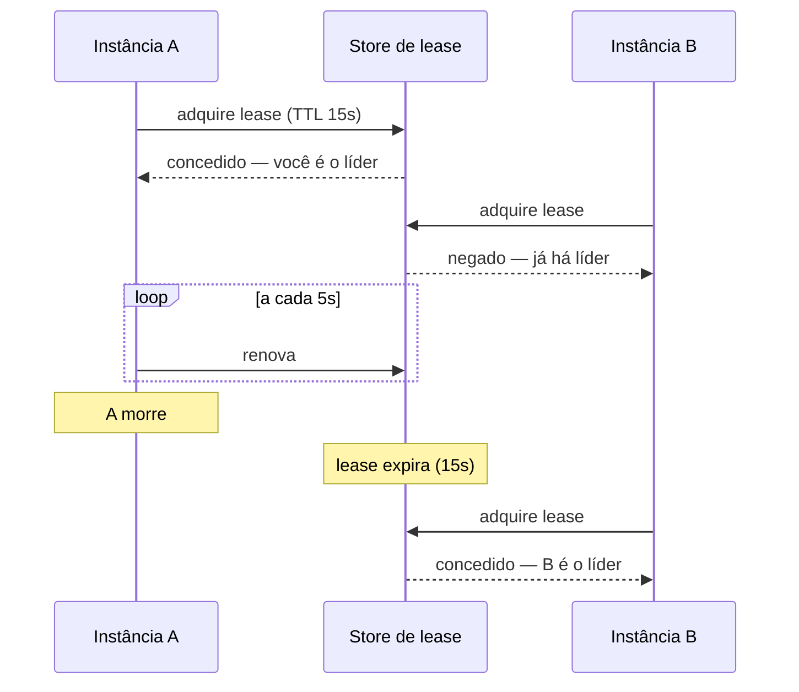

# Leader Election

> [!abstract] TL;DR
> Sua aplicação roda em vinte instâncias idênticas — ótimo para disponibilidade e péssimo para tarefas que devem acontecer **uma vez só**: o job noturno, a reconciliação, a compactação. Rodar vinte vezes não é "mais resiliente": é vinte e-mails para o mesmo cliente. O Leader Election elege uma instância como responsável, tipicamente por **lease** — uma reserva com validade que precisa ser renovada, de modo que a morte do líder libera o cargo automaticamente. O sacrifício é indisponibilidade da função durante a reeleição, e o inimigo tem nome: **split-brain**, dois líderes convictos ao mesmo tempo.

> [!info] O recorte desta nota
> Aqui o padrão como decisão e seus riscos. **Consenso, quórum e os algoritmos** (Raft, Paxos) em [[03-Dominios/Engenharia/Arquitetura/System Design/2 - Building blocks/06 - CAP, consistência e consenso|System Design 2-06]].

## Vinte e-mails para o mesmo cliente

O relatório de cobrança roda todo dia às 3h. Foi escrito quando havia uma instância, e ninguém pensou no assunto: um `@Scheduled` na aplicação, e pronto.

A aplicação cresceu para vinte instâncias. Às 3h, **as vinte** executam o job. Cada cliente inadimplente recebe vinte e-mails, o banco leva vinte varreduras idênticas, e — o pior — a atualização de status acontece vinte vezes em paralelo, produzindo resultados que dependem da ordem de execução.

O que salta aos olhos é que o problema veio de uma decisão que **melhorou** a resiliência: escalar horizontalmente. Redundância é a defesa central de todos os outros padrões desta família; aqui ela é o problema. Nem toda tarefa quer redundância — algumas querem **exclusividade**, e essa exclusividade precisa ser construída de propósito, porque a plataforma não a oferece.

## A ideia: reserva com validade

A abordagem ingênua — uma flag `sou_o_lider = true` numa tabela — falha no caso que importa: se o líder **morrer**, a flag continua lá, e ninguém mais assume. O cargo fica ocupado por um cadáver.

A resposta é o **lease**: uma reserva com **prazo de validade** que o líder precisa **renovar** periodicamente. Se ele parar de renovar — porque morreu, travou ou perdeu a rede —, o lease expira sozinho e outra instância assume. A liderança deixa de ser um estado permanente e vira uma **assinatura que vence**.

Os dois parâmetros que definem o comportamento: o **TTL** decide quanto tempo a função fica sem dono após uma falha; o **intervalo de renovação** precisa ser bem menor que o TTL, para tolerar um atraso de rede sem perder a liderança por acidente.

A implementação quase nunca deve ser sua: o `Lease` do Kubernetes, o etcd, o Zookeeper e o ZAB já resolvem isso, com as garantias testadas. Escrever eleição de líder à mão é onde times competentes introduzem bugs sutis.

## Split-brain: dois líderes convictos

O modo de falha característico, e o que torna o padrão mais difícil do que parece.

O líder A está processando. Uma pausa longa de coletor de lixo — ou uma partição de rede — o impede de renovar o lease por vinte segundos. O lease expira, B assume corretamente e começa a trabalhar. Então **A volta** da pausa, sem saber que dormiu, convicto de que ainda é o líder — e continua exatamente de onde parou.

Por um intervalo, **dois processos agem como líder único**. Se a tarefa é enviar e-mail, sai duplicado. Se é mover dinheiro, o resultado é corrupção.

O ponto que mais surpreende: **isso não é um bug do mecanismo de eleição**. O lease funcionou perfeitamente — expirou quando devia, e B foi eleito corretamente. O problema é que A **não tem como saber**, do seu lado, que perdeu a liderança, porque nada o notifica de que o tempo passou. Duas defesas:

**Verificar antes de agir**, não apenas no início. O líder confere a validade do seu lease antes de cada operação com efeito, não uma vez ao assumir.

**Fencing token.** O store entrega, junto do lease, um número que **sempre cresce**. O líder envia esse número em cada operação, e o recurso protegido (banco, storage) **rejeita** qualquer operação com número menor que o último que viu. Assim, quando A volta com um token velho, suas escritas são recusadas — a proteção fica no recurso, que é o único lugar capaz de arbitrar. É a defesa que funciona mesmo quando o líder está enganado sobre si mesmo.

> [!question]- Preciso mesmo de eleição, ou existe alternativa mais simples?
> Muitas vezes existe, e vale considerar antes. **Particionar o trabalho** — cada instância cuida de um subconjunto por hash da chave — elimina a exclusividade global e escala melhor; é a solução preferível quando o trabalho é divisível. **Lock por item**, em vez de liderança global: quem pegar o lock daquele registro o processa, o que também paraleliza. Ou **tirar o job da aplicação**: um agendador externo (o `CronJob` do orquestrador, um serviço gerenciado) dispara **uma** execução, e o problema deixa de existir no seu código. Eleição de líder é a resposta certa quando o trabalho é genuinamente indivisível e precisa de um coordenador único — mais raro do que se supõe.

## O que se sacrifica

**Disponibilidade da função durante a transição.** Entre o líder morrer e o lease expirar, ninguém está trabalhando. Reduzir o TTL encurta essa janela e aumenta o risco de reeleição espúria por uma lentidão passageira — um trade-off direto, sem opção livre de custo.

**Utilização.** Numa frota de vinte, dezenove instâncias não fazem aquela tarefa. Para um job noturno, irrelevante; para trabalho contínuo e volumoso, é o sinal de que particionar seria melhor.

**Complexidade e uma dependência nova** — o store do lease vira parte do caminho crítico da função, com seu próprio modo de falha.

## Armadilhas comuns

> [!warning] Flag de liderança sem expiração
> **O que acontece:** o líder morre com a flag marcada. Ninguém assume, e a tarefa simplesmente **para de acontecer** — em silêncio, porque não há erro, só ausência. A descoberta vem dias depois, quando alguém nota que os relatórios pararam. **Por quê:** modelou-se liderança como estado permanente, não como reserva com validade. **Como evitar:** lease com TTL e renovação, sempre. E monitore a **execução da tarefa**, não a saúde do líder: alarme quando o job não roda há mais tempo que o esperado.

> [!warning] Ignorar o split-brain
> **O que acontece:** pausa de GC ou partição de rede produzem dois líderes por alguns segundos. Efeitos duplicados, ou pior, escritas concorrentes que corrompem estado. **Por quê:** assume-se que "sou o líder" continua verdadeiro enquanto o processo executa — e nada avisa o líder deposto de que ele foi deposto. **Como evitar:** **fencing token** validado no recurso protegido, e reverificação do lease antes de cada operação com efeito. Onde a operação for idempotente, o dano do split-brain cai muito — mais uma razão para idempotência.

> [!warning] Implementar do zero
> **O que acontece:** eleição caseira sobre uma tabela, com bugs sutis que só aparecem sob partição de rede ou relógios divergentes — condições difíceis de reproduzir e raras o bastante para não serem testadas. **Por quê:** o mecanismo **parece** simples: uma linha, um TTL, um `UPDATE` condicional. **Como evitar:** use o que já existe — `Lease` do Kubernetes, etcd, Zookeeper, ou o mecanismo do seu framework. Coordenação distribuída correta é uma das áreas em que a diferença entre "funciona nos meus testes" e "funciona sob partição" é maior.

## Como explicar em inglês

> "When you scale to twenty identical instances, anything that must happen exactly once becomes a problem — a nightly job runs twenty times, so every customer gets twenty emails. Leader election picks one instance, normally with a lease: a reservation with a TTL that the leader has to keep renewing, so if it dies the lease expires and someone else takes over. A plain 'I am the leader' flag fails precisely when it matters, because a dead leader never clears it. The failure mode to know is split-brain: a long GC pause means the leader stops renewing, another instance is correctly elected, and then the first one wakes up still believing it's the leader. That's not a bug in the election — the leader simply has no way to know it was deposed. The fix is a fencing token: a monotonically increasing number that the protected resource checks, so stale writes get rejected at the resource itself."

| PT | EN |
| --- | --- |
| eleição de líder | leader election |
| reserva / concessão | lease |
| renovação | renewal / heartbeat |
| cérebro dividido | split-brain |
| token de cerca | fencing token |
| partição de rede | network partition |
| exclusividade | mutual exclusion |

## O que vem a seguir

Isso fecha o bloco **Adepto**. O último bloco muda de nível: em vez de padrões dentro do seu processo, ele trata de **onde a resiliência mora** — num processo acompanhante, na borda, ou numa camada de tradução que protege seu sistema de outro.

- [[11 - Ambassador + Sidecar]] — tirar a resiliência do código da aplicação; abre o bloco Magus.
- [[12 - Gatekeeper + Valet Key]] — os padrões de borda de segurança.
- [[09 - Health Endpoint Monitoring]] — como a plataforma sabe quem está apto.

## Veja também

- [[03-Dominios/Engenharia/Arquitetura/System Design/2 - Building blocks/06 - CAP, consistência e consenso|CAP, consistência e consenso]] — Raft, Paxos e o que consenso realmente garante.
- [[03-Dominios/Engenharia/Design de Software/Padrões de Projeto/Aplicação Corporativa/09 - Optimistic × Pessimistic Offline Lock|Offline Locks]] — o lock pessimista distribuído e por que ele é difícil.
- [[03-Dominios/Engenharia/Design de Software/Padrões de Projeto/Arquitetura de Eventos/06 - Idempotent Consumer (Inbox)|Idempotência]] — o que reduz o dano do split-brain.

## Fontes

- **Microsoft** — [*Leader Election pattern*](https://learn.microsoft.com/en-us/azure/architecture/patterns/leader-election) — a ficha canônica do padrão.
- **Martin Kleppmann** — [*How to do distributed locking*](https://martin.kleppmann.com/2016/02/08/how-to-do-distributed-locking.html) — o argumento do *fencing token* e por que lease sozinho não basta.
- **Kubernetes** — a API de `Lease` e o mecanismo de *leader election* dos controladores — a implementação de referência mais acessível.
- **Diego Ongaro & John Ousterhout** — *In Search of an Understandable Consensus Algorithm* (Raft, 2014) — o consenso por trás dos stores de lease.
