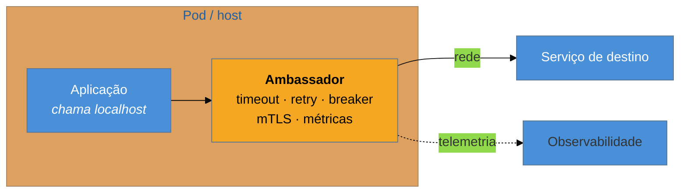

# Ambassador + Sidecar

> [!abstract] TL;DR
> Todos os padrões anteriores vivem **no seu código** — o que significa implementá-los, testá-los e
> mantê-los em cada linguagem, em cada serviço. O **Sidecar** move capacidades auxiliares para um
> processo acompanhante, no mesmo host ou pod; o **Ambassador** é o sidecar especializado em intermediar
> as chamadas de **saída**, aplicando timeout, retry, circuit breaker e mTLS por fora da aplicação. É o
> modelo do *service mesh*, e o argumento mais forte a favor dele não é elegância: é **legado e
> poliglota** — dá resiliência a serviços que ninguém pode recompilar. O sacrifício é um salto de rede,
> mais consumo por pod, e a resiliência saindo do alcance de quem escreve o código.

> [!info] O recorte desta nota
> Aqui os dois padrões e o que custam. A discussão **"onde a resiliência mora: no código ou no mesh"**,
> com a experiência de operar isso, está em
> [[03-Dominios/Engenharia/Operação/3 - Rodar em produção/06 - Resiliência operacional|Operação 3-06]];
> **rede e borda em produção** em [[03-Dominios/Engenharia/Operação/3 - Rodar em produção/05 - Rede e borda em produção|Operação 3-05]].

## Quatro linguagens, a mesma biblioteca que não existe

Sua plataforma tem serviços em Java, Node, Python e Go. A decisão de arquitetura foi razoável: cada time usa o que domina.

Aí chega o requisito: **todas** as chamadas entre serviços precisam de timeout coerente, retry com jitter, circuit breaker e TLS mútuo. Você escreve a biblioteca em Java. Depois em Node. Depois em Python. Depois em Go — e agora existem quatro implementações do mesmo comportamento, que precisam **concordar** entre si, evoluir juntas e ser atualizadas ao mesmo tempo em dezenas de serviços quando um bug aparece.

E há um serviço em Perl que ninguém compila desde 2019, cujo autor saiu da empresa. Ele também faz chamadas de rede. Para ele, não haverá biblioteca nenhuma.

**Esse é o problema que o sidecar resolve**, e ele explica por que o padrão nasceu em ambientes poliglotas grandes. A capacidade não é do seu domínio de negócio — é infraestrutura que toda chamada precisa. Colocá-la num processo separado permite implementá-la **uma vez**, em qualquer linguagem, e aplicá-la a qualquer serviço, inclusive ao que não pode ser tocado.

## A ideia: um processo acompanhante

**Sidecar** é o padrão geral: um processo que acompanha a aplicação no mesmo pod, compartilhando ciclo de vida e rede local, provendo capacidade auxiliar — coleta de logs, métricas, recarga de configuração, gestão de certificados.

**Ambassador** é o caso especializado em **saída**: a aplicação faz a chamada como se fosse local (`localhost:porta`), e o ambassador cuida do resto — descobrir o destino, aplicar as políticas de resiliência, cifrar, medir. Do ponto de vista do código, a chamada remota virou uma chamada local trivial.

Um *service mesh* é essa ideia industrializada: um ambassador em cada pod (o *data plane*) mais uma camada que os configura centralmente (o *control plane*). O ganho decisivo é que a política passa a ser **declarativa e uniforme** — "toda chamada a este serviço tem timeout de 2s e 2 tentativas" vira configuração aplicada à frota inteira, sem tocar em código.

> [!question]- Então devo tirar toda a resiliência do código?
> Não — e a divisão razoável segue uma linha clara: o **mesh** cuida bem do que é **genérico e por conexão** (timeout, retry de erro de transporte, breaker por destino, mTLS, telemetria). O **código** cuida do que exige **contexto de negócio**, que o mesh não tem como conhecer: *este* retry é seguro porque a operação é idempotente; o fallback correto para preço é a tabela em cache; esta requisição é de baixa prioridade e pode ser descartada. O mesh não sabe o que sua chamada significa. A consequência prática é que a resiliência fica **em duas camadas**, e é exatamente aí que nasce a armadilha da multiplicação — a primeira da seção seguinte.

## O que se sacrifica

**Um salto de rede e latência.** Toda chamada passa por um proxy local. É pouco — normalmente frações de milissegundo — mas é diferente de zero, e num caminho crítico com muitos saltos internos a soma aparece.

**Recursos por pod.** Cada instância ganha um processo extra com CPU e memória próprias. Numa frota de centenas de pods, isso é uma linha real de custo — e é a razão pela qua os *meshes* passaram a oferecer modos sem sidecar por pod.

**Distância entre quem escreve o código e o comportamento em produção.** Este é o sacrifício mais subestimado. O desenvolvedor vê uma chamada local que "misteriosamente" às vezes falha rápido, às vezes é retentada, às vezes leva mTLS — e o comportamento está descrito num YAML que talvez pertença a outro time. Depurar exige entender uma camada que não está no repositório da aplicação, e o modelo mental de quem escreve deixa de corresponder ao que executa.

**Mais uma coisa no caminho crítico.** O proxy pode ter bug, versão incompatível ou ordem de inicialização errada — e uma falha dele derruba a comunicação de uma aplicação que está perfeitamente saudável.

## Armadilhas comuns

> [!warning] Retry no mesh e na aplicação
> **O que acontece:** o mesh está configurado com 3 tentativas e a aplicação também. Cada chamada vira até 9 no destino, e sob incidente a amplificação é multiplicativa — o cenário da [[03 - Retry|nota 03]], agora com uma camada que ninguém lembra que existe.
> **Por quê:** as duas configurações vivem em lugares diferentes, mantidas por pessoas diferentes; o time de aplicação frequentemente não sabe o que o mesh já faz.
> **Como evitar:** decida **uma** camada para retry e desligue explicitamente na outra. Documente a política de resiliência como um conjunto único, e trate a soma como parte da revisão quando qualquer lado mudar.

> [!warning] Adotar mesh pelo que ele promete, não pelo que se usa
> **O que acontece:** o mesh é adotado por mTLS e observabilidade, traz consigo uma superfície enorme de funcionalidades, e o time passa a gastar tempo operando a própria malha — inclusive depurando incidentes causados por ela.
> **Por quê:** a lista de capacidades é sedutora e a adoção parece tudo-ou-nada.
> **Como evitar:** enuncie **quais três capacidades** justificam a adoção e meça se elas estão sendo usadas. Se o motivo real é só mTLS entre serviços, há caminhos bem mais baratos. Numa plataforma pequena e monolíngue, uma biblioteca compartilhada resolve com uma fração da complexidade.

> [!warning] Ordem de ciclo de vida entre app e sidecar
> **O que acontece:** no encerramento, o sidecar morre antes da aplicação — que perde a rede no meio das requisições em voo. Ou, no arranque, a aplicação começa a chamar antes de o proxy estar pronto, e as primeiras chamadas falham a cada implantação.
> **Por quê:** são processos independentes no mesmo pod; sem configuração explícita, a ordem não é garantida.
> **Como evitar:** use os mecanismos de ordenação da plataforma (contêineres de inicialização, *hooks* de parada, sidecars nativos) e teste **implantação e encerramento**, não só o estado estável — é onde essa classe de bug vive.

## Como explicar em inglês

> "Everything else in this family lives in your code, which means implementing and maintaining it in every language you run. A sidecar moves auxiliary capability into a companion process in the same pod; an ambassador is the outbound-specific one — your app calls localhost and the proxy handles service discovery, timeouts, retries, circuit breaking and mTLS. That's what a service mesh industrialises. The strongest argument isn't elegance, it's polyglot and legacy: you get consistent resilience on a service nobody can recompile. What you pay is an extra network hop, resources per pod, and — the underrated one — distance between the developer and the actual behaviour, because the policy lives in YAML that may belong to another team. The classic bug is retries configured in both the mesh and the app, so three times three becomes nine calls at exactly the wrong moment."

| PT | EN |
| --- | --- |
| processo acompanhante | sidecar |
| proxy de saída | egress / outbound proxy |
| malha de serviços | service mesh |
| plano de dados / de controle | data plane / control plane |
| política declarativa | declarative policy |
| TLS mútuo | mutual TLS |
| poliglota | polyglot |

## O que vem a seguir

O ambassador protege as chamadas **de saída**. Os próximos dois padrões olham para a **entrada** — e para o caso em que o que precisa ser contido não é uma falha, e sim um acesso.

- [[12 - Gatekeeper + Valet Key]] — validar na borda e delegar acesso por token limitado.
- [[13 - Anti-Corruption Layer + Strangler Fig]] — a fronteira com o legado.
- [[03 - Retry]] — a política que não pode existir em duas camadas ao mesmo tempo.

## Veja também

- [[03-Dominios/Engenharia/Operação/3 - Rodar em produção/06 - Resiliência operacional|Resiliência operacional]] — onde a resiliência mora, na prática de quem opera.
- [[03-Dominios/Engenharia/Operação/3 - Rodar em produção/05 - Rede e borda em produção|Rede e borda em produção]] — mesh, ingress e a topologia real.
- [[03-Dominios/Engenharia/Design de Software/Padrões de Projeto/Clássicos (GoF)/10 - Proxy|Proxy]] — o padrão GoF de que o ambassador é a encarnação em infraestrutura.

## Fontes

- **Microsoft** — [*Ambassador pattern*](https://learn.microsoft.com/en-us/azure/architecture/patterns/ambassador) e [*Sidecar pattern*](https://learn.microsoft.com/en-us/azure/architecture/patterns/sidecar) — as fichas canônicas.
- **Brendan Burns & David Oppenheimer** — *Design Patterns for Container-based Distributed Systems* (2016) — a formulação de sidecar, ambassador e adapter como padrões de contêiner.
- **Istio / Linkerd** — documentação de arquitetura — data plane, control plane e as políticas de resiliência declarativas.
