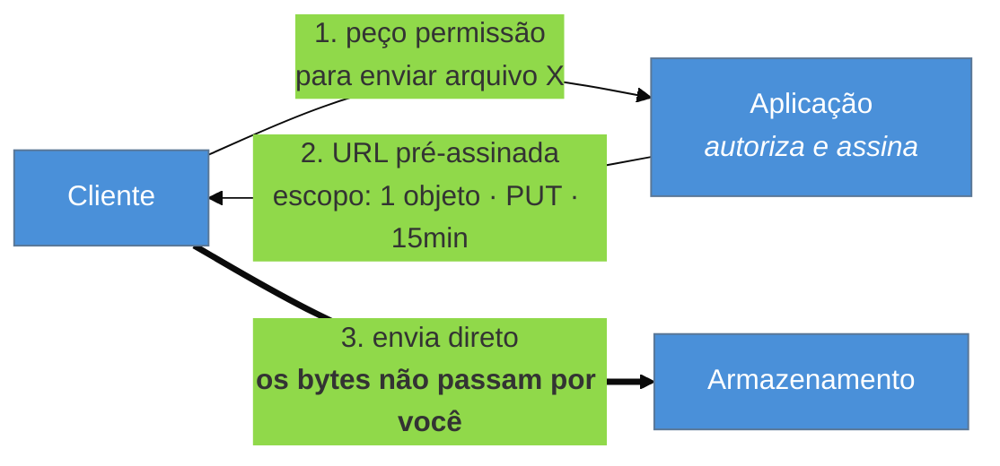

# Gatekeeper + Valet Key

> [!abstract] TL;DR
> Dois padrões de **borda**, com propósitos opostos e complementares. O **Gatekeeper** coloca uma instância intermediária entre o cliente e o serviço: ela valida, sanitiza e só então encaminha — de modo que o serviço rode com **privilégio menor** e nunca seja exposto diretamente. O **Valet Key** faz o inverso: em vez de proxyar dados pesados, entrega ao cliente uma **chave temporária e limitada** para falar direto com o armazenamento (a URL pré-assinada do S3), tirando a aplicação do caminho dos bytes. Um **interpõe** para proteger; o outro **sai da frente** para não virar gargalo — e é por isso que entram numa família de resiliência, e não só de segurança.

> [!info] O recorte desta nota
> Aqui os dois padrões como decisão de topologia e o que sacrificam. **Autorização na borda de API** em [[03-Dominios/Tecnologia/Cloud/14 - API Gateway e edge de aplicação/04 - Autorização na borda de API|Cloud 14-04]]; os fundamentos de **autorização e credenciais** no galho [[03-Dominios/Engenharia/Auth e Identidade/index|Auth e Identidade]].

## O serviço que precisava de privilégio para servir arquivos

Sua API permite ao usuário baixar e enviar arquivos grandes — laudos, vídeos, backups.

A implementação natural é a aplicação intermediar: recebe o upload, valida, e escreve no armazenamento. Funciona, e tem três consequências que só aparecem em escala.

**Primeira: a aplicação vira gargalo de banda.** Cada byte trafega duas vezes — do cliente para você, de você para o armazenamento. Cem uploads simultâneos de um gigabyte consomem sua rede, sua memória e suas conexões, sem que você faça **nada de útil** com aqueles bytes além de repassá-los.

**Segunda: a aplicação precisa de credenciais amplas.** Ela escreve em nome de todos os usuários, então tem permissão sobre o bucket inteiro. Uma falha de autorização no seu código expõe os arquivos de todo mundo.

**Terceira: a resiliência acopla.** Se a aplicação estiver sobrecarregada, downloads de arquivos param — embora o armazenamento, que é o sistema que realmente serve os bytes, esteja perfeitamente saudável.

O Valet Key resolve os três de uma vez. E o Gatekeeper ataca um problema irmão, pelo lado oposto.

## Valet Key: entregue a chave, não o carro

A analogia do nome é exata: você entrega ao manobrista uma chave que abre o carro e liga o motor, mas **não abre o porta-malas** e vale só por um tempo. A aplicação mantém a decisão de **autorização** — quem pode, o quê, por quanto tempo — e abre mão de intermediar a **transferência**.

O que ela emite é um token com escopo mínimo: um objeto específico, uma operação específica (`PUT` ou `GET`), uma validade curta. É a URL pré-assinada do S3 e as SAS do Azure Storage.

**Por que isso é resiliência, e não só desempenho:** o caminho dos bytes deixa de depender da sua disponibilidade. Sua aplicação pode estar degradada e os downloads continuam, porque quem os serve é o armazenamento. Você removeu um componente do caminho crítico — que é a forma mais definitiva de resiliência que existe.

## Gatekeeper: um porteiro sacrificável

O Gatekeeper vai na direção contrária: **acrescenta** um componente à frente, deliberadamente.

A ideia é que a instância exposta à internet seja diferente da que executa a lógica e detém as credenciais. O porteiro valida formato, sanitiza entrada, aplica autenticação — e só encaminha o que passou. Ele roda com privilégio **mínimo**: não tem as credenciais do banco nem as chaves da aplicação.

O ganho é de contenção de dano: se o componente exposto for comprometido, o atacante ganha um processo que **não sabe nada** e **não pode nada**. É a mesma lógica do bulkhead aplicada a privilégio em vez de recursos — compartimentar para que o comprometimento de uma parte não entregue o todo.

Na prática, esse papel costuma ser exercido por uma peça de infraestrutura — API Gateway, WAF, ingress com validação de esquema — e é aí que ele encontra o [[03-Dominios/Engenharia/Design de Software/Padrões de Projeto/Aplicação Corporativa/03 - Page Controller × Front Controller|Front Controller que virou infraestrutura]] da família 4.

> [!question]- Os dois não se contradizem — um interpõe e o outro remove?
> Parecem, e não se contradizem, porque tratam de **fluxos diferentes**. O Gatekeeper protege o fluxo de **controle**: pedidos pequenos, que exigem validação e decisão, e onde um salto extra custa pouco. O Valet Key libera o fluxo de **dados**: transferências grandes, onde interpor custa banda e disponibilidade e não acrescenta segurança — porque a decisão de autorização já foi tomada na emissão do token. Um sistema maduro usa os dois: o porteiro examina o pedido; o cofre entrega a carga diretamente, com uma chave restrita. A regra geral é **interpor onde se decide, sair da frente onde se transporta**.

## O que se sacrifica

**Gatekeeper sacrifica latência e simplicidade** — mais um salto em toda requisição, e mais um componente para operar, versionar e monitorar. Sacrifica também clareza de diagnóstico: com validação em duas camadas, descobrir **onde** uma requisição foi rejeitada exige olhar em dois lugares.

**Valet Key sacrifica controle fino durante a operação.** Emitido o token, o acesso vale **pelo escopo dele** — você não está mais no caminho para reavaliar, registrar detalhes ou aplicar regra de negócio. Se precisar revogar antes do vencimento, normalmente não dá: a validade curta é a única defesa. E a auditoria muda de lugar: quem registra o acesso é o armazenamento, não a sua aplicação, então o seu log deixa de contar a história completa.

Em ambos, quem paga é o **usuário legítimo** em casos de borda — um token que expira no meio de um upload longo em rede ruim, uma validação de porteiro rígida demais que rejeita um caso raro e válido.

## Armadilhas comuns

> [!warning] Valet key com escopo largo ou validade longa
> **O que acontece:** o token vale para o bucket inteiro, ou por 24 horas, "para simplificar". Ele vaza num log, num histórico de navegador ou num compartilhamento — e agora é uma credencial de acesso amplo circulando fora do seu controle. **Por quê:** escopo restrito exige gerar um token por operação, o que dá mais trabalho que gerar um genérico e reutilizável. **Como evitar:** **um objeto, uma operação, minutos**. Se o upload é longo, use upload em partes com renovação, não um token de horas. E trate a URL assinada como segredo: fora de log e de qualquer lugar persistente.

> [!warning] Gatekeeper que vira God proxy
> **O que acontece:** o porteiro começa validando formato e termina executando regra de negócio, consultando banco e tomando decisões — o que exige dar a ele exatamente as credenciais que o padrão existia para lhe negar. **Por quê:** ele é o único ponto que vê toda requisição, então toda validação "que precisa de contexto" parece caber ali. É a mesma dinâmica do *God dispatcher* da família 4. **Como evitar:** o porteiro valida o que dá para validar **sem estado e sem credenciais** — esquema, tamanho, autenticação, limites. Regra que precisa do domínio pertence ao serviço, e se o porteiro precisa de credenciais fortes, o padrão foi desfeito.

> [!warning] Assumir que o token não vaza
> **O que acontece:** a URL assinada é registrada em log de acesso, aparece no *referer*, ou é compartilhada pelo próprio usuário. O acesso passa a existir fora de quem você autorizou. **Por quê:** ela parece uma URL comum, e URLs vazam por muitos caminhos que ninguém considera individualmente. **Como evitar:** valide-a como credencial de curta duração — validade mínima viável, escopo mínimo, e monitoramento de uso anômalo do lado do armazenamento. E onde o dado for sensível, considere restringir também por origem ou por IP, quando o provedor permitir.

## Como explicar em inglês

> "These are two edge patterns pulling in opposite directions. A Gatekeeper deliberately puts an extra instance in front: it validates and sanitises requests and runs with minimal privilege, so if the internet-facing component is compromised the attacker gets a process that knows nothing and can do nothing. A Valet Key does the reverse — instead of proxying heavy data through your application, you hand the client a narrowly scoped, short-lived token to talk to storage directly, which is what an S3 presigned URL is. It belongs in a resilience family because it takes your application off the critical path for bytes: your service can be degraded and downloads still work. The rule I'd summarise it with is interpose where you decide, get out of the way where you transport. And the risk with valet keys is scope and lifetime — one object, one operation, minutes, and treat the URL as a secret."

| PT | EN |
| --- | --- |
| porteiro | gatekeeper |
| chave de manobrista | valet key |
| URL pré-assinada | presigned URL |
| privilégio mínimo | least privilege |
| escopo do token | token scope |
| sanitizar entrada | sanitise input |
| caminho crítico | critical path |

## O que vem a seguir

Falta o último par de padrões, e ele muda de assunto: em vez de proteger contra falha ou acesso, protege contra **o outro sistema** — o legado com que você precisa conviver, e que precisa ser substituído sem parar a operação.

- [[13 - Anti-Corruption Layer + Strangler Fig]] — a fronteira e a substituição incremental.
- [[14 - Escolher o padrão de resiliência (capstone)]] — o mapa por sintoma; fecha a família e o galho.
- [[11 - Ambassador + Sidecar]] — a borda de saída, complementar a esta.

## Veja também

- [[03-Dominios/Tecnologia/Cloud/14 - API Gateway e edge de aplicação/04 - Autorização na borda de API|Autorização na borda de API]] — o gatekeeper na prática de nuvem.
- [[03-Dominios/Engenharia/Auth e Identidade/index|Auth e Identidade]] — os fundamentos de autorização e credenciais de curta duração.
- [[03-Dominios/Engenharia/Design de Software/Padrões de Projeto/Aplicação Corporativa/03 - Page Controller × Front Controller|Front Controller]] — o padrão que virou infraestrutura de borda.

## Fontes

- **Microsoft** — [*Gatekeeper pattern*](https://learn.microsoft.com/en-us/azure/architecture/patterns/gatekeeper) e [*Valet Key pattern*](https://learn.microsoft.com/en-us/azure/architecture/patterns/valet-key) — as fichas canônicas.
- **AWS** — [*Presigned URLs*](https://docs.aws.amazon.com/AmazonS3/latest/userguide/using-presigned-url.html) — a encarnação mais usada do Valet Key.
- **OWASP** — *Application Security Verification Standard* — validação de entrada na borda e o princípio de privilégio mínimo.
