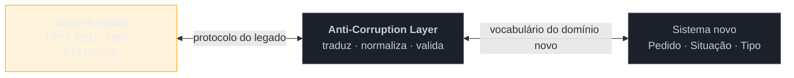

# Anti-Corruption Layer + Strangler Fig

> [!abstract] TL;DR
> O par de padrões para **conviver com o legado enquanto ele morre**. A **Anti-Corruption Layer** é uma camada de tradução na fronteira: o modelo do sistema antigo — com seus códigos numéricos, campos reaproveitados e regras esquisitas — **não atravessa** para o novo. O **Strangler Fig** substitui por incremento: um roteador na frente desvia funcionalidade por funcionalidade para o sistema novo, até que o antigo fique sem nada para fazer e possa ser desligado. Entram numa família de resiliência porque ambos protegem **contra outro sistema** — e porque a alternativa (a reescrita de uma vez) é a forma mais confiável de derrubar um negócio.

> [!info] O recorte desta nota
> Esta é a nota com a fronteira mais estreita da família: aqui a **entrada de catálogo** — o que cada padrão é, o que sacrifica, quando não usar. O **método de migração**, com o passo a passo de quem assume um sistema legado, tem casa própria e muito mais profunda em [[03-Dominios/Engenharia/Arqueologia e Restauração de Software/18 - Strangler Fig|Arqueologia 18]] e [[03-Dominios/Engenharia/Arqueologia e Restauração de Software/19 - Branch by Abstraction e Anti-Corruption Layer|Arqueologia 19]].

## O sistema novo que virou o velho em seis meses

O time construiu um serviço novo para substituir o módulo de pedidos do sistema de 2008. Arquitetura limpa, domínio bem modelado, testes.

Ele precisa ler dados do sistema antigo. E o sistema antigo tem `TIPO_PED` como um `char(2)` com quatorze valores possíveis, dos quais três significam a mesma coisa por razões históricas; um campo `OBS` que às vezes carrega dado estruturado separado por `|`; e uma regra de que `STATUS = 'X'` significa cancelado, exceto quando `DT_FIM` está preenchida, caso em que significa concluído.

Sem defesa, o caminho é conhecido: o serviço novo lê aquilo, e para "não perder informação" começa a carregar `tipoPed` como string de dois caracteres. Aparece um `if` para o caso do `X`. O `OBS` é parseado em três lugares. **Em seis meses, o modelo do sistema novo é o modelo do antigo com nomes melhores** — e a reescrita produziu um segundo legado, agora com a desvantagem de haver dois.

A Anti-Corruption Layer existe para impedir exatamente isso. O nome é literal: sem ela, o modelo antigo **corrompe** o novo — não por malícia, mas porque a tradução, se não tiver um lugar próprio, se espalha por todo lugar.

## ACL: uma fronteira com tradução

Toda comunicação atravessa a camada, que converte nos dois sentidos. Do lado de dentro, o domínio novo só conhece **seus próprios conceitos** — nunca vê `TIPO_PED`. Do lado de fora, o legado continua falando como sempre falou.

Duas propriedades que fazem a diferença: a tradução fica **num lugar só**, então uma peculiaridade descoberta depois é corrigida uma vez; e a camada é o **ponto natural de desligamento** — quando o legado morrer, você apaga a ACL e o domínio novo não muda uma linha. É o mesmo raciocínio do Message Translator da família EIP e do DTO na fronteira da família 4: **não deixar o modelo do outro atravessar**.

## Strangler Fig: substituir por incremento

O nome vem da figueira estranguladora, que cresce ao redor de uma árvore hospedeira até sustentar-se sozinha, e a hospedeira apodrece por dentro — a metáfora é de Fowler, e é exata.

Em vez da reescrita de uma vez (o *big bang*, cuja taxa de fracasso histórica é o argumento mais forte a favor deste padrão), coloca-se um **roteador na frente** dos dois sistemas. No começo ele manda tudo para o antigo. Conforme funcionalidades são reimplementadas, o roteador passa a desviá-las para o novo. O antigo vai perdendo responsabilidades até não ter nenhuma — e então é desligado.

O ganho não é técnico, é **de risco**: cada passo é pequeno, verificável e **reversível** — se a funcionalidade nova falhar, o roteador volta a apontar para a antiga. Comparado à reescrita de dois anos que entrega tudo num fim de semana, é a diferença entre um risco distribuído e uma aposta única.

> [!question]- Os dois padrões são a mesma coisa?
> Não, e a confusão é comum porque quase sempre aparecem juntos. **Strangler Fig é a estratégia de migração** — o roteador, a ordem das fatias, o desligamento. **ACL é a proteção de fronteira** — a tradução entre modelos. Você pode usar ACL sem migrar nada (integrando com um ERP de terceiro que vai ficar para sempre) e, em tese, estrangular sem ACL (se os modelos forem compatíveis, o que é raro). Na prática, quem estrangula precisa de ACL: durante a transição, o sistema novo **tem** que ler e escrever no antigo, e é exatamente aí que a contaminação aconteceria.

## O que se sacrifica

**ACL sacrifica esforço que não entrega valor de negócio.** É código de tradução — ninguém no negócio vai perceber que ele existe, ele precisa ser testado e mantido, e cresce com cada peculiaridade descoberta. Sacrifica também **desempenho** (mais um salto, mais uma conversão) e **fidelidade**: traduzir implica **decidir o que descartar**, e informação que o legado tinha pode não existir do lado novo. Essa decisão é frequentemente boa — muito do que o legado carrega é lixo histórico —, mas é irreversível e deve ser consciente.

**Strangler Fig sacrifica o tempo em que há dois sistemas vivos.** Durante a migração — que dura meses ou anos — você opera, monitora e paga por **ambos**, e cada mudança de negócio precisa ser avaliada nos dois. O roteador vira componente crítico: se ele cair, **tudo** cai, incluindo a parte que ainda é do sistema antigo e estava funcionando bem.

E o sacrifício que costuma ser mal calculado: **o esforço de manter a paridade**. Enquanto a migração corre, o negócio continua pedindo funcionalidades novas, e cada uma precisa ser decidida — vai no antigo, no novo, ou nos dois?

## Armadilhas comuns

> [!warning] O estrangulamento que nunca termina
> **O que acontece:** as funcionalidades fáceis migram nos primeiros meses; as difíceis — as com regras obscuras e sem ninguém que as entenda — ficam. Cinco anos depois, os dois sistemas seguem vivos, e o "temporário" virou arquitetura permanente, com o dobro do custo operacional. **Por quê:** o padrão remove a pressão de terminar, que é justamente a sua virtude: como cada passo entrega valor, adiar o próximo nunca dói **hoje**. **Como evitar:** trate o **desligamento** como o objetivo, não a migração. Ordene as fatias com as difíceis cedo o bastante para descobrir surpresas, defina data-alvo para desativar o legado, e monitore a proporção de tráfego ainda no antigo como métrica de projeto.

> [!warning] ACL que vaza o modelo antigo
> **O que acontece:** por conveniência, a camada devolve estruturas parecidas com as do legado — "só este campo, porque é mais fácil". Aos poucos, o vocabulário antigo atravessa, e a ACL vira uma camada de repasse com nomes trocados. **Por quê:** traduzir de verdade dá trabalho, e cada exceção individual parece inofensiva. **Como evitar:** teste do vocabulário — **nenhum tipo ou termo do legado deve aparecer na assinatura de nada do lado novo**. Se `TIPO_PED` aparece fora da ACL, ela já vazou.

> [!warning] Desligar o legado sem saber quem ainda o chama
> **O que acontece:** todo o tráfego conhecido foi migrado, o sistema antigo é desligado — e quebra um relatório noturno, uma integração de parceiro ou um job que lia direto do banco antigo, por um caminho que não passava pelo roteador. **Por quê:** o roteador só enxerga o que passa por ele. Acessos diretos ao banco, jobs agendados e integrações antigas são invisíveis para ele. **Como evitar:** antes de desligar, **instrumente o legado inteiro** — inclusive acesso direto ao banco — e observe por um ciclo completo de negócio (que inclui fechamento mensal e anual). Depois desligue em etapas reversíveis, começando por recusar em vez de remover.

## Como explicar em inglês

> "These two go together when you're replacing a legacy system. An Anti-Corruption Layer is a translation boundary: the old model — the two-character type codes, the overloaded free-text field, the status that means two different things — doesn't cross into the new system. Without it you rewrite the system and six months later your clean domain is the old model with better names, because the translation ended up scattered everywhere instead of living in one place. Strangler Fig is the migration strategy: a router in front sends traffic to the old system, and you divert functionality piece by piece until the old one has nothing left to do. The value isn't technical, it's risk — every step is small and reversible, versus a two-year rewrite that lands in one weekend. The failure mode to watch is the strangling that never finishes: easy features migrate, hard ones don't, and five years later you're paying for both systems."

| PT | EN |
| --- | --- |
| camada anticorrupção | anti-corruption layer |
| figueira estranguladora | strangler fig |
| reescrita de uma vez | big-bang rewrite |
| desligamento | decommissioning |
| paridade de funcionalidades | feature parity |
| fatiar / desviar | slice / divert |
| dívida histórica | historical baggage |

## O que vem a seguir

Isso completa os treze padrões. Falta a nota que os põe em relação uns com os outros — e que, sendo a última da última família, também fecha o galho-pai inteiro.

- [[14 - Escolher o padrão de resiliência (capstone)]] — o mapa por sintoma, a soma dos sacrifícios e a síntese das seis famílias.
- [[11 - Ambassador + Sidecar]] — onde o roteador do Strangler costuma viver na prática.
- [[01 - Panorama da resiliência]] — a lente do sacrifício, para reler com os treze na cabeça.

## Veja também

- [[03-Dominios/Engenharia/Arqueologia e Restauração de Software/18 - Strangler Fig|Strangler Fig (Arqueologia)]] — o método de migração completo.
- [[03-Dominios/Engenharia/Arqueologia e Restauração de Software/19 - Branch by Abstraction e Anti-Corruption Layer|Branch by Abstraction e ACL]] — as técnicas de quebra de dependência.
- [[03-Dominios/Engenharia/Design de Software/Padrões de Projeto/Integração Empresarial (EIP)/08 - Message Translator + Normalizer|Message Translator]] — o mesmo raciocínio de tradução, no vocabulário de mensageria.

## Fontes

- **Eric Evans** — *Domain-Driven Design* (2003) — a formulação original da Anti-Corruption Layer entre contextos delimitados.
- **Martin Fowler** — [*StranglerFigApplication*](https://martinfowler.com/bliki/StranglerFigApplication.html) — a metáfora e a estratégia de substituição incremental.
- **Microsoft** — [*Strangler Fig pattern*](https://learn.microsoft.com/en-us/azure/architecture/patterns/strangler-fig) e [*Anti-Corruption Layer pattern*](https://learn.microsoft.com/en-us/azure/architecture/patterns/anti-corruption-layer) — as fichas do catálogo Azure.
