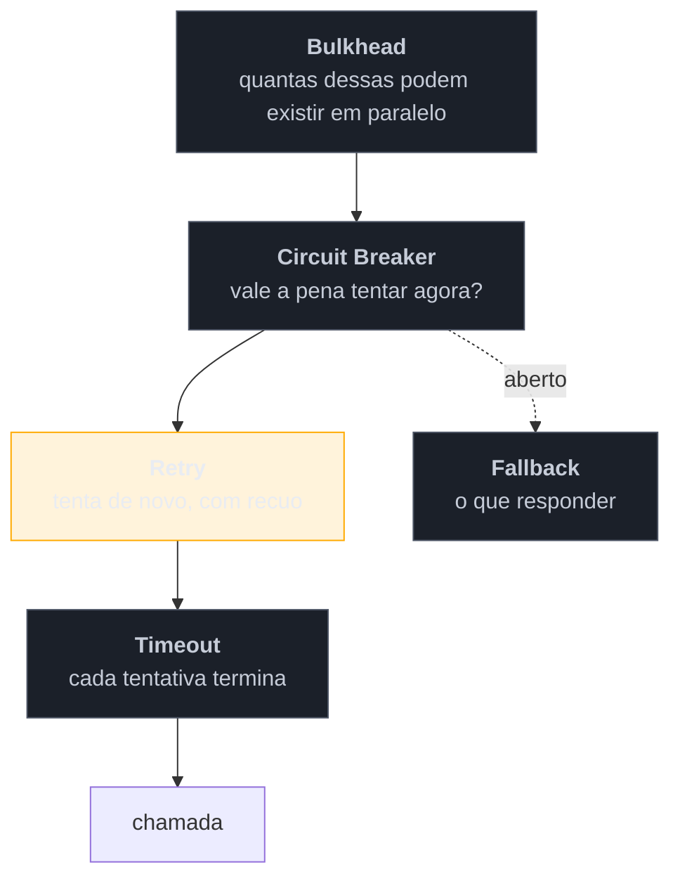

# Escolher o padrão de resiliência (capstone)

> [!abstract] TL;DR
> Fechamento em duas camadas. Primeiro, o **mapa da família**: do sintoma que você tem ao padrão que o trata, a tabela de **quem paga cada sacrifício**, e — a parte que mais importa — a **ordem de composição**, porque os padrões desta família interagem e empilhá-los sem somar produz falhas novas. Depois, o fechamento do **galho-pai**: seis famílias, noventa padrões, seis lentes diferentes. E a única conclusão que atravessa todas elas: **um padrão não nomeia uma solução, nomeia um trade-off** — e por isso a pergunta que dá acesso ao catálogo inteiro nunca é "qual padrão usar?", mas "o que estou disposto a trocar?".

## Parte I — Escolher na hora do incidente

### Do sintoma ao padrão

| O que está acontecendo | Padrão | Nota |
| --- | --- | --- |
| a dependência está **lenta** e minhas threads acabam | Timeout | [[02 - Timeout\|02]] |
| falhas passageiras derrubam operações que funcionariam | Retry (com backoff e jitter) | [[03 - Retry\|03]] |
| a dependência está **fora** e insistir é desperdício | Circuit Breaker | [[04 - Circuit Breaker\|04]] |
| uma funcionalidade **opcional** derrubou uma essencial | Bulkhead | [[05 - Bulkhead\|05]] |
| a defesa disparou e o usuário vê erro 500 | Fallback | [[06 - Fallback e degradação graciosa\|06]] |
| um cliente consome a capacidade de todos | Rate Limiting | [[07 - Rate Limiting e Load Shedding\|07]] |
| a carga legítima excede a capacidade **agora** | Load Shedding | [[07 - Rate Limiting e Load Shedding\|07]] |
| a origem não aguenta o volume de leitura | Cache-Aside | [[08 - Cache-Aside\|08]] |
| instâncias doentes continuam recebendo tráfego | Health Endpoint | [[09 - Health Endpoint Monitoring\|09]] |
| um job roda N vezes numa frota de N instâncias | Leader Election | [[10 - Leader Election\|10]] |
| preciso de resiliência uniforme em 4 linguagens (e num legado) | Ambassador / Sidecar | [[11 - Ambassador + Sidecar\|11]] |
| meu serviço exposto tem privilégio demais | Gatekeeper | [[12 - Gatekeeper + Valet Key\|12]] |
| a aplicação é gargalo de banda servindo arquivos | Valet Key | [[12 - Gatekeeper + Valet Key\|12]] |
| o modelo do legado está contaminando o sistema novo | Anti-Corruption Layer | [[13 - Anti-Corruption Layer + Strangler Fig\|13]] |
| preciso substituir o legado sem parar a operação | Strangler Fig | [[13 - Anti-Corruption Layer + Strangler Fig\|13]] |

### Quem paga cada conta

| Padrão | Sacrifica | Quem paga |
| --- | --- | --- |
| Timeout | requisições que teriam sucesso se esperassem | o usuário daquela requisição |
| Retry | latência; **amplifica carga** | **a dependência já fraca** |
| Circuit Breaker | requisições que talvez funcionassem | usuários durante a janela aberta |
| Bulkhead | utilização de recursos | o orçamento de infraestrutura |
| Fallback | **correção** — resposta pior de propósito | o usuário, muitas vezes sem saber |
| Rate Limiting | uso legítimo acima da cota | clientes na cauda |
| Load Shedding | requisições escolhidas para morrer | quem tem menor prioridade |
| Cache-Aside | frescor | quem lê dado desatualizado |
| Health Endpoint | precisão do diagnóstico (check raso) | quem depura sem informação |
| Leader Election | disponibilidade durante a reeleição | a função, não o sistema |
| Ambassador/Sidecar | latência, recursos, **proximidade** dev↔comportamento | quem depura |
| Gatekeeper | um salto e um componente a mais | latência e operação |
| Valet Key | controle fino durante o acesso | auditoria e revogação |
| ACL | esforço sem valor de negócio visível | o time, continuamente |
| Strangler Fig | conviver com dois sistemas por muito tempo | o custo operacional dobrado |

**A leitura transversal:** o Retry é o único padrão cujo custo recai sobre **outra pessoa** — a dependência que já está mal. Todos os demais gastam alguma moeda sua. É por isso que ele exige mais disciplina que os outros doze.

### A ordem de composição

Os padrões se aninham, e a ordem muda o comportamento de formas não óbvias. A composição convencional, de fora para dentro:

A lógica de cada nível: o **timeout** é o mais interno porque delimita **cada tentativa**; o **retry** envolve tentativas; o **breaker** observa o resultado do conjunto e decide se vale começar; o **bulkhead** limita quantas dessas operações existem ao mesmo tempo.

Inverter tem consequências concretas. Retry **por fora** do breaker faz as tentativas contornarem a decisão dele — o breaker abre e o retry tenta assim mesmo. Breaker contando cada tentativa individual em vez do resultado da operação abre muito mais cedo do que o limiar configurado sugere. E timeout **por fora** do retry, sem orçamento total, deixa o usuário esperando a soma de todas as esperas.

### Três somas que causam incidentes

**Multiplicação de retries.** Cliente 3× · gateway 3× · aplicação 3× = 27 chamadas no alvo. Cada configuração é razoável isolada; o produto não é. **Escolha uma camada** e desligue nas outras — e lembre que o [[11 - Ambassador + Sidecar|mesh]] é uma camada que costuma ser esquecida nessa conta.

**Timeouts incoerentes.** Se o de fora é menor que o de dentro, o serviço interno trabalha por respostas descartadas. Os timeouts devem **decrescer** para dentro, e a versão correta do padrão é propagar o **prazo**, não configurar valores locais.

**Defesas que se anulam.** O retry esconde falhas do breaker, que nunca abre. O fallback silencioso esconde a falha das métricas, e ninguém sabe que o sistema opera degradado. Duas defesas mal casadas podem ser piores que uma só.

> [!question]- Por onde começar num sistema que não tem nada disso?
> Na ordem de retorno sobre esforço: **timeout em toda chamada remota** (é a maior redução de risco por linha de código escrita, e a mais barata); depois **health checks com semântica correta** — liveness raso, readiness real —, porque é o que permite à plataforma agir; depois **bulkhead** entre o essencial e o opcional, que protege sem precisar detectar nada. Só então retry (com jitter e teto) e circuit breaker, que são os que exigem mais calibração e mais podem causar dano quando mal configurados. Fallback entra junto com o breaker, porque um sem o outro só troca erro lento por erro rápido. E a régua para tudo: **qual falha concreta isso evita hoje?** Sem resposta, é cerimônia.

---

## Parte II — Fechando o galho-pai

Esta é a última nota da última família. O catálogo está completo: **noventa padrões em seis famílias**, cada uma com uma lente própria.

| # | Família | Notas | Fonte | A lente |
| --- | --- | ---: | --- | --- |
| 1 | [[03-Dominios/Engenharia/Design de Software/Padrões de Projeto/Clássicos (GoF)/index\|Clássicos (GoF)]] | 23 | Gang of Four (1994) | **cross-linguagem** — quando a linguagem dissolve o padrão |
| 2 | [[03-Dominios/Engenharia/Design de Software/Padrões de Projeto/Acesso a Dados/index\|Acesso a Dados]] | 15 | Fowler PoEAA | **cross-ORM** — Active Record × Data Mapper |
| 3 | [[03-Dominios/Engenharia/Design de Software/Padrões de Projeto/Integração Empresarial (EIP)/index\|Integração Empresarial]] | 14 | Hohpe & Woolf | **cross-ferramenta** — smart endpoints, dumb pipes |
| 4 | [[03-Dominios/Engenharia/Design de Software/Padrões de Projeto/Aplicação Corporativa/index\|Aplicação Corporativa]] | 14 | Fowler PoEAA | **arqueológica** — era × hoje, e a ressurreição |
| 5 | [[03-Dominios/Engenharia/Design de Software/Padrões de Projeto/Arquitetura de Eventos/index\|Arquitetura de Eventos]] | 10 | Fowler (4 estilos) | **acoplamento** — o que o evento carrega |
| 6 | **Nuvem e Resiliência** | 14 | Azure · Nygard | **sacrifício** — o que se abre mão |

### O que o catálogo inteiro ensina

**Um padrão não nomeia uma solução — nomeia um trade-off.** É a conclusão que atravessa as seis lentes, e cada família a descobriu por um caminho diferente. No GoF, a linguagem moderna **dissolve** metade dos padrões, porque o que eles compravam (indireção) passou a ser gratuito. Em Acesso a Dados, Active Record e Data Mapper não competem: otimizam para casos opostos. Em EIP, toda armadilha é a mesma — inteligência demais no cano. Em Eventos, desacoplamento não é quantidade, é a escolha de qual dependência ter. Aqui, todo padrão sacrifica algo explicitamente.

Cinco leituras que decorrem disso, e que valem mais que qualquer padrão individual:

**1. Sem o atrito, o padrão é cerimônia.** Cada entrada deste catálogo existe contra uma pressão específica: descasamento objeto-relacional, latência de rede, transação longa demais para o banco, falha parcial. Aplicar um padrão sem ter o atrito é pagar o custo sem receber o benefício — e é a origem do sistema pequeno com arquitetura de sistema grande. A pergunta é sempre a mesma: *que pressão isto alivia no meu caso?*

**2. O contexto muda, e os padrões voltam.** A família 4 mostrou isso com clareza: a nuvem inverteu a recomendação de 2002 sobre estado de sessão, o *file-based routing* ressuscitou o Page Controller que os frameworks MVC tinham enterrado, e o BFF é Remote Facade com outro nome. Um padrão "datado" é uma decisão tomada sob restrições que não estão no código — antes de removê-la, reconstrua a restrição e verifique se ela ainda vale. Às vezes vale ainda; às vezes **voltou a valer**.

**3. Padrões movem problemas, não os eliminam.** O Remote Facade não faz menos trabalho — faz do lado certo da rede. O CQRS não simplifica o sistema — separa dois usos e acrescenta um pipeline. O Circuit Breaker não conserta a dependência — troca desperdício por rejeição. Reconhecer para onde o problema foi é o que permite antecipar onde ele vai reaparecer.

**4. O nome é metade do valor.** Boa parte do que este catálogo entrega não é técnica: é **vocabulário**. Dizer "isto é um Front Controller" ou "estamos com um problema de dual-write" encerra em cinco segundos uma discussão que duraria meia hora — e permite que a conversa comece do trade-off em vez de começar da descrição. Num legado, nomear o que você encontrou é o primeiro passo para decidir o que fazer com aquilo.

**5. A seção que mais importa é "quando NÃO usar".** Foi a decisão de design do galho, e ela se confirmou em todas as famílias. Todo mundo ensina quando aplicar; o que separa o sênior é saber **quando o custo excede o benefício** — e essa informação quase nunca está no texto original do padrão, porque quem cataloga um padrão está entusiasmado com ele.

### Como usar este catálogo daqui em diante

Ele é de **consulta**, não de leitura linear. Três portas de entrada:

- **Pelo sintoma** — os mapas de escolha ao fim de cada família ([[03-Dominios/Engenharia/Design de Software/Padrões de Projeto/Aplicação Corporativa/14 - Special Case + Null Object|família 4]], [[03-Dominios/Engenharia/Design de Software/Padrões de Projeto/Arquitetura de Eventos/10 - CQRS|família 5]], e a Parte I desta nota) partem do problema que você tem.
- **Pelo que você encontrou no código** — o [[03-Dominios/Engenharia/Design de Software/Padrões de Projeto/Aplicação Corporativa/14 - Special Case + Null Object|mapa de reconhecimento da família 4]] vai do artefato (`web.xml` com servlet único, classes `XxxVO`, coluna `VERSION`) ao padrão.
- **Pelo tema** — os `index.md` de cada família.

## Como explicar em inglês

> "If I had to compress the whole resilience family into one idea: none of these patterns is free, and the expensive mistake is stacking several without adding up what each one costs. A timeout sacrifices requests that would have succeeded, a circuit breaker sacrifices requests that might have worked, a bulkhead sacrifices utilisation, a fallback sacrifices correctness. Retry is the odd one out — it's the only pattern whose cost lands on someone else, the dependency that's already struggling, which is why it needs the most discipline. Composition order matters too: timeout innermost because it bounds an attempt, then retry, then the breaker observing the whole operation, then the bulkhead limiting concurrency. And where I'd start on a system with none of this is timeouts on every remote call and health checks with correct semantics — the two cheapest interventions with the biggest reduction in risk."

| PT | EN |
| --- | --- |
| ordem de composição | composition order |
| amplificação | amplification |
| orçamento total | overall budget |
| trade-off explícito | explicit trade-off |
| cerimônia | ceremony / accidental complexity |
| catálogo de consulta | reference catalogue |

## O que vem a seguir

Isso **fecha a família Nuvem e Resiliência e o galho-pai [[03-Dominios/Engenharia/Design de Software/Padrões de Projeto/index|Padrões de Projeto]]** — as seis famílias, completas. O catálogo passa a ser material de **consulta e manutenção**: revisitado quando um padrão aparece no trabalho, atualizado quando o contexto muda o suficiente para mudar um trade-off.

- [[03-Dominios/Engenharia/Design de Software/Padrões de Projeto/index|Padrões de Projeto]] — o galho-pai e o mapa das seis famílias.
- [[01 - Panorama da resiliência]] — a abertura desta família, para reler com os treze padrões na cabeça.
- [[03-Dominios/Engenharia/Design de Software/Padrões de Projeto/Clássicos (GoF)/23 - Quando NÃO usar - anti-patterns e discernimento sênior|Quando NÃO usar]] — o discernimento que atravessa as seis famílias.

## Veja também

- [[03-Dominios/Engenharia/Operação/3 - Rodar em produção/06 - Resiliência operacional|Resiliência operacional]] — a mesma matéria pela ótica de quem opera e tuna.
- [[03-Dominios/Engenharia/Arquitetura/System Design/3 - Padrões recorrentes/05 - Circuit Breaker e resiliência|Circuit Breaker e resiliência (System Design)]] — pela ótica de escala.
- [[03-Dominios/Engenharia/Arqueologia e Restauração de Software/index|Arqueologia e Restauração de Software]] — o ofício a que este catálogo serve.

## Fontes

- **Michael Nygard** — *Release It!* (2ª ed., 2018) — a fonte central desta família e a origem do vocabulário de estabilidade.
- **Google SRE Book** — [*Addressing Cascading Failures*](https://sre.google/sre-book/addressing-cascading-failures/) e [*Handling Overload*](https://sre.google/sre-book/handling-overload/) — a composição das defesas e o custo do trabalho desperdiçado.
- **Microsoft** — [*Cloud Design Patterns*](https://learn.microsoft.com/en-us/azure/architecture/patterns/) — o catálogo que dá nome à família.
- **Gamma et al.** · **Fowler** · **Hohpe & Woolf** · **Evans** · **Richardson** — as fontes canônicas das seis famílias deste galho.
