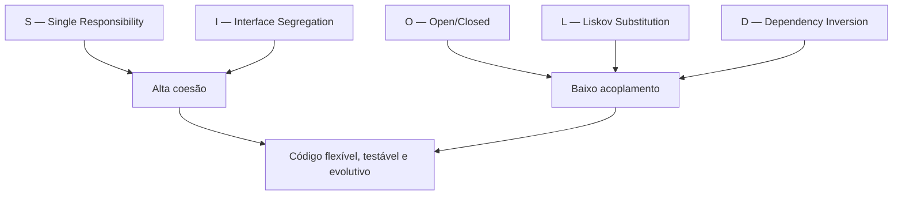

# O que é SOLID

> [!abstract] TL;DR
> SOLID é um conjunto de **cinco heurísticas** de design orientado a objetos que, aplicadas juntas, empurram o código para **baixo acoplamento** e **alta coesão** — e com isso para flexível, testável e fácil de evoluir. Não são leis: são heurísticas cujas exceções você precisa conhecer.

Imagine que você herdou uma casa onde, para trocar uma lâmpada, é preciso desligar a água, mexer no encanamento e rezar para o fogão não pegar fogo. Tudo está amarrado em tudo. Essa é a casa do código sem design: você não consegue mexer numa peça sem que três outras quebrem.

SOLID é um conjunto de cinco hábitos que servem para construir a casa de outro jeito — onde cada cômodo tem uma função clara, e onde trocar a lâmpada é só trocar a lâmpada.

Não é um framework. Não é uma biblioteca. É vocabulário de design. E, como todo vocabulário, ele só vale alguma coisa quando você sabe *quando usar cada palavra* — e quando ficar calado.

## Cinco letras, cinco hábitos

O nome é um acrônimo. Cada letra é um princípio que tem nome próprio, história própria e uma nota dedicada neste galho.

| Letra | Princípio | Em uma linha | Puxa para... |
|:---:|---|---|---|
| **S** | Single Responsibility | Uma classe deve ter uma só razão para mudar | Coesão |
| **O** | Open/Closed | Aberto para extensão, fechado para modificação | Acoplamento |
| **L** | Liskov Substitution | Subtipos devem ser substituíveis pelo tipo base | Acoplamento |
| **I** | Interface Segregation | Muitas interfaces pequenas, não uma gigante | Coesão |
| **D** | Dependency Inversion | Dependa de abstrações, não de implementações | Acoplamento |

> [!tip] Leitura da tabela
> Leia a coluna da direita primeiro. Os cinco não são cinco metas diferentes — são cinco *caminhos* para as mesmas duas metas: separar o que não tem nada a ver (coesão) e afrouxar os nós entre as peças (acoplamento). Guarde isso; vamos voltar a ele.

Vamos passar a mão em cada um, rápido. A nota dedicada é onde a coisa fica séria.

### S — Responsabilidade Única

Uma classe deve fazer uma coisa e ter um único motivo para mudar. Se a classe `Relatorio` calcula os números *e* formata o PDF *e* envia o e-mail, ela tem três razões para mudar — e três times diferentes vão brigar pelo mesmo arquivo.

A pergunta-teste: *"quem pede mudanças aqui?"* Se a resposta tem mais de um nome (o financeiro, o time de design, o de infra), a classe está fazendo demais. Detalhe em [[02 - SRP - Responsabilidade Única]].

### O — Aberto-Fechado

Você deve conseguir adicionar comportamento novo *sem* abrir o código velho e mexer nele. Aberto para extensão, fechado para modificação.

Pense num `switch` que cresce um `case` novo a cada feature. Toda nova forma geométrica te obriga a abrir a função `area()` e adicionar um ramo. Isso é "aberto para modificação" — exatamente o que você não quer. A saída é polimorfismo: cada forma sabe calcular sua própria área. Veja [[03 - OCP - Aberto-Fechado]].

### L — Substituição de Liskov

Se um código funciona com a classe `Ave`, ele tem que continuar funcionando se você passar uma `Pinguim` — *desde que* `Pinguim` seja mesmo uma `Ave` no sentido do contrato. O clássico contraexemplo: se `Pinguim` herda de `Ave` mas `voar()` joga uma exceção, a herança mentiu. O subtipo quebrou a promessa do tipo base.

Substituibilidade é uma promessa de comportamento, não só de assinatura. Aprofundado em [[04 - LSP - Substituição de Liskov]].

### I — Segregação de Interfaces

Ninguém deveria ser obrigado a depender de métodos que não usa. Uma interface `Funcionario` com `trabalhar()`, `tirarFerias()` e `baterPonto()` força um `Robo` a implementar `tirarFerias()` — e ele vai retornar... o quê? Melhor quebrar em interfaces menores, cada uma coesa. Mais em [[05 - ISP - Segregação de Interfaces]].

### D — Inversão de Dependência

Módulos de alto nível (a regra de negócio) não devem depender de módulos de baixo nível (o banco, o e-mail, o arquivo). Ambos devem depender de uma abstração.

Em vez de o `ProcessadorDePedido` chamar `MySQLConnection` diretamente, ele depende de uma interface `RepositorioDePedido` — e *quem* implementa isso é decidido lá fora. A seta de dependência se inverte: o detalhe passa a apontar para a abstração, não o contrário. Veja [[06 - DIP - Inversão de Dependência]] e, na prática, [[07 - DIP na prática - DI e IoC]].

```java
// Antes: a regra de negócio acorrentada ao detalhe
class ProcessadorDePedido {
    private MySQLConnection conexao = new MySQLConnection(); // depende do concreto
    void processar(Pedido p) { conexao.salvar(p); }
}

// Depois: a regra depende de uma abstração; o detalhe entra de fora
class ProcessadorDePedido {
    private final RepositorioDePedido repo;
    ProcessadorDePedido(RepositorioDePedido repo) { this.repo = repo; } // injeção
    void processar(Pedido p) { repo.salvar(p); }
}
```

Repare: na segunda versão, trocar MySQL por Postgres, ou por um repositório falso num teste, não toca uma linha do `ProcessadorDePedido`. Essa é a recompensa de SOLID em miniatura.

## De onde isso veio?

Aqui é onde muita gente repete história errada, então vamos com cuidado.

Os princípios são mais velhos que o acrônimo. **Robert C. Martin** — o "Uncle Bob" — reuniu, formulou e popularizou os cinco ao longo dos anos 1990 e 2000, com destaque para o artigo *Design Principles and Design Patterns* (2000) e o livro *Agile Software Development: Principles, Patterns, and Practices* (2002).

Mas o nome "SOLID"? Esse não foi ele. Foi **Michael Feathers** quem, por volta de 2004, percebeu que as iniciais dos cinco princípios podiam ser reordenadas para formar a palavra *SOLID* — sólido. Um truque de mnemônica que transformou cinco ideias soltas em um pacote memorável.

E nem todos os princípios nasceram com Uncle Bob:

- O **OCP** vem de **Bertrand Meyer**, no livro *Object-Oriented Software Construction* (1988) — embora a versão moderna, baseada em interfaces, tenha derivado um pouco da formulação original de Meyer, que era centrada em herança.
- O **LSP** vem de **Barbara Liskov**, da palestra *Data Abstraction and Hierarchy* (1987), depois formalizada com Jeannette Wing em termos de pré-condições, pós-condições e invariantes.

Uncle Bob deu a SRP, ISP e DIP suas formulações mais conhecidas e colou tudo num conjunto coerente. Mas o crédito é distribuído.

> [!info] Lastro
> O canônico: Robert C. Martin formulou e popularizou os cinco princípios (artigo de 2000, livro de 2002); o acrônimo *SOLID* foi arranjado por Michael Feathers por volta de 2004. OCP é de Bertrand Meyer (*Object-Oriented Software Construction*, 1988) e LSP é de Barbara Liskov (keynote *Data Abstraction and Hierarchy*, 1987, depois formalizado com Jeannette Wing). A simplificação comum — "SOLID é do Uncle Bob" — apaga essas raízes anteriores e o autor do próprio acrônimo. Fontes: [SOLID — Wikipedia](https://en.wikipedia.org/wiki/SOLID), [Open–closed principle — Wikipedia](https://en.wikipedia.org/wiki/Open%E2%80%93closed_principle), [Liskov substitution principle — Wikipedia](https://en.wikipedia.org/wiki/Liskov_substitution_principle).

## A meta secreta: acoplamento e coesão

Volte à coluna da direita da tabela. Os cinco princípios não são cinco objetivos independentes — são cinco engrenagens girando a serviço de **duas** metas:

- **Alta coesão** — cada peça do código junta o que pertence junto e nada mais. SRP e ISP empurram para cá: SRP diz "uma razão para mudar", ISP diz "uma interface por papel".
- **Baixo acoplamento** — peças diferentes se conhecem o mínimo possível. OCP, LSP e DIP empurram para cá: OCP evita que estender uma coisa force tocar noutra, LSP garante que você possa trocar uma implementação sem o chamador notar, e DIP corta o fio direto entre regra e detalhe.



> [!note] Leitura do diagrama
> As cinco letras convergem. SRP e ISP alimentam a coesão; OCP, LSP e DIP alimentam o baixo acoplamento. E essas duas, juntas, produzem o que de fato importa: código que você consegue mudar sem medo. SOLID não é o objetivo — é o caminho. O objetivo é coesão e acoplamento.

Por isso o galho inteiro de SOLID é, no fundo, a engenharia de atingir uma meta que vive lá fora: em [[08 - Acoplamento e coesão]], no galho de [[03-Dominios/Engenharia/Design de Software/Orientação a Objetos/index|Orientação a Objetos]]. Se você ainda não tem essa nota firme na cabeça, ela é o pré-requisito conceitual de tudo o que vem aqui. Leia-a primeiro, se puder.

E como SOLID alcança isso? Pelas ferramentas que o OO já te deu: [[05 - Polimorfismo]] (o motor do OCP e do LSP), [[06 - Interfaces e classes abstratas]] (o ponto de articulação do DIP e do ISP). SOLID não inventa mecanismos novos — ele te diz *como apontar* os mecanismos que você já tem.

## Heurísticas, não mandamentos

Aqui mora a diferença entre um pleno e um senior.

O pleno decorou os cinco e aplica todos, sempre, em tudo. O resultado costuma ser um labirinto de interfaces com uma única implementação cada, fábricas para criar fábricas, e camadas de abstração que ninguém pediu. Isso tem nome: [[12 - Anti-patterns de OO|over-engineering]]. Aplicar SOLID religiosamente num CRUD de 200 linhas é como contratar um arquiteto naval para construir uma jangada.

O senior sabe que SOLID são *heurísticas* — bons palpites, válidos na maioria dos casos, mas não em todos. E sabe nomear quando ignorá-las:

- DIP atrás de uma interface com uma só implementação que nunca vai mudar? Acoplamento direto pode ser mais honesto.
- OCP num código que ainda está descobrindo sua forma? Você abstrai cedo demais e abstrai errado.
- ISP num projeto onde a interface "gorda" é usada inteira por todo mundo? Quebrar não paga.

A pergunta nunca é *"isto é SOLID?"*. É *"isto reduz acoplamento e aumenta coesão a um custo que vale a pena agora?"*. A leitura crítica — quando SOLID atrapalha, o que John Ousterhout responde a ele, e como o assunto cai em entrevista — fica em [[08 - SOLID em xeque]].

> [!warning] A armadilha
> Tratar SOLID como checklist binário ("violou? errado!") é o erro de quem aprendeu o nome dos princípios mas não o problema que eles resolvem. O problema é a rigidez do código. Se aplicar o princípio deixa o código mais rígido (mais difícil de entender, mais peças para mover), você está usando a ferramenta contra a própria finalidade dela.

## Em entrevista

SOLID é quase certo de aparecer numa entrevista de design ou de OO. Não basta soletrar as letras — o entrevistador quer ver se você entende *para que servem*.

Frases prontas, em inglês:

- *"SOLID is a set of five object-oriented design heuristics that, taken together, push code toward low coupling and high cohesion."*
- *"They're heuristics, not hard rules — knowing when **not** to apply them matters as much as knowing them."*
- *"The acronym was coined by Michael Feathers around 2004; Robert C. Martin formulated and popularized the principles, but the Open/Closed Principle goes back to Bertrand Meyer and the Liskov Substitution Principle to Barbara Liskov."*
- *"Single Responsibility and Interface Segregation are mostly about cohesion; Open/Closed, Liskov, and Dependency Inversion are mostly about decoupling."*
- *"Applying every principle everywhere is over-engineering — the real question is whether the abstraction pays for itself."*

Vocabulário PT → EN:

| Português | Inglês |
|---|---|
| Acoplamento / baixo acoplamento | Coupling / low (loose) coupling |
| Coesão / alta coesão | Cohesion / high cohesion |
| Responsabilidade única | Single responsibility |
| Aberto para extensão, fechado para modificação | Open for extension, closed for modification |
| Substituibilidade (de subtipos) | (Subtype) substitutability |
| Segregação de interfaces | Interface segregation |
| Inversão de dependência | Dependency inversion |
| Depender de uma abstração | To depend on an abstraction |
| Heurística (não regra rígida) | Heuristic (not a hard rule) |
| Excesso de engenharia | Over-engineering |
| Código rígido / frágil | Rigid / brittle code |

> [!tip] Movimento de senioridade
> Depois de explicar os cinco, antecipe a pergunta seguinte com: *"...but I'd push back on applying all five blindly — here's a case where Dependency Inversion would just add ceremony."* Mostrar que você conhece os limites da ferramenta vale mais do que recitá-la perfeitamente.

## Veja também

- [[02 - SRP - Responsabilidade Única]] — a primeira letra: uma só razão para mudar
- [[03 - OCP - Aberto-Fechado]] — extensão sem modificação
- [[04 - LSP - Substituição de Liskov]] — subtipos que cumprem o contrato
- [[05 - ISP - Segregação de Interfaces]] — interfaces pequenas e coesas
- [[06 - DIP - Inversão de Dependência]] — dependa de abstrações
- [[07 - DIP na prática - DI e IoC]] — injeção de dependência e Inversão de Controle
- [[08 - SOLID em xeque]] — over-engineering, crítica e leitura senior
- [[08 - Acoplamento e coesão]] — a meta que os cinco perseguem (pré-requisito conceitual)
- [[05 - Polimorfismo]] — o motor por trás de OCP e LSP
- [[06 - Interfaces e classes abstratas]] — o ponto de articulação de DIP e ISP
- [[12 - Anti-patterns de OO]] — o que acontece quando SOLID vira dogma
- [[03-Dominios/Engenharia/Design de Software/Orientação a Objetos/index|Orientação a Objetos]] — o galho de onde SOLID nasce
- [[Arquitetura de Software]] — SOLID no nível de módulo e serviço
- [[Design Patterns]] — padrões que materializam OCP e DIP
