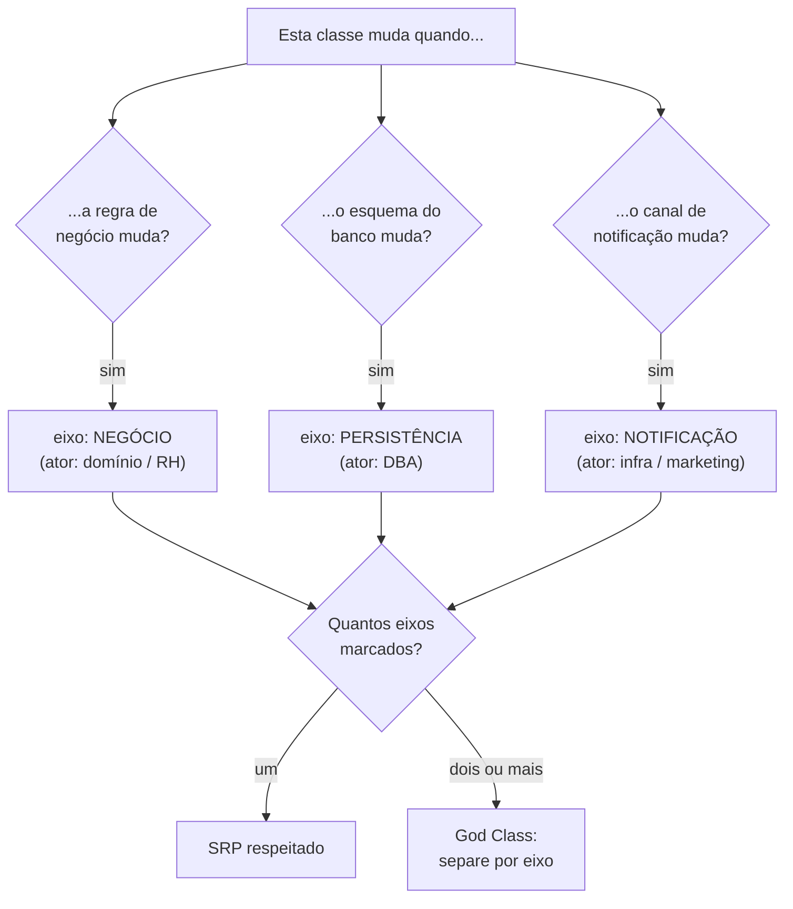
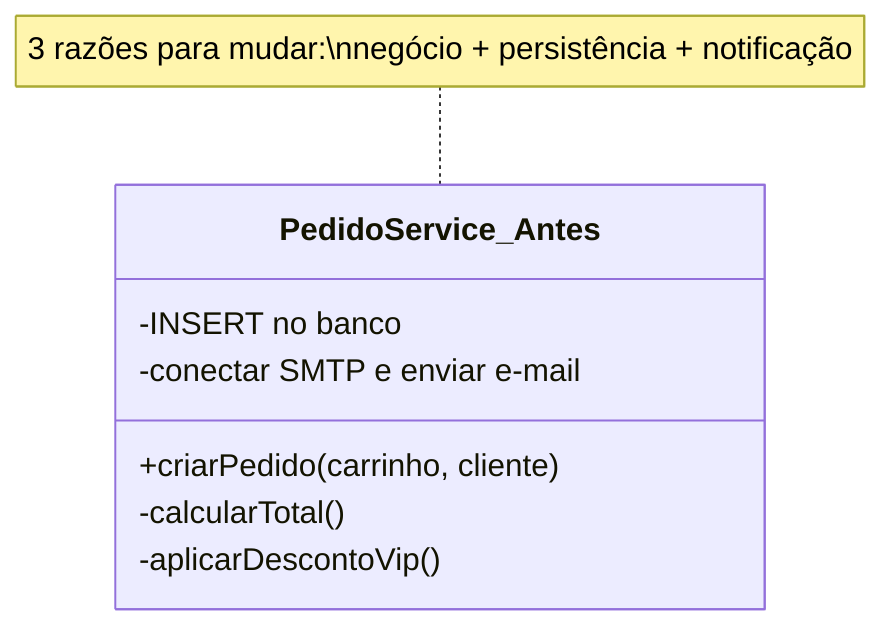

# SRP - Responsabilidade Única

> Uma classe deve ter uma — e só uma — razão para mudar. E "razão" não é "função": é o **ator** (o grupo de pessoas) que pede a mudança. Junte o que muda pelas mesmas razões; separe o que muda por razões diferentes.

O **S** do [[01 - O que é SOLID|SOLID]] é o mais citado e o mais mal-entendido. Quase todo mundo decora a frase "uma classe, uma responsabilidade" e logo a traduz para algo que ela **não** diz: "uma classe deve fazer uma coisa só", ou pior, "um método por classe". Não é isso. Se fosse, qualquer classe com dois métodos violaria o princípio — o que é absurdo.

Vamos desmontar a frase de verdade.

## "Uma razão para mudar" — mas razão é gente

Robert C. Martin (Uncle Bob) definiu responsabilidade como **"uma razão para mudar"**. A pergunta natural é: razão de quê? Por que código muda?

Código não muda sozinho. Código muda porque **uma pessoa pede**. E pessoas diferentes pedem mudanças por motivos diferentes.

Pense numa folha de pagamento. Três stakeholders olham para a mesma classe `Funcionario`:

- O **time de RH** pede mudanças em como o salário é **calculado**.
- O **time de Contabilidade** pede mudanças em como as horas são **reportadas**.
- O **DBA** pede mudanças em como o registro é **persistido**.

Se os três métodos vivem na mesma classe, uma mudança pedida pela Contabilidade pode quebrar — sem querer — algo de que o RH dependia, porque os dois compartilham código interno. Pessoas que não conversam entre si acabam editando o mesmo arquivo. Isso é uma fonte de bugs e de medo de mexer no código.

É por isso que a definição refinada do Uncle Bob fala em **ator**:

> [!info] Lastro
> A formulação canônica de Uncle Bob é **"A module should be responsible to one, and only one, actor"** ("um módulo deve ser responsável perante um, e somente um, ator"), onde *ator* é o grupo de stakeholders ou usuários que pedem uma mudança. A reformulação irmã: **"Gather together the things that change for the same reasons. Separate those things that change for different reasons."** A versão popular "uma classe, uma responsabilidade" é uma **simplificação didática** — útil para memorizar, mas perigosa se levada ao pé da letra, pois esconde que o critério real é o ator/eixo de mudança, não a contagem de métodos. Fontes: [The Clean Code Blog](https://blog.cleancoder.com/uncle-bob/2014/05/08/SingleReponsibilityPrinciple.html), [Single-responsibility principle (Wikipedia)](https://en.wikipedia.org/wiki/Single-responsibility_principle).

A reformulação "junte o que muda pelas mesmas razões, separe o que muda por razões diferentes" deixa claro o que o SRP realmente é: **o princípio que otimiza a coesão**. Junte o coeso; separe o que não tem nada a ver. (Esse é o outro lado da moeda de [[08 - Acoplamento e coesão]].)

## Eixos de mudança, não verbos

O critério prático não é "quantas coisas a classe faz", e sim **quantos eixos de mudança independentes ela atravessa**.

Um eixo de mudança é uma direção na qual o software pode evoluir por conta de um ator. Persistência é um eixo. Regra de negócio é outro. Notificação é outro. Apresentação é outro.

A pergunta de teste é simples: *se eu trocar o banco de Postgres para Mongo, esta classe precisa mudar? Se a regra de desconto mudar, esta classe precisa mudar? Se eu trocar e-mail por SMS, esta classe precisa mudar?* Se você respondeu "sim" para mais de um, a classe serve a mais de um ator.



Leitura do diagrama: cada pergunta aponta para um eixo de mudança ligado a um ator distinto. O veredito vem da contagem na base: **um** eixo marcado significa SRP respeitado; **dois ou mais** sinalizam uma classe que será arrastada para mudar por razões que não têm relação entre si — a [[12 - Anti-patterns de OO|God Class]].

## O monólito: `PedidoService` que faz tudo

Eis a violação clássica. Um único serviço que cria o pedido, salva no banco e dispara o e-mail:

```java
public class PedidoService {

    public void criarPedido(Carrinho carrinho, Cliente cliente) {
        // 1. REGRA DE NEGÓCIO (ator: domínio)
        if (carrinho.estaVazio()) {
            throw new PedidoInvalidoException("Carrinho vazio");
        }
        BigDecimal total = carrinho.getItens().stream()
                .map(Item::getSubtotal)
                .reduce(BigDecimal.ZERO, BigDecimal::add);
        if (cliente.isVip()) {
            total = total.multiply(new BigDecimal("0.90")); // 10% off
        }
        Pedido pedido = new Pedido(cliente, carrinho.getItens(), total);

        // 2. PERSISTÊNCIA (ator: DBA)
        try (Connection conn = DriverManager.getConnection(URL, USER, PASS)) {
            PreparedStatement ps = conn.prepareStatement(
                "INSERT INTO pedidos (cliente_id, total) VALUES (?, ?)");
            ps.setLong(1, cliente.getId());
            ps.setBigDecimal(2, pedido.getTotal());
            ps.executeUpdate();
        } catch (SQLException e) {
            throw new RuntimeException(e);
        }

        // 3. NOTIFICAÇÃO (ator: infra/marketing)
        Properties props = new Properties();
        props.put("mail.smtp.host", "smtp.exemplo.com");
        Session session = Session.getInstance(props);
        Message msg = new MimeMessage(session);
        // ... monta e envia o e-mail de confirmação
    }
}
```

Por que isso dói? Conte os atores. O cálculo do desconto VIP muda por pedido do **negócio**. O `INSERT` muda por pedido do **DBA** (trocou de banco, mudou o esquema). O SMTP muda por pedido da **infra** (trocou de provedor, virou fila). **Três razões para mudar na mesma classe.** Toda vez que qualquer um dos três mexe, recompila e arrisca os outros dois. E você não consegue testar a regra de desconto sem um banco e um servidor SMTP de pé.



Leitura do diagrama: uma só caixa concentra cálculo, SQL e e-mail. Os três comentários internos são os três atores — a anotação cravou o diagnóstico: God Class.

## O conserto: orquestrar e delegar

A correção **não** é estourar tudo em mil classes minúsculas. É separar **por eixo de mudança**. O `PedidoService` continua existindo, mas vira um **orquestrador**: ele coordena o fluxo e delega cada responsabilidade para o colaborador certo.

```java
public class PedidoService {
    private final PedidoRepository repository;
    private final EmailService emailService;

    public PedidoService(PedidoRepository repository, EmailService emailService) {
        this.repository = repository;
        this.emailService = emailService;
    }

    public void criarPedido(Carrinho carrinho, Cliente cliente) {
        // A regra de negócio mora na ENTIDADE, não aqui (Rich Domain Model)
        Pedido pedido = Pedido.novo(carrinho, cliente);

        repository.salvar(pedido);          // delega persistência
        emailService.enviarConfirmacao(pedido); // delega notificação
    }
}
```

Repare em dois movimentos. Primeiro: a **regra de negócio saiu do service e foi para a entidade** `Pedido` — o cálculo do total e o desconto VIP vivem em `Pedido.novo(...)`, não num service inchado. Isso é o [[10 - Rich vs Anemic Domain Model|Rich Domain Model]]: a entidade protege sua própria consistência, em vez de ser um saco de getters manipulado por fora.

Segundo: persistência e notificação viraram colaboradores injetados (`PedidoRepository`, `EmailService`). Cada um muda pelo seu próprio ator, isolado dos demais. (Como essas dependências chegam ao construtor é assunto de [[07 - DIP na prática - DI e IoC|injeção de dependência]].)

Agora o `PedidoService` tem **uma** razão para mudar: o **fluxo de criação do pedido**. Se o DBA trocar de banco, ele mexe em `PedidoRepository` e o service nem sabe. Se o provedor de e-mail mudar, mexe em `EmailService`. E você testa a regra de desconto chamando `Pedido.novo(...)` sem encostar em banco nem SMTP.

## A armadilha: SRP virando fragmentação

Aqui mora o perigo de levar o princípio longe demais. Se "uma razão para mudar" vira "um método por classe", você sai de uma God Class e cai no oposto: dezenas de classes anêmicas de uma linha cada, e a lógica do fluxo se espalha por tantos arquivos que **ninguém consegue mais segui-la**. Você trocou baixa coesão por baixa legibilidade.

O critério de parada é o ator, não a contagem. `calcularTotal()` e `aplicarDesconto()` mudam **pelo mesmo motivo** (regra de negócio do pedido) — então ficam **juntos** na entidade. Separar seria violar a própria reformulação do Uncle Bob: *junte o que muda pelas mesmas razões*. SRP é uma força que puxa para a coesão tanto quanto para a separação. O equilíbrio entre os dois é o tema de [[08 - SOLID em xeque]].

## Em entrevista

SRP é o princípio mais provável de cair, e o entrevistador quase sempre testa se você sabe que **não** é "uma classe, uma função". Cravar a definição do ator é o que separa o júnior do senior.

- "The Single Responsibility Principle says a class should have **one, and only one, reason to change** — and that reason is an **actor**, a group of stakeholders who request the change."
- "It's not about *how many things* the class does. It's about how many **axes of change** it spans. Persistence, business rules, and notification are different axes."
- "The popular phrasing 'one class, one responsibility' is a useful simplification, but the real test is: **gather what changes for the same reasons, separate what changes for different reasons**."
- "Here the order service was a **God Class** doing business logic, SQL, and email. I'd keep it as an **orchestrator** that delegates to a repository and a notification service, and push the business rules down into the entity."
- "Over-applying SRP leads to **fragmentation** — dozens of anemic one-method classes. The stopping criterion is the actor, not the method count."

Vocabulário PT → EN:
- razão para mudar → *reason to change*
- ator / stakeholder → *actor / stakeholder*
- eixo de mudança → *axis of change*
- responsabilidade → *responsibility*
- coesão → *cohesion*
- orquestrador / delegar → *orchestrator / to delegate*
- God Class / classe-deus → *God Class*
- fragmentação → *fragmentation*

## Veja também

- [[01 - O que é SOLID]] — o acrônimo e a meta comum dos cinco princípios
- [[03 - OCP - Aberto-Fechado]] — o próximo princípio: extensão sem modificação
- [[04 - LSP - Substituição de Liskov]] — subtipos substituíveis
- [[05 - ISP - Segregação de Interfaces]] — o SRP aplicado a interfaces
- [[06 - DIP - Inversão de Dependência]] — depender de abstrações
- [[07 - DIP na prática - DI e IoC]] — como o orquestrador recebe seus colaboradores
- [[08 - SOLID em xeque]] — quando SRP vira over-engineering e fragmentação
- [[08 - Acoplamento e coesão]] — SRP é o princípio que otimiza a coesão
- [[12 - Anti-patterns de OO]] — a God Class, a violação clássica do SRP
- [[10 - Rich vs Anemic Domain Model]] — a regra de negócio vive na entidade, não no service
