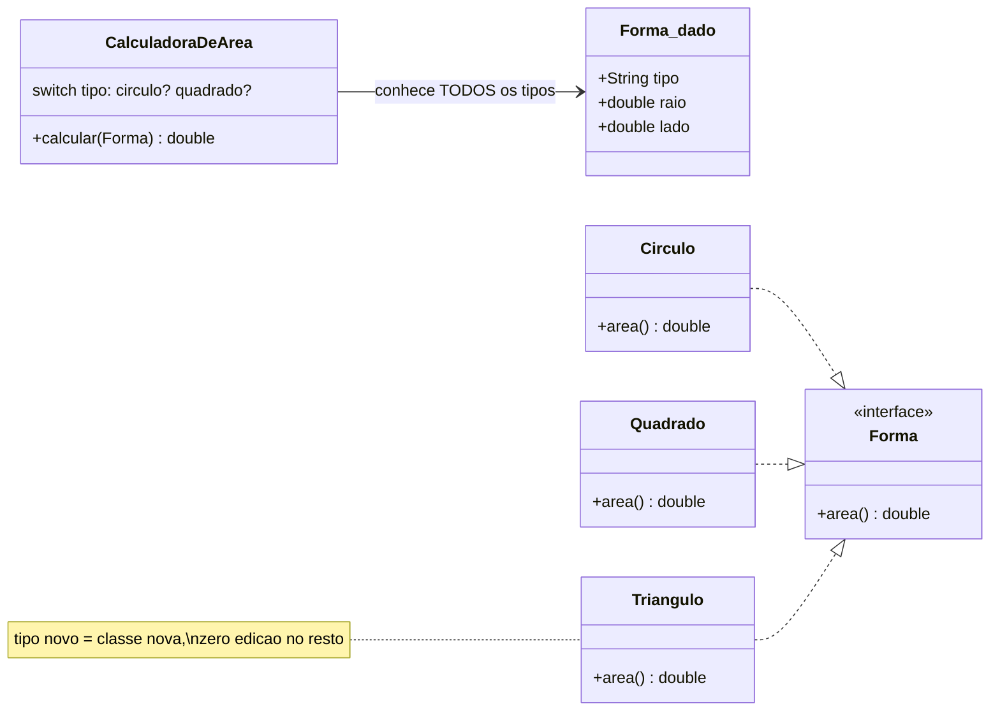
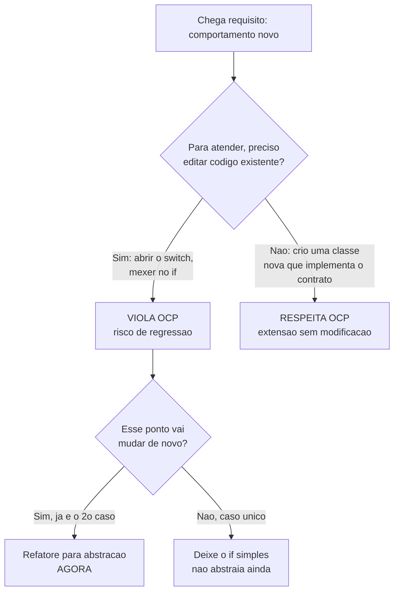

# OCP - Aberto-Fechado

> [!abstract] TL;DR
> Comportamento novo deveria entrar **adicionando código** (uma classe nova), não **mexendo no código que já funciona**. Você consegue isso com polimorfismo: cada caso implementa a mesma interface. Em uma linha: **aberto para extensão, fechado para modificação**.

Pensa numa régua de tomada com várias saídas. Quando você compra um aparelho novo, você não abre a parede e refaz a fiação — você pluga na régua. A parede está **fechada** (você não toca nela), mas o sistema está **aberto** para receber aparelhos novos. Esse é o espírito do **Open-Closed Principle (OCP)**: o "O" do [[01 - O que é SOLID|SOLID]].

A frase canônica é: *"módulos de software devem estar **abertos para extensão** e **fechados para modificação**"*. À primeira vista soa contraditório — como uma coisa pode estar aberta e fechada ao mesmo tempo? O truque é que são dois eixos diferentes. **Aberto para extensão**: o comportamento do módulo pode crescer. **Fechado para modificação**: esse crescimento não exige reabrir e reeditar o código que já existe, testado e em produção.

## Por que mexer no código existente é o problema

Toda vez que você edita uma função que já funcionava para encaixar mais um caso, você faz duas apostas perigosas. Primeira: que não vai quebrar nenhum dos casos antigos. Segunda: que você lembrou de todos os lugares que precisavam mudar juntos. Quanto mais um módulo é tocado, mais cicatrizes ele acumula — e mais frágil fica.

O sintoma clássico é o **`switch` (ou cadeia de `if`) que liga no tipo**. Olha esse cálculo de área:

```java
// VIOLA OCP: para cada tipo novo, edito este switch
public class CalculadoraDeArea {
    public double calcular(Forma forma) {
        switch (forma.tipo) {
            case "circulo":
                return Math.PI * forma.raio * forma.raio;
            case "quadrado":
                return forma.lado * forma.lado;
            // adicionar "triangulo"? edito AQUI...
            default:
                throw new IllegalArgumentException("tipo desconhecido");
        }
    }
}
```

Quer adicionar triângulo? Você abre essa classe e edita o `switch`. E aqui está o veneno: esse provavelmente **não é o único `switch`** que liga no tipo. Tem outro em `desenhar(...)`, outro em `serializar(...)`, outro no relatório. Cada tipo novo te manda caçar e editar **todos eles**. Esquece um e nasce um bug silencioso. O código não está fechado para modificação — ele te obriga a modificá-lo a cada extensão.

## A virada: polimorfismo

A saída do OCP é inverter quem conhece quem. Em vez de uma calculadora que sabe sobre todas as formas, cada forma sabe calcular a si mesma. Você define um **contrato** — uma interface — e cada caso o implementa.

```java
public interface Forma {
    double area();
}

public class Circulo implements Forma {
    private final double raio;
    public Circulo(double raio) { this.raio = raio; }
    public double area() { return Math.PI * raio * raio; }
}

public class Quadrado implements Forma {
    private final double lado;
    public Quadrado(double lado) { this.lado = lado; }
    public double area() { return lado * lado; }
}

// O consumidor não sabe NEM SE IMPORTA qual forma é:
public double areaTotal(List<Forma> formas) {
    return formas.stream().mapToDouble(Forma::area).sum();
}
```

Agora vem o triângulo. Você cria `Triangulo implements Forma`, implementa `area()`, e **pronto**. Você não tocou em `Circulo`, em `Quadrado`, nem em `areaTotal`. Zero alteração no código existente. O sistema é uma régua de tomada: o triângulo se "plugou".

Repara o que sumiu: o `switch`. Quem decide qual `area()` rodar agora é o **dispatch dinâmico** da linguagem — o mecanismo de [[05 - Polimorfismo|polimorfismo]] que escolhe o método certo em tempo de execução, baseado no objeto real. A interface ([[06 - Interfaces e classes abstratas|interfaces e classes abstratas]]) é a costura estável; as implementações são as peças intercambiáveis.



Leitura do diagrama: em cima, o desenho frágil — uma calculadora central que precisa **conhecer todos os tipos** e decidir com `switch`; todo tipo novo a obriga a mudar. Embaixo, o desenho OCP — a interface `Forma` é o ponto fixo, e `Circulo`, `Quadrado`, `Triangulo` penduram nela com a seta tracejada de *realização* (`..|>`). O `Triangulo` entra sem que ninguém ao redor mude.

## A pergunta que você faz na frente do requisito

Na prática, OCP não é uma estrutura que você desenha de antemão — é uma **decisão que você toma quando o requisito novo bate na porta**. O fluxo mental é simples:



Leitura do diagrama: o coração é o losango `preciso editar código existente?`. Se a resposta é **sim** (abrir o `switch`), você está violando OCP e arriscando regressão. Se é **não** (basta uma classe nova obedecendo o contrato), você está respeitando. O ramo de baixo é o alerta anti-exagero: nem todo `if` precisa virar interface — só refatore quando o ponto **já mostrou** que vai variar.

## OCP especulativo é over-engineering

Esse último ramo merece destaque, porque é onde gente esperta erra. É tentador abstrair *tudo* "para o futuro": criar interfaces, factories e camadas para casos que **ainda não existem**. Isso não é OCP — é adivinhação. Você paga complexidade hoje por flexibilidade que talvez nunca precise.

A heurística sã é a **regra dos dois**: escreva o caso concreto e simples primeiro. Quando o **segundo** caso aparecer e os dois divergirem, *aí* você extrai a abstração — agora você já sabe qual é o eixo de variação real, não um imaginado. Essa tensão entre "flexível" e "simples" é o assunto de [[08 - SOLID em xeque]].

## OCP na prática e nos patterns

Esse exato padrão — interface estável, implementações plugáveis — é a costura do [[06 - DIP - Inversão de Dependência|DIP]]. O caso `NotificationSender` (adicionar notificação por WhatsApp = uma classe nova, **zero** mudança no consumidor que dispara notificações) é OCP em ação, e está detalhado em [[07 - DIP na prática - DI e IoC]].

E quando o "comportamento que varia" é um **algoritmo** intercambiável em vez de um "tipo de dado", esse mesmo OCP ganha nome de padrão: **Strategy**. Strategy é literalmente OCP empacotado — trocar a estratégia = nova classe, sem tocar no contexto. O catálogo vive em [[Design Patterns]] (linka, não duplica).

## Meyer vs. Uncle Bob: duas leituras do mesmo nome

> [!info] Lastro
> O termo **Open-Closed Principle** foi cunhado por **Bertrand Meyer** em *Object-Oriented Software Construction* (1988). A solução **original de Meyer** era por **herança de implementação**: uma classe está "fechada" porque pode ser compilada e versionada numa biblioteca, e "aberta" porque uma subclasse pode herdá-la e adicionar features sem alterar o pai. A versão que ensino acima — **polimórfica**, via **interface abstrata** com múltiplas implementações substituíveis — é a releitura dos anos 1990 popularizada por **Robert C. Martin (Uncle Bob)**, hoje chamada de *Polymorphic Open-Closed Principle*. Não são sinônimos: Meyer usava [[04 - Herança|herança]] de implementação (hoje em desuso); Uncle Bob usa interfaces. Quando alguém diz "OCP" em uma entrevista moderna, quase sempre quer dizer a leitura polimórfica. Fontes: [Open–closed principle — Wikipedia](https://en.wikipedia.org/wiki/Open%E2%80%93closed_principle); [Open-Closed Principle Revisited — thevaluable.dev](https://thevaluable.dev/open-closed-principle-revisited/).

Por que a leitura mudou? Porque herdar implementação acopla o filho aos detalhes internos do pai — frágil, e fonte de bugs sutis (assunto do [[04 - LSP - Substituição de Liskov|LSP]]). Programar contra uma interface evita isso: o contrato é só a forma pública, sem amarrar ninguém à entranha de uma classe-mãe.

## Em entrevista

OCP é fácil de recitar e fácil de explicar mal. O que separa o senior é (a) dar o exemplo do `switch` e (b) lembrar do trade-off com over-engineering.

- **Definição em uma frase:** *"Software entities should be open for extension but closed for modification — you add new behavior by adding new code, not by changing existing, working code."*
- **Como se alcança:** *"In practice you achieve OCP through polymorphism: program against an interface, and each new case is a new class implementing it. The tell-tale smell that you're violating it is a type-switch — a `switch` or `if/else` chain on a type field."*
- **O trade-off (mostra senioridade):** *"But I don't abstract speculatively. Premature abstraction is over-engineering. I apply the rule of two: I keep it concrete until a second case actually shows up, then extract the abstraction along the axis that really varies."*
- **Conexão com patterns:** *"The Strategy pattern is OCP in action — swapping the strategy means adding a class, never editing the context."*
- **Se cobrarem a história:** *"Meyer coined OCP in 1988 using implementation inheritance; the modern, polymorphic reading via interfaces is Uncle Bob's."*

**Vocabulário PT → EN:**

- aberto para extensão → *open for extension*
- fechado para modificação → *closed for modification*
- adicionar comportamento → *to add behavior*
- ligar no tipo / `switch` no tipo → *type-switch* / *switching on type*
- polimorfismo → *polymorphism*
- contrato / interface → *contract* / *interface*
- implementação → *implementation*
- substituível / intercambiável → *substitutable* / *interchangeable*
- regressão → *regression*
- abstração especulativa / prematura → *speculative* / *premature abstraction*
- exagero de engenharia → *over-engineering*
- eixo de variação → *axis of variation*

## Veja também

- [[01 - O que é SOLID]] — o acrônimo e a meta comum dos cinco
- [[02 - SRP - Responsabilidade Única]] — o princípio anterior; uma única razão para mudar
- [[04 - LSP - Substituição de Liskov]] — por que herança de implementação é frágil
- [[05 - ISP - Segregação de Interfaces]] — interfaces pequenas como pontos de extensão
- [[06 - DIP - Inversão de Dependência]] — a mesma costura interface/implementação, invertendo a seta
- [[07 - DIP na prática - DI e IoC]] — `NotificationSender` como OCP/DIP na prática
- [[08 - SOLID em xeque]] — quando abstrair vira over-engineering
- [[05 - Polimorfismo]] — o mecanismo que faz o OCP funcionar
- [[06 - Interfaces e classes abstratas]] — o contrato estável
- [[04 - Herança]] — a versão original de Meyer
- [[Design Patterns]] — Strategy e outros padrões que materializam OCP
