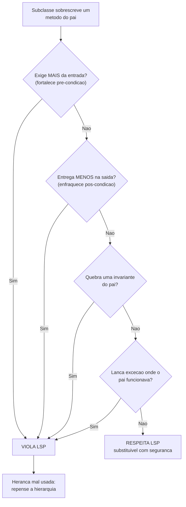
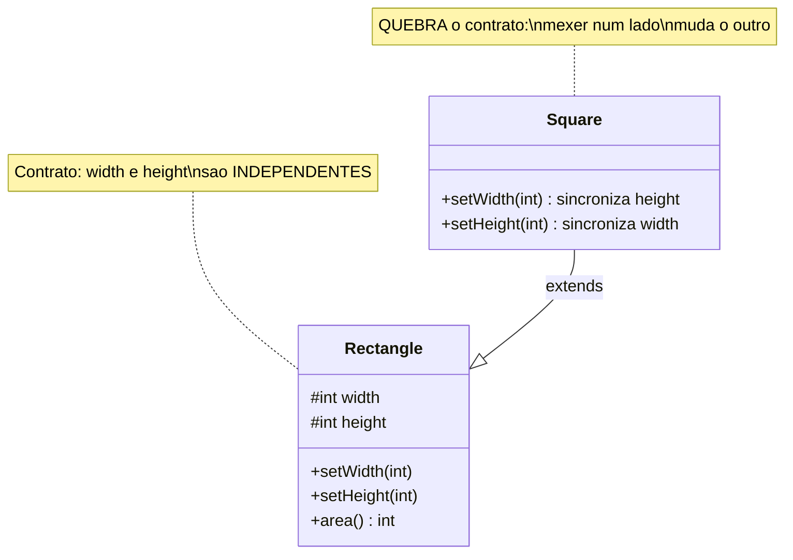

# LSP - Substituição de Liskov

> [!abstract] TL;DR
> Se um pedaço de código funciona com um tipo base, ele tem que funcionar com **qualquer
> subtipo** sem surpresas. Subclasse não pode exigir mais na entrada, entregar menos na
> saída, nem quebrar as garantias do pai. Em uma linha: **um subtipo precisa ser
> substituível pelo seu tipo base sem o cliente perceber a troca**.

Imagina que você contratou um pintor por uma descrição: "pinta uma parede em 2 horas,
qualquer cor que eu pedir". Você assina o contrato sem saber *qual* pintor vai aparecer.
Se mandarem outro no lugar — um substituto — você espera que ele honre **o mesmo
contrato**: a mesma cor, no mesmo prazo. Se o substituto disser "ah, eu só pinto de
azul" ou "preciso de 8 horas", você foi enganado. O contrato que você assinou não valia
nada.

Esse é o coração do **Liskov Substitution Principle (LSP)**, o "L" do
[[01 - O que é SOLID|SOLID]]. A frase canônica: *"subtipos devem ser substituíveis pelos
seus tipos base"*. Se o seu código funciona com `Bird`, deve funcionar com qualquer
subtipo de `Bird` — `Sparrow`, `Eagle`, `Penguin` — **sem que você precise saber qual é**
e sem nenhuma surpresa.

## O que significa "sem surpresas"

O perigo do LSP é que ele é **fácil de violar sem o compilador reclamar**. Em Java, se
`Square extends Rectangle`, o código compila lindamente. O LSP não é sobre o que compila
— é sobre o **comportamento** que o cliente *espera*. E expectativa de comportamento o
compilador não verifica.

Foi exatamente esse o salto que Barbara Liskov deu. A ideia comum de subtipo é
**estrutural** ("o filho tem todos os métodos do pai, então pode passar onde o pai
passa"). Liskov disse: não basta. O subtipo tem que se **comportar** como o pai. Isso se
chama **subtipagem comportamental** (*behavioral subtyping*), e é mais forte do que a
checagem de tipos da linguagem.

## Design by Contract: as regras concretas

"Comportar como o pai" soa vago. A parte genial do LSP é que ele tem **regras precisas**,
emprestadas do **Design by Contract** de Bertrand Meyer. Pensa em todo método como um
contrato com três cláusulas:

- **Pré-condições** — o que o método **exige da entrada** para funcionar (ex: "o índice
  tem que estar entre 0 e tamanho").
- **Pós-condições** — o que o método **garante na saída** se a pré-condição foi cumprida
  (ex: "retorna um valor não-nulo").
- **Invariantes** — o que tem que ser **sempre verdade** sobre o objeto, antes e depois
  de qualquer método (ex: "o saldo nunca fica negativo").

Quando uma subclasse sobrescreve um método, ela renegocia o contrato — mas só pode mexer
**a favor do cliente**. As três regras:

> [!warning] As três cláusulas do contrato (decore isto)
> 1. **Pré-condições não podem ser FORTALECIDAS** no subtipo. O filho não pode exigir
>    *mais* da entrada do que o pai exigia. Quem chama confiou no contrato fraco do pai.
> 2. **Pós-condições não podem ser ENFRAQUECIDAS** no subtipo. O filho não pode entregar
>    *menos* na saída do que o pai prometeu. Quem chama contava com a garantia forte do pai.
> 3. **Invariantes do pai têm que ser PRESERVADAS**. O filho não pode quebrar o que o pai
>    garantia ser sempre verdade.

Repara na assimetria, que é onde quase todo mundo se confunde: a subclasse pode ser
**mais generosa** (aceitar entradas que o pai recusava, prometer mais do que o pai
prometia), mas nunca **mais exigente** ou **mais avara**. O cliente assinou o contrato do
pai — ele só pode ser surpreendido para melhor.



Leitura do diagrama: é um checklist sequencial. A cada bifurcação você pergunta se o
filho piorou o contrato para o cliente — exigiu mais, entregou menos, quebrou uma
garantia, ou estourou uma exceção onde o pai trabalhava normalmente. **Qualquer "sim"**
joga direto na caixa de violação. Só quem passa por todos os "não" é substituível com
segurança. E a saída de uma violação não é "remendar o filho" — é admitir que a
**herança está modelando algo errado**.

## Variância: o LSP nos tipos

As mesmas regras aparecem nas **assinaturas** dos métodos, com o nome de **variância**.
Quando você sobrescreve um método, o que pode mudar nos tipos?

- **Retorno covariante** — o subtipo pode devolver um tipo *mais específico* (subtipo) do
  retorno do pai. Faz sentido: é a pós-condição ficando *mais forte*, e isso é permitido.
  Java suporta isso desde a versão 5 (`@Override` com retorno covariante).
- **Parâmetro contravariante** — em teoria, o subtipo poderia aceitar um tipo *mais geral*
  (supertipo) no parâmetro. É a pré-condição ficando *mais fraca* — também permitido.

A simetria é elegante: **retorno acompanha a saída** (pode ficar mais específico,
covariante) e **parâmetro acompanha a entrada** (pode ficar mais geral, contravariante).

> [!note] Detalhe de Java
> Java só implementa **covariância de retorno**. Para parâmetros, mudar o tipo na
> assinatura cria uma **sobrecarga** (*overload*), não um *override* — então
> contravariância de parâmetro é teoria de subtipagem, não algo que você escreve direto
> em Java do dia a dia. Vale conhecer o conceito; vale saber que a linguagem é mais
> restrita que a teoria.

## O exemplo canônico: Square não é um Rectangle

Aqui está a armadilha mais famosa do LSP, e ela é traiçoeira porque parece **óbvia que
está certa**. Todo quadrado é um retângulo, certo? Na geometria, sim. Em código, não
necessariamente.

```java
public class Rectangle {
    protected int width;
    protected int height;

    public void setWidth(int w)  { this.width = w; }
    public void setHeight(int h) { this.height = h; }
    public int area()            { return width * height; }
}

// "Todo quadrado e um retangulo" — parece natural...
public class Square extends Rectangle {
    @Override
    public void setWidth(int w)  { this.width = w; this.height = w; }  // sincroniza!
    @Override
    public void setHeight(int h) { this.width = h; this.height = h; }  // sincroniza!
}
```

Um `Square` precisa manter os lados iguais — então ele sobrescreve os setters para
sincronizar largura e altura. Faz sentido em isolamento. Agora olha o cliente, que só
conhece `Rectangle`:

```java
// Cliente que confia no CONTRATO de Rectangle
void testarArea(Rectangle r) {
    r.setWidth(5);
    r.setHeight(10);
    // O contrato de Rectangle diz: largura e altura sao independentes.
    // Logo, area DEVE ser 5 * 10 = 50.
    assert r.area() == 50;
}
```

Passe um `Rectangle`: `area()` é 50. Tudo bem. Passe um `Square`: `setHeight(10)`
também mudou a largura para 10, então `area()` é **100**. O `assert` explode.



Leitura do diagrama: `Square` herda de `Rectangle` com a seta sólida de herança
(`--|>`). O problema está nas notas: `Rectangle` carrega a **invariante implícita** de
que largura e altura são independentes — é isso que o cliente assume. `Square` **viola
essa invariante** ao sincronizar os lados. Tecnicamente o `Square` *fortaleceu uma
pré-condição* (só aceita largura == altura), e por isso quebra todo cliente que confiava
no contrato mais frouxo do pai.

A lição que dói: a relação "é-um" da linguagem natural **mente** sobre código. Um quadrado
*é* um retângulo na matemática, mas um `Square` **não é substituível** por um `Rectangle`
que tem setters independentes. O modelo de herança estava errado — não o código do `Square`.

## O segundo clássico: o pinguim que não voa

O outro exemplo de manual: `Bird` (pássaro) com um método `fly()`. Parece inofensivo —
até o pinguim chegar.

```java
public class Bird {
    public void fly() { /* sobe nos ceus */ }
}

public class Penguin extends Bird {
    @Override
    public void fly() {
        throw new UnsupportedOperationException("pinguim nao voa!");
    }
}
```

Qualquer código que faça `bird.fly()` confiando no contrato de `Bird` vai **estourar** se
receber um `Penguin`. O `Penguin` *enfraqueceu a pós-condição* (`Bird` promete "vai
voar"; `Penguin` entrega uma exceção) — violação direta.

A correção não é gambiarra no `Penguin`. É admitir que `fly()` não pertence a *todo*
pássaro. Você reparte a hierarquia: uma interface `FlyingBird` (com `fly()`) que só os
pássaros voadores implementam, e `Penguin` fica de fora. Isso é o LSP te empurrando para
o [[05 - ISP - Segregação de Interfaces|ISP]] — interfaces magras que não obrigam ninguém
a implementar o que não faz.

## Os sinais de que você violou LSP

Como farejar uma violação antes que ela vire bug em produção? Três cheiros denunciam:

- **A subclasse lança `UnsupportedOperationException`** (ou similar) num método herdado.
  É a confissão de que a subclasse não consegue honrar o contrato — o caso do `Penguin`.
- **O cliente checa o tipo concreto** (`if (forma instanceof Square)`) para tratar um
  subtipo diferente. Se você precisa saber *qual* subtipo é, eles **não são substituíveis**
  — o polimorfismo quebrou.
- **Refused Bequest** — a subclasse herda métodos/campos que não fazem sentido para ela e
  os ignora, sobrescreve com vazio, ou os neutraliza. É um anti-pattern catalogado; veja
  [[12 - Anti-patterns de OO]].

Todos os três apontam para a **mesma causa-raiz**: a herança está modelando algo errado.
LSP violado quase nunca é um bug pontual — é o sintoma de uma **hierarquia mal desenhada**.
A cura costuma ser trocar herança por [[04 - Herança|composição]] (*favor composition over
inheritance*): em vez de `Square extends Rectangle`, modele `Shape` como uma interface, ou
faça o quadrado *ter* um lado em vez de *ser* um retângulo deformado.

> [!info] Lastro
> O LSP foi enunciado por **Barbara Liskov** numa keynote de **1987**, e formalizado no
> artigo *"A Behavioral Notion of Subtyping"* (Liskov & **Jeannette Wing**, **1994**) — por
> isso "formulação Liskov-Wing". A formulação original é densa e quantificada (*"let φ(x) be
> a property provable about objects x of type T; then φ(y) should be true for objects y of
> type S where S is a subtype of T"*); o que ensino aqui — as três cláusulas de
> pré/pós-condição e invariante — vem do **Design by Contract** de **Bertrand Meyer**
> (*Object-Oriented Software Construction*, 1988/1997), que Liskov-Wing reconhecem como
> aparentado da abordagem deles. A regra de variância (**retorno covariante, parâmetro
> contravariante**) é teoria de subtipagem clássica; Java implementa só a covariância de
> retorno. O exemplo `Square`/`Rectangle` foi popularizado por **Robert C. Martin (Uncle
> Bob)**, não pela própria Liskov.
> Fontes: [Liskov substitution principle — Wikipedia](https://en.wikipedia.org/wiki/Liskov_substitution_principle);
> [Liskov substitution principle and DbC in depth — gersti.at](https://gersti.at/posts/liskov-substitution-principle/).

## Por que o LSP sustenta o OCP

O LSP não vive sozinho — ele é o que torna o [[03 - OCP - Aberto-Fechado|OCP]]
**confiável**. Lembra que o OCP te deixa "plugar" uma classe nova que implementa o
contrato, sem tocar no consumidor? Isso só é seguro **se** você puder confiar que toda
implementação nova honra o contrato de verdade.

Pensa assim: o OCP te dá o **polimorfismo** (substituir implementações sem medo); o LSP é
a **garantia de que substituir é seguro**. Sem LSP, o OCP é uma promessa vazia — você
plugaria um `Penguin` no lugar de um `Bird` e o código quebraria silenciosamente. O LSP é
a letra miúda do contrato que faz o polimorfismo do OCP não te trair. Os dois andam de
mãos dadas: OCP é a estrutura, LSP é a disciplina que a mantém honesta.

## Em entrevista

LSP é o princípio do SOLID que mais gente recita errado ("é só herança fazer sentido").
O que separa o senior é citar as **regras de contrato** e o exemplo `Square`/`Rectangle`
com a explicação do *porquê* da quebra.

- **Definição em uma frase:** *"Subtypes must be substitutable for their base types
  without breaking the program. If code works with the base type, it must work with any
  subtype, with no surprises."*
- **As regras (mostra profundidade):** *"It comes from design by contract: a subtype must
  not strengthen preconditions, must not weaken postconditions, and must preserve the
  base class invariants. The subclass can be more generous, never more demanding."*
- **O exemplo canônico:** *"The classic violation is Square extends Rectangle. A Square
  syncs width and height, so a client that does setWidth(5), setHeight(10) and expects
  area() == 50 gets 100 instead. The 'is-a' relationship lies — Square is not substitutable
  for a Rectangle with independent setters."*
- **Os sinais de alerta:** *"Red flags are a subclass throwing UnsupportedOperationException,
  a client checking the concrete type with instanceof, or a refused bequest. They all mean
  the inheritance is modeling the wrong thing — I'd favor composition over inheritance."*
- **A conexão com OCP:** *"LSP is what makes OCP's polymorphism trustworthy — it's the
  guarantee that swapping an implementation won't break the caller."*

**Vocabulário PT → EN:**

- substituível → *substitutable*
- subtipo / tipo base → *subtype* / *base type*
- subtipagem comportamental → *behavioral subtyping*
- pré-condição → *precondition*
- pós-condição → *postcondition*
- invariante → *invariant*
- fortalecer / enfraquecer → *to strengthen* / *to weaken*
- design by contract → *design by contract*
- retorno covariante → *covariant return type*
- parâmetro contravariante → *contravariant parameter type*
- relação "é-um" → *"is-a" relationship*
- herança vs. composição → *inheritance vs. composition*
- herança mal usada → *misused inheritance*
- legado recusado → *refused bequest*

## Veja também

- [[01 - O que é SOLID]] — o acrônimo e a meta comum dos cinco
- [[02 - SRP - Responsabilidade Única]] — uma única razão para mudar
- [[03 - OCP - Aberto-Fechado]] — o polimorfismo que o LSP torna confiável
- [[05 - ISP - Segregação de Interfaces]] — interfaces magras (a cura do caso `Penguin`)
- [[06 - DIP - Inversão de Dependência]] — depender de abstrações estáveis
- [[07 - DIP na prática - DI e IoC]] — substituição de implementações na prática
- [[08 - SOLID em xeque]] — as críticas e os limites dos cinco princípios
- [[04 - Herança]] — quando "é-um" mente e composição é melhor
- [[12 - Anti-patterns de OO]] — Refused Bequest e outros cheiros de herança ruim
- [[06 - Interfaces e classes abstratas]] — o contrato que o subtipo precisa honrar
