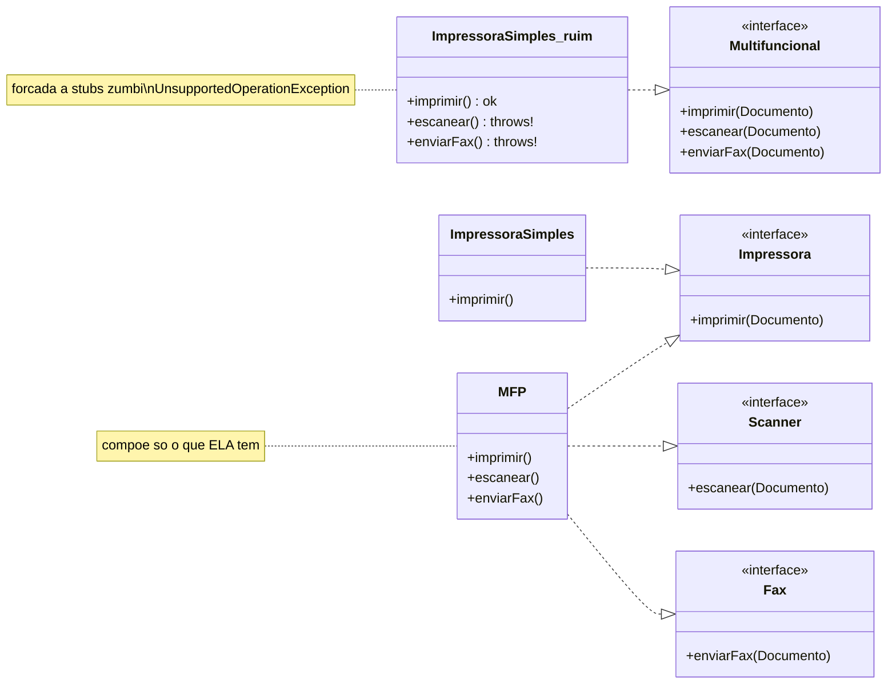
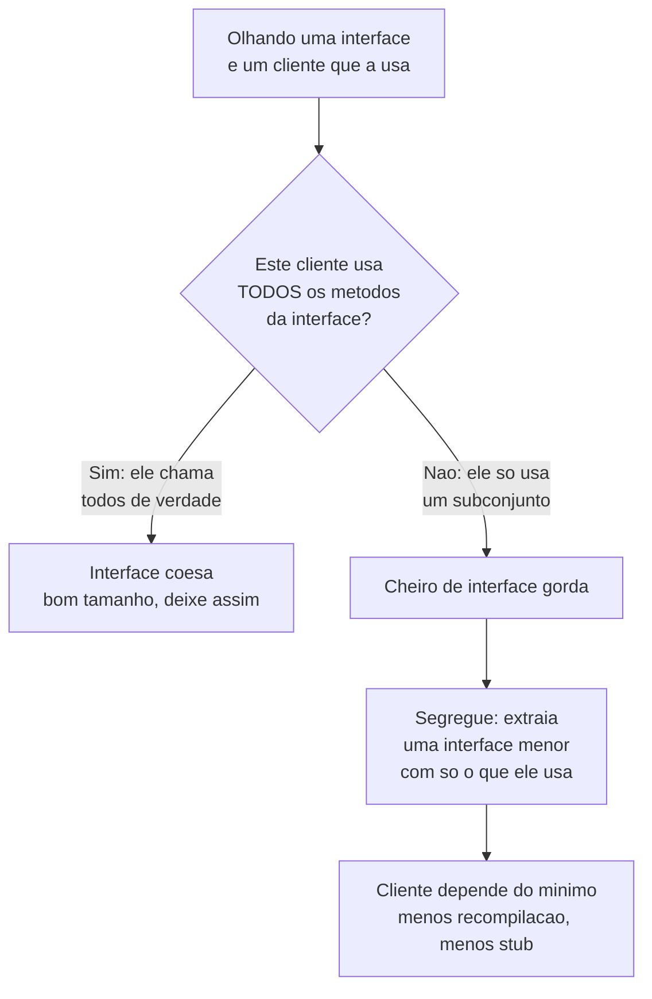

# ISP - Segregação de Interfaces

> [!abstract] TL;DR
> **Nenhum cliente deveria ser forçado a depender de métodos que ele não usa.** Em vez de
> uma interface gorda que faz tudo, prefira **várias interfaces pequenas**, cada uma uma
> capacidade. Em uma linha: **ISP é o [[02 - SRP - Responsabilidade Única|SRP]] aplicado
> ao contrato — uma interface, uma razão para o cliente depender dela**.

Imagine que você comprou uma impressora só para imprimir. Aí o manual te obriga a aprender
a usar o scanner, o fax e a copiadora — mesmo que sua impressora **não tenha** nenhuma
dessas coisas. Você assina um contrato com promessas que não consegue cumprir. Soa absurdo?
É exatamente o que uma **interface gorda** faz com o código.

Esse é o **Interface Segregation Principle (ISP)**: o "I" do [[01 - O que é SOLID|SOLID]].
A frase canônica de Uncle Bob é direta: *"clients should not be forced to depend upon
interfaces that they do not use"* — clientes não deveriam ser forçados a depender de
interfaces (de métodos) que não usam.

## A interface gorda e seus métodos zumbi

Vamos ao exemplo clássico. Um escritório tem uma multifuncional moderna que imprime,
escaneia e envia fax. Tentado pela conveniência, alguém modela **um contrato só**:

```java
// VIOLA ISP: interface gorda — promete TUDO a TODO mundo
public interface Multifuncional {
    void imprimir(Documento doc);
    void escanear(Documento doc);
    void enviarFax(Documento doc);
}
```

Funciona lindamente para a multifuncional, que de fato faz as três coisas. O problema
aparece quando chega a **impressora simples** da recepção — a velha confiável que só
imprime:

```java
// O cliente é FORÇADO a implementar o que não tem
public class ImpressoraSimples implements Multifuncional {
    public void imprimir(Documento doc) { /* ...isto funciona... */ }

    public void escanear(Documento doc) {
        throw new UnsupportedOperationException("não escaneia");
    }
    public void enviarFax(Documento doc) {
        throw new UnsupportedOperationException("não tem fax");
    }
}
```

Repara nos dois métodos de baixo. Eles são **zumbis**: existem no código, mas estão mortos
por dentro. Esse cheiro tem dois nomes que você precisa reconhecer na hora — **stubs
vazios** (corpo vazio que finge atender) e **`UnsupportedOperationException`** (lança erro
porque não há o que fazer). Sempre que você escreve um desses, pare: a interface está
mentindo sobre o que o objeto consegue.

E note o veneno escondido: esse stub não é só feio, é uma **bomba de [[04 - LSP - Substituição de Liskov|LSP]]**.
Quem recebe um `Multifuncional` acredita que pode chamar `escanear(...)`. Passe uma
`ImpressoraSimples` no lugar e o programa **explode em runtime**. A interface gorda quebrou
a substituibilidade — ISP e LSP estão de mãos dadas aqui.

## A virada: separe por capacidade

A correção do ISP é fatiar a interface gorda em **capacidades coesas**. Cada coisa que o
objeto *pode* fazer vira uma interface pequena e independente:

```java
public interface Impressora { void imprimir(Documento doc); }
public interface Scanner    { void escanear(Documento doc); }
public interface Fax        { void enviarFax(Documento doc); }
```

Agora cada cliente assina **só os contratos que consegue honrar**. A impressora simples
declara que imprime, e ponto:

```java
public class ImpressoraSimples implements Impressora {
    public void imprimir(Documento doc) { /* ...e nada mais... */ }
}

// A multifuncional compõe as capacidades que ela realmente tem:
public class MFP implements Impressora, Scanner, Fax {
    public void imprimir(Documento doc)  { /* ... */ }
    public void escanear(Documento doc)  { /* ... */ }
    public void enviarFax(Documento doc) { /* ... */ }
}
```

Sumiram os stubs. Sumiu o `UnsupportedOperationException`. E agora um consumidor pode pedir
**exatamente** a capacidade de que precisa: um método que só imprime recebe `Impressora`,
não a multifuncional inteira. Ele depende do mínimo — e portanto só recompila ou quebra
quando *o que ele usa de verdade* muda.



Leitura do diagrama: em cima, o desenho gordo — `ImpressoraSimples` é obrigada a realizar
(`..|>`) a `Multifuncional` inteira e por isso carrega os métodos que lançam exceção.
Embaixo, o desenho segregado — três interfaces pequenas. `ImpressoraSimples` pendura só em
`Impressora`; a `MFP` **compõe** as três porque de fato faz as três. Cada seta de realização
agora é uma promessa que o objeto consegue cumprir.

## Por que isso importa: o acoplamento invisível

"Mas é só um método a mais na interface, qual o drama?" O drama é o **acoplamento
desnecessário**. Quando dez clientes dependem de uma interface gorda, eles ficam amarrados
**uns aos outros pela interface** — mesmo sem se conhecerem.

Pensa numa interface com `imprimir()`, `escanear()` e `enviarFax()`. Você muda a assinatura
de `enviarFax()` por um requisito de fax. Em uma compilação estática como Java, **todo
mundo que implementa a interface precisa recompilar** — inclusive a `ImpressoraSimples`,
que não tem nem ideia do que é fax. Um cliente foi sacudido por uma mudança em um método
que ele **nunca usou**. Isso é [[08 - Acoplamento e coesão|acoplamento]] no pior sabor:
invisível e gratuito.

ISP corta esse fio. Interfaces pequenas significam que uma mudança no fax toca só quem usa
fax. O raio de impacto encolhe. É por isso que a regra prática é: **a forma da interface
deve ser ditada pelo cliente que a consome, não pelo objeto que a implementa**.



Leitura do diagrama: o losango é a pergunta-régua do ISP — *este cliente usa todos os
métodos da interface?* Se **sim**, a interface está coesa, do tamanho certo: não invente
fatias. Se **não** — se o cliente só toca um pedaço — você tem o cheiro da interface gorda
e a saída é **segregar**: extrair uma interface menor com exatamente o que aquele cliente
consome.

## ISP é SRP no nível do contrato

Se essa pergunta soou familiar, é porque ela é parente do [[02 - SRP - Responsabilidade Única|SRP]].
O SRP diz que uma classe deveria ter **uma única razão para mudar**. O ISP diz a mesma
coisa sobre a **interface**: cada interface deveria responder a **um grupo de clientes**, e
portanto ter uma única razão (um único cliente/capacidade) para mudar de forma.

É o mesmo princípio de [[08 - Acoplamento e coesão|coesão]] aplicado a camadas diferentes.
SRP olha a coesão da *implementação*; ISP olha a coesão do *contrato*. Uma interface gorda
é, por definição, uma interface **pouco coesa** — ela junta capacidades que não pertencem
ao mesmo cliente. Segregar é restaurar a coesão.

## Entre linguagens: Go já nasce com ISP

Aqui vale uma volta por
[[11 - Como o modelo OO difere entre linguagens|como o OO difere entre linguagens]], porque **Go** ilustra o ISP de um jeito quase poético. A cultura de Go
prega interfaces minúsculas — frequentemente de **um único método**. As mais famosas da
biblioteca padrão são `io.Reader` e `io.Writer`:

```go
// A interface mais usada de Go tem UM metodo:
type Reader interface {
    Read(p []byte) (n int, err error)
}

type Writer interface {
    Write(p []byte) (n int, err error)
}
```

Dois fatores empurram Go nessa direção. Primeiro, a **tipagem estrutural** (*duck typing*
em tempo de compilação): em Go você não declara `implements` — qualquer tipo que tenha o
método `Read` **já é** um `Reader`, automaticamente. Isso barateia muito ter dezenas de
interfaces pequenas e **compô-las** quando precisa de mais (`io.ReadWriter` é só `Reader`
+ `Writer`). Segundo, o ditado da comunidade: *"the bigger the interface, the weaker the
abstraction"* — quanto maior a interface, mais fraca a abstração.

O contraste com Java é instrutivo. Em Java você precisa do `implements` explícito e tende a
interfaces maiores; o ISP é uma **disciplina** que você aplica conscientemente. Em Go, a
linguagem **inclina** você ao ISP por design. Mesmo princípio, ergonomias diferentes — o
detalhe de como interfaces e [[06 - Interfaces e classes abstratas|classes abstratas]] se
declaram em cada linguagem muda o quanto o ISP "dói" ou "flui".

## Em entrevista

ISP é curto de definir, mas o senior se separa do júnior ao (a) nomear o cheiro — stubs e
`UnsupportedOperationException` — e (b) conectar com LSP e coesão.

- **Definição em uma frase:** *"Clients should not be forced to depend on methods they don't
  use. Prefer many small, role-based interfaces over one fat interface."*
- **O cheiro que delata:** *"The tell-tale sign of an ISP violation is an implementation full
  of empty stubs or methods that throw `UnsupportedOperationException` — the object is being
  forced to honor a contract it can't fulfill."*
- **A conexão com LSP:** *"A fat interface often breaks Liskov too: a client expects all the
  methods to work, but a partial implementer blows up at runtime. ISP prevents that whole
  class of bug."*
- **A regra de ouro:** *"Interfaces should be shaped by the client that consumes them, not by
  the class that implements them. ISP is basically the Single Responsibility Principle applied
  to interfaces."*
- **Entre linguagens (mostra alcance):** *"Go bakes this in — its standard library favors
  tiny, single-method interfaces like `io.Reader`, and structural typing makes composing them
  cheap."*
- **Se cobrarem a história:** *"Uncle Bob coined ISP at Xerox, where one giant `Job` class
  forced every client to depend on methods for jobs it never ran."*

**Vocabulário PT → EN:**

- interface gorda → *fat interface*
- segregar interfaces → *to segregate interfaces*
- interface por papel / capacidade → *role interface* / *capability*
- ser forçado a depender de → *to be forced to depend on*
- método que não usa → *method it doesn't use*
- stub vazio → *empty stub*
- método zumbi / morto → *dead method*
- acoplamento desnecessário → *needless coupling*
- coesão de interface → *interface cohesion*
- recompilar → *to recompile*
- tipagem estrutural → *structural typing*
- compor interfaces → *to compose interfaces*

> [!info] Lastro
> O **Interface Segregation Principle** foi formulado por **Robert C. Martin (Uncle Bob)**,
> que o articulou no artigo *"The Interface Segregation Principle"* no **C++ Report (1996)** e
> depois nos livros *Agile Software Development* e *Clean Architecture*. A origem é real: Martin
> consultava na **Xerox**, onde uma única classe `Job` gigante servia a todos os tipos de
> tarefa (imprimir, grampear, faxar), forçando cada cliente a depender de métodos de tarefas
> que não executava — e cada mudança disparava um ciclo de recompilação/redeploy de quase uma
> hora. O exemplo da **multifuncional / impressora-scanner-fax** que ensino acima é a
> didatização moderna mais comum (não o caso Xerox literal), mas captura fielmente a mesma
> dor. A relação que afirmo entre **ISP e coesão de interface** (ISP como SRP no nível do
> contrato) é interpretação amplamente aceita, mas é uma leitura — Martin enfatiza
> "clientes forçados a depender", e a coesão é a outra face dessa moeda.
> Fontes: [Interface segregation principle — Wikipedia](https://en.wikipedia.org/wiki/Interface_segregation_principle);
> ["The Interface Segregation Principle" — Robert C. Martin, C++ Report (1996)](https://web.archive.org/web/20150905081110/http://www.objectmentor.com/resources/articles/isp.pdf);
> [Go Proverbs — go-proverbs.github.io](https://go-proverbs.github.io/).

## Veja também

- [[01 - O que é SOLID]] — o acrônimo e a meta comum dos cinco
- [[02 - SRP - Responsabilidade Única]] — ISP é o SRP aplicado ao contrato
- [[03 - OCP - Aberto-Fechado]] — interfaces pequenas como pontos de extensão estáveis
- [[04 - LSP - Substituição de Liskov]] — por que stubs/`UnsupportedOperationException` quebram substituibilidade
- [[06 - DIP - Inversão de Dependência]] — depender de abstrações; ISP define quais abstrações
- [[07 - DIP na prática - DI e IoC]] — injetar a capacidade mínima, não a interface gorda
- [[08 - SOLID em xeque]] — quando segregar demais vira fragmentação
- [[06 - Interfaces e classes abstratas]] — o contrato que se segrega
- [[08 - Acoplamento e coesão]] — ISP é coesão no nível da interface
- [[11 - Como o modelo OO difere entre linguagens]] — por que Go inclina ao ISP por design
