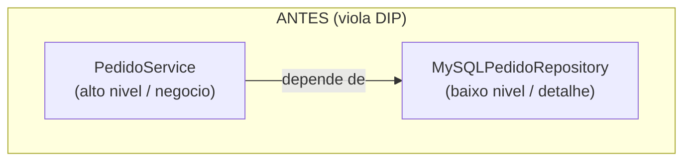
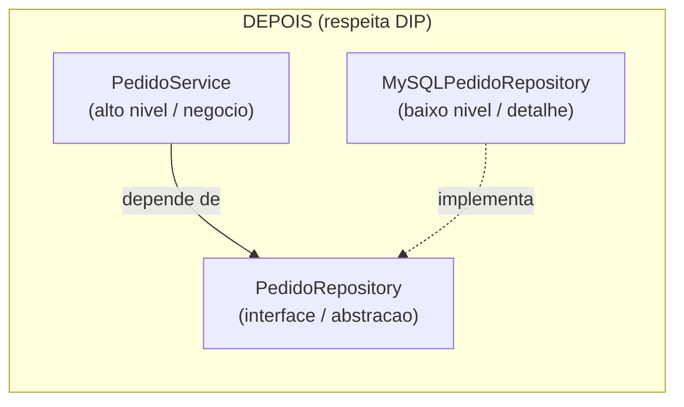
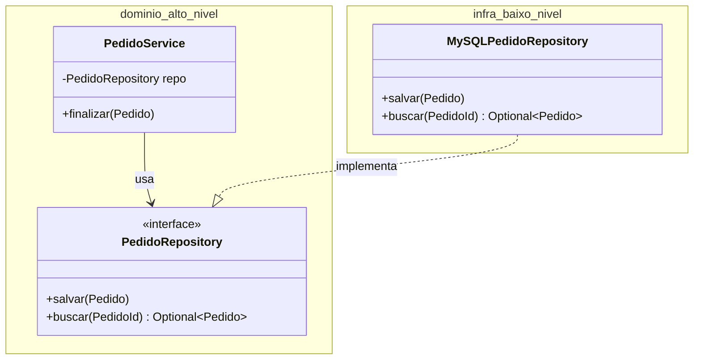

# DIP - Inversão de Dependência

> [!abstract] TL;DR
> Seu **negócio** (alto nível) não deveria depender do **banco** (baixo nível). Os dois
> deveriam depender de uma **interface no meio**. O truque: essa interface **pertence ao
> negócio**, e o banco é que se curva a ela — a seta de dependência, que antes apontava do
> negócio para o detalhe, **se inverte** e passa a apontar do detalhe para a abstração.

Imagina uma tomada na parede. A parede não sabe — nem quer saber — se você vai plugar uma
geladeira, um carregador ou um abajur. Ela define um **padrão** (o formato da tomada) e
diz: "quem quiser energia, encaixe nisso aqui". O aparelho é que se adapta ao padrão da
parede, não o contrário.

Repara na direção dessa relação: quem **manda** é a parede (o que precisa da energia
fornecida do outro lado), e quem **obedece** é o aparelho. Esse é o coração do **Dependency
Inversion Principle (DIP)** — o "D" do [[01 - O que é SOLID|SOLID]]. A parede é o seu
módulo de alto nível; o aparelho é o detalhe; e o formato da tomada é a **abstração** que
fica no meio.

A formulação canônica de **Robert C. Martin (Uncle Bob)** tem quatro partes:

1. Módulos de **alto nível** não devem depender de módulos de **baixo nível**. Ambos devem
   depender de **abstrações**.
2. **Abstrações** não devem depender de **detalhes**. **Detalhes** devem depender de
   **abstrações**.

"Alto nível" aqui é a **política de negócio** — as regras que dão valor ao sistema. "Baixo
nível" são os **detalhes de infraestrutura**: banco, arquivo, e-mail, API externa. A
intuição perigosa é deixar o negócio importar o detalhe. O DIP diz: pare e inverta.

## A seta que aponta para o lado errado

Vamos ao caso concreto. Você tem um `PedidoService` (regra de negócio) que precisa salvar
pedidos. O jeito ingênuo:

```java
// VIOLA DIP: o negócio importa o detalhe
public class PedidoService {
    private final MySQLPedidoRepository repo = new MySQLPedidoRepository();

    public void finalizar(Pedido pedido) {
        // ...regra de negócio...
        repo.salvar(pedido);
    }
}
```

Onde está o problema? Na primeira linha. `PedidoService` **importa** `MySQLPedidoRepository`.
A regra de negócio — a coisa mais valiosa e estável do sistema — agora **depende** de um
detalhe de infraestrutura. Se amanhã você trocar MySQL por Postgres, ou quiser testar o
service sem subir um banco, você esbarra nesse acoplamento.

A seta de dependência aponta **do negócio para o detalhe**:



Leitura do diagrama: uma única seta saindo do negócio e mergulhando no detalhe. O alto
nível está **refém** do baixo nível. Toda mudança no detalhe (o banco) sobe a corrente e
sacode o negócio. É exatamente o que o DIP proíbe na primeira frase.

## A inversão: vire a seta

Agora a virada. Em vez de o `PedidoService` conhecer o `MySQLPedidoRepository`, defina uma
**interface** — `PedidoRepository` — e faça o service depender **dela**. O MySQL passa a
ser apenas **uma** implementação dessa interface.

```java
// A abstração — define O QUE o negócio precisa, não COMO
public interface PedidoRepository {
    void salvar(Pedido pedido);
    Optional<Pedido> buscar(PedidoId id);
}

// O negócio depende da ABSTRAÇÃO (recebe pela construtor)
public class PedidoService {
    private final PedidoRepository repo;

    public PedidoService(PedidoRepository repo) {  // não sabe qual implementação
        this.repo = repo;
    }

    public void finalizar(Pedido pedido) {
        // ...regra de negócio...
        repo.salvar(pedido);
    }
}

// O DETALHE é que implementa a abstração
public class MySQLPedidoRepository implements PedidoRepository {
    public void salvar(Pedido pedido) { /* SQL... */ }
    public Optional<Pedido> buscar(PedidoId id) { /* SQL... */ }
}
```

Olha o que aconteceu com as setas. `PedidoService` aponta para `PedidoRepository` (a
abstração). E `MySQLPedidoRepository` **também** aponta para `PedidoRepository` — mas agora
de baixo para cima, com a seta de *realização*. O detalhe se curvou para a abstração.



Leitura do diagrama: ninguém mais aponta para o detalhe. O negócio aponta para a interface
(seta cheia, "depende de"); o detalhe aponta para a mesma interface (seta tracejada,
"implementa"). A seta que antes ia do negócio para o MySQL **sumiu** — foi *invertida*. É
daí que vem o nome: a dependência de compilação entre alto e baixo nível foi virada de
ponta-cabeça. O banco agora gira em torno do negócio, não o contrário.

## O ponto sutil: a abstração pertence ao consumidor

Aqui mora a diferença entre quem decorou DIP e quem entendeu. Não basta "usar uma
interface". A pergunta certa é: **de quem é essa interface?**

`PedidoRepository` precisa **pertencer ao módulo de alto nível** — ao
[[08 - Acoplamento e coesão|consumidor]] que a usa, não a quem a implementa. Em termos de
pacote: a interface vive junto do `PedidoService` (no pacote de domínio), e
`MySQLPedidoRepository` vive lá longe, no pacote de infraestrutura, **importando** o domínio
para implementar o contrato.

Por que isso importa? Porque o contrato passa a falar a **língua do negócio**. O service
não pede "uma conexão JDBC com um `ResultSet`"; ele pede "salve este `Pedido`, busque por
este `PedidoId`". A abstração reflete o que o negócio **precisa**, não o que o banco
**oferece**. Se a interface morasse no pacote do banco, você teria só *dependency injection*
disfarçada — o negócio ainda estaria conceitualmente subordinado à infra, mesmo passando a
dependência por construtor.



Leitura do diagrama: a caixa de cima é o **domínio (alto nível)** — e dentro dela moram
*tanto* o `PedidoService` *quanto* a interface `PedidoRepository`. A caixa de baixo é a
**infra**, onde vive só o MySQL. A seta de realização (`..|>`) cruza a fronteira **de baixo
para cima**: a infra alcança o domínio para cumprir o contrato. A linha divisória entre os
dois pacotes só é atravessada nesse sentido — o domínio nunca olha para baixo. Isso é o que
a frase "abstrações não dependem de detalhes" desenha na prática.

## DIP, DI e IoC: três coisas diferentes

Esses três termos vivem juntos e quase sempre são confundidos. A distinção rápida:

| Sigla | O que é | Natureza | Pergunta que responde |
|---|---|---|---|
| **DIP** | Dependency Inversion **Principle** | Um **princípio** de design | *Para onde a seta de dependência deve apontar?* (do detalhe para a abstração; abstração pertence ao alto nível) |
| **DI** | Dependency **Injection** | Uma **técnica** | *Como entrego a dependência?* (passar pronta — por construtor/setter — em vez de o objeto criar a sua) |
| **IoC** | Inversion of **Control** | Um **padrão** mais amplo | *Quem está no comando do fluxo?* (o framework chama você — "don't call us, we'll call you" — não o contrário) |

O DIP é o **porquê** (a meta arquitetural); a DI é **um dos comos** que o realizam (você
*pode* satisfazer DIP injetando a dependência); e IoC é o guarda-chuva que inclui DI mais a
ideia geral de delegar o controle do fluxo a um framework (como o Spring). Eles se reforçam,
mas não são sinônimos — e trocar um pelo outro numa entrevista entrega que o conceito não
está firme. O **como** detalhado (construtor injection, container Spring, testabilidade com
*test doubles*) vive em [[07 - DIP na prática - DI e IoC]]; aqui fica só a placa de trânsito.

> [!info] Lastro
> A formulação de quatro partes acima é a **canônica** de Robert C. Martin (Uncle Bob),
> publicada em *Agile Software Development, Principles, Patterns, and Practices* (2002) e
> reafirmada em *Clean Architecture* (2017). O ponto de **ownership** — "as abstrações são
> *de propriedade* dos módulos de alto nível e *implementadas* pelos de baixo nível" — é o
> que distingue DIP de mera *dependency injection*; é uma leitura amplificada (porém fiel)
> dos comentaristas modernos. A separação **DIP (princípio) / DI (técnica) / IoC (padrão)** é
> simplificação didática consagrada, mas largamente aceita; alguns autores tratam IoC e DI
> como quase intercambiáveis. Para fins de entrevista, a distinção das três camadas é o que
> demonstra domínio.
> Fontes: [Dependency inversion principle — Wikipedia](https://en.wikipedia.org/wiki/Dependency_inversion_principle);
> [Dependency Inversion implies interfaces are owned by high-level modules — Mikhail Shilkov](https://mikhail.io/2016/05/dependency-inversion-implies-interfaces-are-owned-by-high-level-modules/).

## Como o DIP conversa com o resto

O DIP é o princípio mais "arquitetural" dos cinco — ele desenha o sentido das setas entre
camadas inteiras. Três conexões valem o link:

- **Acoplamento.** Inverter a seta é, no fundo, **gerenciar acoplamento**: você troca um
  acoplamento rígido (negócio → MySQL concreto) por um acoplamento frouxo (negócio →
  interface estável). Por que isso é melhor está em [[08 - Acoplamento e coesão]].
- **Interfaces.** Todo o DIP se apoia em depender de uma **abstração** — uma interface ou
  classe abstrata. O ferramental está em [[06 - Interfaces e classes abstratas]].
- **Composição.** O DIP combina naturalmente com **composição em vez de herança**: o
  `PedidoService` *tem um* `PedidoRepository` (recebido de fora), não *é um* repositório nem
  herda dele. Por que compor costuma ganhar de herdar está em
  [[07 - Composição sobre herança]].

E há a ponte com o vizinho de acrônimo: a costura "interface estável + implementações
plugáveis" do DIP é a **mesma** do [[03 - OCP - Aberto-Fechado|OCP]]. A diferença de foco é
o ângulo: OCP olha para "como adiciono comportamento sem editar o existente"; DIP olha para
"para onde aponta a dependência entre camadas". Frequentemente, respeitar um é respeitar o
outro. Já a **forma certa de fatiar essa interface** (pequena, focada no consumidor) é
assunto do [[05 - ISP - Segregação de Interfaces|ISP]] — e repara que ISP e DIP se casam: a
interface que o consumidor *possui* (DIP) tende a ser exatamente a interface enxuta que ele
*precisa* (ISP).

## Em entrevista

DIP é o princípio que mais gente cita errado, confundindo com DI. Mostre que você sabe a
diferença e que entende o **ownership** da abstração — é o que separa o senior.

- **Definição em uma frase:** *"High-level modules shouldn't depend on low-level modules;
  both should depend on abstractions. And details should depend on abstractions, not the
  other way around."*
- **A inversão, em palavras:** *"Normally your business service would import the concrete
  MySQL repository — the dependency arrow points from policy to detail. DIP inverts that
  arrow: you introduce an interface the service depends on, and the database implements it.
  Now the detail points up at the abstraction."*
- **O ponto que mostra senioridade:** *"The subtle part is ownership: the abstraction belongs
  to the high-level module — the consumer — not to whoever implements it. The interface lives
  in the domain package and speaks the domain's language. Otherwise it's just dependency
  injection, not true inversion."*
- **Distinguir DIP / DI / IoC:** *"DIP is the principle — where the arrow should point. DI is
  one technique to achieve it — passing dependencies in instead of newing them up. IoC is the
  broader pattern where the framework controls the flow and calls you."*
- **Por que vale a pena:** *"It buys testability and swappability — I can inject a fake
  repository in tests, or switch MySQL for Postgres, without touching business code."*

**Vocabulário PT → EN:**

- inversão de dependência → *dependency inversion*
- módulo de alto nível → *high-level module*
- módulo de baixo nível → *low-level module*
- abstração → *abstraction*
- detalhe → *detail*
- seta de dependência → *dependency arrow*
- inverter a seta → *to invert the arrow*
- a abstração pertence ao consumidor → *the abstraction is owned by the consumer*
- injeção de dependência → *dependency injection*
- inversão de controle → *inversion of control*
- instanciar / "dar new" → *to instantiate* / *to new up*
- substituível / plugável → *swappable* / *pluggable*
- dublê de teste / fake → *test double* / *fake*

## Veja também

- [[01 - O que é SOLID]] — o acrônimo e a meta comum dos cinco
- [[02 - SRP - Responsabilidade Única]] — uma única razão para mudar
- [[03 - OCP - Aberto-Fechado]] — a mesma costura interface/implementação, vista pelo outro ângulo
- [[04 - LSP - Substituição de Liskov]] — quando a implementação injetada respeita o contrato
- [[05 - ISP - Segregação de Interfaces]] — fatiar enxuta a interface que o consumidor possui
- [[07 - DIP na prática - DI e IoC]] — o *como*: construtor injection, Spring, testabilidade
- [[08 - SOLID em xeque]] — quando inverter demais vira cerimônia
- [[06 - Interfaces e classes abstratas]] — o ferramental da abstração
- [[08 - Acoplamento e coesão]] — o que a inversão otimiza
- [[07 - Composição sobre herança]] — *ter um* em vez de *ser um*
