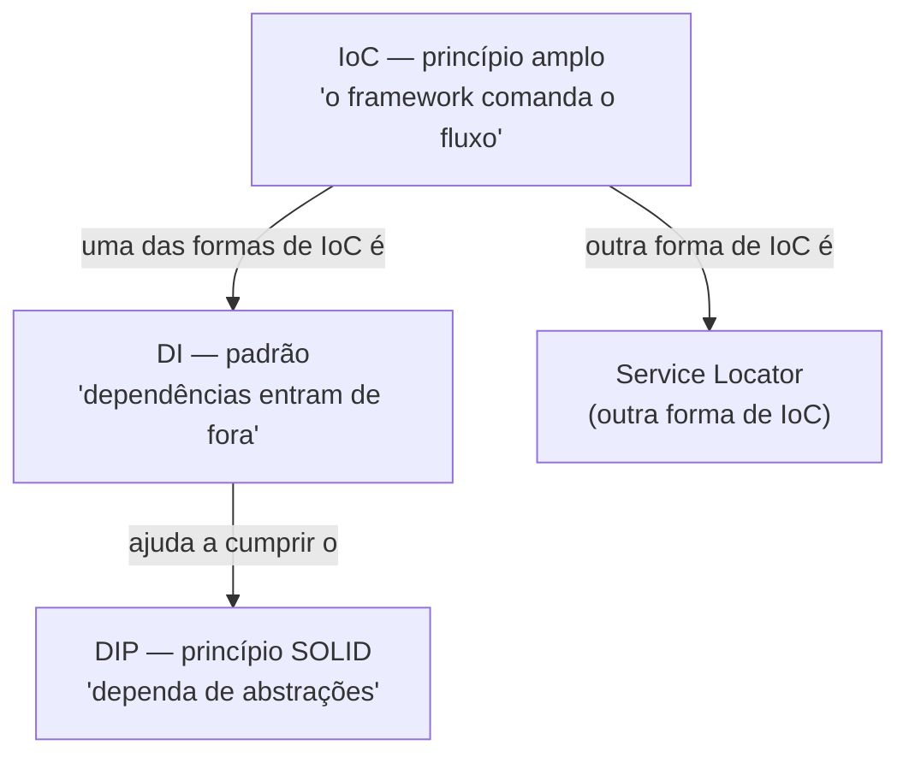
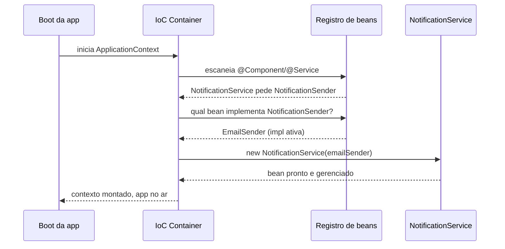
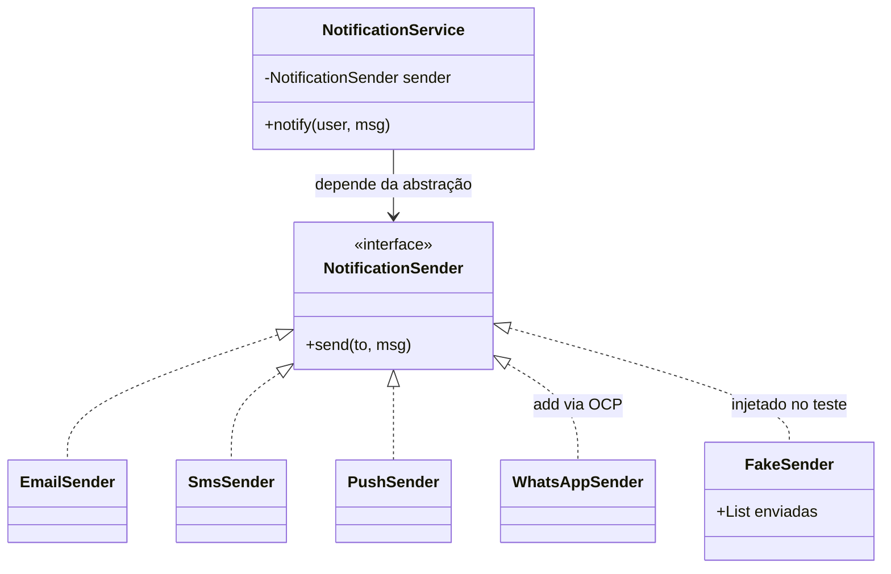

# DIP na prática - DI e IoC

> O DIP diz "dependa de abstrações"; a Dependency Injection é a mecânica de receber a abstração de fora, e a Inversion of Control é o framework que assume o controle de montar tudo — três camadas do mesmo movimento, da ideia ao container.

A nota [[06 - DIP - Inversão de Dependência]] te deu o princípio: módulos de alto nível não devem depender de detalhes; ambos dependem de abstrações. Bonito. Mas princípio não compila. A pergunta que sobra é prática: **se minha classe não pode criar `new MySQLRepo()`, quem cria?**

Essa nota responde isso. E a resposta tem três nomes que vivem sendo confundidos em entrevista: DIP, DI e IoC. Vamos separar os três e ver o Java/Spring fazendo o trabalho pesado.

## O problema concreto: quem dá o `new`?

Pensa numa classe que envia notificações. A versão ingênua faz assim:

```java
public class NotificationService {
    private final EmailSender sender = new EmailSender(); // ela mesma cria

    public void notify(User user, String msg) {
        sender.send(user.getEmail(), msg);
    }
}
```

Repara no problema: `NotificationService` está **soldada** à `EmailSender`. Quer trocar por SMS? Edita a classe. Quer testar sem disparar e-mail de verdade? Não dá — o `new` está cravado lá dentro. Isso é exatamente a violação que o DIP aponta: o alto nível dependendo do detalhe concreto.

A pergunta "quem dá o `new`?" é o coração de tudo. Enquanto a própria classe der o `new`, ela carrega o detalhe junto. A **Dependency Injection** é só a decisão de tirar esse `new` de dentro e empurrar a dependência **pela porta da frente**.

```java
public class NotificationService {
    private final NotificationSender sender; // abstração, não concreto

    // a dependência ENTRA por aqui — injetada de fora
    public NotificationService(NotificationSender sender) {
        this.sender = sender;
    }

    public void notify(User user, String msg) {
        sender.send(user.getEmail(), msg);
    }
}
```

Agora a classe **declara o que precisa** (`NotificationSender`) e **não decide qual**. Quem decide é quem a constrói. Esse é o pulo do gato.

## As três formas de injetar (e por que constructor vence)

Injetar de fora pode ser feito de três jeitos. O Spring suporta todos, mas tem favorito.

**Por construtor (constructor injection)** — a dependência chega como parâmetro do construtor. É a recomendada, e por motivos sólidos:

```java
@Service
public class NotificationService {
    private final NotificationSender sender;

    // No Spring moderno, um único construtor dispensa @Autowired
    public NotificationService(NotificationSender sender) {
        this.sender = sender;
    }
}
```

Por que essa ganha?

- **Imutabilidade**: o campo pode ser `final`. Construiu, fechou — ninguém troca a dependência depois.
- **Dependências explícitas**: olhou o construtor, sabe exatamente do que a classe precisa. Nada escondido.
- **Não tem como nascer quebrado**: sem passar o `sender`, o objeto nem é criado. Adeus `NullPointerException` por dependência faltando.
- **Testável sem framework**: no teste você faz `new NotificationService(fake)` na unha. Não precisa subir Spring nenhum.

**Por setter (setter injection)** — a dependência chega por um método `set`. Útil para dependências de fato **opcionais** ou que você precisa trocar em runtime. O custo: o campo não pode ser `final`, e existe uma janela em que o objeto está vivo mas ainda sem a dependência.

**Por campo (field injection)** — `@Autowired` direto no atributo. Parece o mais limpo (menos código!), e é justamente por isso que vira armadilha:

```java
@Service
public class NotificationService {
    @Autowired // desencorajado — esconde a dependência
    private NotificationSender sender;
}
```

Por que é desencorajado? Porque ele **esconde** a dependência: nada na assinatura pública conta que a classe precisa de um `NotificationSender`. O campo não pode ser `final`. E para testar você é praticamente obrigado a subir o container ou apelar para reflection, porque não há porta nenhuma para injetar um fake. A partir do Spring Framework 6 / Spring Boot 3, a documentação oficial **desencoraja** `@Autowired` em campo e recomenda construtor.

> [!tip] Regra de bolso
> Dependência obrigatória? Construtor. Dependência opcional? Setter. Campo? Quase nunca — só prototipagem descartável.

## DIP vs DI vs IoC: a tabela que resolve a confusão

Aqui mora a pergunta de entrevista. As três palavras rimam, mas operam em níveis diferentes.

| | DIP (princípio) | DI (padrão) | IoC (princípio amplo) |
|---|---|---|---|
| **O que é** | Regra de design: dependa de abstrações | Técnica: receber dependências de fora | Conceito: o framework controla o fluxo |
| **Camada** | Filosofia do código | Mecânica de montagem | Arquitetura do framework |
| **Pergunta que responde** | "De que eu devo depender?" | "Como a dependência chega?" | "Quem está no comando?" |
| **Exemplo** | Depender de `NotificationSender`, não de `EmailSender` | Receber o `sender` pelo construtor | O Spring montar o grafo no boot |
| **Relação** | É o *objetivo* | É uma *forma de alcançar* IoC | É o *guarda-chuva* |

A frase para guardar: **DI é uma forma de IoC; DIP é o princípio que a DI ajuda a cumprir.** Martin Fowler, no artigo *Inversion of Control Containers and the Dependency Injection pattern* (2004), percebeu que "IoC" era vago demais — *qual* controle está sendo invertido? — e cunhou o nome "Dependency Injection" justamente para o subtipo que move o controle de **construir dependências** para fora.

Vamos ver a relação como diagrama. Lead-in: os três conceitos formam camadas concêntricas, não sinônimos.



Leitura do diagrama: IoC é o conceito mais largo — "não me chame, eu te chamo". Dentro dele cabem várias técnicas; DI é uma, Service Locator é outra. A DI, por sua vez, é o caminho prático para satisfazer o DIP no dia a dia. Ou seja: você usa **DI** (a técnica) para honrar o **DIP** (o princípio), dentro de um framework que pratica **IoC** (a inversão geral).

## IoC: "não me chame, eu te chamo"

A Inversion of Control tem um apelido ótimo, o **Princípio de Hollywood**: *"Don't call us, we'll call you."* Pensa numa audição de cinema. O ator não fica ligando para o estúdio toda hora; ele deixa o currículo e espera — o estúdio liga quando precisa.

No código tradicional, **você** está no comando: seu `main` cria objetos, chama métodos, decide a ordem. Com IoC, isso vira de cabeça para baixo. O **framework** está no comando: ele cria seus objetos, decide quando chamá-los, gerencia o ciclo de vida. Você só fornece as peças e declara as dependências; a montagem não é mais sua.

A DI é a forma mais comum dessa inversão: em vez de você buscar a dependência, ela **aparece** pronta. Você nunca escreve "me dá o sender" — ele simplesmente já está lá quando seu construtor roda.

## O IoC Container: o Spring montando o grafo

No Java, o agente concreto dessa inversão é o **IoC Container** — no caso do Spring, o `ApplicationContext`. É ele quem lê suas classes anotadas (`@Service`, `@Component`, `@Repository`), descobre o que cada uma pede no construtor, escolhe a implementação certa e **injeta** — tudo no boot da aplicação. Essas peças gerenciadas chamam-se *beans*.

O ponto que casa com o DIP: seus beans pedem **interfaces**. O `NotificationService` pede um `NotificationSender`. Qual implementação concreta entra? O container decide — pode ser a real em produção, um fake no teste. O consumidor nunca toca nessa escolha.

Lead-in: veja a sequência de montagem no boot. Lê de cima para baixo, o tempo descendo.



Leitura do diagrama: ninguém no seu código deu o `new NotificationService`. O container leu a necessidade, resolveu qual `NotificationSender` usar e construiu o objeto com a dependência já dentro. No teste, troca-se só a implementação ativa — o restante da coreografia é idêntico.

## Por que isso torna tudo testável (o ponto central)

Aqui está o retorno prático que justifica todo o ritual. Como a dependência **entra de fora**, no teste você entrega outra coisa.

```java
class FakeSender implements NotificationSender {
    final List<String> enviadas = new ArrayList<>();
    public void send(String to, String msg) {
        enviadas.add(to + ": " + msg); // só guarda na memória
    }
}

@Test
void notifica_o_usuario() {
    var fake = new FakeSender();
    var service = new NotificationService(fake); // injeção na mão, sem Spring

    service.notify(user, "Olá");

    assertEquals(1, fake.enviadas.size());
}
```

Sem framework, sem rede, sem e-mail de verdade saindo. A suíte fica **rápida** (nada de I/O) e **determinística** (o fake sempre responde igual). Esse é o presente que a DI dá: o ponto onde você injeta a dependência real em produção é o mesmo ponto onde você injeta um fake no teste.

E repara: isso só funciona porque o código depende de **composição**, não de herança — o `NotificationService` *tem um* `NotificationSender`, e esse "tem um" é plugável. É a tese de [[07 - Composição sobre herança]] em ação. O efeito colateral é **baixo acoplamento**: o serviço não conhece nenhuma implementação concreta, exatamente o que [[08 - Acoplamento e coesão]] persegue. Toda essa flexibilidade vive das [[06 - Interfaces e classes abstratas]] como ponto de costura.

## A dupla com o OCP

A DI não anda sozinha. Quando você adiciona comportamento criando uma **nova implementação** da interface — sem editar o consumidor — você acabou de praticar o [[03 - OCP - Aberto-Fechado]]: aberto para extensão (nova classe), fechado para modificação (o `NotificationService` não muda uma linha). DI é o canal de entrega: a nova implementação chega pela mesma porta de injeção. Por isso DIP e OCP costumam aparecer de mãos dadas no código real.

## Na prática

No MedEspecialista, a arquitetura de notificações virou um caso de manual de DIP + OCP bem aplicados, e eu ainda volto nela quando quero explicar o assunto para alguém.

A interface central é a `NotificationSender`, com implementações para e-mail, SMS e push. O `NotificationService` nunca soube qual delas estava usando — ele pedia a abstração, o container injetava a concreta.

A prova do bolo veio quando precisamos de WhatsApp. Foi literalmente **criar uma classe nova**, `WhatsAppSender`, implementando a mesma interface. Zero mudança no código consumidor. O serviço que dispara notificações não foi tocado. Isso é o OCP que eu tinha lido em livro acontecendo de verdade: estendi sem modificar.

E o ganho em teste foi o que mais me marcou. Eu injetava um `FakeSender` que só gravava as mensagens em memória, em vez da implementação real. A suíte ficou **rápida** — nada de chamar gateway de SMS ou servidor de e-mail — e **determinística**: a mesma entrada, sempre a mesma saída, sem flakiness de rede. Foi aí que a frase "DIP torna o código testável" deixou de ser slogan e virou uma coisa que eu sentia rodando em segundos no CI.

Lead-in para o desenho da arquitetura. Lê das setas: o serviço aponta para a abstração; as implementações realizam a abstração.



Leitura do diagrama: a seta sólida do `NotificationService` para `NotificationSender` é a única dependência que o serviço tem — e ela aponta para a **interface**. Todas as implementações (linhas tracejadas) realizam essa interface. Adicionar `WhatsAppSender` foi acrescentar uma linha tracejada nova, sem mexer no topo. E `FakeSender` entra pela mesmíssima costura, só que no teste. O serviço não distingue nenhuma delas — é esse o ponto.

## Em entrevista

DI e IoC são pratos cheios em entrevista de design. Saber **separar os três termos** te coloca à frente, porque muita gente troca um pelo outro. Frases que entregam clareza:

- "DI is *how* you achieve the Dependency Inversion Principle — the principle says depend on abstractions, DI is the mechanism that hands those abstractions in from the outside."
- "I prefer **constructor injection** because it makes dependencies explicit, lets me keep fields `final`, and I can unit-test the class with a fake without booting Spring at all."
- "Field injection with `@Autowired` hides dependencies and forces a container to test the class, so Spring itself discourages it now."
- "IoC is the broader idea — the Hollywood Principle, *don't call us, we'll call you*. The framework owns the lifecycle and wires the object graph at boot. DI is one flavor of IoC."
- "Because the dependency comes in from the outside, I inject a fake in tests and the real implementation in production — same seam, so the suite stays fast and deterministic."

Vocabulário PT→EN:

- injeção de dependência → **dependency injection**
- injeção por construtor → **constructor injection**
- injeção por campo → **field injection**
- desencorajado → **discouraged**
- container de IoC → **IoC container**
- ciclo de vida → **lifecycle**
- montar o grafo de objetos → **wire the object graph**
- dependência explícita → **explicit dependency**
- esconder dependências → **hide dependencies**
- testável → **testable**
- determinístico → **deterministic**
- Princípio de Hollywood → **Hollywood Principle**

> [!info] Lastro
> O canônico aqui é o artigo de Martin Fowler, *Inversion of Control Containers and the Dependency Injection pattern* (2004), que cunha o termo "Dependency Injection" e distingue DI de Service Locator como duas formas de IoC; ele lista as três variantes (constructor / setter / interface injection — type 3, 2 e 1). A recomendação de **constructor injection** sobre field injection é a posição da documentação oficial do Spring (Framework 6 / Boot 3), corroborada por Baeldung. Simplificações conscientes: trato "interface injection" como nota de rodapé (raro na prática Java/Spring); colapso a discussão de Service Locator em uma menção, já que o foco é DI. Fontes: [Fowler — Injection](https://martinfowler.com/articles/injection.html); [Wikipedia — Inversion of control](https://en.wikipedia.org/wiki/Inversion_of_control); [Baeldung — Field Injection cons](https://www.baeldung.com/java-spring-field-injection-cons).

## Veja também

- [[06 - DIP - Inversão de Dependência]] — o princípio que esta nota concretiza
- [[01 - O que é SOLID]] — o conjunto dos cinco princípios
- [[03 - OCP - Aberto-Fechado]] — a dupla natural: estender via nova implementação injetada
- [[08 - SOLID em xeque]] — as críticas e os limites de aplicar isso cegamente
- [[06 - Interfaces e classes abstratas]] — o ponto de costura que torna a injeção possível
- [[07 - Composição sobre herança]] — o "tem um" plugável que a DI explora
- [[08 - Acoplamento e coesão]] — o baixo acoplamento que a DI entrega
- [[Arquitetura de Software]] — IoC containers como peça da arquitetura
- estante Java/Spring: [[Spring Boot]], [[03-Dominios/Tecnologia/Java/Backend/Spring Boot]] — o IoC container na prática
